# Define New Data Structures Using Quick SQL

## Introduction

Memorizing the SQL to create and maintain database objects can be difficult. However, there are tools that can generate the code for you based on a shorthand syntax or a graphical user interface. In this lab, you will learn how to create tables and views by defining data structures in Quick SQL.

Estimated Time: 15 minutes

### Problem Definition
Within most organizations, the use of spreadsheets is prolific. Spreadsheets are excellent for doing simple data review and tracking personal data, however, they are very ill suited to gathering data amongst team members for example.

A very common use case is that a manager needs to track the different projects his team is working on. The manager has built a spreadsheet with the critical data elements. However, now that the team is growing, trying to manage the spreadsheet updates is becoming unmanageable, and it is near impossible to get a single source of truth.

Below is an excerpt from the spreadsheet the manager has been sending out to the team:


### Napkin Design - Improved data model for Projects
Rather than just creating a single Project Tasks table based on the spreadsheet, you can define a collection of data structures to better model the relationships and collect additional information that would be valuable.

Below is a napkin design for collecting project information:


You should notice that the new model allows the assignment of Team Members to Projects, as well as optionally to Tasks, and To Dos. The concept of a Project having Milestones has been introduced, however, it is optional that Tasks are associated with a Milestone. Further, To Dos and Links have been added to Tasks.

### Objectives
- Add tables and insert data into your Oracle APEX Workspace

### What Do You Need?

- An Oracle Cloud paid account, LiveLabs account or free trial.
- An APEX Workspace

## Task 1: Open Quick SQL
1. Log into your workspace
2. Click **SQL Workshop**
3. Click **SQL Scripts**

    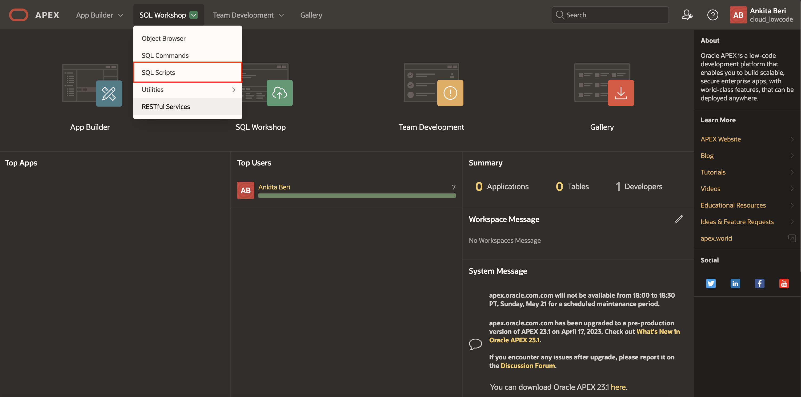

4. Click **Quick SQL**

    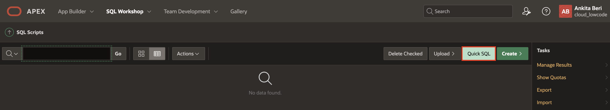

## Task 2: Enter Shorthand for Tables
Quick SQL provides an easy way to generate the SQL required to create a relational data model from an indented text document. This tool is designed to reduce the time and effort required to create SQL tables, triggers, and index structures.

*{Note: You will only be entering some of the tables and a few columns for each table. This exercise is designed to teach you the concepts behind Quick SQL, and not a typing exercise. A completed script will be provided later in the lab.}*

1. Enter your first table and some columns.

    In Quick SQL (left pane), enter the Table Name:   
    <code>Team Members</code>

    Indent 2 or more spaces and enter several column names:  
    <code>  username</code>     
    <code>  full name</code>    
    <code>  email</code>

    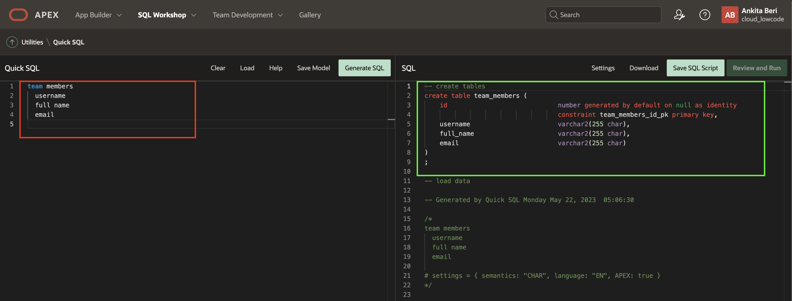

    *{Note: As you type in each row the SQL (right pane) is updated with the required SQL to create the table you are defining. If the output does not look like the image ensure that you have indented the columns username, and so forth correctly.}*

2. Enter your second table and some columns.

    In the Quick SQL (left pane), enter the Table Name in the first column:   
    <code>Projects</code>

    Indent 2 or more spaces and enter the Column Names:     
    <code>  name</code>     
    <code>  project lead</code>     
    <code>  budget</code>   
    <code>  status</code>

    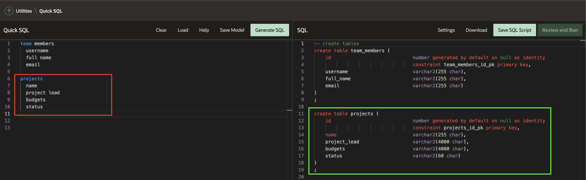

## Task 3: Improve the Shorthand
So far you have defined some basic tables and used the defaults, however, there are numerous directives and data types you can add to the shorthand to improve the SQL generated.

1. Click **Help**   
    Click **Table Directives**

    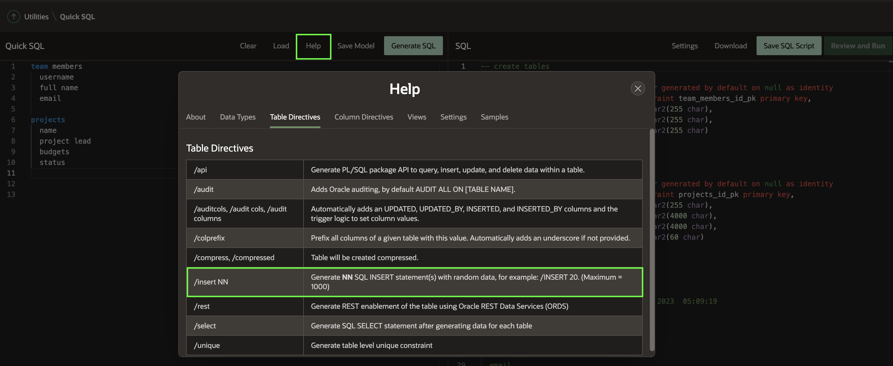

2. Click **Column Directives**

    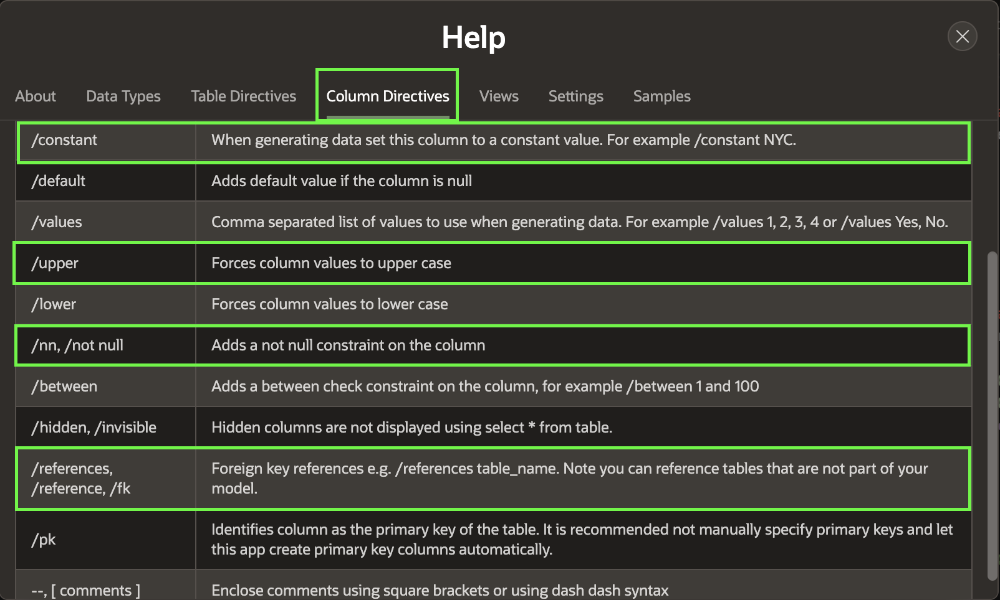

3. Click **Data Types**

    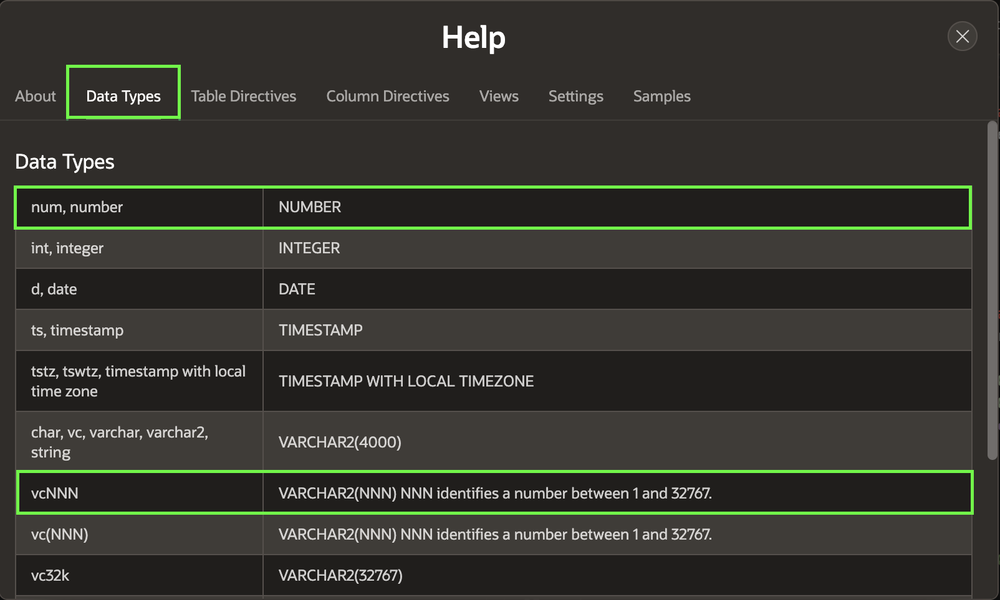

4. Close **Help**
5. In the Quick SQL (left pane), update the Team Members table with the following:  
    - Table: team members - add **/insert 10** *{This will insert 10 sample records}*
    - Column: username - add **/nn /upper** *{this will make the column uppercase and mandatory}*
    - Column: email - add **/nn**

    Update the Projects table with the following:  
    - Table: projects - add **/insert 20** *{This will insert 20 sample records}*   
    - Column: name - add **/nn**    
    - Column: project lead - add **/references team_members**       
    *{This will add a foreign key relationship to the Team Members table}*  
    - Column: budget - add **num** *{This will make the column numeric}*    
    - Column: status - add **vc30 /nn /check ASSIGNED,IN_PROGRESS,COMPLETED**    *{This will define the length of the mandatory column and add a check constraint using the three values given}*

    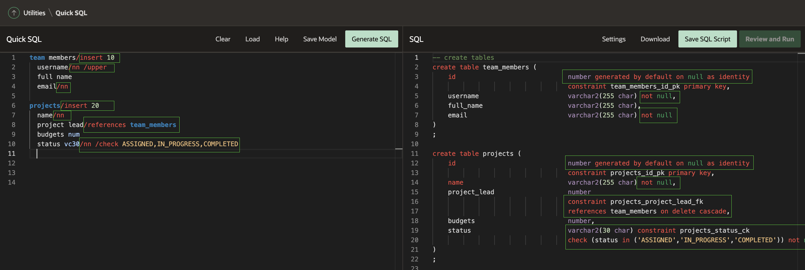

    *{Note: You will need to scroll down within the SQL (right pane) to review the team member trigger for the implementation of the _/upper_ on _username_. If you scroll down further, you will see all of the insert statements.}*

## Task 4: Enter a Child Table
By indenting a table name, you can define the new table as a child table of the table above, and the SQL will generate a foreign key relationship between the two tables.

1. Enter a child table related to Projects.

    In Quick SQL (left pane), enter the Table Name and directive:  
    <code>Milestones /insert 30</code>
    *{Use the same indent as the columns in the Projects table}*

    Indent 2 or more spaces and enter the Column Names and directives:  
    <code>name /nn</code>   
    <code>due_date /nn</code> *{If you do not include the underscore the column will be called _due_ instead of _due\_date_.}*   
    <code>description</code>    

    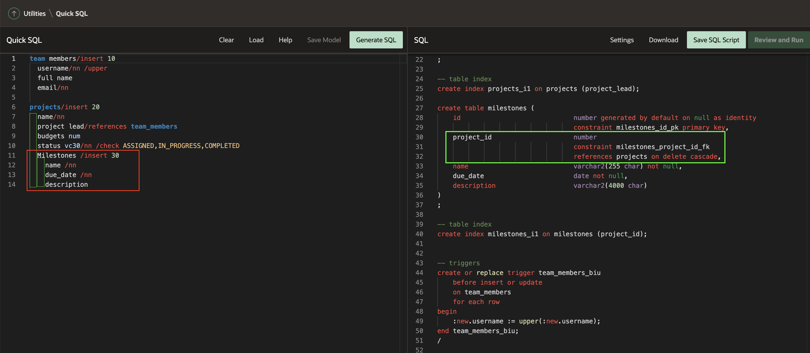

    *{Note: The SQL for the Milestones table includes the project_id column and a foreign key relationship to the parent table, Projects.}*

2. Enter another child table related to Projects.

    In Quick SQL (left pane), enter the Table Name and directive:  
    <code>Tasks /insert 100</code>  
    *{The indent should be the same as you used for the Milestones table to ensure this new table is also a parent of Projects, not of the table above.}*

    Indent 2 or more spaces and enter the Column Names and directives:  
    <code>name /nn</code>   
    <code>assignee /references team_members</code>   
    <code>milestone id /references milestones</code>   

    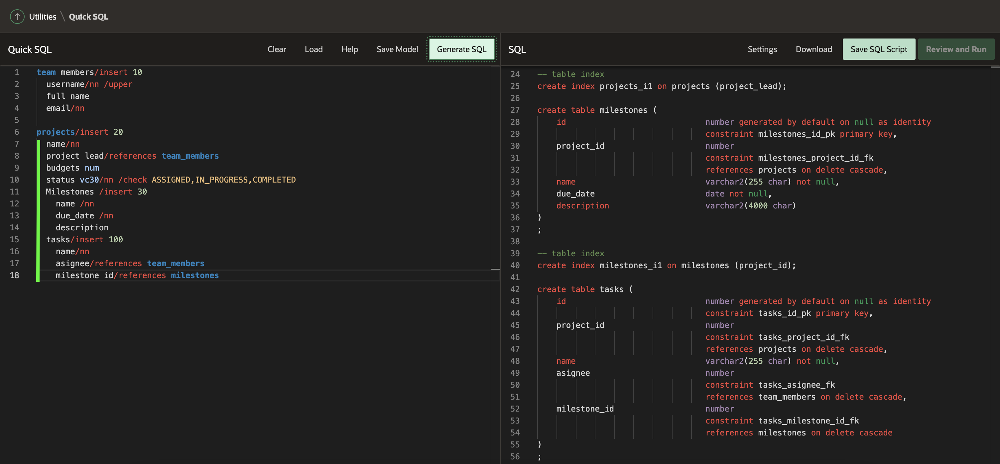

## Task 5: Update the Settings
You can define numerous settings to further improve the generated SQL. You can click **Settings** within the toolbar under SQL (right pane), if you only plan to run the script once. As outlined in the **Help**, you can also define settings in Quick SQL (left pane). Settings defined in Quick SQL do not need to be reentered each time you return to Quick SQL to rerun a previously run script.

1. In the SQL (right pane) toolbar, click **Settings**

    In the Settings dialog, enter the following:
    - Object Prefix - enter **hol**
    - On Delete - select **Restrict**
    - Primary Keys -  select **Identity Column**
    - Date Data Type - select **TIMESTAMP WITH LOCAL TIME ZONE**
    - Audit Columns - **Check**
    - Row Version Number - **Check**

    Click **Save Changes**

    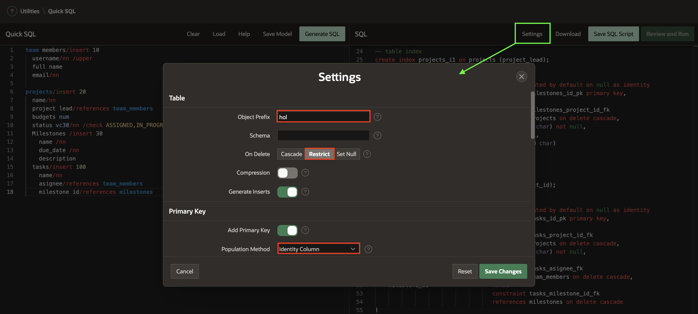

    The generated SQL has changed markedly. The table names are updated, there are additional columns, and updated triggers.

    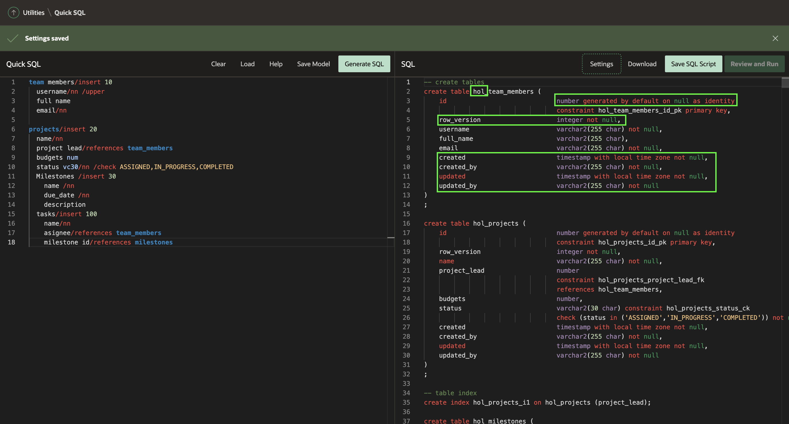

## Task 6: Copy in the Complete Shorthand

1. In Quick SQL (left pane), replace all of the existing shorthand with the following:


    ```
    <copy>
    # settings = { prefix: "hol", ondelete: "restrict", pk: "identity" }
    # date: "timestamp with local time zone"
    # auditcols: true
    # rowVersion: true

    team_members /insert 10
      username /nn /upper
      full name
      email /nn
      phone_number
      profile
      photo file
    projects /insert 20
      name /nn
      project_lead /nn /references team_members
      budget num
      status vc30 /nn /check ASSIGNED, IN-PROGRESS, COMPLETED
      completed_date
      description
      milestones /insert 30
        name /nn
        due_date /nn
        description
      tasks /insert 100
        name /nn
        assignee /references team_members
        milestone_id /references milestones
        start_date /nn
        end_date
        cost num
        description
        is_complete_yn /check Y, N
        to dos /insert 20
          todo vc(255) /nn
          assingee /references team_members
          due_date
          details
        links /insert 10
          url vc(255) /nn /lower
          name
          description

    view project_tasks projects tasks
    </copy>
    ```

    Click **Generate SQL**

    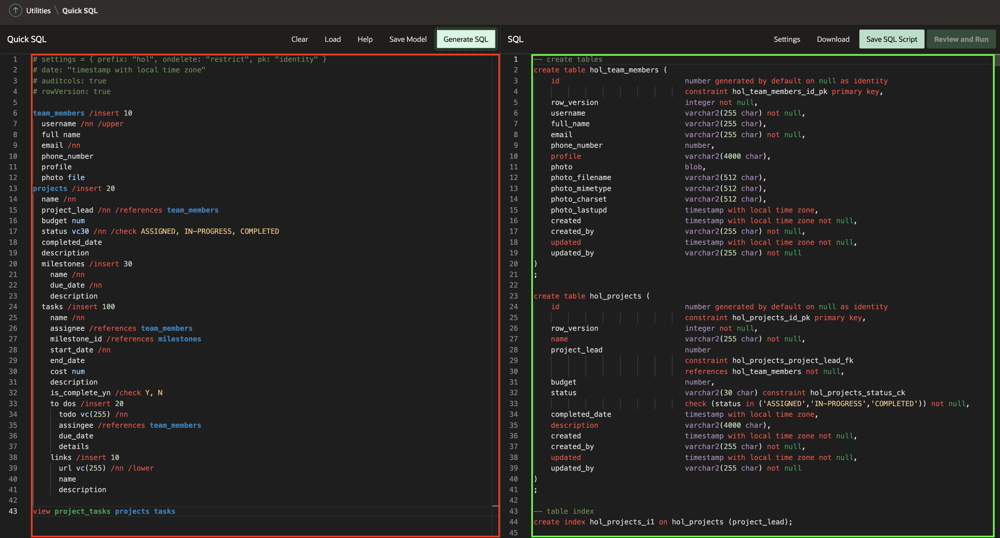

    *{Note: The full shorthand defines all of the required settings. It also includes additional columns on many of the tables, and additional directives and data types. There is also a view defined.}*

## Task 7: Implement the Script
At this stage you have created a list of SQL statements. However, you first need to save the statements as a script file and then run the script. This will create the database objects and insert the data.

1. In the SQL (right pane) toolbar, click **Save SQL Script**.
2. In the Save Script dialog, for Script Name, enter **hol**.   
    Click **Save Script**.

    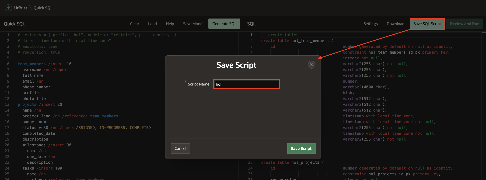

3. In the SQL (right pane) toolbar, click **Review and Run**.    
    The script will be displayed in the **Script Editor**, within SQL Scripts.

    Click **Run**.

    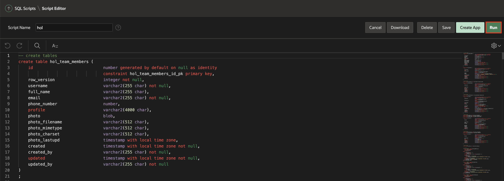

4. On the Run Script page, click **Run Now**.

    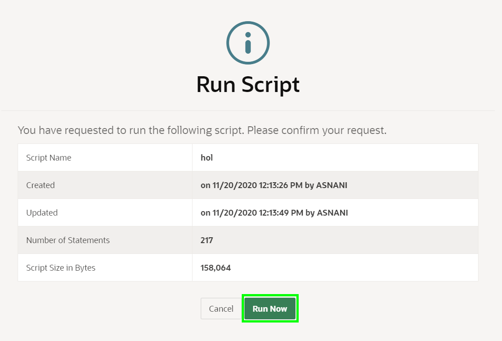
5. The Script Results page will be displayed listing the statements processed, successful, and with errors.

    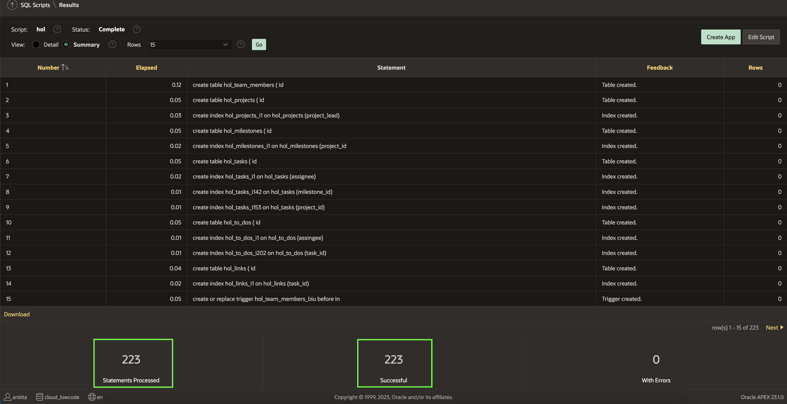

    *{Note: If you do not see 217 statements processed then return to Quick SQL and click _Generate SQL_, resave the script and then run it again. If you do not see 217 successful, then review the errors displayed in Feedback within the results.}*

## **Summary**
You now know how to utilize Quick SQL to build complex data structures, complete with sample data.

## **Acknowledgments**

- **Author** - Salim Hlayel, Principle Product Manager
- **Contributors** - Oracle LiveLabs Team (Robbie Ruppel, Functional Lead; Marilyn Isabella Kessinger, QA Intern; Arabella Yao, Product Manager Intern)
- **Last Updated By/Date** - Salim Hlayel, Principle Product Manager, November 2020
