# Sign up for an Oracle APEX Workspace

## Introduction

Oracle Application Express (APEX) is a feature of Oracle Database, including the Autonomous Data Warehouse (ADW) and Autonomous Transaction Processing (ATP) services. To start, you will need to decide which Oracle Database you are going to use for the lab, and then create an APEX workspace in that database.

If you already have an APEX 19.2 Workspace provisioned you can skip this lab and go straight to (Lab 2)[?lab=lab-2-defining-new-data-structures].

### What is an APEX Workspace?
An APEX Workspace is a logical domain where you define APEX applications. Each workspace is associated with one or more database schemas (database users) which are used to store the database objects, such as tables, views, packages, and more. These database objects are generally what APEX applications are built on top of.

### Where to Run the Lab
You can run this lab in any Oracle Database with APEX 19.2 installed. This includes the "Always Free" Oracle Autonomous Database, the free, "Development Only" apex.oracle.com service, your on-premises Oracle Database (providing APEX 19.2 is installed), on a third party cloud provider where APEX 19.2 is installed, or even on your laptop by installing Oracle XE or the Oracle VirtualBox App Dev VM and installing APEX 19.2.

Below are steps on how to sign-up for either an Oracle Autonomous Database cloud service or apex.oracle.com service. The always free Oracle Autonomous Database is ideal for learning about the Oracle Database and APEX, and provides 1 OCPU and 20 GB of compressed storage. This service can also be utilized for production applications, and can readily be upgraded to a paid service as necessary. On the other hand apex.oracle.com is also a free service, however, it is only designated for development purposes, and running production apps is not allowed. For conducting these labs either service can be utilized.

### Objectives
Access an Oracle APEX Workspace.

### What Do You Need?

- An Oracle Cloud paid account or free trial. To sign up for a trial account with $300 in credits for 30 days, click [here](http://oracle.com/cloud/free).

Click one of the options below to proceed.

## **Option 1**: Oracle Autonomous Database

In this part, you will create an Oracle Cloud trial account. Once you have signed up for the service you will create an Autonomous Transaction Processing database. The final step in the process is to provision Oracle APEX.

1.  Please [click this link to create your free account](https://myservices.us.oraclecloud.com/mycloud/signup?language=en&sourceType). When you complete the registration process you will receive an account with a $300 credit and several "forever free" services that will enable you to complete the lab for free. You can then use any remaining credit to continue to explore the Oracle Cloud. The forever free services will continue to work after the trial expires.

2.  Soon after requesting your trial you will receive a  **Get Started Now with Oracle Cloud** email.   
    Make note of your **Username**, **Password**, and **Cloud Account Name**.

    

3. Now that you have a service, you will log into your Oracle Cloud account so that you can start working with various services.        
    From any browser go to [https://cloud.oracle.com/en_US/sign-in](https://cloud.oracle.com/en_US/sign-in).

    Enter your **Cloud Account Name** in the input field and click the **Next** button.

    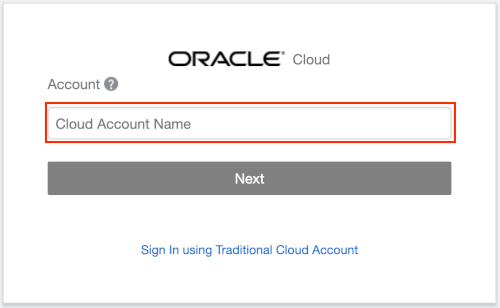

4. Enter your **Username** and **Password** in the input fields and click **Sign In**.

    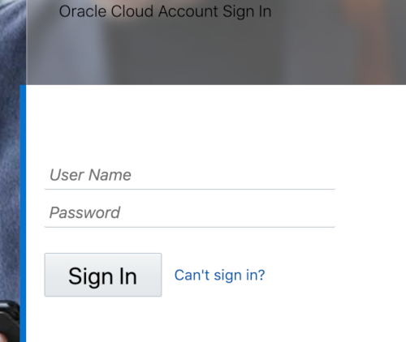

5. From within your Oracle Cloud environment, you will create an instance of the Autonomous Transaction Processing database service.

    From the Cloud Dashboard, select the navigation menu icon in the upper left-hand corner and then select **Autonomous Transaction Processing**.

    

6. Click **Create Autonomous Database**.

    

7. Select the **Always Free** option, enter **```SecretPassw0rd```** for the ADMIN password, then click **Create Autonomous Database**.

    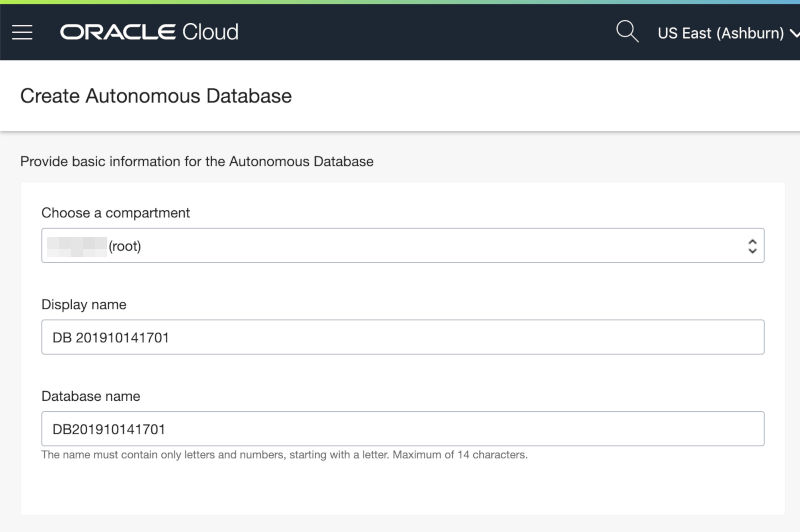
    
    

8. After clicking **Create Autonomous Database**, you will be redirected to the Autonomous Database Details page for the new instance.

    Continue when the status changes from:

    

    to:

    

9. Within your new database, APEX is not yet configured. Therefore, when you first access APEX you will need to log in as an APEX Instance Administrator to create a workspace.

    Click the **Tools** tab.
    Click **Open APEX**.

    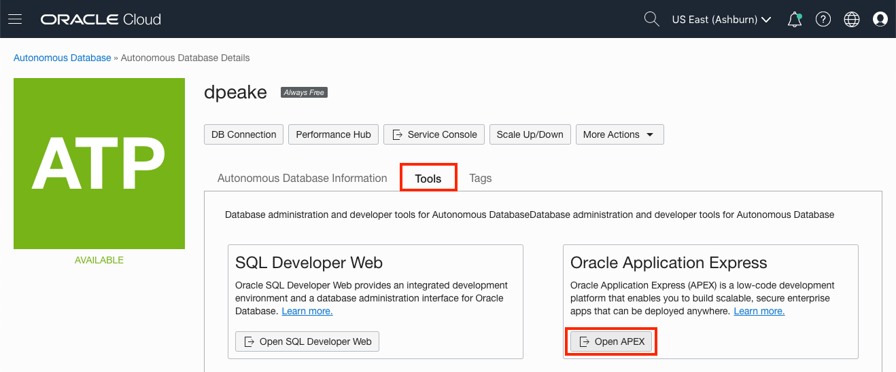

10. Enter the password for the Administration Services and click **Sign In to Administration**.     
    The password is the same as the one entered for the ADMIN user when creating the ATP instance: **```SecretPassw0rd```**

    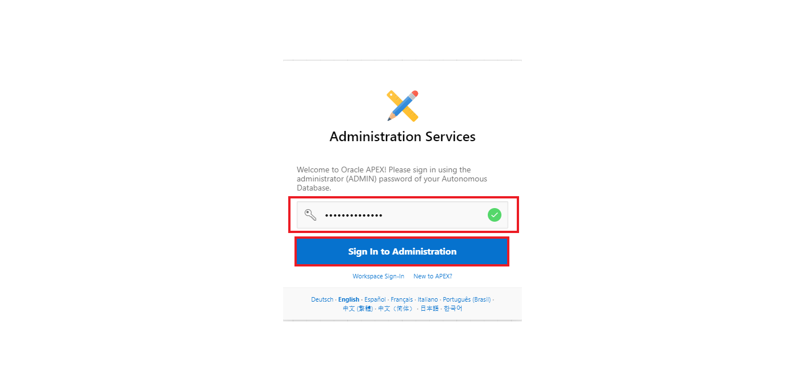

4. Click **Create Workspace**.

    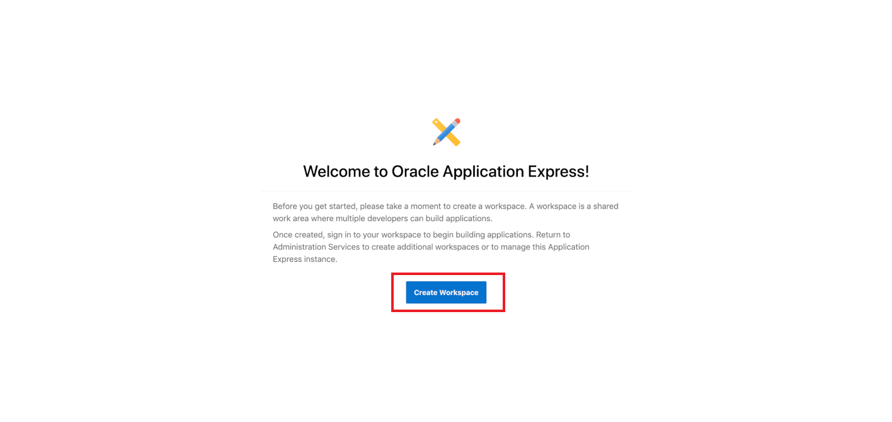

5. In the Create Workspace dialog, enter the following:

    | Property | Value |
    | --- | --- |
    | Database User | DEMO |
    | Password | **`SecretPassw0rd`** |
    | Workspace Name | DEMO |

    Click **Create Workspace**.

    

6. In the PEX Instance Administration page, click the **DEMO** link in the success message.         
    *{Note: This will log you out of APEX Administration so that you can log into your new workspace.}*

    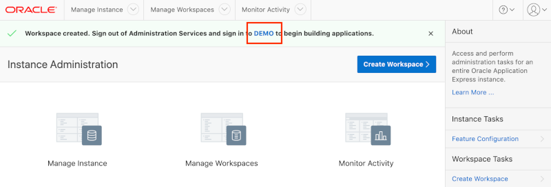

7. On the APEX Workspace log in page, enter **``SecretPassw0rd``** for the password, check the **Remember workspace and username** checkbox, and then click **Sign In**.

    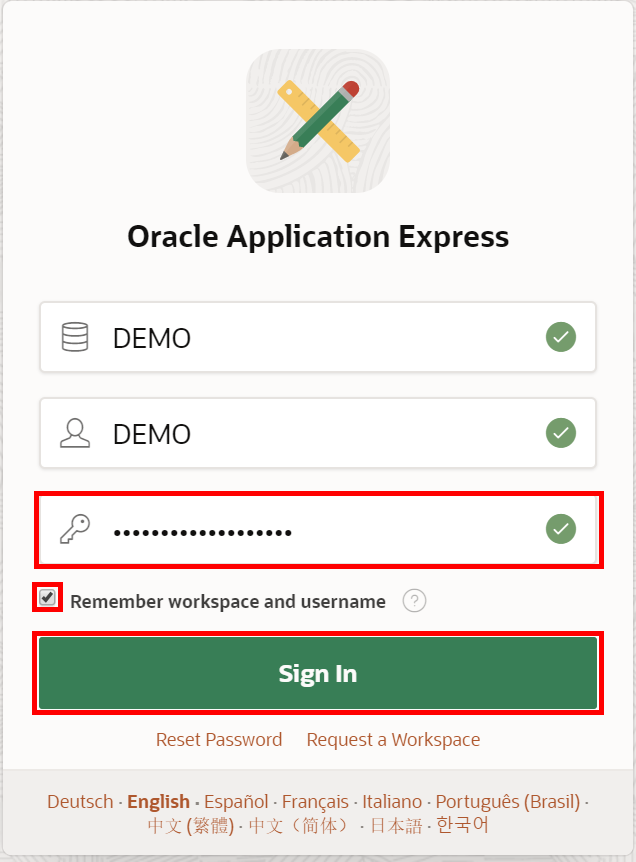

## **Option 2**: apex.oracle.com
Signing up for apex.oracle.com is simply a matter of providing details on the workspace you wish to create and then waiting for the approval email.

1. Go to [https://apex.oracle.com](https://apex.oracle.com)
2. Click **Get Started for Free**

    

3. Scroll down until you see details for apex.oracle.com.  Click **Request a Free Workspace**

    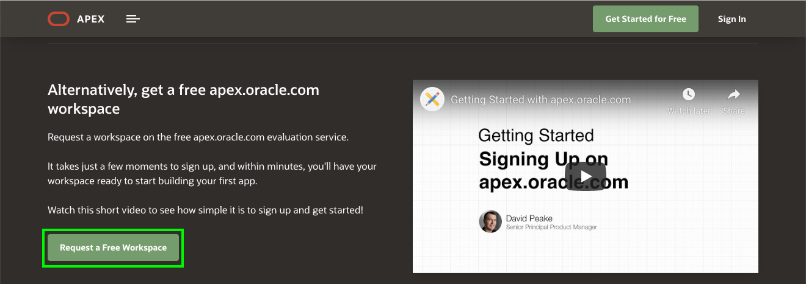

3. On the Request a Workspace dialog, enter your Identification details – First Name, Last Name, Email, Workspace  
   *{Note: For workspace enter a unique name,
such as first initial and last name}*

    Click **Next**.

    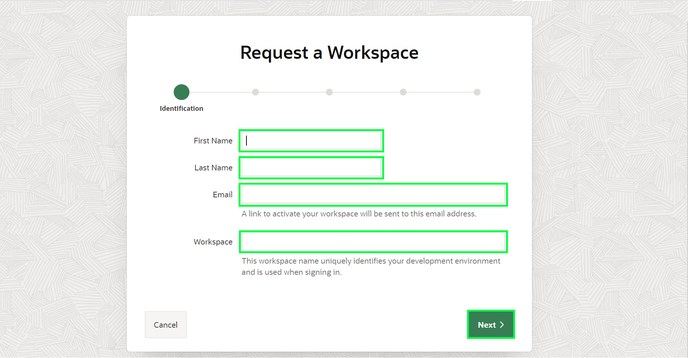

3. Complete the remaining wizard steps.

4. Check your email. You should get an email from oracle- application-express_ww@oracle.com
within a few minutes.  
   *{Note: If you don’t get an email go
back to Step 3 and make sure to enter
your email correctly}*

    Within the email body, click **Create Workspace**

    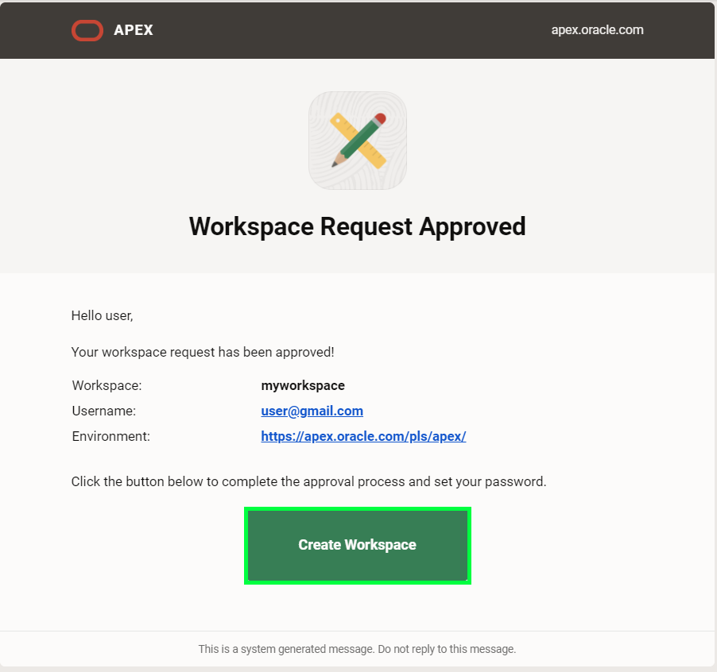

3. Click **Continue to Sign In Screen**.
4. Enter your password, and click **Apply Changes**.
5. You should now be in the APEX Builder.

    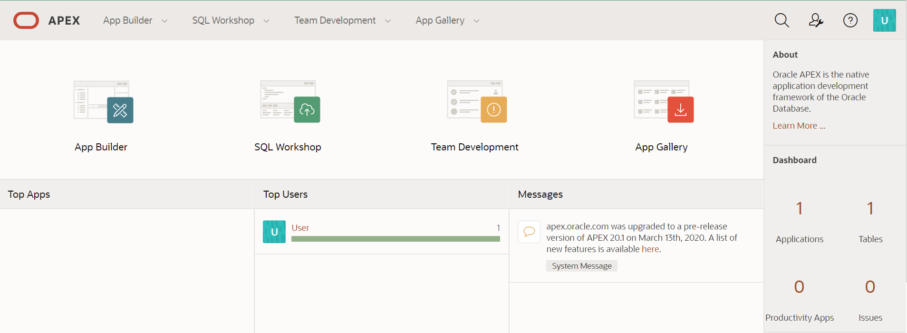


## **Summary**

This completes the lab setup. At this point, you know how to create an APEX Workspace and you are ready to start building amazing apps, fast.

Go to [lab 2 of this workshop](?lab=lab-2-defining-new-data-structures) to create data structures in your APEX Workspace.

## **Acknowledgments**

- **Author** - Salim Hlayel, Principle Product Manager
- **Contributors** - Robbie Ruppel, Functional Lead, Oracle LiveLabs
- **Last Updated By/Date** - Anoosha Pilli, Product Manager, DB Product Management, April 2020
