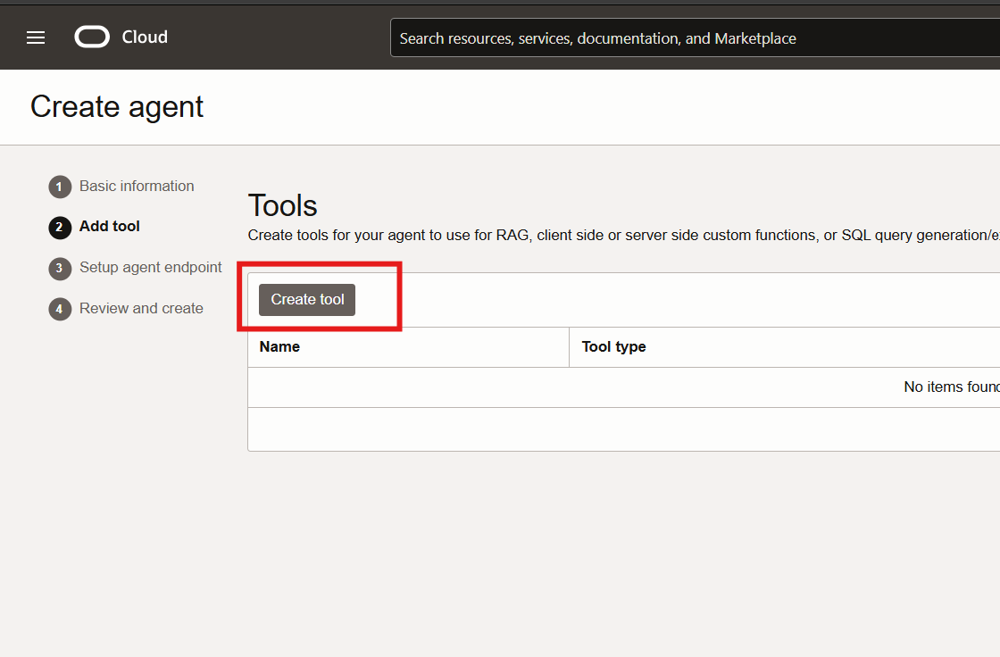

# Setup Backend for GenAI agents

## Introduction
This lab will walk you through setting up important OCI resources to use in the following labs. You will set up your compartment, object storage bucket, GenAI agent, knowledge base, and generate an API key. 

Compartments are a logical collection of related resources. Compartments allow for organization and isolation of your cloud resources. Object storage is a low-cost storage option to store any type of data. Oracle's GenAI Agent combines LLMs and RAG to provide contextually relevant answers by searching a knowledge base. Your knowledge base is the base for all the data sources that an agent can use to retrieve information for its chat answers.

Estimated time - 20 minutes

### Objectives

In this lab, you will:
* Create Compartment
* Create an Object Storage Bucket for Knowledge Base
* Create Knowledge Base
* Create a GenAI agent
* Generate API key

### Prerequisites

This lab assumes you have the following:

Access to Oracle Cloud Infrastructure (OCI), paid account or free tier, in a region that has:
Generative AI
Basic experience with OCI Cloud Console and standard components.

## Task 1: Create a compartment

1. Navigate to the hamburger menu in the top left-hand corner. Select **Identity & Security**, under the **Identity** section choose **Compartments**.
   	

2. Select the button **Create Compartment**. Enter in a name, for this example I will be naming the compartment **LiveLab**.
	

## Task 2: Create Bucket for Knowledge Base

1. Navigate to **Object Storage** by selecting the side-menu button, click **Storage** and then, **Buckets**.

	

2. Select **Create Bucket**, name the bucket **RAG**, and leave everything else as default. Select Create.

	

3. Navigate to the newly created bucket by selecting from the list, **RAG**. Scroll down on the bucket page and select **Upload**. 

	

4. Download the sample PDF [here](https://docs.oracle.com/en/database/oracle/apex/24.2/htmrn/oracle-apex-release-notes.pdf) and then, drag and drop the sample PDF to the console and select **Upload**.

	

## Task 3: Create your Knowledge Base

1. Navigate to the hamburger menu in the top left-hand corner. Select 'Analytics & AI', choose **Generative AI Agents**. 
 **Note:** Make sure you are in the correct region **US-Midwest Chicago** or else the Generative AI options won't be visable.

	

2. Select **Knowledge Bases** on the left-hand side and click the button **Create Knowledge Base**

	

3. Enter in a name for your knowledge base, **RAG-KB**. Under **Data sources** click **Specify data source**.

	

4. Select the Object Storage bucket you created earlier, **RAG**, and check **Select all in bucket**. Click **Create**.

	

5. Ensure your knowledge base is active before proceeding to Task 4.

	

## Task 4: Create your Gen AI Agent

1. Navigate to Gen AI Agents by selecting the hamburger menu in the top left-hand corner, click **Analytics & AI** and then, **Generative AI Agents**. Make sure you are in the correct region.

	

2. On the landing page for **Generative AI Agents**, click the **Create Agent** button.

	

3. Enter a name, **RAG-AGENT**, ensure you are in the correct compartment, optionally enter in a welcome message, & click **Next**.

	

4. Click **Create Tool**.

	

5. Select **RAG**. 

	

6. Enter a name, **RAGLL**, description, and add the RAG-KB knowledge base you created earlier. After this, select **Create tool**.

	   

7. Setup agent endpoint. Make sure **Automatically create an endpoint for this agent** is checked. For the purposes of this LiveLab, leave all Guardrails disabled. You will need the Endpoint OCID for later in the following labs. Select **Next**.

 	 

 8. Review your agent information and click **Create agent**. You can now proceed to the next task.

	

   
## Task 5: Generate API Keys

1. Navigate to your profile icon on the right-hand side of the screen. Select **User Settings**. 

	

2. On the left under **Resources**, select **API keys**

	

3. Make sure **Generate API Key Pair** is selected. Download your private & public key because you will need these for later. After downloading, select **Add**. You will see a configuration file preview, you can close this. You may proceed to the next lab. 

      

## Acknowledgements

* **Authors:**
	* Kevin Xie - Cloud Architect
	* Nicholas Cusato - Cloud Architect
	* Olivia Maxwell - Cloud Architect
	* Graham Shroyer - Cloud Architect
	* Rachel Ogle - Cloud Architect
* **Last Updated by/Date** - Nicholas Cusato, May 2025
