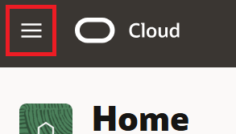
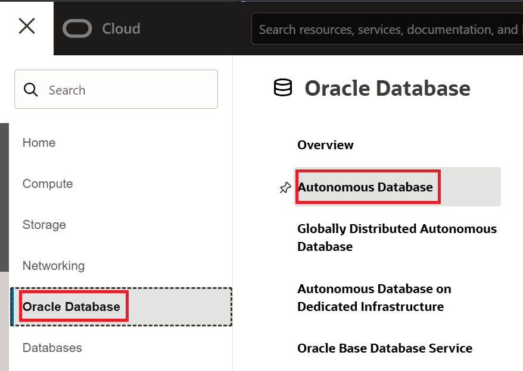
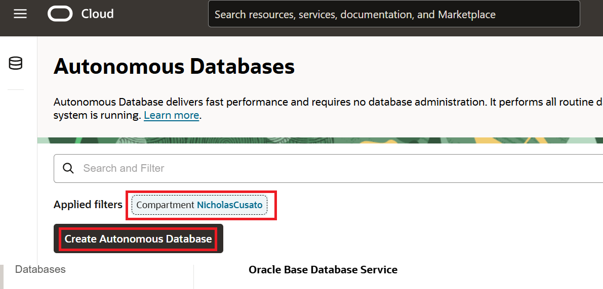
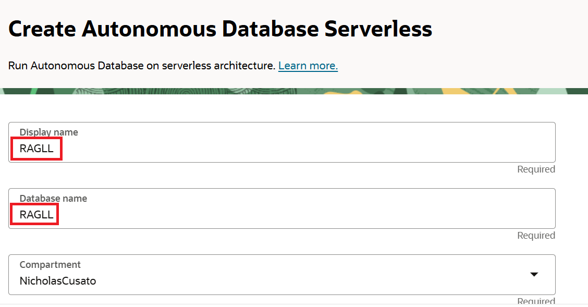
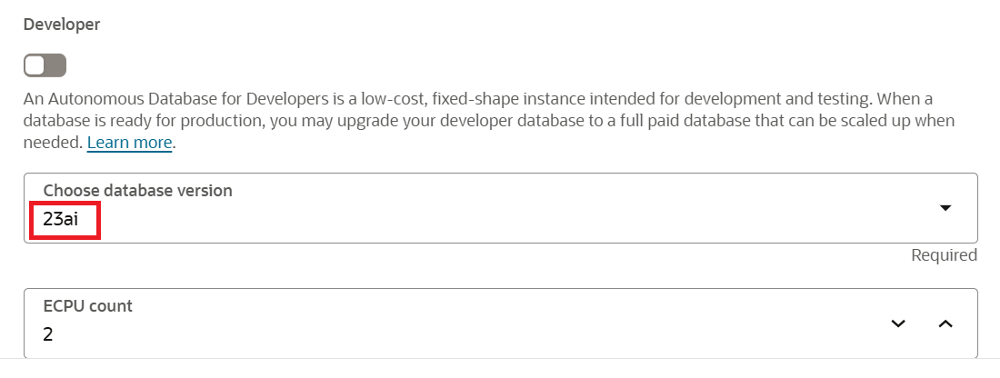
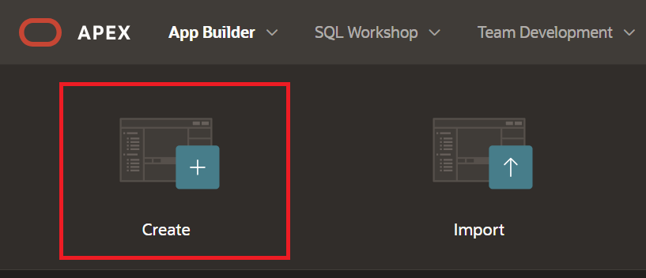

# Build a RAG Chatbot using Low-Code APEX

## Introduction

This lab walks the user 

Estimated time - 20 minutes

### Objectives

* Create the Application on APEX
* Update the Credentials to Connect to OCI Resources
* Build the Question Panel
* Build the Chat Panel
* Test the application

### Prerequisites

* An OCI cloud account
* Subscription to US-Central Chicago Region

## Task 1: Provision a 23ai ADB and Object Storage Bucket

1. Navitage to the OCI home console and expand the side-menu bar.

	

2. Select the **Oracle Database** and click the **Autonomous Database** Option.

	

3. Ensure you are in the correct compartment and select **Create Autonmous Database**. The region in which you provision the ADB doesn't matter as much as the previous GenAI services Lab as the ADB will use the service route to access the model. 

	

4. Give the ADB a unique name, such as **RAGLL**, select database version **23ai**, and provide a password. Leave everything else as default and click **Create**.

	

	

5. Navigate to **Object Storage** by selecting the side-menu button, click **Storage** and then, **Buckets**.

	

6. Select **Create Bucket**, name the nucket **RAG**, and leave everything else as default. Select Create

	

7. Navigate to the newly created bucket by selecting from the list the name **RAG**. Scroll down on the bucket page and select **Upload**. Download the sample PDF [here](https://orasenatdpltsecitom03.objectstorage.us-phoenix-1.oci.customer-oci.com/p/ZtYD0BzBps8w3O2sYzLvnync2uSXfZk9SHSHdpaZAMnlxIVpVAEiGY4wmMKSZVEE/n/orasenatdpltsecitom03/b/RAG/o/OCI%20Dedicated%20Region%20At-A-Glance.pdf) and then, drag and drop the sample PDF to the console and select **Upload**.

	

1. Create an application by selecting the **create** button.

  

2. 

## Task 2: 

## Task 3: 

Thank you for completing this lab.

## Acknowledgements

* **Authors:**
	* Kevin Xie - Cloud Architect
	* Nicholas Cusato - Cloud Architect
	* Olivia Maxwell - Cloud Architect
	* Graham Shroyer - Cloud Architect
	* Rachel Ogle - Cloud Architect
* **Last Updated by/Date** - Nicholas Cusato, March 2025