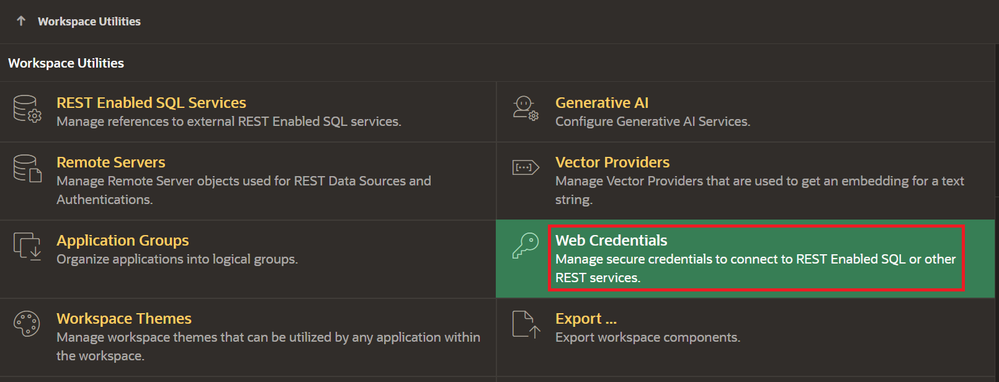

# Build a RAG Chatbot using Low-Code APEX

## Introduction

This lab walks the user 

Estimated time - 45 minutes

### Objectives

* Provision a 23ai ADB and APEX App
* Update the Credentials to Connect to OCI Resources
* Create the Application
* Connect Rest Sources
* Build the Question Panel
* Build the Chat Panel
* Test the application

### Prerequisites

* An OCI cloud account
* Subscription to US-Central Chicago Region

## Task 1: Provision a 23ai ADB and APEX App

1. Navitage to the OCI home console and expand the side-menu bar.

	

2. Select the **Oracle Database** and click the **Autonomous Database** Option.

	

3. Ensure you are in the correct compartment and select **Create Autonmous Database**. The region in which you provision the ADB doesn't matter as much as the previous GenAI services Lab as the ADB will use the service route to access the model. 

	

4. Give the ADB a unique name, such as **RAGLL**, select database version **23ai**, and provide a password. Leave everything else as default and click **Create**.

	

	

5. Navigate to the newly created ADB by selecting the name that you provided, then click the **Tool Configuration** tab and select the Public Access URL **Copy** button for Oracle APEX. Paste that in a new tab.

	

6. Enter your password used during the creation of the ADB and click **Sign in to Administration**.

	

7. Create a new workspace by clicking **Create Workspace**.

	

8. Create a new schema by clicking the **New Schema** button.

	

9. Enter the following credentials and click **Create Workspace**.
	* **Workspace Name:** *RAG*
	* **Workspace Username:** *RAG*
	* **Workspace Password:** *Welcome2Oracle* (or choose a secure password that you will remember)

	

10. Sign out of the admin management by selecting the profile button on the top right and click **Sign out**

	

11. Click **Return to Sign in Page** 

	

12. Sign in using the new credentials:
	* **Workspace Name:** *RAG*
	* **Workspace Username:** *RAG*
	* **Workspace Password:** *Welcome2Oracle* (or whichever password you chose to remember)

	

## Task 2: Update the Credentials to Connect to OCI Resources

1. Click **App Builder** to access the Web Credentials.

	

2. Click the **Workspace Utilities** button.

	

3. Click the **Web Credentials** button.

	

4. Click **Create** to update your web credentials.

	

5. Paste the information collected in the first lab into the cooresponding fields (be sure to name the credentials and static ID: **api_key**) and select **Create**.

	

## Task 3: Create the Application

1. Navigate back to the App Builder by selecting the menu button **App Builder**.

	

2. Create an application by selecting the **create** button.

	

3. Name the App **RAG Chatbot** and click **Create Application**.

	 

## Task 4: Create REST Data Sources

1. Navigate to Shared Components from the App Home Console by selecting the button **Shared Components**.

	

2. Select the button **REST Data Sources** under the Data Sources field.

	

3. Select the button **Create** to create the Data Source.

	

4. Select **Next** and leave the option default as **from Scratch**.

	

5. Select Rest Data Type as **OCI**, then name the Rest Data Source **Object Storage** and paste the URL for the object storage rest url, which has the following format: **https:_//objectstorage._<region_>.oraclecloud.com/n/_<namespace_>/**. Select **Next** to continue.
	* Example region: us-chicago-1
	* Namespace: tenancy name 

	

6. Select **Next** leaving the url base as default.

	

7. Select **api_key** from the drop-down options listed and click **Advanced** to proceed.

	

8. Paste the following into the options and select **Discover** to proceed to view the output and save.
	
	* **Parameter Type:** URL Query String
	* **Parameter Name:** fields
	* **Value:** <copy>name,size,timeCreated,md5,timeModified,storagetier</copy>
	* **Is Static:** Yes

	

## Task 5: Create Object Storage List Page

1. Naviate to the home page by clicking the **app name** in the breadcrumbs bar and then click the **home page** to begin editing.

	

	

Next we will create our first region to display the objects in the object storage bucket.

2. Right-click on the body of the editor and select **Create Region**.

	

3. Modify the details to match the following:

	* **Name:** Object Storage List
	* **Type:** Classic Report
	* **Source:** **Location:** Rest Source, **Rest Source:** Object Storage

	

Next we will create the upload functionality to send files to object storage.

4. Create an **Upload Region** by right-clicking to the left side and select **Create Region**.

	

5. Name the region **Upload** and select the appearance to be **Inline Popup**

	

6. Right click the new region **Upload** and select **Create Page Item**. Name the item **P1_FILE** and select from the drop down **File Upload**.

	

	

7. Right click the **Upload region** one more time and select **Create Button**. Name the button **UploadIngest** and use the label title **Upload & Ingest**. Enable **Hot** for the appearance.

	

	

Next we will create the Open Upload Region Action. 

8. Right click the **Upload Button** and select **Create Dynamic Action**. Modify the options to the include the following for the **True** option:
	* **Name:** Open Region
	* **Action:** Open Region
	* **Selection Type:** Region
	* **Region:** Upload

	

	

9. Select the **process button** to create an Upload Process and right click to click **Create Process**. Name it **Upload & Ingest** and select **Execution Chain** for Type.

	

10. Edit the Process

	

Thank you for completing this lab.

## Acknowledgements

* **Authors:**
	* Kevin Xie - Cloud Architect
	* Nicholas Cusato - Cloud Architect
	* Olivia Maxwell - Cloud Architect
	* Graham Shroyer - Cloud Architect
	* Rachel Ogle - Cloud Architect
* **Last Updated by/Date** - Nicholas Cusato, March 2025
