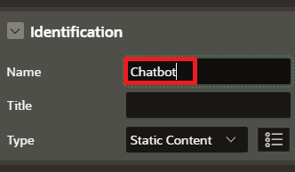

# Build a RAG Chatbot using Low-Code APEX

## Introduction

This lab walks the user througth part 2 of the APEX app development where the user creates the chatbot page.  

Estimated time - 45 minutes

### Objectives

* Create the Chatbot
* Create the Citations Page
* Test Chatbot
* (Optional) Enhance the UI Aesthetically

### Prerequisites

* An OCI cloud account
* Subscription to US-Central Chicago Region

## Task 1: Create the 

1. Navigate to the App Homepage and select **Create New Page**.

	

	

2. Select **Next** and leave the blank page template selected as default. 

	

3. Change the **page number to 2** and name the page **Chatbot**. Select **next** to build the page.

	

4. Create region by right-clicking the **body** in rendering pane and selecting **Create Region**. Name the region **Chatbot**.

	

	

5. Right-click the new region ChatBot and select **Create Page Item**. Name the page item **P2_ANSWER** and select type as **Hidden**.

	![]

	3. Create Chat Region
		1. Right Click ChatBot Region
		2. Create Region
			1. Name: Chat
			2. Type: Classic Report
			3. Source: Type: SQL Query
			4. Appearance: CSS Classes: t-Chat

Thank you for completing this lab.

## Acknowledgements

* **Authors:**
	* Kevin Xie - Cloud Architect
	* Nicholas Cusato - Cloud Architect
	* Olivia Maxwell - Cloud Architect
	* Graham Shroyer - Cloud Architect
	* Rachel Ogle - Cloud Architect
* **Last Updated by/Date** - Nicholas Cusato, March 2025
