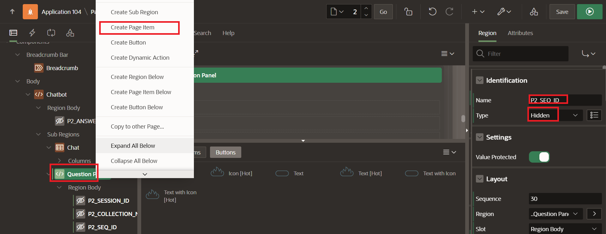
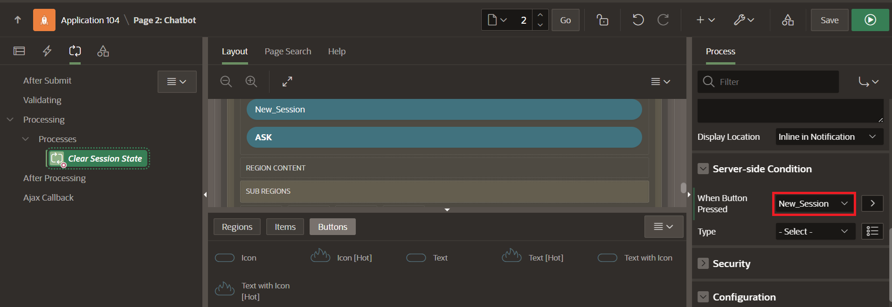
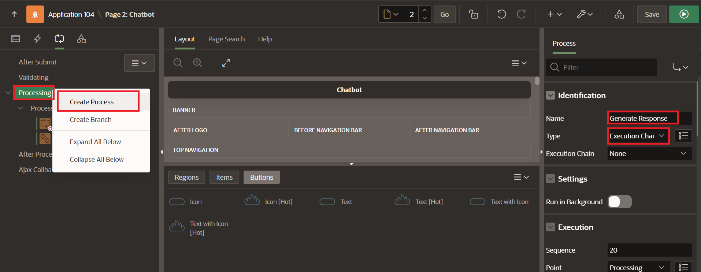
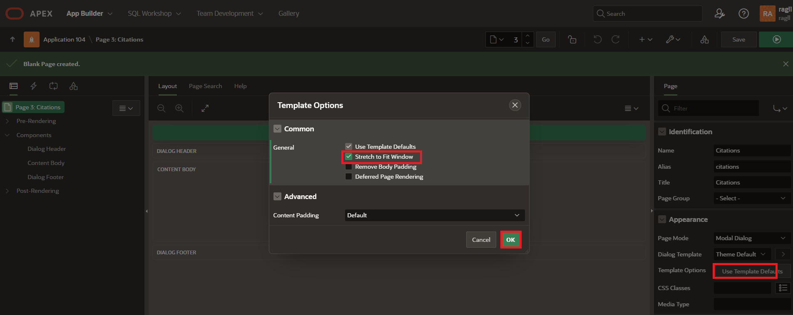

# Build a RAG Chatbot using Low-Code APEX

## Introduction

This lab walks the user througth part 2 of the APEX app development where the user creates the chatbot page.  

Estimated time - 20 minutes

### Objectives

* Create the Chatbot
* Create the Citations Page
* Test Chatbot
* (Optional) Enhance the UI Aesthetically

### Prerequisites

* An OCI cloud account
* Subscription to US-Central Chicago Region

## Task 1: Create the Chatbot Page 

1. Navigate to the App Homepage and select **Create New Page**.

	

	

2. Select **Next** and leave the blank page template selected as default. 

	

3. Change the **page number to 2** and name the page **Chatbot**. Select **next** to build the page.

	

4. Create region by right-clicking the **body** in rendering pane and selecting **Create Region**. Name the region **Chatbot**.

	

	

5. Right-click the new region ChatBot and select **Create Page Item**. Name the page item **P2_ANSWER** and select type as **Hidden**.

	

6. Right Click **ChatBot Region** and select **Create Sub Region**. Modify the following on the right panel: 
	* **Name:** Chat
	* **Type:** Classic Report
	* **Source: Type:** SQL Query
	* **Appearance:** CSS Classes: t-Chat
	* **SQL Query:**
	```
	<copy>
	select c001          as user_name,
		c003          as comment_text, 
		c004          as comment_date,
		case when c001 = :APP_USER then apex_string.get_initials(:APP_USER)
		else 'CB'
		end user_icon,
		case when c002 = 'Yes' then 'Citations'
		else null        
		end actions,
		null          as attribute_1,
		null          as attribute_2,
		null          as attribute_3,
		null          as attribute_4,
		case
		when c002 = 'No' then 't-Chat--own'
		else null
		end comment_modifiers,
		n001
	from apex_collections 
	where collection_name = :P2_COLLECTION_NAME
	order by seq_id asc
	</copy>
	```
	

	

	

Next we will create the Question Panel.

7. Right-click the **ChatBot Region** that we just created and select **Create Sub Region**. Name the region **Question Panel**.

	

8. Right-click the new region: **Question Panel** and select **Create Page Item**. Update the following on the right side of the screen:
	* **Name:** "P2\_SESSION\_ID"
	* **Type:** Hidden

	

9. Right-click the same **Question Panel** and select **Create Page Item**. Update the following on the right side of the screen:
	* **Name:** "P2\_COLLECTION\_NAME"
	* **Type:** Hidden

	

10. Right-click the same **Question Panel** and select **Create Page Item**. Update the following on the right side of the screen:
	* **Name:** "P2\_SEQ\_ID"
	* **Type:** Hidden

	

11. Right-click the same **Question Panel** and select **Create Page Item**. Update the following on the right side of the screen:
	* **Name:** "P2_QUESTION"
	* **Type:** Text Field
	* **Settings:** Submit when Enter pressed: Enabled

	

12. Right-click the same **Question Panel** and select **Create Button**. Name the button **NEW_SESSION**.

	

13. Right-click the same **Question Panel** and select **Create Button**. Name the button **ASK**. Enable the **Hot** under appearance.

	

14. Create a **Processes** by selecting the **Process tab** and right-click **Processing**, selecting **Create Process**. Provide the following on the right side of the panel:
	* **Name:** Clear Session State
	* **Type:** Clear Session State

	

	* **Server-side Condition:** When button Pressed: New Session

	

16. Right-click **Processing** again and select **Create Process**. Provide the following on the right side of the panel:
	* **Name:** Generate Response
	* **Type:** Execution Chain

	

17. Right-click **GenerateResponse Process** and select **Add Child Process**. Provide the following on the right side of the panel:
	* **Name:** Create Session
	* **PL/SQL Code:**
	```
	<copy>
	declare
	 c_agent_endpoint_id constant varchar2(1024) :=
	  'ocid1.genaiagentendpoint.oc1.us-chicago-1.xxxxxxxxxx';
	 l_response clob;
	begin
	 apex_web_service.set_request_headers(
	  p_name_01 => 'Content-Type'
	  , p_value_01 => 'application/json'
	 );
	l_response := apex_web_service.make_rest_request(
	  p_http_method => 'POST'
	  , p_url =>
		'https://agent-runtime.generativeai.us-chicago-1.oci.oraclecloud.com'
		|| '/20240531/agentEndpoints/'
		|| c_agent_endpoint_id
		|| '/sessions'
	  , p_credential_static_id => 'api_key'
	  , p_body => json_object(
		key 'displayName' value 'AgentTester'
		, key 'description' value 'Application testing the GenAI Agent service.'
	  )
	 );
	if apex_web_service.g_status_code = 200 then
	  apex_json.parse(p_source => l_response);
	-- Store the session ID
	  :P2_SESSION_ID := apex_json.get_varchar2(p_path => 'id');
	-- Create a new APEX collection to store the question and response.
	  :P2_COLLECTION_NAME := 'SSID_' || to_char(systimestamp
	   , 'YYYYMMDDHH24MISS');
	  apex_collection.create_or_truncate_collection(
	   p_collection_name => :P2_COLLECTION_NAME
	  );
	 else
	  raise_application_error(-20001, 'Error creating session.');
	 end if;
	end;
	</copy>
	```
	* **Server-side condition**
		* **Type:** Item is Null
		* **Item:** P2\_SESSION\_ID

	

		

18. Right-click **GenerateResponse** and select **Add Child Process**. Provide the following on the right side of the panel:
	* **Name:** Generate Response child
	* **PL/SQL Code:**
	```
	<copy>
	declare
	 c_agent_endpoint_id constant varchar2(1024) :=
	  'ocid1.genaiagentendpoint.oc1.us-chicago-1.xxxxxx';
	 l_response clob;
	 l_clean_response clob;
	begin
	 apex_web_service.set_request_headers(
	  p_name_01 => 'Content-Type'
	  , p_value_01 => 'application/json'
	 );
	l_response := apex_web_service.make_rest_request(
	  p_http_method => 'POST'
	  , p_url =>
		'https://agent-runtime.generativeai.us-chicago-1.oci.oraclecloud.com'
		|| '/20240531/agentEndpoints/'
		|| c_agent_endpoint_id
		|| '/actions/chat'
	  , p_credential_static_id => 'api_key'
	  , p_body => json_object(
		key 'sessionId' value :P2_SESSION_ID
		, key 'shouldStream' value 'false'
		, key 'userMessage' value apex_escape.json(:P2_QUESTION)
	  )
	 );
	if apex_web_service.g_status_code = 200 then
	  apex_json.parse(p_source => l_response);
	l_clean_response := JSON_VALUE(l_response, '$.message.content.text' returning varchar2);
	  -- Save the question and response to the question, and then save the
	  -- generated SEQ ID to the session state.
	:P2_SEQ_ID := apex_collection.add_member(
	   p_collection_name => :P2_COLLECTION_NAME,
	   p_c001 => :APP_USER,
	   p_c002 => 'No',
	   p_c003 => :P2_QUESTION,
	   p_c004 => to_char(sysdate, 'DD-MON-YYYY HH24:MI:SS'),
	   p_n001 => :P2_SEQ_ID+1
	  );
	:P2_SEQ_ID := apex_collection.add_member(
	   p_collection_name => :P2_COLLECTION_NAME,
	   p_c001 => 'CHATBOT',
	   p_c002 => 'Yes',
	   p_c003 => l_clean_response,
	   p_c004 => to_char(sysdate, 'DD-MON-YYYY HH24:MI:SS'),
	   p_n001 => :P2_SEQ_ID+1,
	   p_clob001 => l_response
	  );
	 end if;
	end;
	</copy>
	```

* **Note:** Be sure to update the first variable line (**c\_agent\_endpoint\_id**) in the copy section above with the AI Agent Endpoint OCID with the correct OCID from the OCI console that was written down from Lab 1, Task 4, Step 7. Make sure there are no spaces within the single quotes.

	

19. Click the **green button** at the top right of the page to save and run.

	


## Task 2: Create Citations Page 

1. Navigate back to the page we were editing. Create a new page by selecting the **plus sign drop down button** at the top right and select **Page**.

	

2. Select **Blank Page**, modify the following, and select **Create Page**:
	* **Page #:** 3
	* **Name:** Citations
	* **Page Mode:** Modal Dialog

	

3. Click **Edit Page** and under **Appearance/Template Options**, click **Template Defaults**, and select **Stretch to Fit Window**. Select **Ok** to save.

	

3. Right-click **Components/Content Body** and select **Create Page Item**. Modify the following on the right side of the screen:
	* **Name:** P3\_SEQ\_ID
	* **Type:** Hidden

	

4. Create the Citation Region by right-clicking Components/Content Body and selecting **Create Region**. Modify the following on the right side of the screen:
	* **Name:** Citations
	* **Type:** Classic Report
	* **Source Type:** SQL Query
	* **SQL Query:**
	```
	<copy>
	select
	 ct.source_text
	 , ct.source_title
	 , ct.source_location_type
	 , ct.source_url
	from apex_collections c
	 , json_table(c.clob001, '$.message.content.citations[*]'
	   columns(
		source_text varchar2(32767) path '$.sourceText'
		, source_title varchar2(32767) path '$.title'
		, source_location_type varchar2(32767)
		  path '$.sourceLocation.sourceLocationType'
		, source_url varchar2(32767) path '$.sourceLocation.url'
	   )
	 ) ct
	where c.collection_name = :P2_COLLECTION_NAME
	and c.seq_id = :P3_SEQ_ID
	</copy>
	```

	

5. Click the **Save button** at the top right of the page.

	

6. Create a link to the Citations by first navigating back to page 2 by clicking the **nav bar** and selecting **2**.

	


7. Expand the Columns under the Chat Subregion by clicking **the arrow** and then select **Actions**.Change Type from Plain Text to **Link**.

	

	* **Link target:** Click No Link Defined
	* **Type:** Page in this application
	* **Page:** 3
	* **Set Items:**
		* **Name:** P3\_SEQ\_ID
		* **Value:** #N001#

	


7. Click the **green arrow** at the top right of the page to save the app and run it.

	

8. Test the app functionality by typing a series of questions specific to the knowledge base, such as the following:

* What are the main new features introduced in Oracle APEX 24.2?
* What are the minimum database and browser requirements for Oracle APEX 24.2?
* What is the recommended web server for running Oracle APEX 24.2?
* What improvements have been made to REST source integration?
* Can you describe the new workflow enhancements in APEX 24.2?
* What are the new AI-related features, such as "Generate Text with AI" or "Create Custom Data Models Using AI"?

9. Observe the response and click through the citations response to validate answers. 

Thank you for completing this lab.

## Acknowledgements

* **Authors:**
	* Kevin Xie - Cloud Architect
	* Nicholas Cusato - Cloud Architect
	* Olivia Maxwell - Cloud Architect
	* Graham Shroyer - Cloud Architect
	* Rachel Ogle - Cloud Architect
* **Last Updated by/Date** - Nicholas Cusato, May 2025
