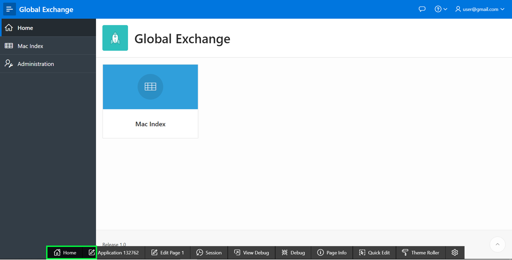
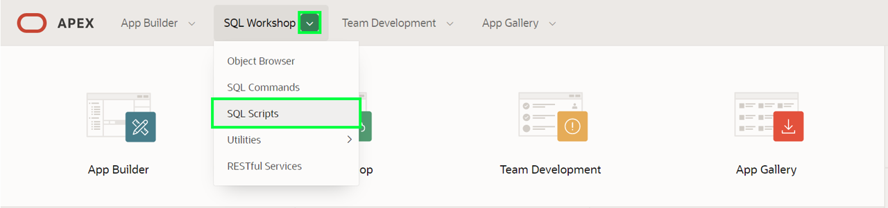
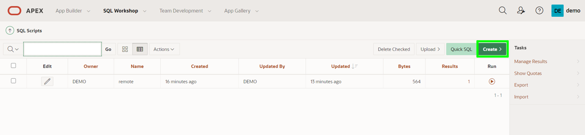
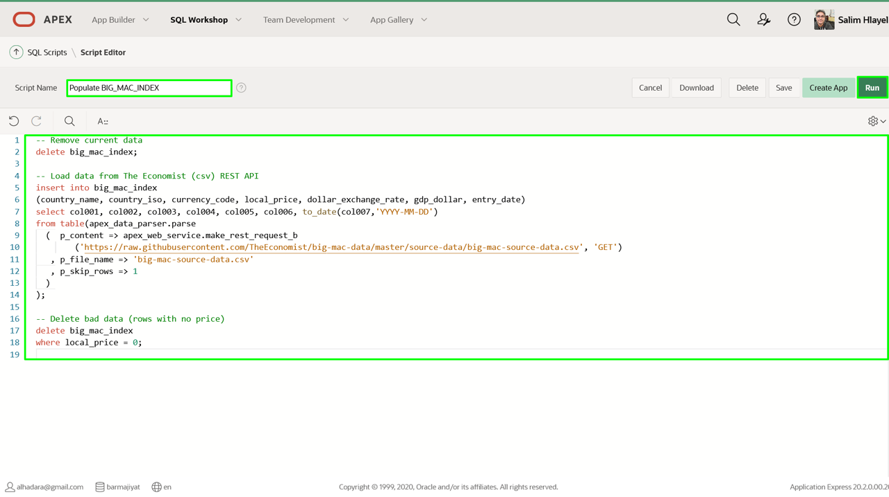
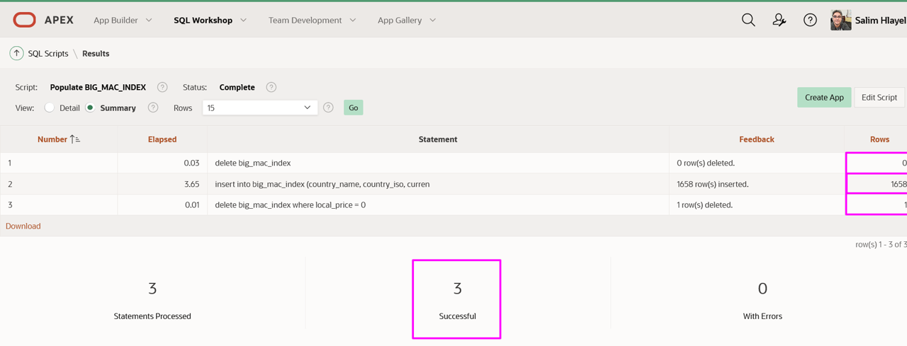
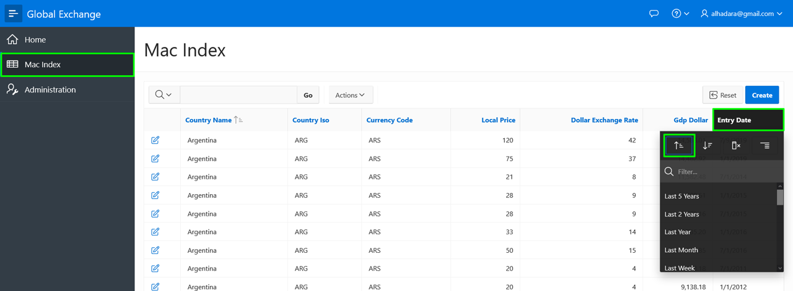
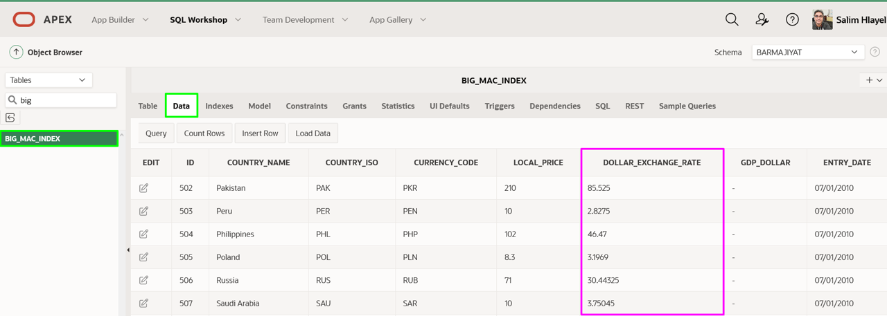

# Populating the Table

## Introduction

In this lab, you will learn how to insert data into a table from a REST API.

Estimated Time: 5 minutes

### Background Information

The **apex\_data\_parser** is a PL/SQL package which provides an easy interface to parse files from various file formats, including comma-delimited (.csv). The parser is implemented as a table function - so the developer accesses parser results like a table. Therefore, the parser can utilize INSERT ... SELECT statements to insert rows directly into a table from the specified file.

The **apex\_web\_service.make\_rest\_request\_b** is a PL/SQL function which invokes a RESTful style Web service and returns the results in a BLOB. Utilizing this function within apex\_data\_parser will allow you to load data from a REST API directly into your table.

## Task 1: Create a Script

Rather than running a one-off SQL statement to load the data, writing a SQL Script enables the SQL statement to be run repeatedly.

The Big Mac Data is refreshed every 6 months. Therefore, this script can be used twice a year to keep the data current.

1. From the runtime environment, in the Developer Toolbar (bottom of screen), click **Home**.

2. Click **SQL Workshop**, and then select **SQL Scripts**.

3. In the SQL Script page toolbar, click **Create**.

4. In the Script Editor page, enter the following.
    * **Script Name:** enter **Populate BIG\_MAC\_INDEX**
    * Copy and paste the following.

    ```
    <copy>-- Remove current data
    delete big_mac_index;

    -- Load data from The Economist (csv) REST API
    insert into big_mac_index
    (country_name, country_iso, currency_code, local_price, dollar_exchange_rate, gdp_dollar, entry_date)
    select col001, col002, col003, col004, col005, col006, to_date(col007,'YYYY-MM-DD')
    from table(apex_data_parser.parse
    (  p_content => apex_web_service.make_rest_request_b
        ('https://raw.githubusercontent.com/TheEconomist/big-mac-data/master/source-data/big-mac-source-data.csv', 'GET')
      , p_file_name => 'big-mac-source-data.csv'
      , p_skip_rows => 1
    ));

    -- Delete bad data (rows with no price)
    delete big_mac_index
    where local_price = 0;</copy>    
    ```

5. Click **Run**.

6. On the Run Script page, click **Run Now**.
7. The Script Results page will be displayed listing the statements processed, successful, and with errors.
In November 2020, Results should show **1658 row(s) inserted** and **1 row(s) deleted**(your number of rows inserted/deleted may differ depending on the date you run the script).

*Note: If you do not see 3 statements processed successfully then double check your table definition and the script to populate the table.*

## Task 2: Review the Data

There are several ways to review the data.

1. Navigate to the runtime environment tab or window.
2. In the application menu click **Mac Index**.
On the report, click **Entry Date**, and click **Sort Ascending**, to see the latest data.

*Note: Many of the Dollar Exchange Rate values simply show 1.*
3. In the APEX Builder tab or window, click **SQL Workshop**, and then select **Object Browser**.

4. In Object Browser, within the list of Tables, click **BIG\_MAC\_INDEX**.
In the middle pane, click **Data**.

Note: Review the decimal places on the DOLLAR\_EXCHANGE\_RATE column. In the next lab you will ensure the data displays properly.

## **Summary**

This completes Lab 3. You now know how to utilize **apex\_data\_parser** and **apex\_web\_service.make\_rest\_request\_b** to populate a table in the Oracle database based on a REST endpoint. [Click here to navigate to Lab 4](?lab=lab-4-improving-report)

## **Acknowledgements**

* **Author** \- Salim Hlayel\, Principle Product Manager
* **Contributors** \- Jaden McElvey\, Technical Lead \- Oracle LiveLabs Intern
* **Last Updated By/Date** \- Madhusudhan Rao, Apr 20220

