# Adding a Chart

## Introduction
In this lab, you will learn how to add a chart page to the application.

Estimated Time: 5 minutes

### Background Information
The Big Mac Index includes data for countries over the last 20 years. Therefore, to better visualize trends in a country's exchange rate over time it would be highly beneficial to create a chart that is country specific.

Initially you will create a chart that displays the Dollar Exchange Rate for Australia (COUNTRY_ISO = 'AUS'). Then you will add additional data series.

## Task 1: Create a New Page

1. From the runtime environment, in The Developer Toolbar (bottom of the screen), click **Application ###**.

    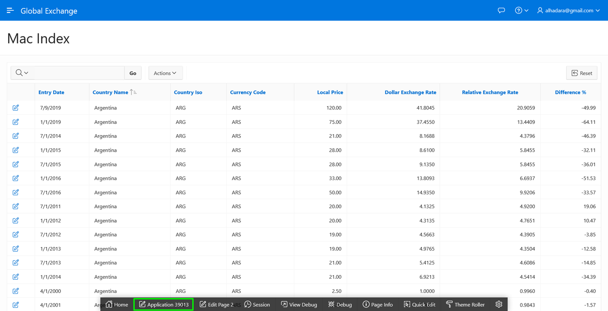

2. From the Application Home Page, click **Create Page**.

    In the Create a Page dialog, for Page Type, click **Chart**.  

    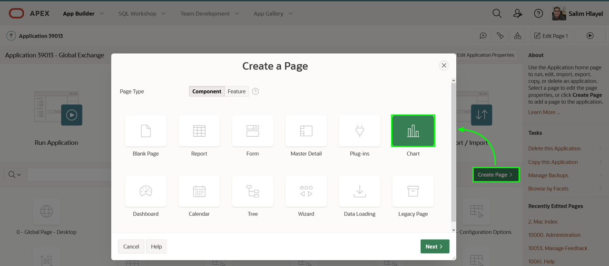

3. In the Create Chart dialog, for Chart Type, click **Line**.

    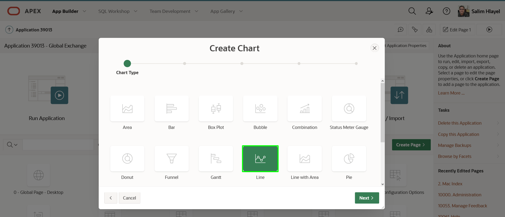

4. In the Page and Region Attributes dialog, enter the following.
    - **Page Name:** enter **Country Chart**
    - **Breadcrumb:** select **Breadcrumb**

    Click **Next**.

    

5. In the Navigation Menu dialog, for Navigation Preference, click **Create a new navigation entry**.

    Click **Next**.

    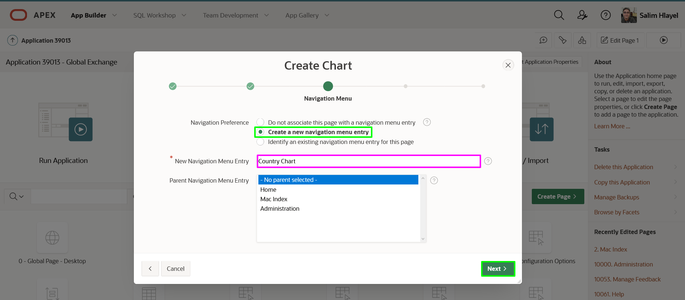

6. In the Source dialog, enter the following.
    - **Source Type:** click **SQL Query**
    - **SQL Query:** cut and paste the following.

        ```
        <copy>select entry_date
        , dollar_exchange_rate
        from big_mac_index l
        where country_iso = 'AUS'
        order by entry_date</copy>
        ```
    Click **Next**.

    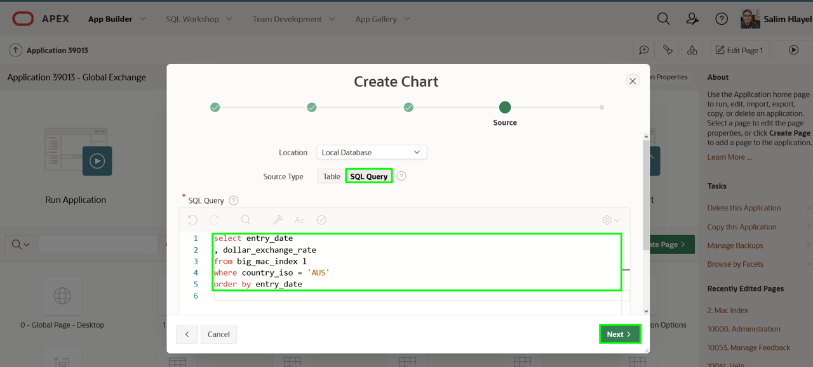

7. In the Column Mapping dialog, enter the following.
    - **Label Column:** select **ENTRY_DATE**
    - **Value Column:** select **DOLLAR\_EXCHANGE\_RATE**

    Click **Create**.

    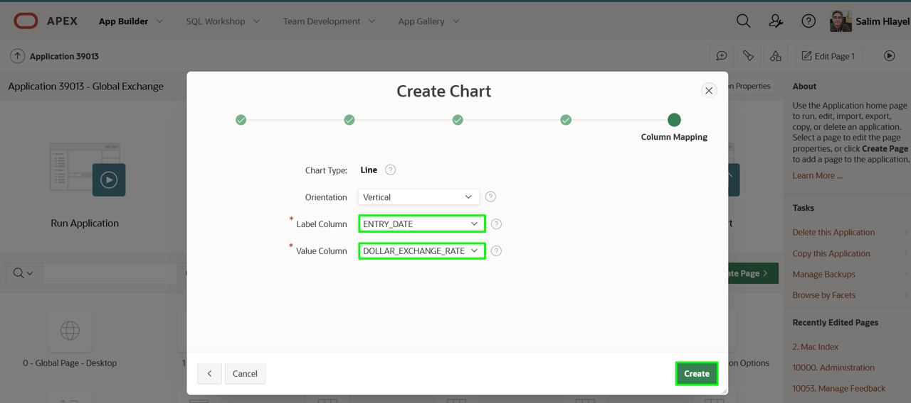

8. In the Page Designer toolbar, click **Save and Run**.

    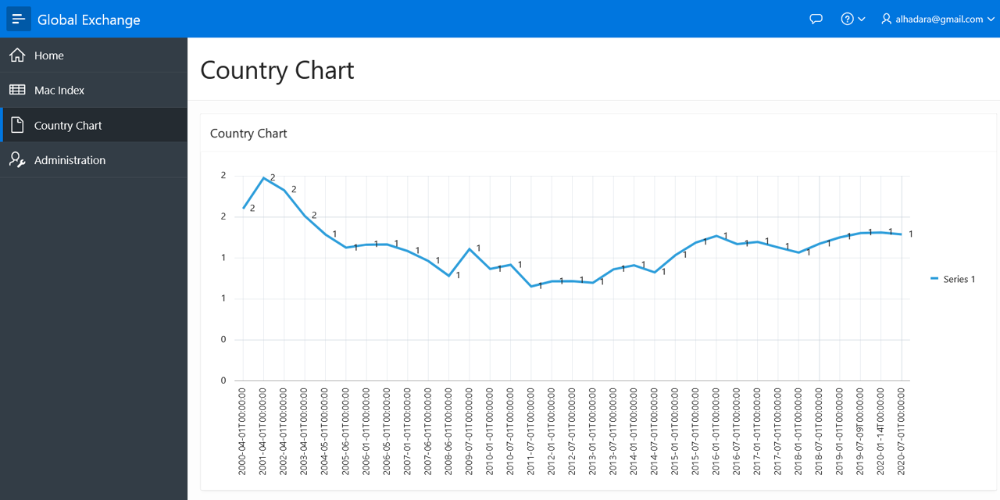

## Task 2: Adjust the Chart Attributes
As can be seen by the appearance of the first cut of the chart, there is work to be done. Updating some attributes will help.

1. From the runtime environment, in the Developer Toolbar (bottom of the screen), click **Quick Edit**.
    Hover over the chart region until it is surrounded by a blue box. Click the Chart.  

    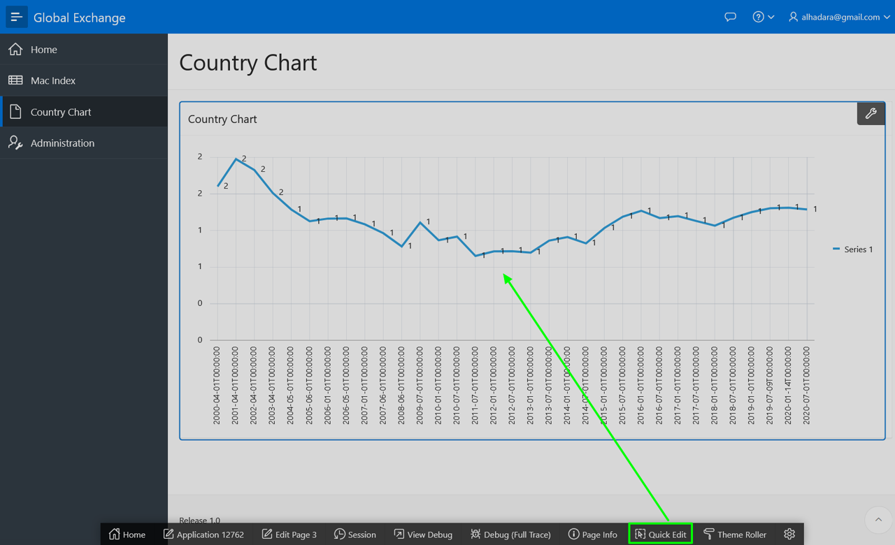

    Alternatively, navigate back to the APEX Application Builder tab or window, and then navigate to Page 4.

2. Within Page Designer, in the Rendering tree (left pane), under **Country Chart**, click **Attributes**.

    In the Property Editor (right pane), enter the following.

    - **Settings > Time Axis Type:** select **Mixed Frequency**
    - **Legend > Show:** click **Yes**  

    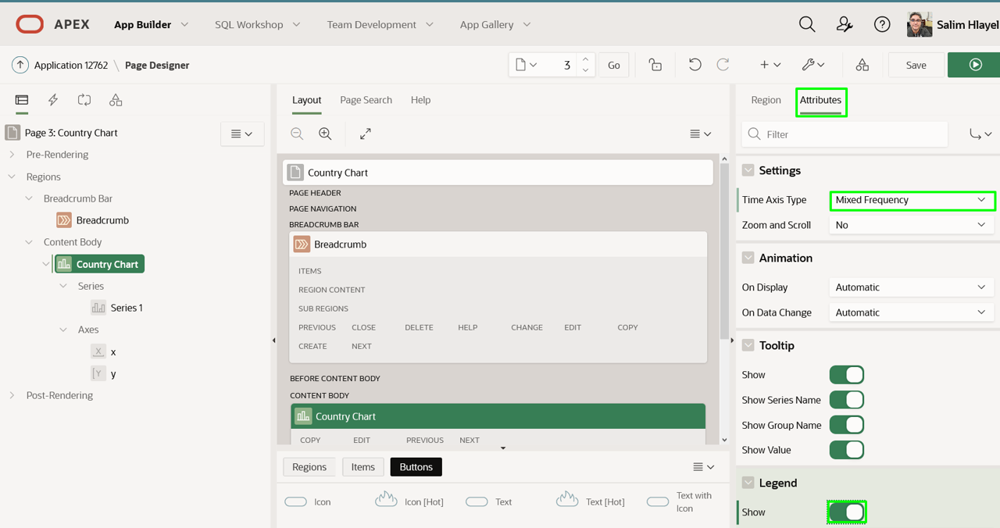

## Task 3: Update the Chart Series
Time to update the existing chart line (series), and add a few more data series.

1. Within Page Designer, in the Rendering tree (left pane), under **Country Chart**, click **Series 1**.

    In the Property Editor (right pane), enter the following.

    - **Identification > Name:** enter **Dollar Exchange Rate**
    - **Label > Show:** click **No**  

    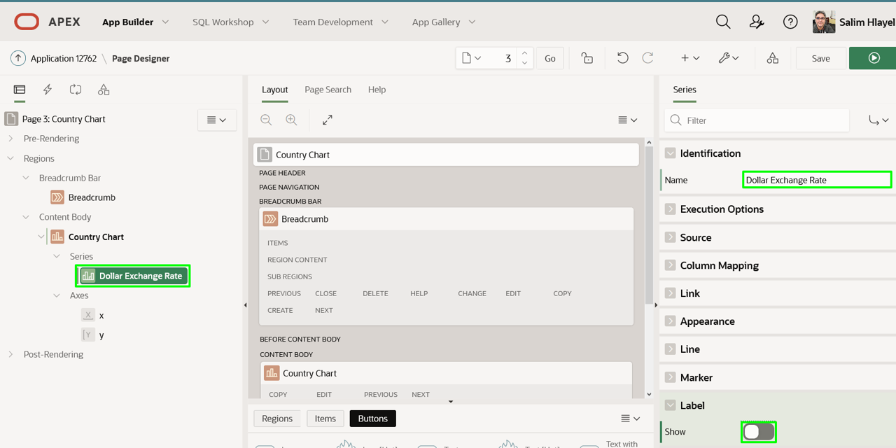

    - Select **Axes > y**
    - **Value > Decimal Places** enter **1**, this will allow the labels on the chart to have decimal values that are more readable.

    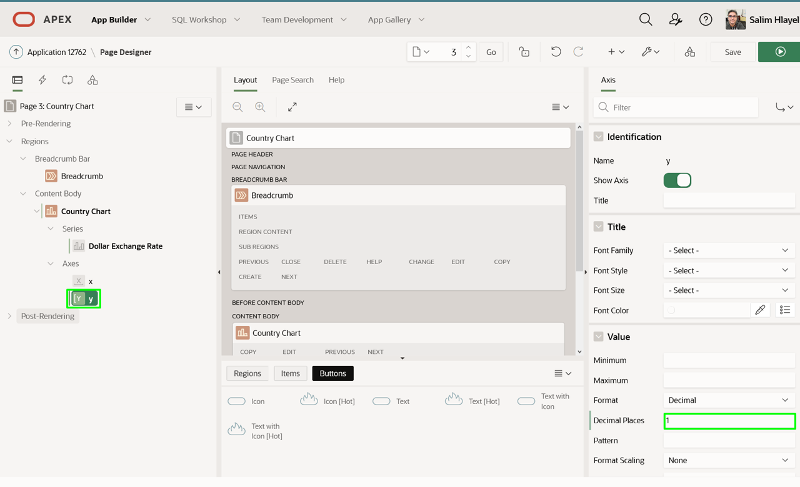

2. The next two series are very similar to the first, so it is easiest to just duplicate the existing series.

    In the Rendering tree (left pane), under **Country Chart**, right-click **Dollar Exchange Rate**, click **Duplicate**.

    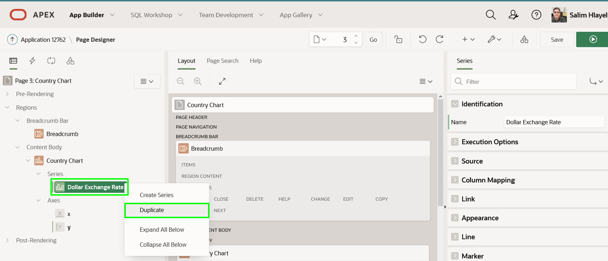

3. Repeat the step above to create a third series.
    *Note: You should now have Dollar Exchange Rate, Dollar Exchange Rate\_1, and Dollar Exchange Rate\_2 or Dollar Exchange Rate\_1\_1, depending on which series you duplicated to create the third series.*

4. The second chart line (series) is going to display the Relative Exchange Rate.

    In the Rendering tree (left pane), under **Country Chart**, click the second series.    
    In the Property Editor (right pane), enter the following.

    - **Identification > Name:** enter **Relative Exchange Rate**
    - **Source > SQL Query:** copy and paste the following.

        ```
        <copy>select entry_date
        , (local_price / (select local_price from big_mac_index u
                          where u.entry_date = l.entry_date
                          and u.country_iso = 'USA'
                         )
          ) relative_exchange_rate
        from BIG_MAC_INDEX l
        where country_iso = 'AUS'
        order by entry_date</copy>
        ```
    - **Column Mapping > Value:** select **RELATIVE\_EXCHANGE_RATE**  

    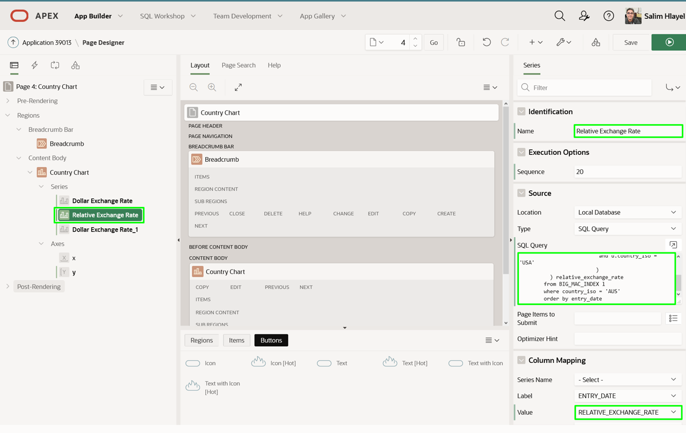

5. The third chart line (series) is going to display the Percentage Difference between the currency and the US currency.

    In the Rendering tree (left pane), under **Country Chart**, click the third series.    
    In the Property Editor (right pane), enter the following.

    - **Identification > Name:** enter **Percentage Difference (Y2)**
    - **Source > SQL Query:** cut and paste the following:

        ```
        <copy>select entry_date
        , ((  local_price / (select local_price from big_mac_index u
                             where u.entry_date = l.entry_date
                             and u.country_iso = 'USA'
                            )
            - dollar_exchange_rate
           ) * 100 / dollar_exchange_rate
          ) percentage_difference
        from BIG_MAC_INDEX l
        where country_iso = 'AUS'
        order by entry_date</copy>
        ```

    - **Column Mapping > Value:** select **PERCENTAGE_DIFFERENCE**
    - **Appearance > Assigned To Y2 Axis:** check **Yes**  

    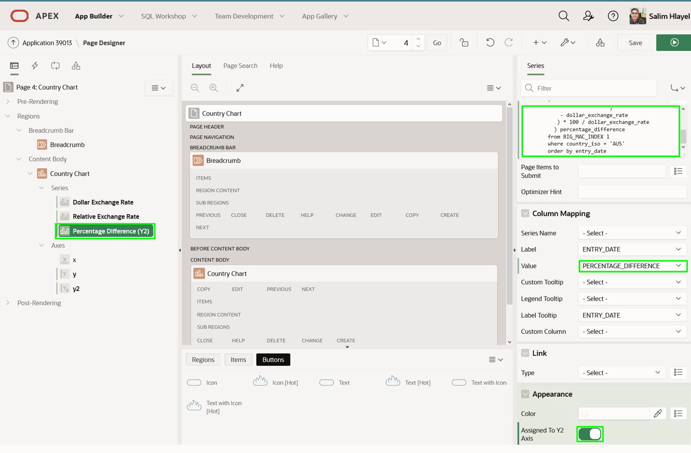

    *Note: If you do not check ‘Assigned to Y2 Axis’ then the chart will not display well, and not look like the following page.*

6. In Page Designer, within the Toolbar, click **Save and Run**.

    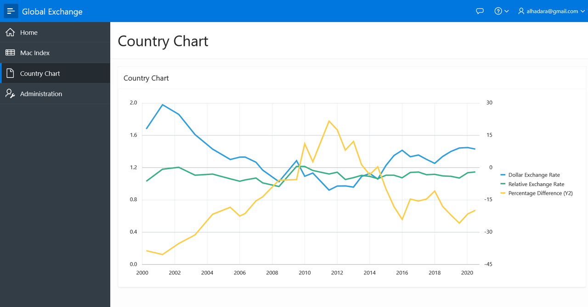

## **Summary**
This completes Lab 5. In this lab you learnt how to create and modify a chart adding multiple series. [Click here to navigate to Lab 6](?lab=lab-6-adding-chart-criteria)

## **Acknowledgements**

 - **Author** -  Salim Hlayel, Principle Product Manager
 - **Contributors** - Jaden McElvey, Technical Lead - Oracle LiveLabs Intern
 - **Last Updated By/Date** - Salim Hlayel, Principle Product Manager, November 2020

