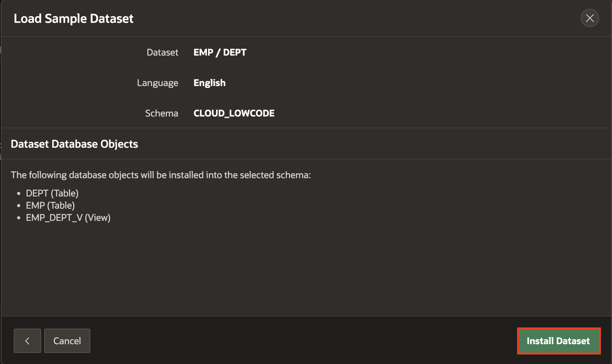
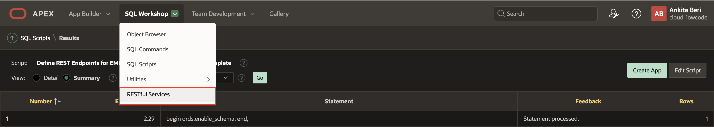
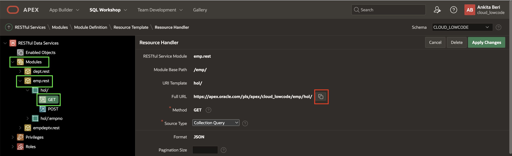

# REST Enabling Database Objects

## Introduction
In this lab, you will learn how to REST enable a schema and database objects.

Estimated Time: 10 minutes

### Background Information
In this lab you will be creating the EMP and DEPT tables, REST enabling them, and then building an application all in the same schema. Normally, you would REST enable database objects in a remote database schema, and then utilize those REST endpoints to define REST Data Sources in an application, where APEX is installed, within the local database, as outlined below.


Once the REST Data Source is defined in an APEX application, rather than calling a local database object, the APEX Engine calls the REST endpoint, to retrieve the data from the remote database. If the PUT, POST, and DELETE handlers have also been defined, then APEX applications can also perform updates, inserts, and deletes on the remote database objects.

## Task 1: Creating the Sample Tables
This lab utilizes the common EMP and DEPT tables. These can easily be installed using Sample Datasets.

1. Log into your workspace.
2. In the main menu, select **SQL Workshop**, select **Utilities**, click **Sample Datasets**.

    

3. In the list of Sample Datasets, on the EMP / DEPT row, click **Install**.

    

4. On the Manage Sample Dataset dialog, click **Next**.

    
5. On the Load Sample Dataset dialog, click **Install Dataset**.

    
6. On the Load Sample Dataset - Results dialog, click **Exit**.

    *Note: We do not want to create an application directly on the tables.*

    

## Task 2: REST Enabling the Database Objects
Running the SQL Script below will REST Enable the schema and also create modules for the EMP and DEPT tables and the EMP\_DEPT\_V view, together with the appropriate handlers.

Alternatively, you could go to SQL Workshop > RESTful Services and REST enabled the schema. Then go to SQL Workshop > Object Browser, clicked on each table/view and then selected REST to define the REST services. However, the handlers created using the SQL Workshop > Object Browser will utilize Data Dictionary lookups each time they are called. This is less efficient then the manually created services you will create, especially on services, such as apex.oracle.com, which have an extremely large data dictionary. On apex.oracle.com there are over 20,000 schemas.

1. In the main menu, select **SQL Workshop**, click **SQL Scripts**.

    

2. On the SQL Scripts page, click **Create**.

    

3. In the Script Editor, enter the following.
    - **Script Name:** Enter **Define REST Endpoints for EMP and DEPT**.
    - **Script Editor:** Cut and paste the following.

    ```
    <copy>begin
        ords.enable_schema;
    end;
    /

    begin
    ords.delete_module(
        p_module_name => 'emp.rest' );
    ords.define_module(
        p_module_name => 'emp.rest',
        p_base_path => '/emp/' );

    ords.define_template(
        p_module_name => 'emp.rest',
        p_pattern     => 'hol/' );
    ords.define_template(
        p_module_name => 'emp.rest',
        p_pattern     => 'hol/:empno' );

    ords.define_handler(
        p_module_name => 'emp.rest',
        p_pattern     => 'hol/',
        p_method      => 'GET',
        p_source_type => ords.source_type_collection_feed,
        p_source      => 'select * from emp' );
    ords.define_handler(
        p_module_name => 'emp.rest',
        p_pattern     => 'hol/:empno',
        p_method      => 'GET',
        p_source_type => ords.source_type_collection_item,
        p_source      => 'select * from emp where empno = :empno' );
    ords.define_handler(
        p_module_name => 'emp.rest',
        p_pattern     => 'hol/',
        p_method      => 'POST',
        p_source_type => ords.source_type_plsql,
        p_source      => 'begin insert into emp (empno, ename, job, mgr, hiredate, sal, comm, deptno)
            values (:empno,:ename,:job,:mgr,:hiredate,:sal,:comm,:deptno);:forward_location:=:empno;:status_code:=201;end;' );
    ords.define_handler(
        p_module_name => 'emp.rest',
        p_pattern     => 'hol/:empno',
        p_method      => 'PUT',
        p_source_type => ords.source_type_plsql,
        p_source      => 'begin update emp set ename=:ename, job=:job, mgr=:mgr, hiredate=:hiredate, sal=:sal, comm=:comm, deptno=:deptno
            where empno=:empno; :forward_location:=:empno;:status_code:=200;end;' );
    ords.define_handler(
        p_module_name => 'emp.rest',
        p_pattern     => 'hol/:empno',
        p_method      => 'DELETE',
        p_source_type => ords.source_type_plsql,
        p_source      => 'begin delete emp where empno=:empno;:status_code:=200;htp.p(''{"status":"success"}'');end;' );
    end;
    /

    begin
    ords.delete_module(
        p_module_name => 'dept.rest' );

    ords.define_module(
        p_module_name => 'dept.rest',
        p_base_path => '/dept/' );

    ords.define_template(
        p_module_name => 'dept.rest',
        p_pattern     => 'hol/' );
    ords.define_template(
        p_module_name => 'dept.rest',
        p_pattern     => 'hol/:deptno' );

    ords.define_handler(
        p_module_name => 'dept.rest',
        p_pattern     => 'hol/',
        p_method      => 'GET',
        p_source_type => ords.source_type_collection_feed,
        p_source      => 'select * from dept' );
    ords.define_handler(
        p_module_name => 'dept.rest',
        p_pattern     => 'hol/:deptno',
        p_method      => 'GET',
        p_source_type => ords.source_type_collection_item,
        p_source      => 'select * from dept where deptno = :deptno' );
    ords.define_handler(
        p_module_name => 'dept.rest',
        p_pattern     => 'hol/',
        p_method      => 'POST',
        p_source_type => ords.source_type_plsql,
        p_source      => 'begin insert into dept (deptno, dname, loc)
            values :deptno,:dname,:loc);:forward_location:=:deptno;:status_code:=201;end;' );
    ords.define_handler(
        p_module_name => 'dept.rest',
        p_pattern     => 'hol/:deptno',
        p_method      => 'PUT',
        p_source_type => ords.source_type_plsql,
        p_source      => 'begin update dept set dname=:dname, loc=:loc
            where deptno=:deptno; :forward_location:=:deptno;:status_code:=200;end;' );
    ords.define_handler(
        p_module_name => 'dept.rest',
        p_pattern     => 'hol/:deptno',
        p_method      => 'DELETE',
        p_source_type => ords.source_type_plsql,
        p_source      => 'begin delete dept where deptno=:deptno;:status_code:=200;htp.p(''{"status":"success"}'');end;' );
    end;
    /

    begin
    ords.delete_module(
        p_module_name => 'empdeptv.rest' );

    ords.define_module(
        p_module_name => 'empdeptv.rest',
        p_base_path => '/empdeptv/' );

    ords.define_template(
        p_module_name => 'empdeptv.rest',
        p_pattern     => 'hol/' );
    ords.define_template(
        p_module_name => 'empdeptv.rest',
        p_pattern     => 'hol/:empno' );

    ords.define_handler(
        p_module_name => 'empdeptv.rest',
        p_pattern     => 'hol/',
        p_method      => 'GET',
        p_source_type => ords.source_type_collection_feed,
        p_source      => 'select * from emp_dept_v' );
    ords.define_handler(
        p_module_name => 'empdeptv.rest',
        p_pattern     => 'hol/:empno',
        p_method      => 'GET',
        p_source_type => ords.source_type_collection_item,
        p_source      => 'select * from emp_dept_v where empno = :empno' );
    end;
    /<copy>
    ```
    *Note: You can also cut and paste the script from the following URL -* [https://www.oracle.com/technetwork/developer-tools/apex/application-express/apex-hol-rest-enable-5478504.txt](https://www.oracle.com/technetwork/developer-tools/apex/application-express/apex-hol-rest-enable-5478504.txt)

    Click **Run**.

    

4. On the Run Script page, click **Run Now**.
5. Results should show 4 statements processed successfully.

    

## Task 3: Reviewing the REST Services

1. In the main menu, select **SQL Workshop**, click **RESTful Services**.

    

3. In the ORDS RESTful Services page, expand **Modules**, expand **emp.rest**, and then expand **hol/**.        
    Click on **GET**.

    Click on the Copy to Clipboard icon (or manually copy the Full URL).

    

4. Open a new tab/window in your browser and paste the Full URL. Keep this tab open or make a note of this URL because you will need it later.

    

    *Note: Depending on your browser you may just see the raw JSON document rather than the formatted output displayed above.*

## **Summary**
This completes Lab 2. You now know how to REST enable database objects include all of the necessary handlers. [Click here to navigate to Lab 3](?lab=lab-3-defining-rest-data-sources).

## **Acknowledgements**

 - **Author/Contributors** -  Salim Hlayel, Principal Product Manager
 - **Contributors** - Oracle LiveLabs Team (Arabella Yao, Product Manager Intern | Jaden McElvey, Technical Lead | Jeffrey Malcolm Jr, Intern)
 - **Last Updated By/Date** - Salim Hlayel, Principal Product Manager, November 2020

