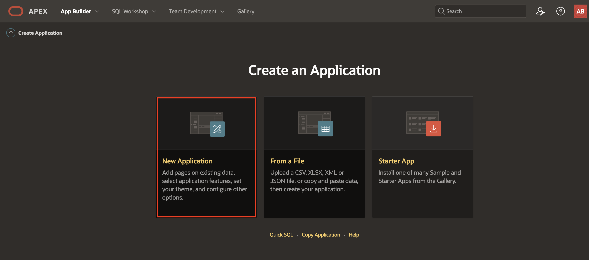
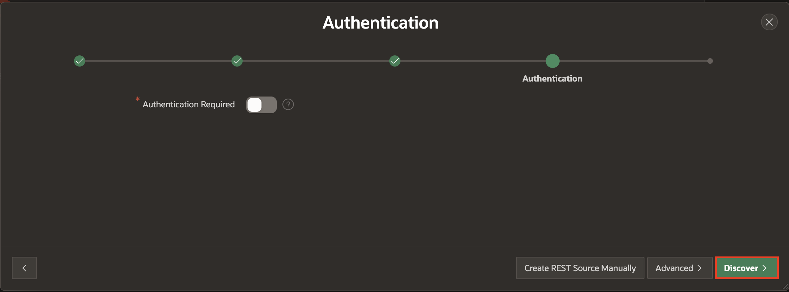
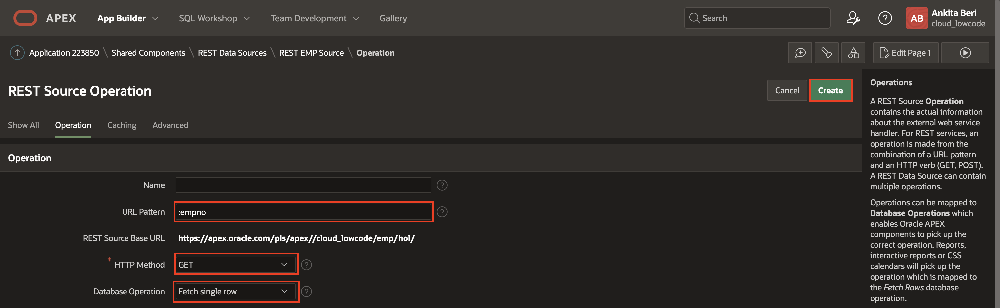

# Defining REST Data Sources

## Introduction
In this lab, you will learn how to utilize the REST APIs you created in the previous lab as the basis for REST Data Sources.

Estimated Time: 10 minutes

## Task 1: Create an App  
In a normal development environment, rather than in a lab, at this point you would log out of the remote database, where you defined the REST APIs, and log into your local database where you want to build the application. However, given for this lab you are using the same workspace for both, there is no need to log out and log back in.

1. Return to the APEX Builder tab or window.
2. In the App Builder toolbar, click **App Builder**, and click **Create**.

    

3. On the Create Application page, click **New Application**.

    

4. On the Create an Application page, for Name, enter **REST Employees**.

    Click **Create Application**.

    

    *Note: At this stage you do not want to add any pages as you have not yet defined the REST Data Source.*

## Task 2: Add REST Data Source for EMP

1. In the Application home page, click **Shared Components**.

    

2. Under **Data Sources**, click **REST Data Sources**.

    

3. On the REST Data Sources page, click **Create**.

    

4. For Method, click **Next**. *Default: From Scratch*

    

5. In the Create REST Data Source wizard, on the General dialog, enter the following:
    - **REST Data Source Type:** select **ORACLE REST Data Services**
    - **Name:** enter **REST EMP Source**
    - **URL Endpoint:** enter the REST URI you tested previously

    *Note: Your URL endpoint will be similar to https://{cloud\_url}/ords/{{your_schema}}/emp/hol/*

    Click **Next**.

    

6. On the Remote Server dialog, review the Base URL and Service URL Path.   
    Click **Next**.

    

7. On the Authentication dialog, click **Discover**.

    - **Authentication Required:** Disabled/Grayed out

    

8. On the Preview dialog, click **Create REST Data Source**.

    

## Task 3: Adding Operations
Given the URL Endpoint used above, the **Create REST Data Source** operation determined that the **GET** and **POST** operations have been defined. You also defined handlers for **GET**, **PUT**, and **DELETE** for a specific employee record. Therefore, it is important to add additional operations for these handlers. If you do not add the operations then the relevant functionality will not be included, such as selecting a single record, updating a record, or deleting a record.

1. On the REST Data Sources page, click **REST EMP Source**.

    

2. On REST EMP Source page, click **Add Operation**. You may need to scroll down to see operations.

    

3. In the REST Source Operation page, enter the following.
    - **URL Pattern:** enter **:empno** (including the leading colon!)
    - **HTTP Method:** select **GET**
    - **Database Operation:** select **Fetch single row**

    Click **Create**.

    

4. On REST EMP Source page, click **Add Operation**.

    In the REST Source Operation page, enter the following.
    - **URL Pattern:** enter **:empno** (including the leading colon!)
    - **HTTP Method:** select **PUT**
    - **Database Operation:** select **Update row**

  Click **Create**.

5. On REST EMP Source page, click **Add Operation**.

    In the REST Source Operation page, enter the following.
     - **URL Pattern:** enter **:empno** (including the leading colon!)
     - **HTTP Method:** select **DELETE**
     - **Database Operation:** select **Delete row**

   Click **Create**.

## **Summary**
This completes Lab 3. You now know how to define a REST Data Source within an application and add the required operations for full CRUD operations. [Click here to navigate to Lab 4](?lab=lab-4-creating-pages).

## **Acknowledgements**

 - **Author/Contributors** -  Salim Hlayel, Principle Product Manager
 - **Contributors** - Oracle LiveLabs Team (Arabella Yao, Product Manager Intern | Jaden McElvey, Technical Lead | Jeffrey Malcolm Jr, Intern)
 - **Last Updated By/Date** - Madhusudhan Rao, Apr 2022

