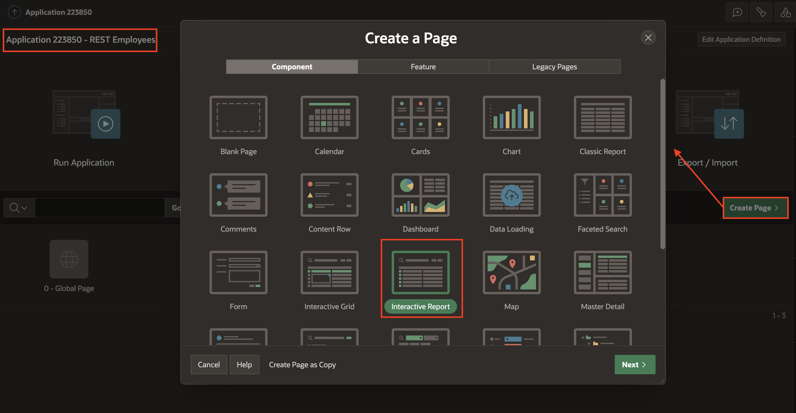
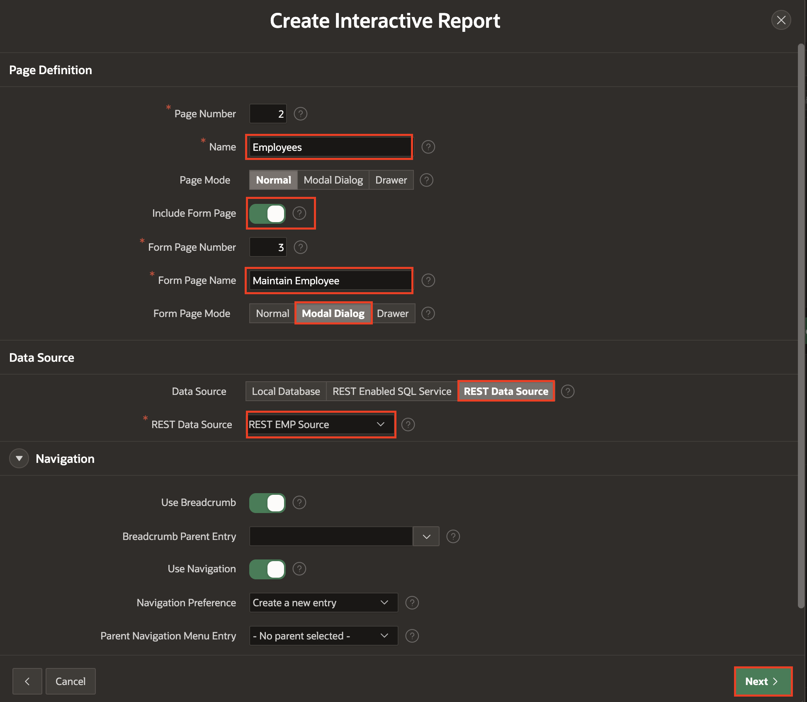
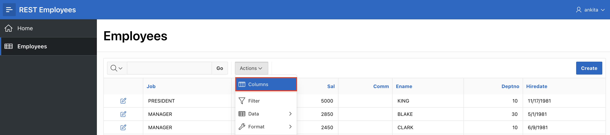
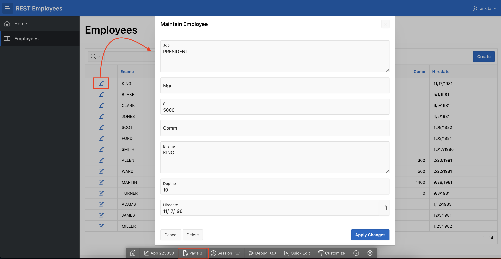
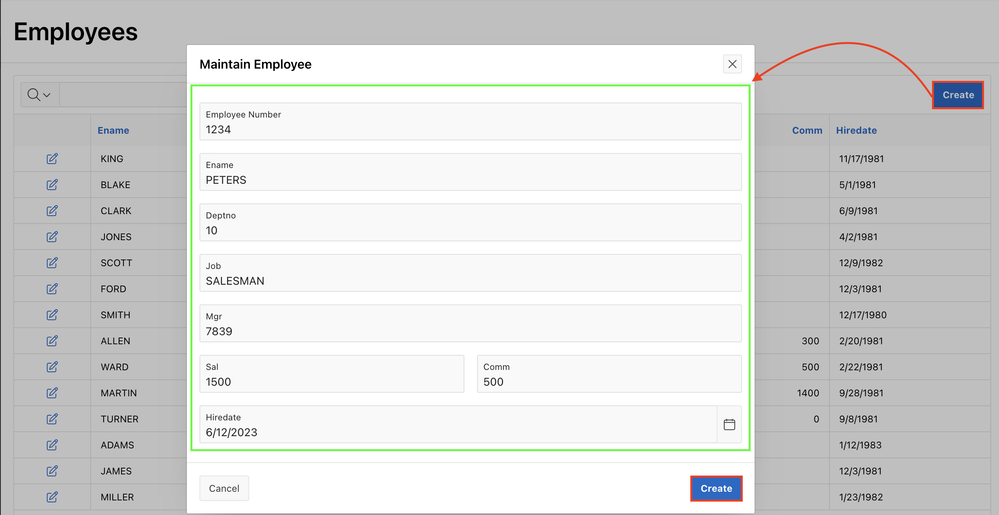
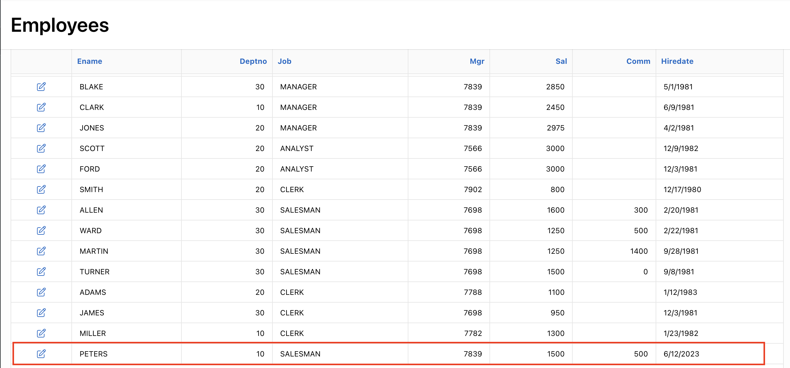
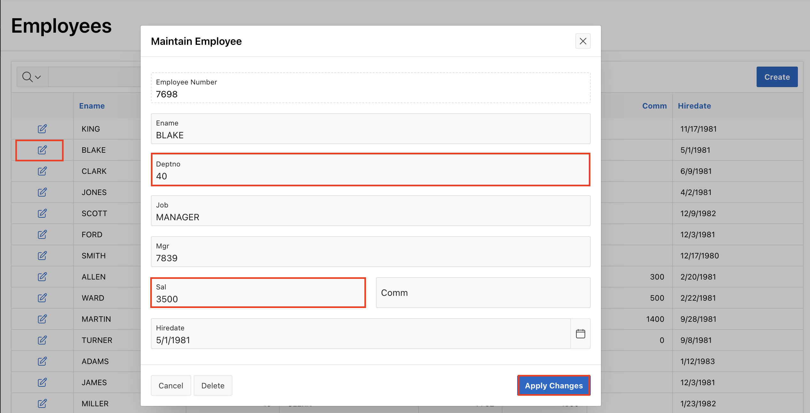

# Creating Pages

## Introduction
In this lab, you will learn how to utilize REST Data Sources as the basis for creating reports and forms within the application.

Estimated Time: 15 minutes

## Task 1: Use the Create Page Wizard

1. Return to the Application Home Page.     
    Click **Create Page**.

    On the Create a Page dialog, click **Report**.

    

2. On the Create Page dialog, click **Report and Form**.

    

3. In the Create Report with Form dialog, for Page Attributes, enter the following.
    - **Report Page Name:** enter **Employees**
    - **Form Page Name:** enter **Maintain Employee**
    - **Form Page Mode:** click **Modal Dialog**
    - **Breadcrumb:** select **Breadcrumb**

    Click **Next**.

    

4. On the Navigation Menu dialog, click **Create a new navigation menu entry**.     
    Click **Next**.

    

5. On the Data Source dialog, enter the following.
    - **Data Source:** click **REST Data Source**
    - **REST Data Source:** select **REST EMP Source**

    Click **Next**.

    

6. On the Form Page dialog, for Primary Key Column, select **EMPNO (Number)**.      
    Click **Create**.

    

## Task 2: Improve the Report
The default column order will not be optimal when the page is generated. You can readily reorder the columns and save the report layout.

1. From Page Designer, click the **Save and Run** button in the top right.

    

2. On the Login Page, enter your user credentials.
    * **Username:** `DEMO`
    * **Password:** `SecretPassw0rd `

3. Review the Employees.

    

4. On the Employees report page, click **Actions**, click **Columns**.

    

5. On the Select Columns dialog, shuffle the columns such that EMPNO, ENAME, and DEPTNO are the first three columns, by selecting the columns and using the **Top** arrow.
    Click **Apply**.

    

6. You need to save the report layout so that it displays this way for all users.

    Click **Actions**, select **Report**, click **Save Report**.

    

7. On the Save Report dialog, for Save (Only displayed for developers), select **As Default Report Settings**.

    

8. On the Save Default Report dialog, select **Primary** and click **Apply**.

    

## Task 3: Update the Form Page
The form page for editing records also needs some improvement.

1. Click the edit icon on a row.
    The Form Page is displayed.

    In the Developer Toolbar, click **Edit Page 3**.     
    Page Designer will be displayed for the current page.

    

    *Note: The Developer Toolbar is only displayed when you run apps from App Builder, so is never visible to end users.*

2. The Employee Number (EMPNO) item is currently hidden, as it is defined as the primary key for the table. However, users should be able to enter a value when inserting a record.

    Within Page Designer, in the Rendering tab (left pane), click item **P3\_EMPNO**.

    In the Property Editor (right pane), enter the following.

    - **Identification > Type:** select **Number Field**
    - **Label > Label:** enter **Employee Number**

    

3. Employee Number should only be entered and should not be updated, as it is the primary key for the table. Therefore, you should make the item read only if displaying an existing record.

    In the Property Editor (right pane), with **P3\_EMPNO** selected, enter the following.
    - **Read Only > Type:** select **Item is NOT NULL**
    - **Read Only > Item:** select **P3\_EMPNO**

    

4. The Job and Name items are currently defined as a Textarea, yet neither will be that large a value. Therefore, they should be changed to be a Text Field.

    In the Rendering tab (left pane), click item **P3\_JOB**.        
    Hold the {Control} Key and click **P3\_NAME**.

    In the Property Editor (right pane), for Identification > Type, select **Text Field**.

    

5. The order of the items should be improved. This can easily be achieved by dragging and dropping items in either the Rendering tree or the Layout.

    In the Rendering tree, click item **P3\_ENAME**.      
    Drag **P3\_ENAME** up to be under **P3\_EMPNO**.  

    

6. In the Rendering tab (left pane), click item **P3\_DEPTNO**.      
    Drag **P3\_DEPTNO** up to be under **P3\_ENAME**.

7. The Commission (COMM) item should be placed on the same line as Salary (SAL).

    In Layout (middle pane), select **P3\_COMM**.        
    Drag it up next to **P3\_SAL**.

    *Note: Do not drop the item until a large dark yellow box appears to the right of the existing items.*    

    

8. In the Toolbar, click **Save**.

    

## Task 4: Insert a Record

1. Navigate back to the Runtime environment.

    

2. Refresh the browser.

3. On the Employees report page, click **Create**.

    On the Maintain Employee page, enter the following.

    - **Employee Number:** enter **1234**
    - **Ename:** enter **PETERS**
    - **Deptno:** enter **10**
    - **Job:** enter **SALESMAN**
    - **Mgr:** enter **7839**
    - **Sal:** enter **1500**
    - **Comm:** enter **500**
    - **Hiredate:** select any date

    Click **Create**.

    

4. On the Employees report page, find the new record.

    

## Task 5: Update a Record

1. On the Employees report page, find **BLAKE**, and click the edit icon.

    On the Maintain Employee dialog, update the following.

    - **Deptno:** enter **40**
    - **Sal:** enter **3500**

    Click **Apply Changes**.

    

2. On the Employees report page, review BLAKE's **Deptno** and **Sal**.

    

## Task 6: Delete a Record

1. On the Employees report page, find **TURNER**, and click the edit icon.

    On the Maintain Employee dialog, click **Delete**.
    On the delete confirmation dialog, click **Ok**.

    

2. On the Employees report page, review the records to ensure TURNER is no longer visible.

    

## **Summary**
This completes Lab 4. You now know how to utilize a REST endpoint to develop a report and form to allow full CRUD operations. [Click here to navigate to Lab 5](?lab=lab-5-defining-list-values).

## **Acknowledgements**

 - **Author/Contributors** -  Salim Hlayel, Principle Product Manager
 - **Contributors** - Oracle LiveLabs Team (Arabella Yao, Product Manager Intern | Jaden McElvey, Technical Lead | Jeffrey Malcolm Jr, Intern)
 - **Last Updated By/Date** - Salim Hlayel, Principle Product Manager, November 2020

