# Defining a List of Values

## Introduction
In this lab, you will learn how to utilize REST Data Sources as the basis for list of values for use within an application.

Estimated Time: 10 minutes

### Information

When you ran the script in your first workspace you created a REST
handler for both the EMP and DEPT tables. You have already created a REST Data Source for the EMP table. If you also create a REST Data Source for the DEPT table, you can readily define List of Values for each in Shared Components. These can then be utilized within your pages to improve the data displayed and significantly improve data entry and quality.

## Task 1: Add REST Data Source for DEPT

1. Return to the Application Builder.
2. Go to the App Builder Home Page.
3. Select your application.
4. On the application home page, click **Shared Components**.

    

5. On the Shared Components page, under Data Sources, click **REST Data Sources**.

    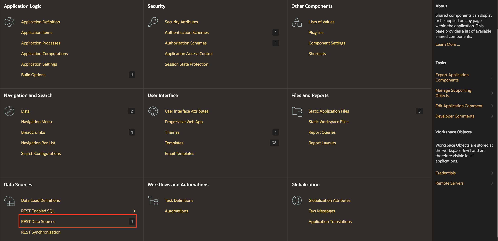

6. On the REST Data Sources page, click **Create**.

    On the Create REST Data Source - Method dialog, click **Next**. *Default: From Scratch*

    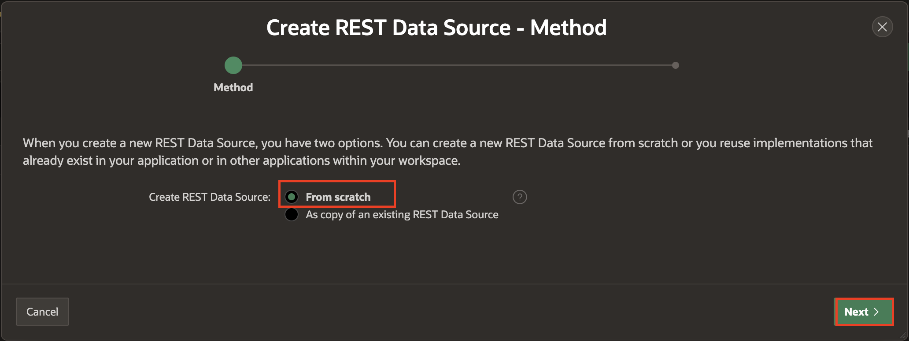

7. On the Create REST Data Source - General dialog, enter the following.

    - **REST Data Source Type:** select **ORACLE REST Data Services**
    - **Name:** enter **REST DEPT Source**
    - **URL Endpoint:** enter the REST URI for the dept.rest handler Similar to https://{cloud\_url}/ords/{your_workspace}/**dept**/hol/

    The URL Endpoint is the same URL you entered in Lab 2 Step 3 exept `emp` is replaced with `dept`.

    Click **Next**.

    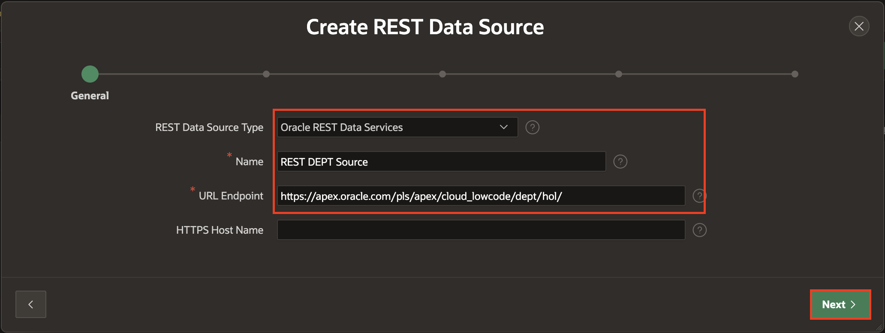

8. On the Remote Server dialog, review the Base URL and Service URL Path.
    Click **Next**.

    

    *Note: As you have already defined a REST Data Source with the same base path, for the REST EMP Source, then the Base URL is not updateable.*

9. On the Authentication dialog, click **Discover**.
    Authentication Required = No
10. On the Preview dialog, click **Create REST Data Source**

    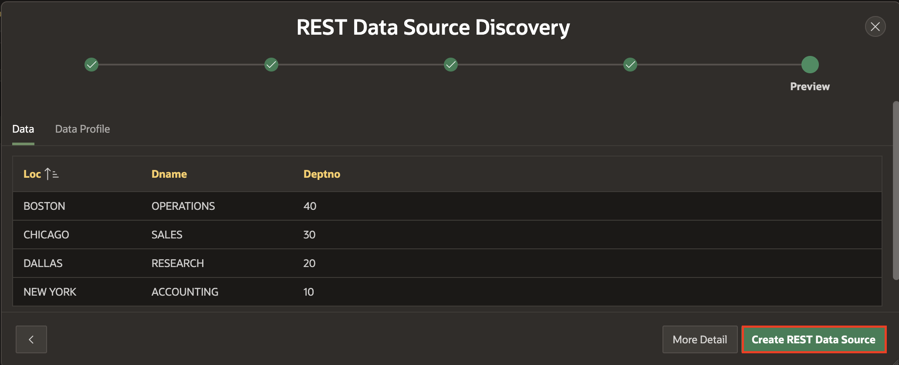

## Task 2: Creating List of Values
You now have the REST Data Sources which can be used as the basis for List of Values.

1. From the REST Data Sources page, in the breadcrumbs, click **Shared Components**.

    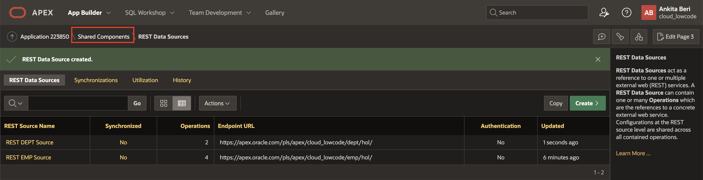

2. On the Shared Components page, under Other Components, click **List of Values**.

    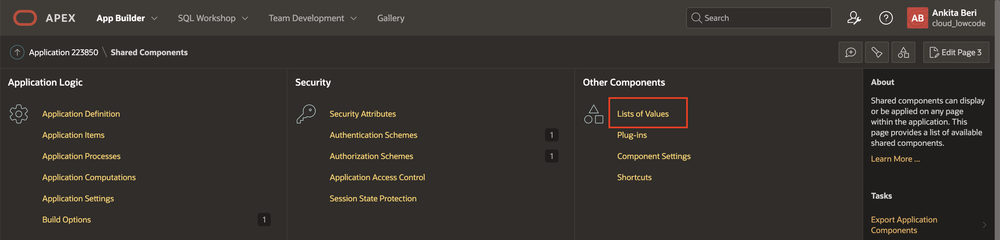

3. On the List of Values page, click **Create**.

    On the Create List of Values - Source dialog, click **Next**.       
    *Default: From Scratch*

    

4. On the Name and Type dialog, for Name, enter **REST EMP LOV**.       
    Click **Next**.

    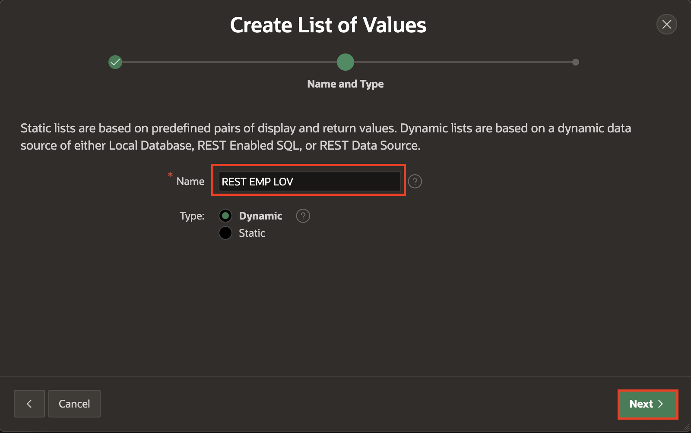

5. On the List of Values Source dialog, enter the following.

    - **Data Source:** click **REST Data Source**
    - **REST Data Source:**  select **REST EMP Source**

    Click **Next**.

    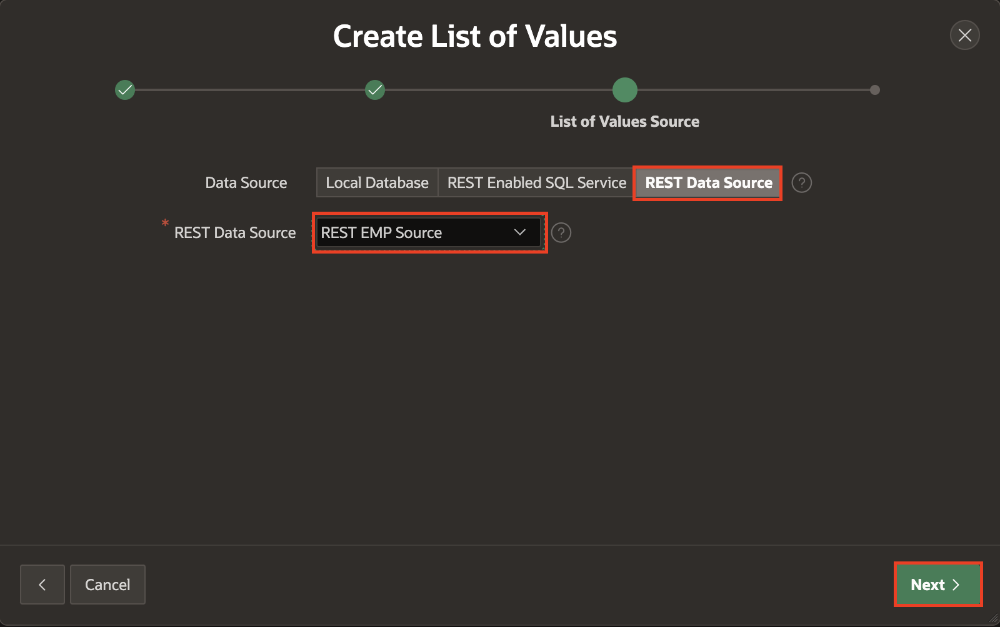

6. On the Column Mappings dialog, enter the following.

    - **Return Column:** select **EMPNO**
    - **Display Column:** select **ENAME**

    Click **Create**.

    

7. To create the List of Values for Departments is the same as above.

    On the List of Values page, click **Create**.   
    On the Create List of Values - Source dialog, click **Next**.     
    *Default: From Scratch*

8. On the Name and Type dialog, for Name, enter **REST DEPT LOV**.       
    Click **Next**.

9. On the List of Values Source dialog, enter the following.

    - **Data Source:** click **REST Data Source**
    - **REST Data Source**:  select **REST DEPT Source**

    Click **Next**.

10. On the Column Mappings dialog, enter the following.

    - **Return Column:** select **DEPTNO**
    - **Display Column:** select **DNAME**

    Click **Create**.

## Task 3: Update the Form
If you review the Maintain Employee form page more closely you will see that the Department Number (DEPTNO) and the Manager (MGR) item are both numeric items and expect the end user to know the relevant numbers, rather than select from a list of names.

1. From the Lists of Values page, in the Application Builder toolbar, click **Edit Page 3**.

    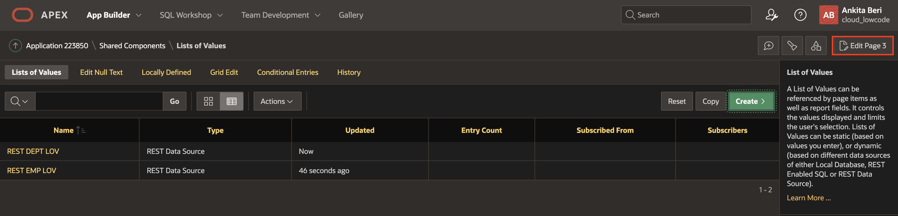

2. From Page Designer, in the Rendering tree (left pane), click **P3_DEPTNO**.

    In the Property Editor (right pane), enter the following.

    - **Identification > Type:** select **Select List**
    - **List of Values > Type:** select **Shared Component**
    - **List of Values > List of Values:** select **REST DEPT LOV**
    - **List of Values > Display Extra Values:** Uncheck

    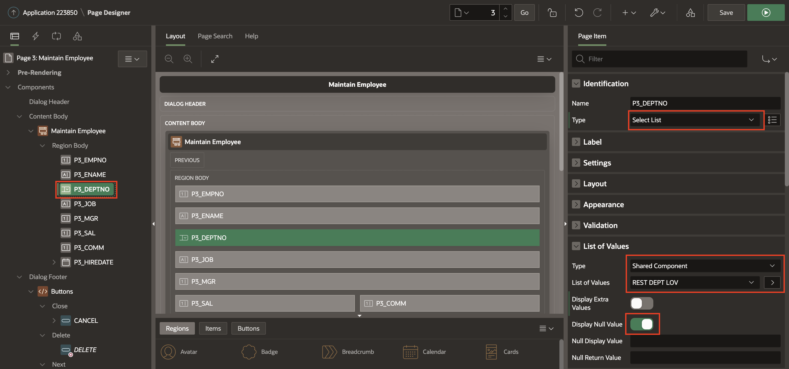
    

3. From Page Designer, in the Rendering tree (left pane), click **P3_MGR**.

    In the Property Editor (right pane), enter the following.

    - **Identification > Type:** select **Select List**
    - **List of Values > Type:** select **Shared Component**
    - **List of Values > List of Values:** select **REST EMP LOV**
    - **List of Values > Display Extra Values:** Uncheck

4. In the Page Designer toolbar, click **Save**.

    

## Task 4: Update the Report
Similarly, the Employees report shows numerical values rather than names.

1. Navigate to Page 2 in Page Designer.     
    In the Page Designer toolbar, use the Page Selector or the down arrow next to the page number.

    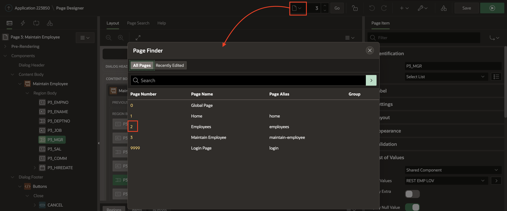

2. Given this is a report you will need to modify columns instead of items.

    In the Rendering tree (left pane), click Columns, click **MGR**.

    In the Property Editor (right pane), enter the following.

    - **Type:** select **Plain Text (based on List of Values)**
    - **List of Values:** select **REST EMP LOV**
    - **Heading > Alignment:** click **Align Left**
    - **Layout > Column Alignment:** click **Align Left**

    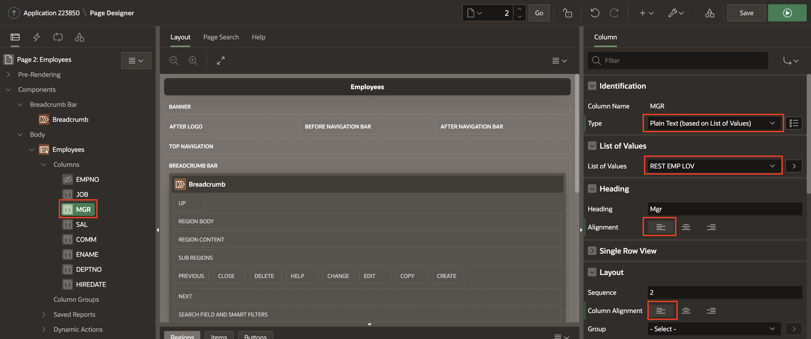

3. In the Rendering tree (left pane), under Columns, click **DEPTNO**.

    In the Property Editor (right pane), enter the following.

    - **Type:** select **Plain Text (based on List of Values)**
    - **List of Values:** select **REST DEPT LOV**
    - **Heading > Alignment:** click **Align Left**
    - **Layout > Column Alignment:** click **Align Left**

    Click **Save**.

4. Navigate to the application Runtime Environment.
5. Refresh your browser.

    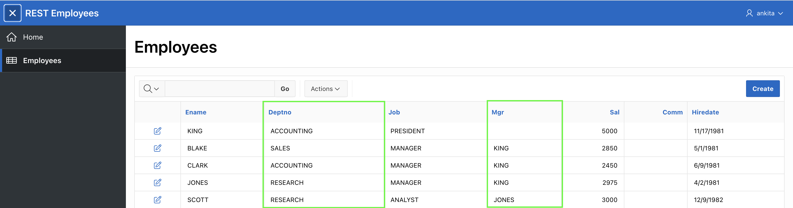

6. Click on the edit icon for any record.       
    Select a department.        
    Select a manager.

    

## **Summary**
This completes Lab 5 and the workshop. You now know how to define List of Values against REST endpoints and then utilize those within an application.

## Learn More - Useful Links

- [APEX on Autonomous](https://apex.oracle.com/autonomous)
- [APEX Collateral](https://apex.oracle.com)
- [Tutorials](https://apex.oracle.com/en/learn/tutorials)
- [Community](https://apex.oracle.com/community)
- [External Site + Slack](http://apex.world)

## **Acknowledgements**

 - **Author/Contributors** -  Salim Hlayel, Principle Product Manager
 - **Contributors** - Oracle LiveLabs Team (Arabella Yao, Product Manager Intern | Jaden McElvey, Technical Lead | Jeffrey Malcolm Jr, Intern)
 - **Last Updated By/Date** - Madhusudhan Rao, Apr 2022

