# Import the Data Model, Sample Data, and Base Application

## Introduction

Before you can build the AI Agent, the workspace needs a schema, sample data, and a base application to work from.

In this lab, you will load the data model script that creates the warehouse tables, run two sample data scripts that populate the schema with warehouses, users, items, suppliers, inventory balances, inbound receipts, and the supplier delivery history the agent uses, and then import the base application. Once this lab is complete, the workspace is ready for you to configure the Generative AI Service in the next lab.

Estimated Lab Time: 10 minutes

### Objectives

In this lab, you will:

- Set up the SCM data model

- Load the sample data

- Import the application for the workshop

## Task 1: Set Up the Data Model

> **Note:** If you completed **Lab 1: Create a Supply Chain Management Application** in the [Build an AI Interactive Report in Oracle APEX](https://livelabs.oracle.com/ords/r/dbpm/livelabs/view-workshop?clear=RR,180&wid=4406) workshop on the same workspace, the data model and sample data are already loaded. Skip **Task 1** and **Task 2** and proceed to **Task 3: Import the SCM Application**.

In this task, you will upload and run the data model script. This creates the warehouse tables that the AI Agent tools will query in the later labs. The data model is compatible with Oracle Database 19c and later.

1. Download the [01\_SCM\_INV\_WMS\_DATAMODEL.sql](./files/01_SCM_INV_WMS_DATAMODEL.sql) file to your local machine.

2. Sign in to your Oracle APEX workspace using the credentials provided for this workshop.

    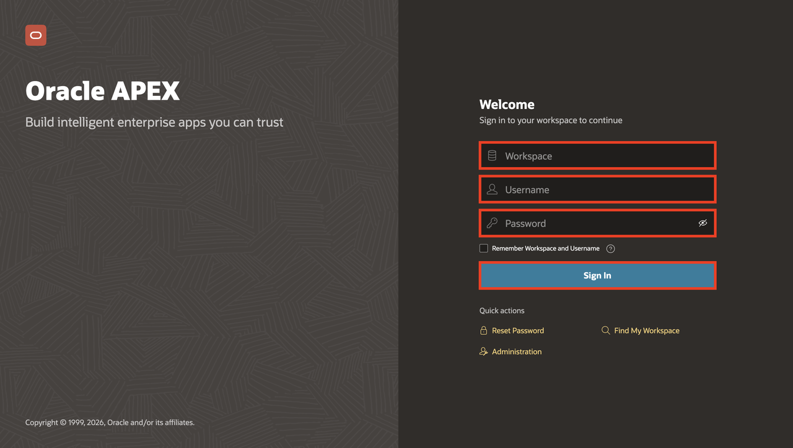

3. From the Oracle APEX Home page, select **SQL Workshop**.

    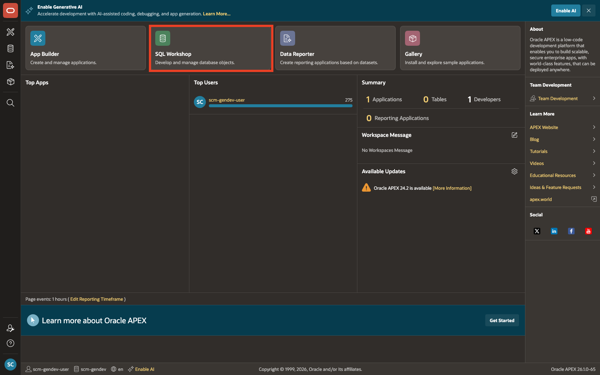

4. From the **SQL Workshop** page, select **SQL Scripts**.

    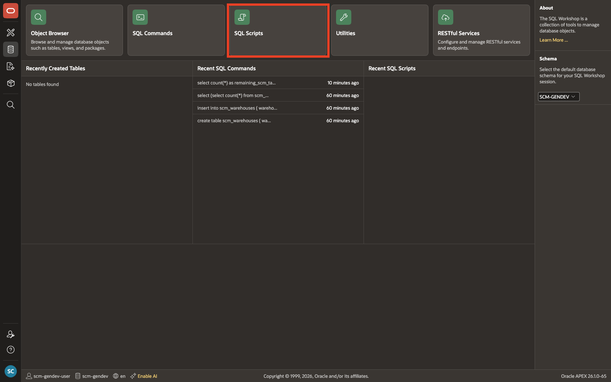

5. Select **Upload**.

    

6. In the **Upload Script** dialog, select the downloaded file, enter **`scm_data_model`** for **Script Name**, and select **Upload**.

    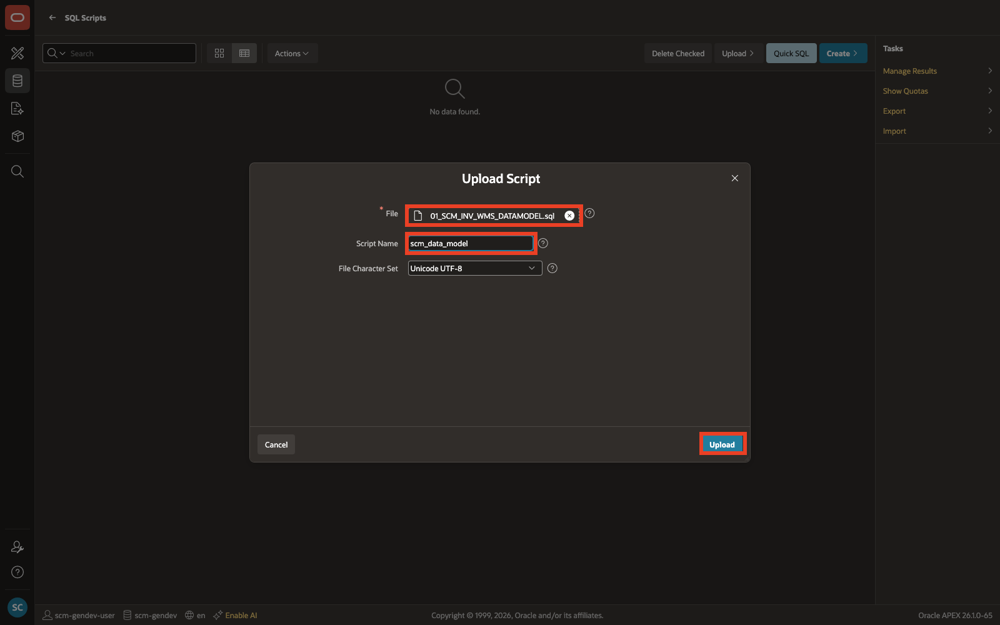

7. In the row for **`scm_data_model`**, select **Run**.

    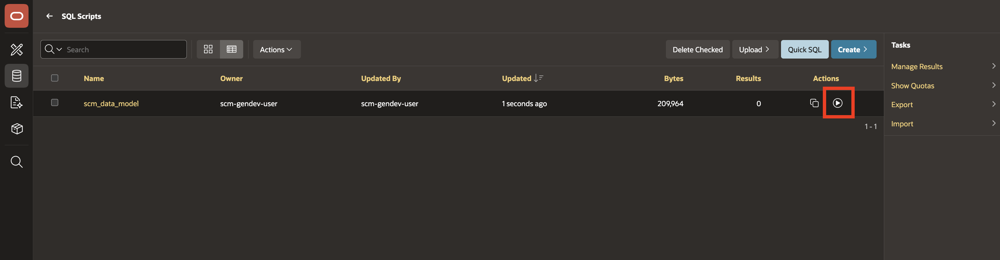

8. On the confirmation page, select **Run**.

    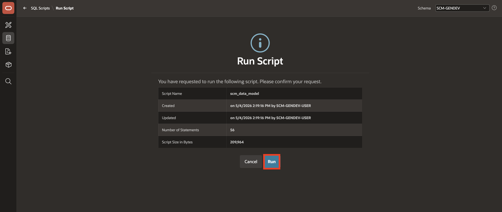

9. Verify that the script completes successfully and that the following objects are created:

    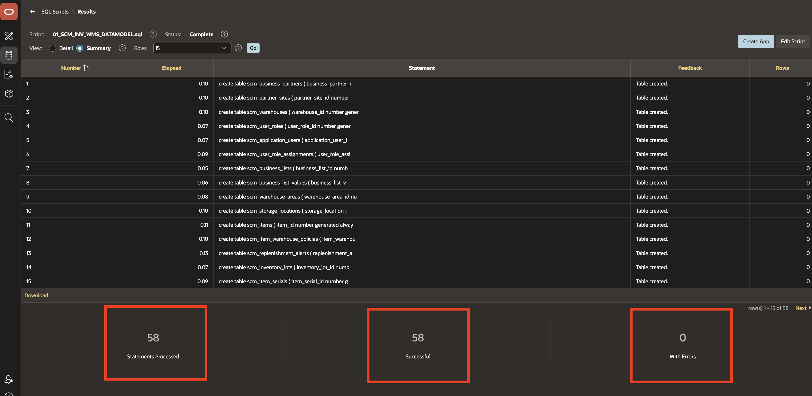

    **Tables**

    | Table | Purpose |
    | --- | --- |
    | `scm_warehouses` | Warehouse master data |
    | `scm_user_roles` | Role definitions and authority levels |
    | `scm_application_users` | Application users and manager relationships |
    | `scm_user_role_assignments` | Primary and secondary role assignments |
    | `scm_warehouse_areas` | Warehouse zones such as storage and picking |
    | `scm_storage_locations` | Physical storage and pick locations |
    | `scm_items` | Inventory items |
    | `scm_item_warehouse_policies` | Reorder points, safety stock, and lead times per item per warehouse |
    | `scm_inventory_balances` | Available stock quantities per location |
    | `scm_replenishment_alerts` | Low-stock and out-of-stock alerts |
    | `scm_business_partners` | Supplier master data |
    | `scm_partner_sites` | Supplier site details |
    | `scm_inbound_receipts` | Supplier delivery headers |
    | `scm_inbound_receipt_lines` | Delivery line items and quality data |
    | `scm_operational_tasks` | Replenishment orders raised by the agent |
    {: title="Database Tables"}

    **Views and Procedures**

    The script also creates the views and stored procedure used by the AI Agent tools. These keep the tool configurations in APEX simple. The business logic resides in the database, not inline in the tool definition.

    | Object | Used by |
    | --- | --- |
    | `scm_v_user_context` | `get_user_context` tool |
    | `scm_v_stocks_at_risk` | `get_stocks_at_risk` tool |
    | `scm_v_suppliers_for_item` | `get_suppliers_for_item` tool |
    | `scm_v_supplier_delivery_performance` | `get_supplier_delivery_performance` tool |
    | `scm_v_warehouses_by_supplier` | `show_warehouses_by_supplier` tool |
    | `scm_replenishment_v` | Annotated replenishment alerts view for reporting |
    | `scm_raise_purchase_order` | `raise_purchase_order` tool |
    {: title="Agent Views and Procedure"}

## Task 2: Load the Sample Data

In this task, you will load two sample data scripts. The first populates warehouses, users, roles, items, suppliers, and inventory balances across the network. The second loads inbound receipts, replenishment alerts, and the supplier delivery history that the agent uses for performance comparisons. Both scripts must be run for the workshop to work correctly.

1. Download both sample data files to your local machine:

    - [02\_SCM\_INV\_WMS\_SAMPLE\_DATALOAD.sql](./files/02_SCM_INV_WMS_SAMPLE_DATALOAD.sql)
    - [03\_SCM\_INV\_WMS\_OPERATIONAL\_DATALOAD.sql](./files/03_SCM_INV_WMS_OPERATIONAL_DATALOAD.sql)

2. In the top breadcrumb, select **SQL Scripts**.

    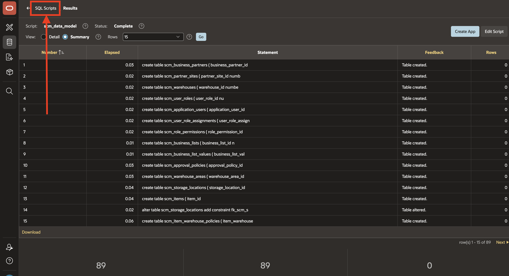

3. Select **Upload**.

    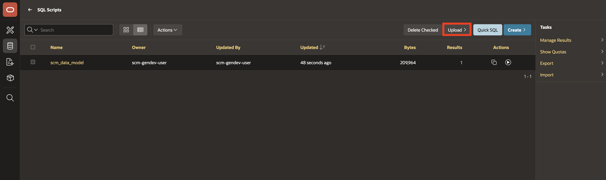

4. In the **Upload Script** dialog, select or drag and drop the downloaded **`02_SCM_INV_WMS_SAMPLE_DATALOAD.sql`** file, enter **`scm_sample_data1`** for **Script Name**, and select **Upload**.

    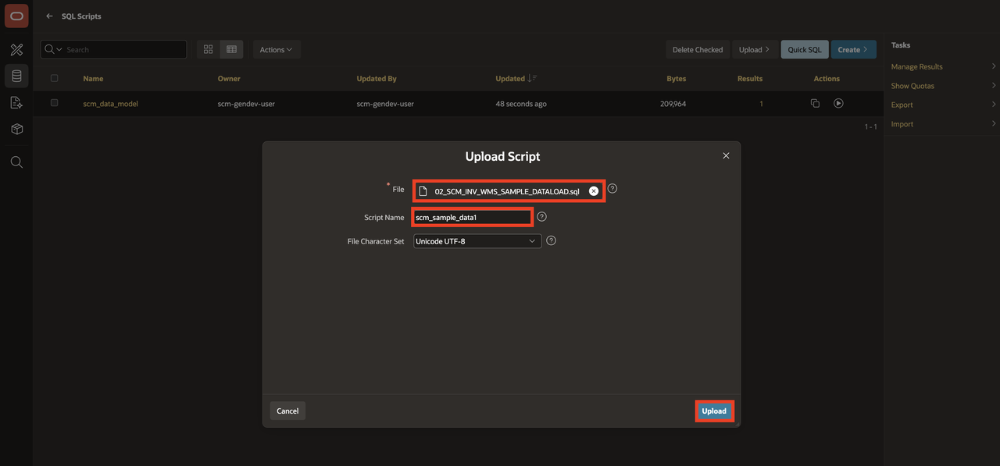

5. In the row for **`scm_sample_data1`**, select **Run**.

    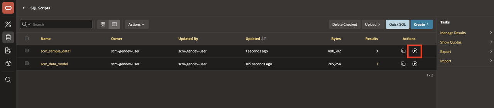

6. On the confirmation page, select **Run**.

    

7. Verify that the script completes successfully with 0 errors.

    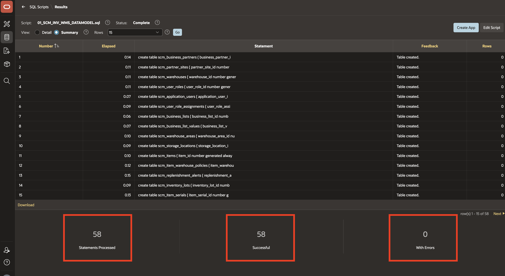

8. In the top breadcrumb, select **SQL Scripts**.

    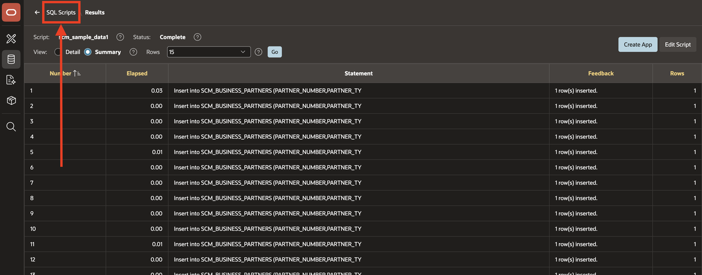

9. Select **Upload** again.

    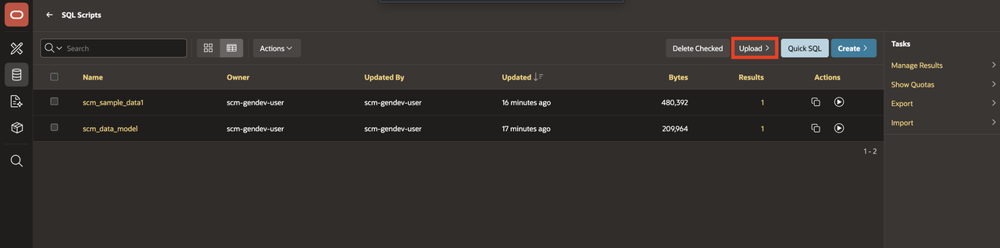

10. In the **Upload Script** dialog, select or drag and drop the downloaded **`03_SCM_INV_WMS_OPERATIONAL_DATALOAD.sql`** file, enter **`scm_sample_data2`** for **Script Name**, and select **Upload**.

    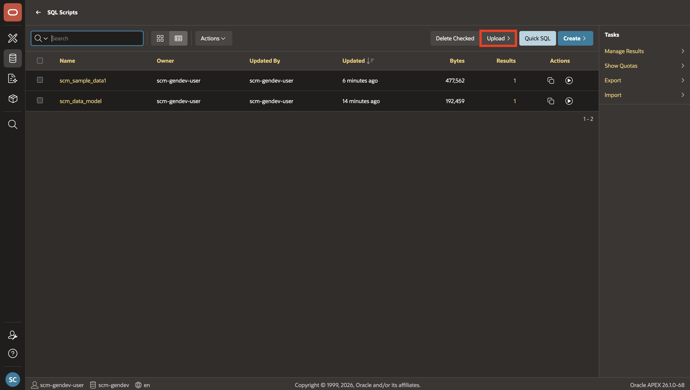

11. In the row for **`scm_sample_data2`**, select **Run**.

    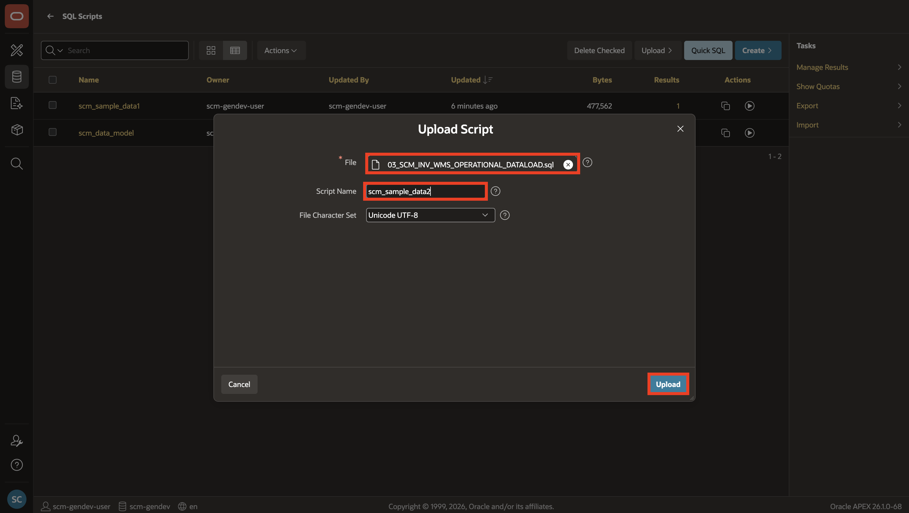

12. On the confirmation page, select **Run**.

    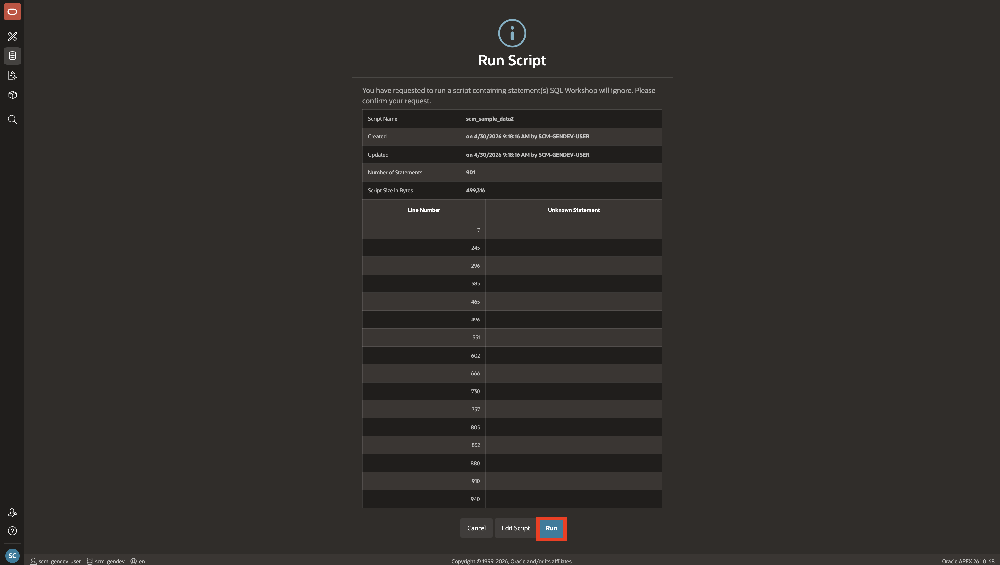

13. Verify that the script completes successfully. This script loads the inbound receipts and supplier delivery history that the agent uses for performance comparisons in Lab 4.

    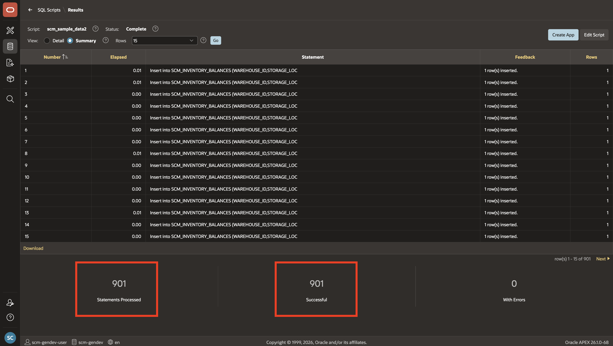

    The combined sample data now includes the following:

    | Data | Details |
    | --- | --- |
    | Warehouses | 20 active warehouses across the US, including `PHX-WEST` (Cactus Ridge Retail Fulfillment Center) as the primary demo warehouse |
    | Roles | Administrator, Warehouse Manager, Inventory Controller, Operations User, Quality User, Business Viewer |
    | Users | `ops.director` (Maya Chen), `inventory.lead` (Daniel Brooks), `receiving.lead` (Sofia Martinez), `fulfillment.lead` (Ethan Walker) |
    | Suppliers | VoltNest Consumer Electronics, CedarLoft Home Furnishings, TrailPeak Outdoor Goods, PureLeaf Beauty Labs, SafeTrip Automotive Supply, PaperTrail Office Products |
    | Items | 200 inventory items across multiple product categories |
    | Inventory | Stock balances, reorder policies, and replenishment alerts for the `PHX-WEST` warehouse |
    {: title="Sample Data Summary"}

## Task 3: Import the SCM Application

In this task, you will import the base APEX application. It already contains the page layout and shared components, so you can focus entirely on building the AI Agent in the following labs rather than setting up pages from scratch.

1. Download the [SCM\_INV\_WMS\_APP.sql](./files/SCM_INV_WMS_APP.sql) file to your local machine.

2. From the left navigation, select the **App Builder** icon.

    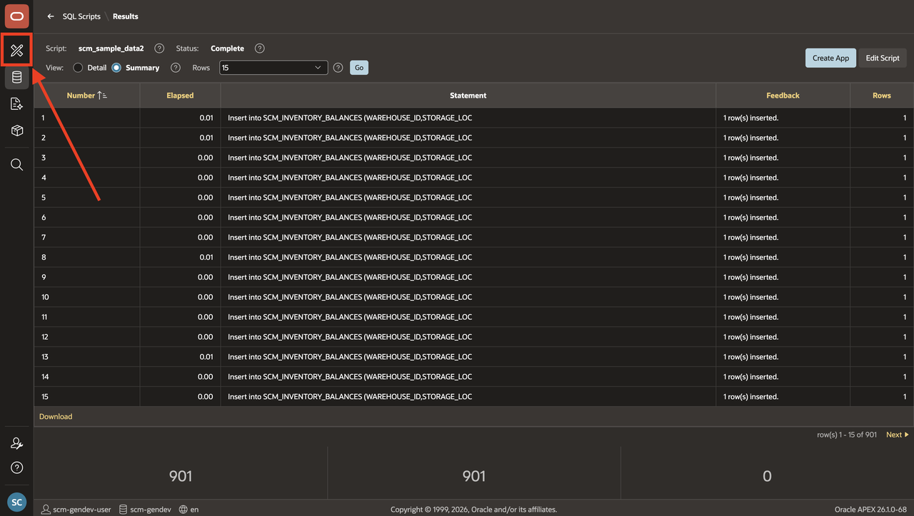

3. From the **App Builder** page, select **Import**.

    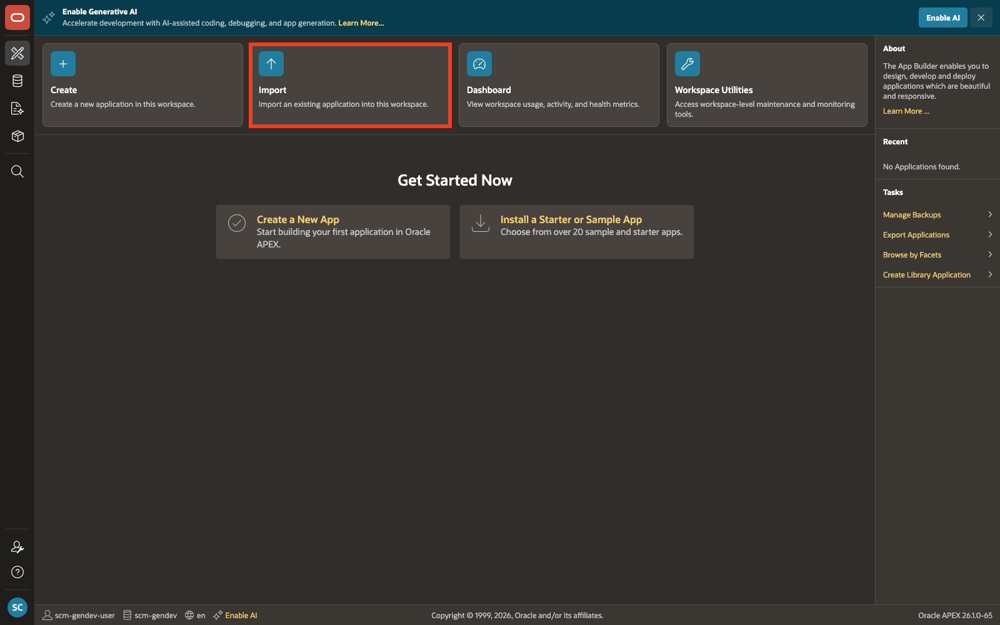

4. In the import wizard, select the downloaded file to upload, then click **Next**.

    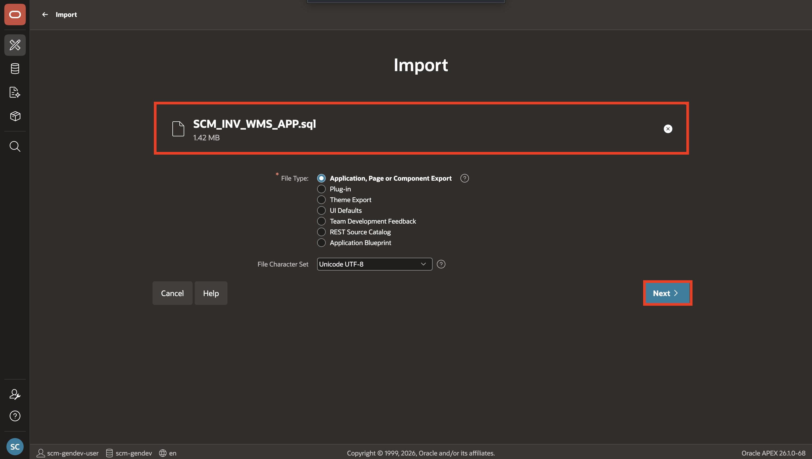

5. Review the import details and select **Import Application**.

    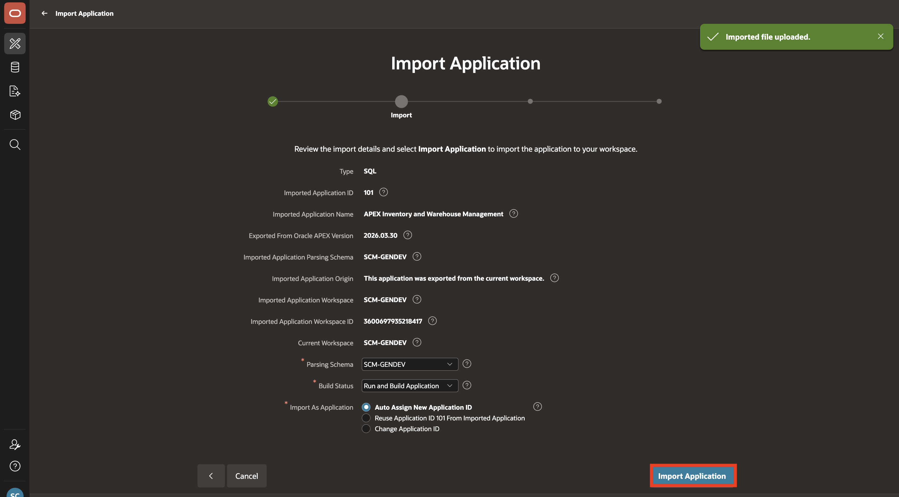

    > **Note:** APEX may assign a different application ID during import. Use the application ID shown after import for all subsequent steps in this workshop.

6. After the import completes, verify that the import finishes successfully.

    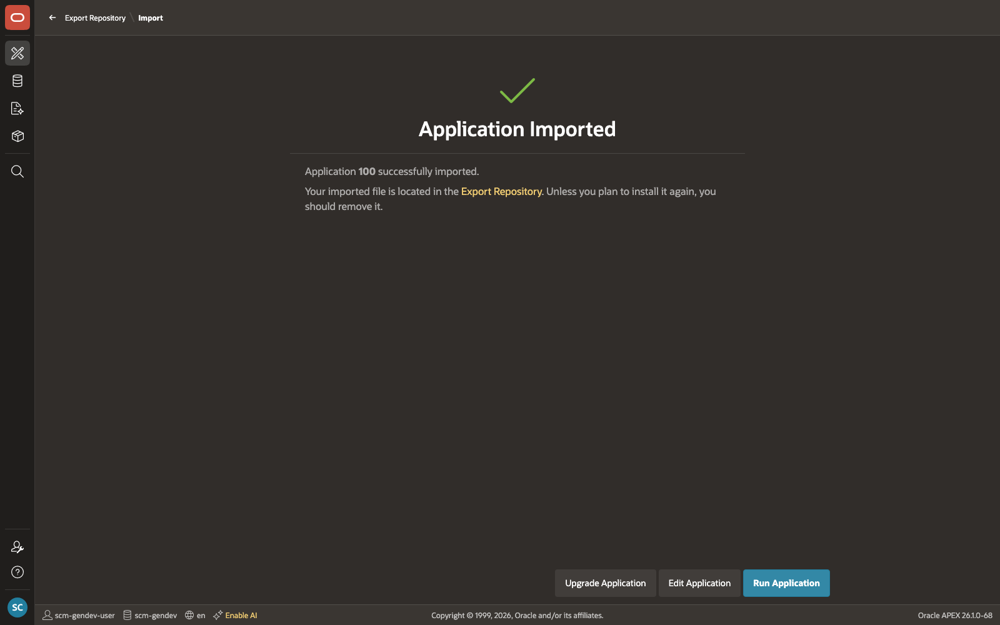

## Summary

You loaded the warehouse schema, sample data, and base application. You are ready to configure the Generative AI Service in the next lab.

You may now **proceed to the next lab**.

## Acknowledgements

- **Author** - Sahaana Manavalan, Senior Product Manager, April 2026
- **Last Updated By/Date** - Sahaana Manavalan, Senior Product Manager, May 2026
