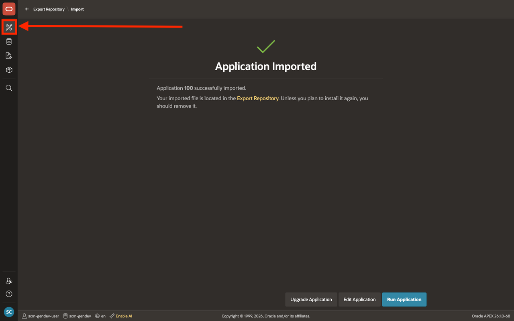
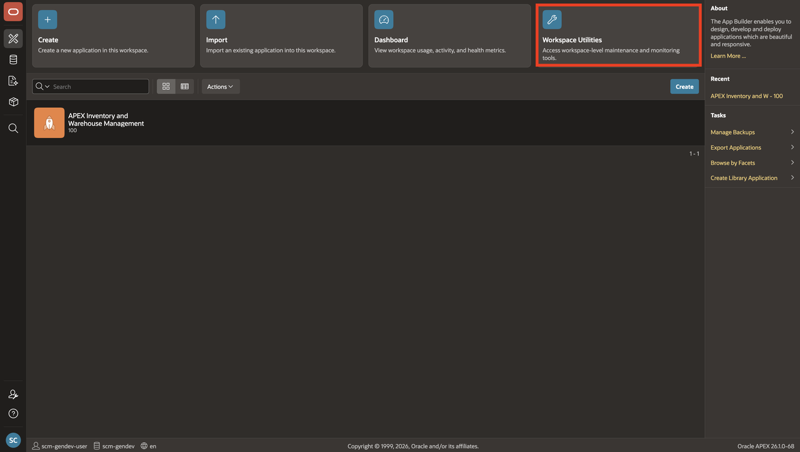
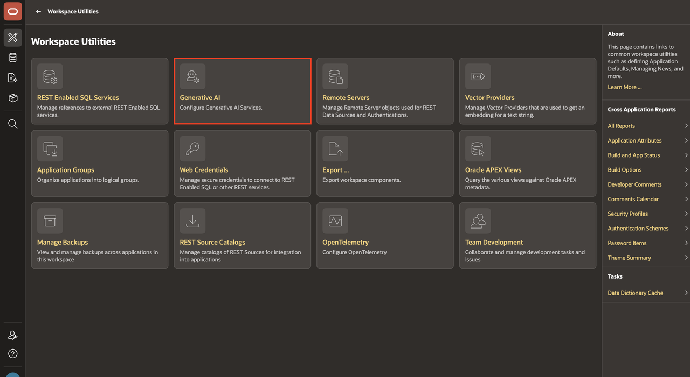
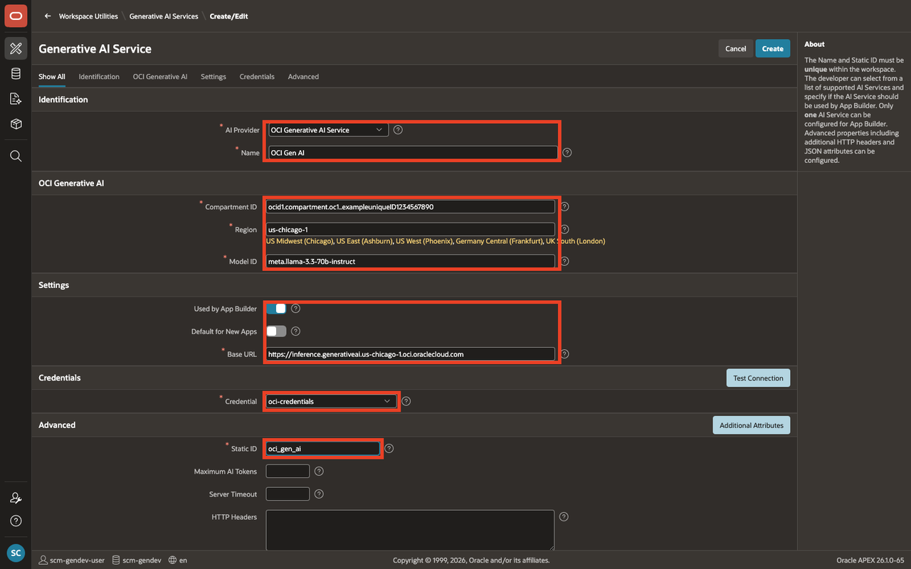
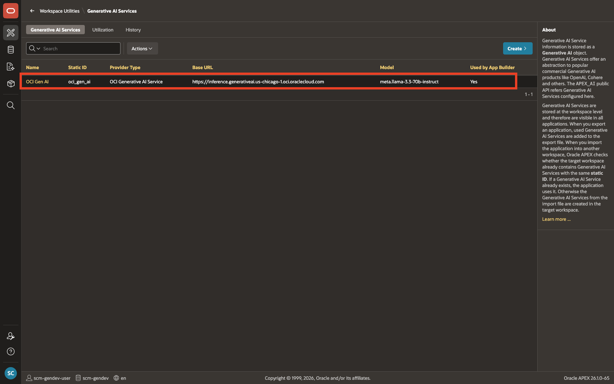
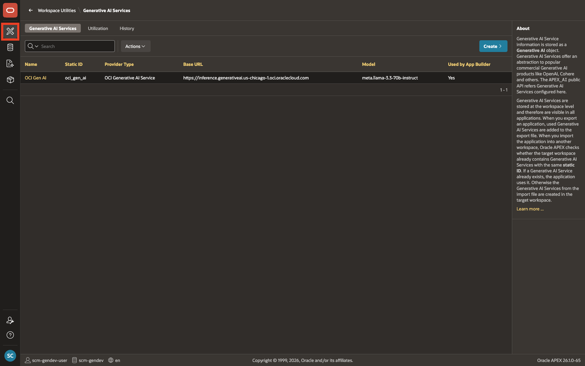
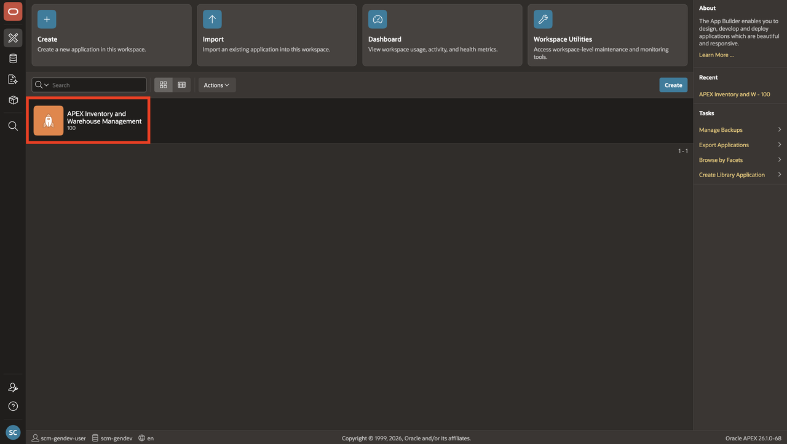
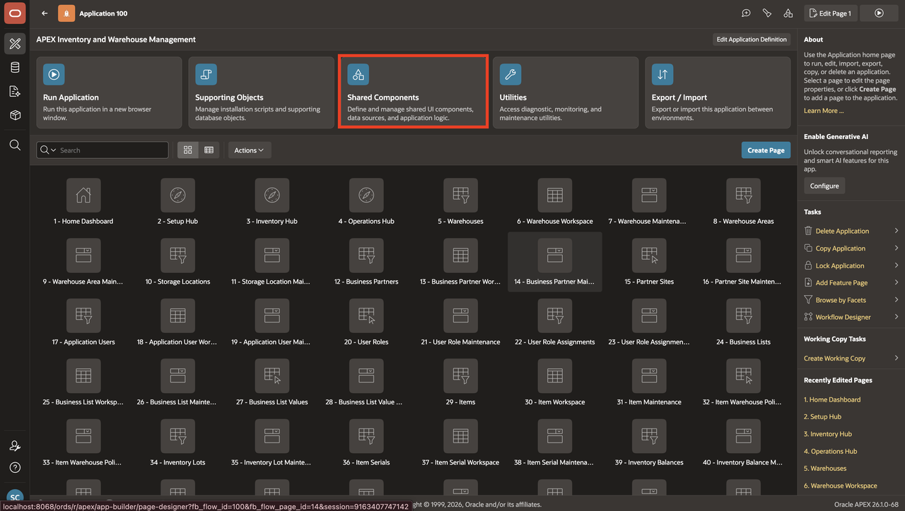
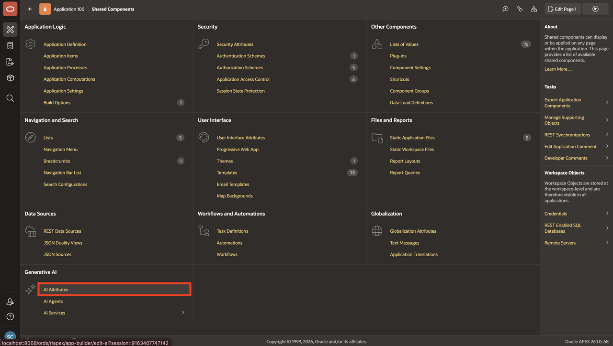
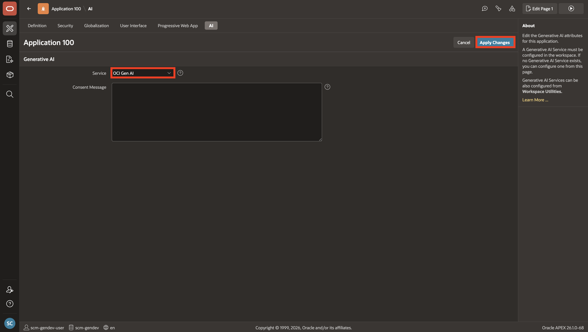

# Configure Generative AI Service

## Introduction

Before you can create the AI Agent, you need to connect Oracle APEX to a Generative AI provider. In this lab, you will configure OCI Generative AI as a workspace-level service and assign it to the application. This provides the LLM backend that the Procurement Agent will use to process natural language and invoke tools in the following labs.

> **Important:** Oracle APEX acts as the application layer and connects to the Generative AI provider of your choice using your own credentials. You will need an active account with a supported provider to complete this lab. Any charges for API usage are billed directly by your AI provider. Please review your provider's pricing before proceeding.

Estimated Time: 5 minutes

### Objectives

In this lab, you will:

- Configure a Generative AI Service in your APEX workspace

- Assign the Generative AI Service to the application

## Task 1: Configure Generative AI Service

In this task, you will configure OCI Generative AI as a service in your APEX workspace and assign it to the application.

1. From the left navigation, click the **App Builder** icon.

    

2. From **App Builder**, select **Workspace Utilities**.

    

3. From **Workspace Utilities**, select **Generative AI**.

    

4. Select **Create**. On the **Create Generative AI Service** page, enter/select the following values for the Workspace level Generative AI configuration:

    > **Note:** This LiveLab uses OCI Generative AI Service as the AI provider. However, Oracle APEX supports multiple Generative AI providers, including OCI Generative AI, OpenAI, Cohere, Google Gemini, Anthropic Claude, Mistral AI, Ollama, and Generic OpenAI API Compatible. You are not required to use OCI Generative AI; you may configure any supported provider that is available in your environment.

    - AI Provider: **OCI Generative AI Service**
    - Name: **OCI Gen AI**
    - Static ID: **oci\_gen\_ai**
    - Compartment ID: Enter your OCI Compartment ID.
    - Region: **us-chicago-1**
    - Model ID: **meta.llama-3.3-70b-instruct**
    - Used by App Builder: **On**
    - Base URL: Leave the auto-generated value unchanged.
    - Credential: Select an existing OCI credential if one is already available in your workspace. Otherwise, create a new OCI credential.

    

5. Select **Create**.

6. Verify that the new **OCI Gen AI** service appears in the **Generative AI Services** list.

    

7. From the **Generative AI Services** page, select the **App Builder** icon in the left navigation.

    

8. Select the application from the App Builder applications list.

    

9. On the application home page, select **Shared Components**.

    

10. From **Shared Components**, select **AI Attributes**.

    

11. For **Generative AI Service**, select **OCI Gen AI**, then select **Apply Changes**.

    

## Summary

The Generative AI Service is now configured and assigned to the application. You are ready to create the Procurement Agent and add tools in the next lab.

You may now **proceed to the next lab**.

## Acknowledgements

- **Author** - Sahaana Manavalan, Senior Product Manager, April 2026
- **Last Updated By/Date** - Sahaana Manavalan, Senior Product Manager, May 2026
