# Build an AI Agent and Add Context Tools

## Introduction

The procurement use case in this workshop is warehouse-specific. When a user asks what stock is at risk, the answer should reflect their warehouse, not the whole network. When the agent raises a purchase order, it needs to know who is requesting it and what their approval authority is. When a user sets a delivery date, the agent needs to interpret it in the right timezone.

None of that is possible without knowing who the signed-in user is. The two tools in this lab solve exactly that problem. They run automatically on every message using the **Augment System Prompt** execution point, so by the time the agent processes anything the user types, it already knows their identity, warehouse, role, and browser timezone. This is the foundation that makes every answer in Labs 3 and 4 accurate and personalised.

In this lab, you will create the **SCM Procurement Agent** and add those two context tools.

Estimated Time: 15 minutes

### Objectives

In this lab, you will:

- Create the **SCM Procurement Agent**

- Add context tools that automatically identify the user and capture the browser timezone

## Task 1: Create the AI Agent

In this task, you will create the SCM Procurement Agent. You will set the system prompt that defines the agent's behavior and add a welcome message that greets the user when they open the chat panel.

Open the agent creation page from within your application's Shared Components to ensure it is automatically associated with the correct application.

1. Click on **Application 102** to return to your application home page.

    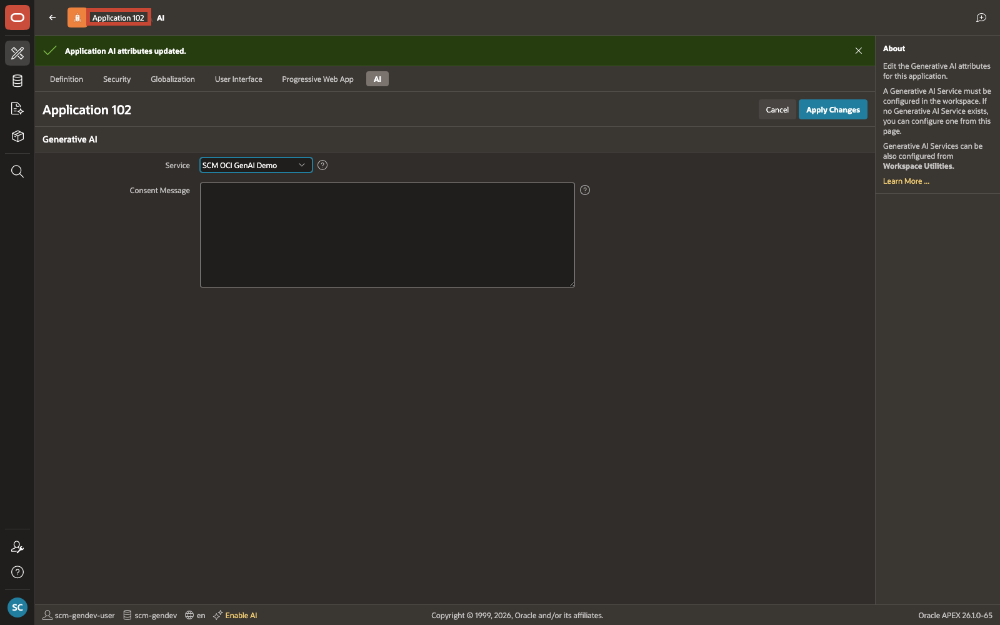

2. From your application home page, select **Shared Components**.

    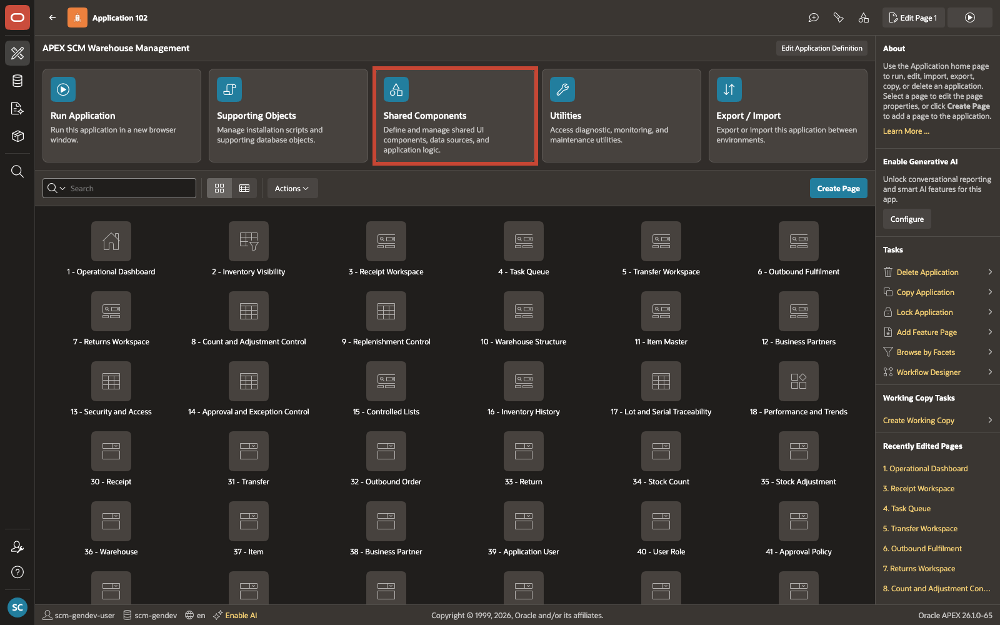

3. From **Shared Components**, under **Generative AI**, select **AI Agents**.

    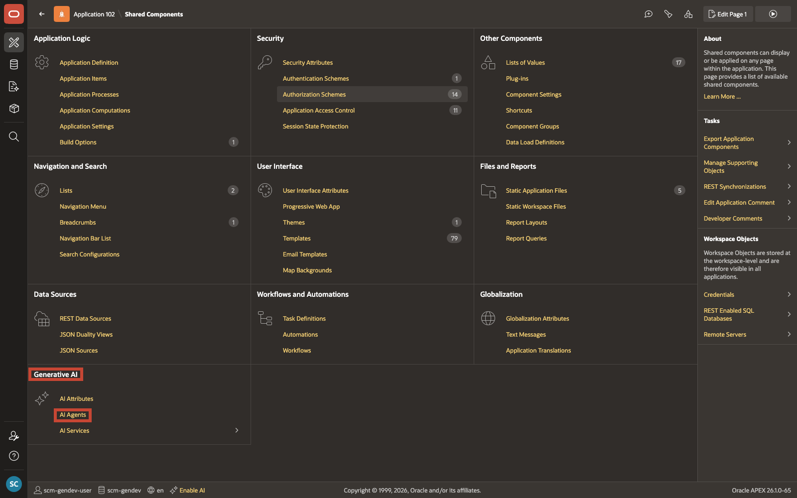

4. On the **Generative AI Agents** page, select **Create**.

    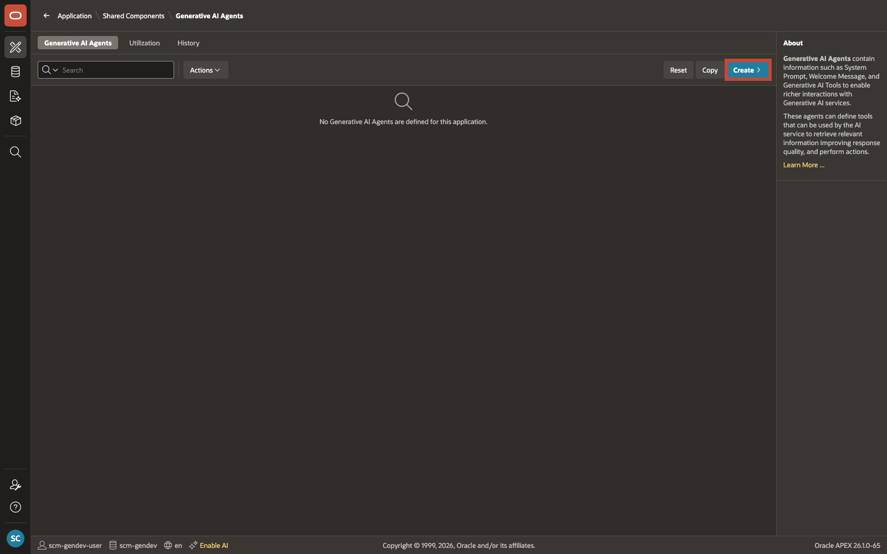

5. On the **Create Generative AI Agent** page, enter/select the following:

    - Under **Identification**:

        - Name: **SCM Procurement Agent**
        - Service: **OCI Gen AI**

    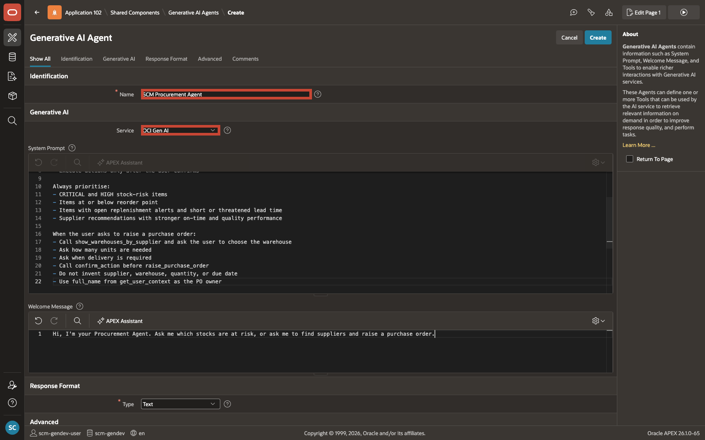

6. In **System Prompt**, enter:

    ```text
    <copy>
    You are a procurement assistant for the APEX Inventory and Warehouse Management application.
    Your role is to:
    - Identify items at risk in the current user's warehouse
    - Explain the severity of the risk using available stock, reorder policy, alert priority, and lead time
    - Find suppliers who have previously supplied the selected item
    - Compare supplier performance before recommending a supplier
    - Collect the warehouse, quantity, and due date needed for a purchase order
    - Execute actions only after the user confirms

    Always prioritise:
    - CRITICAL and HIGH stock-risk items
    - Items at or below reorder point
    - Items with open replenishment alerts and short or threatened lead time
    - Supplier recommendations with stronger on-time and quality performance

    When the user asks to raise a purchase order:
    - Call show_warehouses_by_supplier and ask the user to choose the warehouse
    - Ask how many units are needed
    - Ask when delivery is required
    - Convert any relative date the user gives ("next Tuesday", "end of month") to YYYY-MM-DD using today's date before passing as DUE_DATE
    - Call confirm_action before raise_purchase_order
    - Do not invent supplier, warehouse, quantity, or due date
    - Use full_name from get_user_context as the PO owner
    </copy>
    ```

    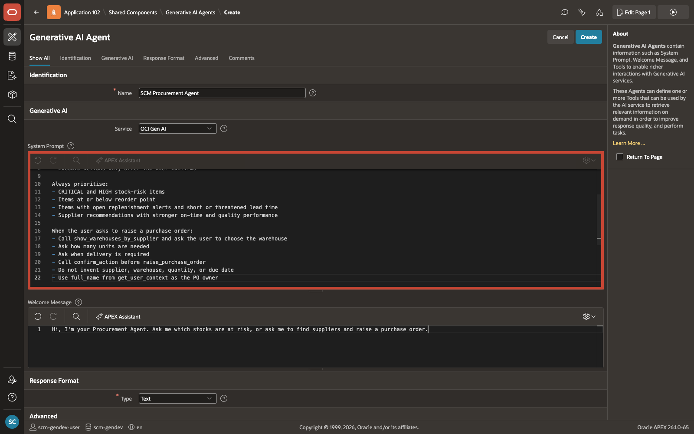

7. In **Welcome Message**, enter:

    ```text
    <copy>
    Hi, I'm your Procurement Agent. Ask me which stocks are at risk, or ask me to find suppliers and raise a purchase order.
    </copy>
    ```

    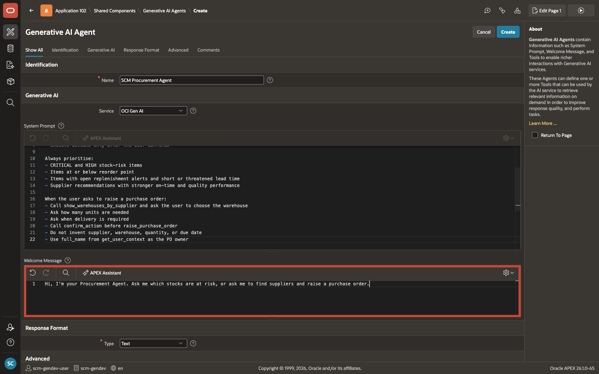

8. Select **Create**.

    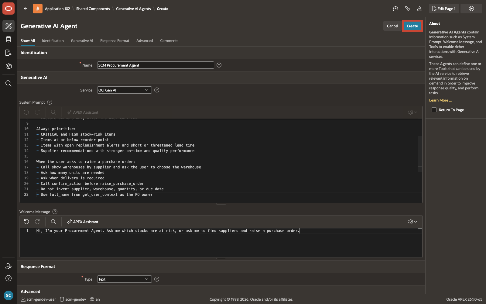

## Task 2: Add the User Context Tool

The agent needs to know who the signed-in user is before it can give useful answers. This tool queries the database and returns the user's full name, role, warehouse, approval authority, and manager automatically on every message.

**Type:** Retrieve Data | **Execution:** Augment System Prompt

1. In the **Tools** section, select **Add Tool**.

    

2. Enter/select the following configuration:

    - Under **Identification**:

        - Tool Name: **get\_user\_context**
        - Type: **Retrieve Data**
        - Execution Point: **Augment System Prompt**
        - Description: **Returns the current user's full name, role, warehouse, approval authority level, and manager. Injected automatically on every message before any reasoning begins. Use full\_name as the PO owner when raising purchase orders. Use warehouse\_id as the default warehouse context.**

    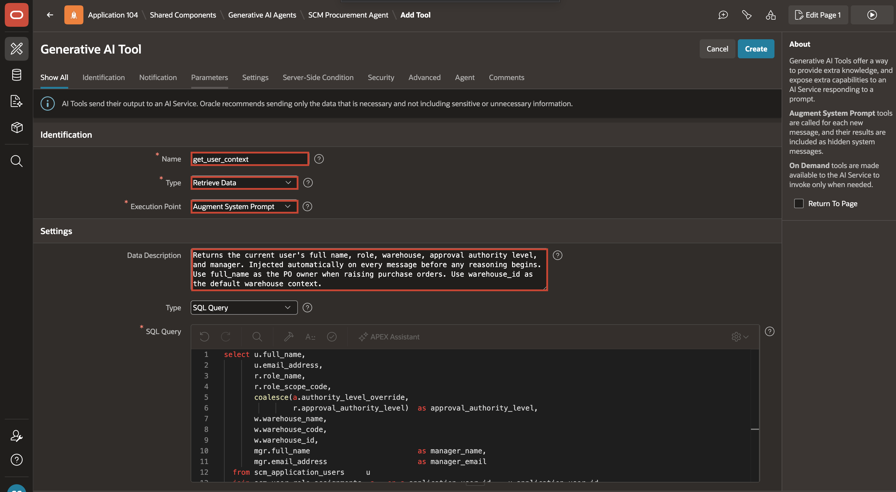

3. Under **Settings**, for **SQL Query**, copy and paste the following:

    ```sql
    <copy>
    select u.full_name,
           u.email_address,
           r.role_name,
           r.role_scope_code,
           coalesce(a.authority_level_override,
                    r.approval_authority_level)  as approval_authority_level,
           w.warehouse_name,
           w.warehouse_code,
           w.warehouse_id,
           mgr.full_name                         as manager_name,
           mgr.email_address                     as manager_email
      from scm_application_users     u
      join scm_user_role_assignments  a   on a.application_user_id  = u.application_user_id
                                         and a.assignment_status_code = 'ACTIVE'
                                         and a.is_primary_role        = true
      join scm_user_roles             r   on r.user_role_id          = a.user_role_id
      left join scm_warehouses        w   on w.warehouse_id          = u.default_warehouse_id
      left join scm_application_users mgr on mgr.application_user_id = u.manager_user_id
    where lower(u.user_name) = lower(:APP_USER)
    </copy>
    ```

    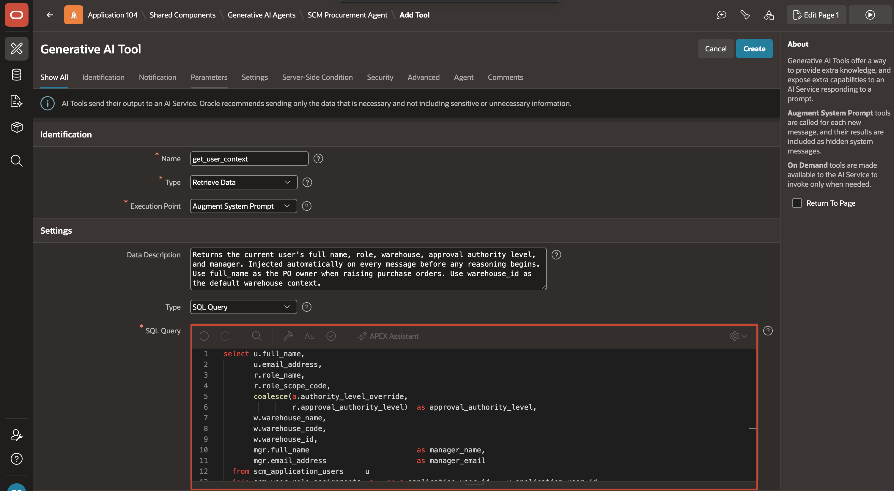

4. Click **Create**.

    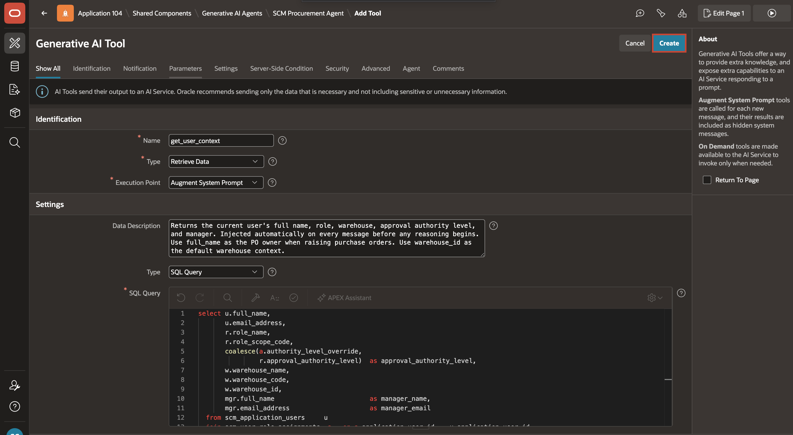

    This query joins four tables to assemble the user's full context:

    | Table | What it provides |
    | --- | --- |
    | `scm_application_users` | User name, email, default warehouse, manager |
    | `scm_user_role_assignments` | Active primary role and optional approval override |
    | `scm_user_roles` | Role name, scope, approval authority |
    | `scm_warehouses` | Warehouse name, code, and warehouse ID |
    {: title="Tables Used by get_user_context"}

## Task 3: Add the Browser Timezone Tool

When a user sets a delivery due date, the agent needs to know their timezone so the date is recorded correctly. This tool reads the timezone directly from the browser and passes it to the agent on every message.

**Type:** Execute Client-side Code | **Execution:** Augment System Prompt

1. In the **Tools** section, select **Add Tool**.

    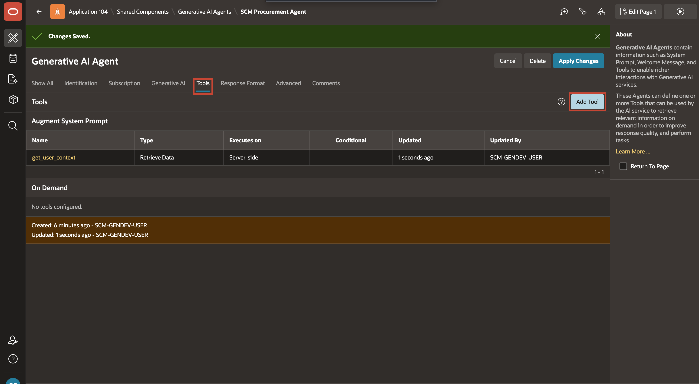

2. Enter/select the following configuration:

    - Under **Identification**:

        - Tool Name: **get\_browser\_timezone**
        - Type: **Execute Client-side Code**
        - Execution Point: **Augment System Prompt**
    - Settings > Code: Copy and paste the following:

        ```javascript
        <copy>
        return Intl.DateTimeFormat().resolvedOptions().timeZone;
        </copy>
        ```

    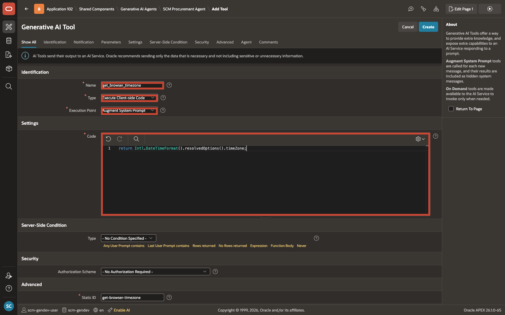

3. Click **Create**.

    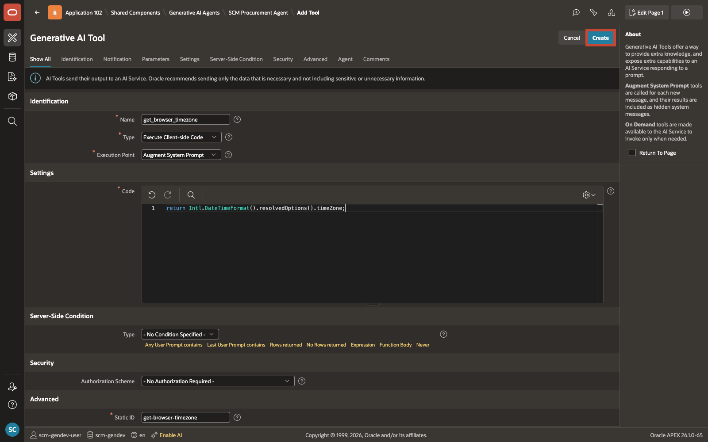

## Summary

The SCM Procurement Agent is created and has two context tools in place. On every message, the agent automatically knows who the user is, which warehouse they belong to, and what timezone their browser is using. This foundation is what makes the agent's answers relevant and accurate for each individual user.

In the next lab, you will add the tools that allow the agent to identify stock risk, compare suppliers, and raise a purchase order.

## Acknowledgements

- **Author** - Sahaana Manavalan, Senior Product Manager, April 2026
- **Last Updated By/Date** - Sahaana Manavalan, Senior Product Manager, April 2026
