# Add Supplier Evaluation and Purchase Order Tools

## Introduction

With the agent created and context tools in place from Lab 3, you can now add the tools that drive the actual procurement conversation.

Each tool in this lab represents one step in the procurement journey:

1. **Identify the problem**: scan the warehouse for items at or below their reorder point
2. **Find who can help**: look up active suppliers with a delivery history for that item
3. **Evaluate the options**: pull a performance scorecard for a chosen supplier
4. **Choose a destination**: show which warehouses that supplier has delivered to before
5. **Confirm before acting**: show a browser dialog and wait for the user to approve
6. **Raise the order**: write the planned purchase order to the database and notify the user

All six tools use the **On Demand** execution point, meaning the agent only calls them when the conversation reaches that step. The agent uses the context from Lab 3 (who the user is and which warehouse they belong to) to make every answer specific to the person asking.

Estimated Time: 20 minutes

### Objectives

In this lab, you will:

- Add supplier evaluation tools to identify stock risk, compare suppliers, and review delivery performance

- Add a human confirmation checkpoint before any write action runs

- Add the tool that creates the planned purchase order

### Tools in This Lab

| Tool Name | Type | Execution Point |
| --- | --- | --- |
| `get_stocks_at_risk` | Retrieve Data | On Demand |
| `get_suppliers_for_item` | Retrieve Data | On Demand |
| `get_supplier_delivery_performance` | Retrieve Data | On Demand |
| `show_warehouses_by_supplier` | Retrieve Data | On Demand |
| `confirm_action` | Execute Client-side Code | On Demand |
| `raise_purchase_order` | Execute Server-side Code | On Demand |
{: title="Tools Built in Lab 4"}

## Task 1: Identify Items at Risk in the Warehouse

The procurement conversation starts here. The user opens the assistant and asks what needs attention, and the agent needs a way to answer that question with real data from the warehouse. This tool scans for items that are at or below their reorder point, or already have an open replenishment alert, and returns them ordered by priority. The result gives the user a clear, ranked list of what to act on first.

**Type:** Retrieve Data | **Execution:** On Demand

1. On the **Procurement Agent** page, in the **Tools** section, select **Add Tool**.

    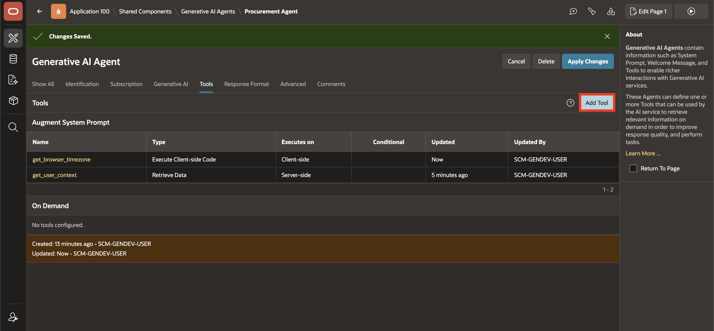

2. Enter/select the following configuration:

    - Under **Identification**:

        - Name: **get\_stocks\_at\_risk**
        - Type: **Retrieve Data**
        - Execution Point: **On Demand**
        - Description: copy and paste the following:

            ```text
            <copy>
            Returns items in the current user's warehouse that are at or below their reorder point, or have an open replenishment alert. Call this when the user asks about stock risk, low stock, or what needs attention. Returns item name, available quantity, reorder point, alert priority, and supplier lead time. Results are ordered by priority then by gap size.
            </copy>
            ```

    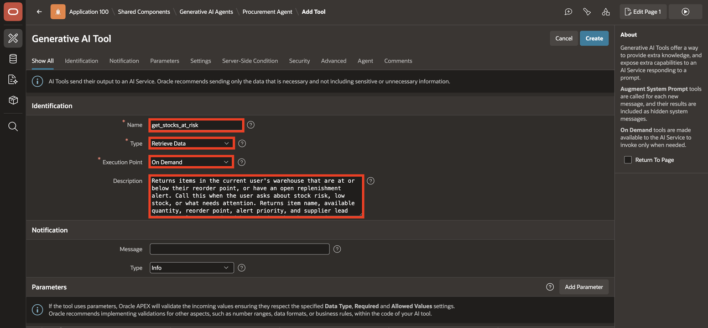

    This tool does not require any parameters.

3. Under **Settings**, for **SQL Query**, copy and paste the following:

    ```sql
    <copy>
    select item_id,
           item_code,
           item_name,
           base_uom_code,
           warehouse_name,
           available_quantity,
           reorder_point_quantity,
           safety_stock_quantity,
           reorder_target_quantity,
           replenishment_lead_time_days,
           alert_priority,
           alert_type_code,
           alert_number,
           hours_open
      from scm_v_stocks_at_risk
     where lower(user_name) = lower(:APP_USER)
     order by priority_sort, stock_gap desc
    </copy>
    ```

    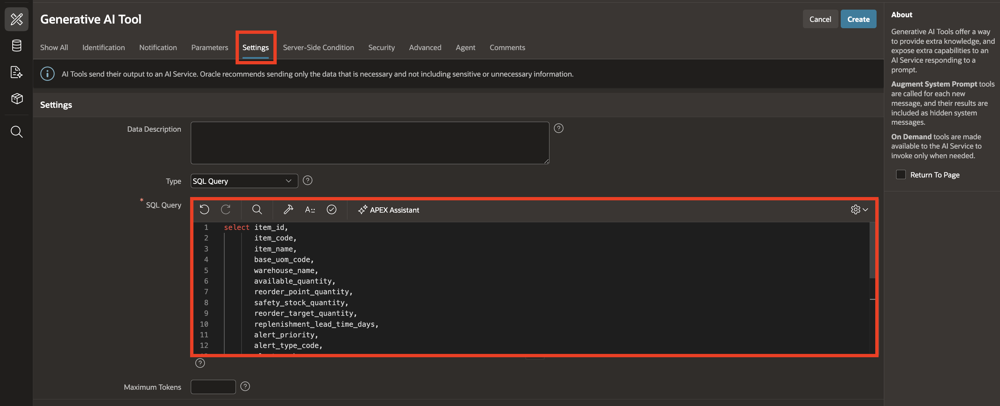

4. Click **Create**.

    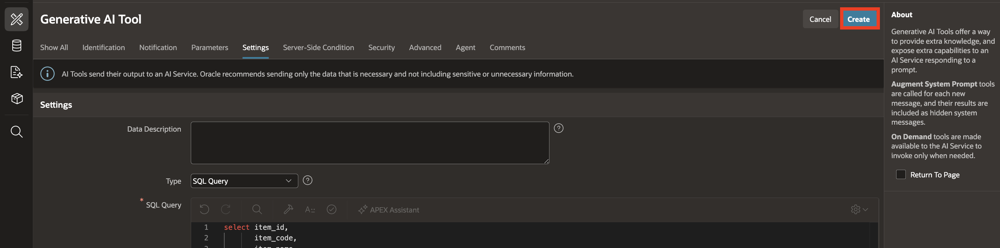

5. The `scm_v_stocks_at_risk` view encapsulates the following tables:

    | Table | What it provides |
    | --- | --- |
    | `scm_item_warehouse_policies` | Warehouse policy, reorder levels, lead time |
    | `scm_items` | Item identity and unit of measure |
    | `scm_warehouses` | Warehouse context |
    | `scm_inventory_balances` | Available stock quantity |
    | `scm_storage_locations` | Warehouse mapping for balances |
    | `scm_replenishment_alerts` | Open alert priority and age |
    | `scm_application_users` | Default warehouse for the current user |
    | `scm_inbound_receipts` | Excludes items with an existing planned receipt |
    | `scm_inbound_receipt_lines` | Item-level match for the planned receipt check |
    {: title="Tables used by get_stocks_at_risk"}

## Task 2: Find Suppliers for a Selected Item

Once the user picks an at-risk item, the conversation moves to finding who can supply it. Knowing the item is low is only half the answer: the user also needs to know their options before they can take action. This tool returns active suppliers who have a delivery history for the selected item, along with on-time rate and damage rate, so the user can compare at a glance and move toward a decision.

**Type:** Retrieve Data | **Execution:** On Demand

1. On the **Procurement Agent** page, in the **Tools** section, select **Add Tool**.

    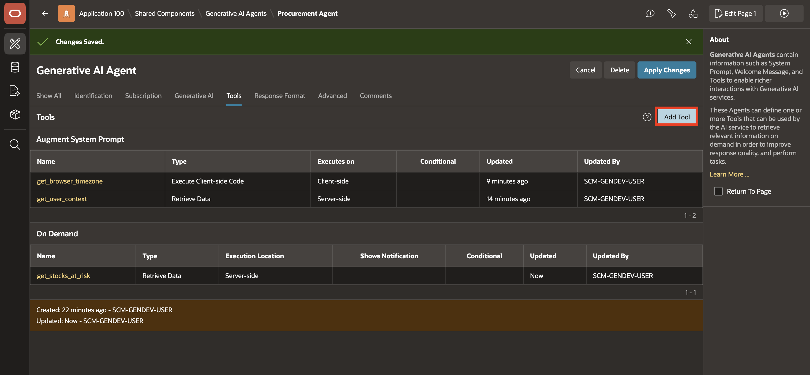

2. Enter/select the following configuration:

    - Under **Identification**:

        - Name: **get\_suppliers\_for\_item**
        - Type: **Retrieve Data**
        - Execution Point: **On Demand**
        - Description: copy and paste the following:

            ```text
            <copy>
            Returns active suppliers who have previously supplied the given item. Pass item_id from get_stocks_at_risk. Present only supplier_name, total_receipts, last_received_at, on_time_rate_pct, and damage_rate_pct to the user. Keep supplier_id and partner_site_id internal, as they are needed as parameters for show_warehouses_by_supplier and raise_purchase_order. Results are ordered best performer first.
            </copy>
            ```

    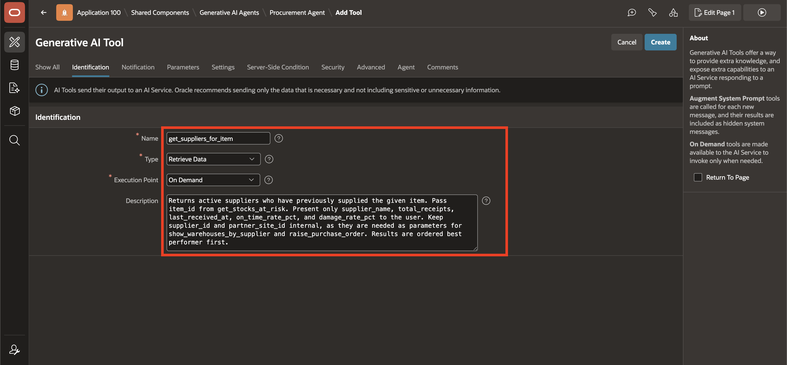

3. Under **Parameters** tab, click **Add Parameter** and add the following parameter:

    | Parameter | Description | Data Type | Required |
    | --- | --- | --- | --- |
    | `ITEM_ID` | Selected item identifier. | NUMBER | Yes |
    {: title="get_suppliers_for_item Parameters"}

    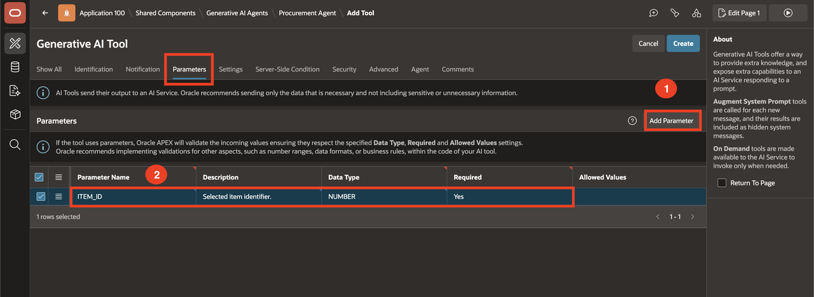

4. Under **Settings**, for **SQL Query**, copy and paste the following:

    ```sql
    <copy>
    select supplier_id,
           partner_number,
           supplier_name,
           partner_site_id,
           site_code,
           site_name,
           total_receipts,
           last_received_at,
           on_time_rate_pct,
           damage_rate_pct
      from scm_v_suppliers_for_item
     where item_id = :ITEM_ID
     order by on_time_rate_pct desc nulls last,
              damage_rate_pct   asc  nulls last
    </copy>
    ```

    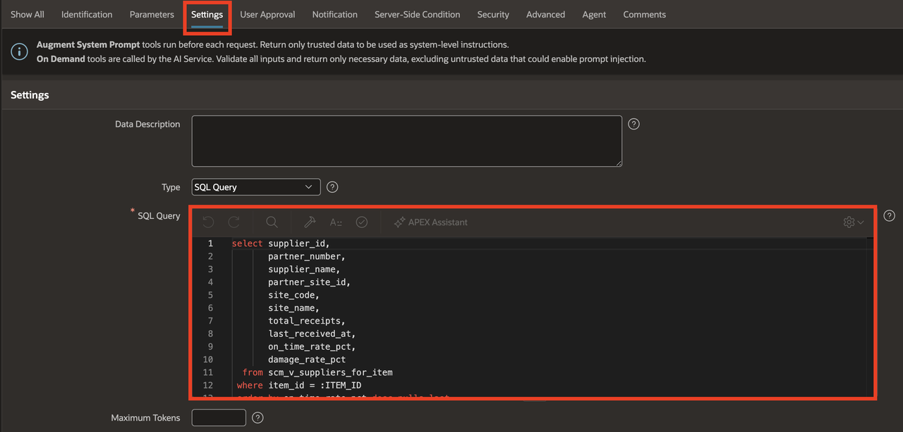

5. Click **Create**.

    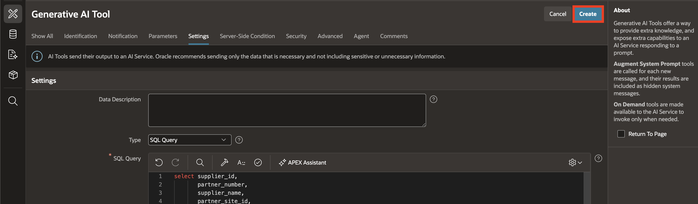

6. The `scm_v_suppliers_for_item` view encapsulates the following tables:

    | Table | What it provides |
    | --- | --- |
    | `scm_business_partners` | Supplier identity |
    | `scm_partner_sites` | Supplier site details |
    | `scm_inbound_receipts` | Historical supplier deliveries |
    | `scm_inbound_receipt_lines` | Item-level receipt history and quality data |
    {: title="Tables used by get_suppliers_for_item"}

## Task 3: Evaluate Supplier Delivery Performance

With a shortlist of suppliers in view, the user may want to dig deeper before committing. A supplier summary is useful, but a track record over time is what builds confidence. This tool returns a performance scorecard for a chosen supplier over the last quarter or the last 12 months, covering on-time rate, average delay, dock-to-stock time, and damage rate. It gives the user the evidence they need to recommend one supplier over another.

**Type:** Retrieve Data | **Execution:** On Demand

1. On the **Procurement Agent** page, in the **Tools** section, select **Add Tool**.

    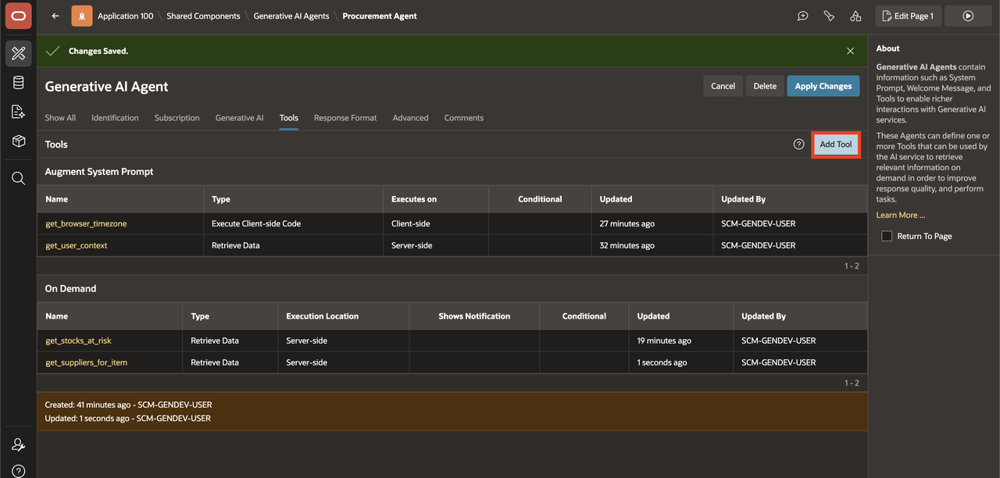

2. Enter/select the following configuration:

    - Under **Identification**:

        - Name: **get\_supplier\_delivery\_performance**
        - Type: **Retrieve Data**
        - Execution Point: **On Demand**
        - Description: copy and paste the following:

            ```text
            <copy>
            Returns a detailed delivery performance scorecard for a supplier over a given period. Pass supplier_id from get_suppliers_for_item. Pass TIME_PERIOD as QUARTER for last quarter or YEAR for last 12 months. Call this when the user wants to check a supplier's track record before raising a purchase order. Returns on-time rate, average delay, dock-to-stock time, damage rate, and total volumes.
            </copy>
            ```

    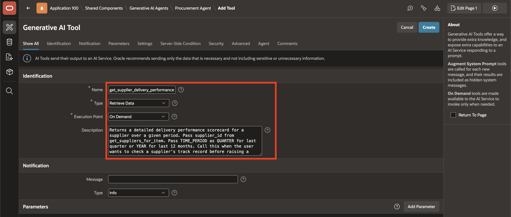

3. Under **Parameters** tab, click **Add Parameter** and add the following parameter:

    | Parameter | Description | Data Type | Required |
    | --- | --- | --- | --- |
    | `TIME_PERIOD` | Reporting horizon such as `QUARTER` or `YEAR`. | VARCHAR2 | Yes |
    | `SUPPLIER_ID` | Selected supplier identifier. | NUMBER | Yes |
    {: title="get_supplier_delivery_performance Parameters"}

    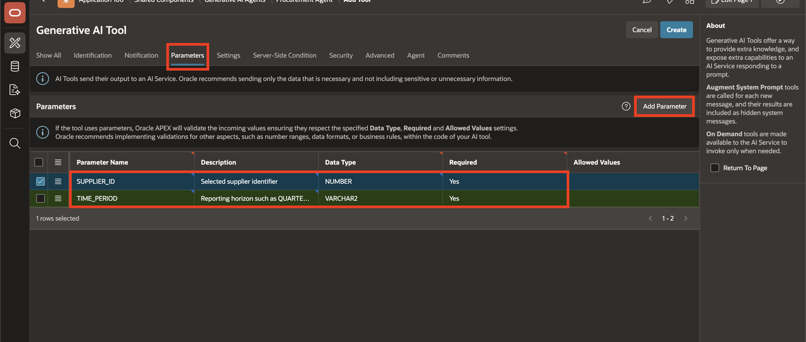

4. Under **Settings**, for **SQL Query**, copy and paste the following:

    ```sql
    <copy>
    select *
      from scm_v_supplier_delivery_performance
     where business_partner_id = :SUPPLIER_ID
       and time_period         = :TIME_PERIOD
    </copy>
    ```

    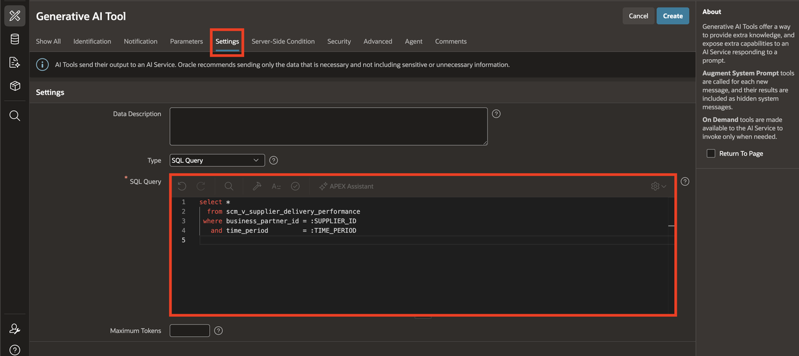

5. Click **Create**.

    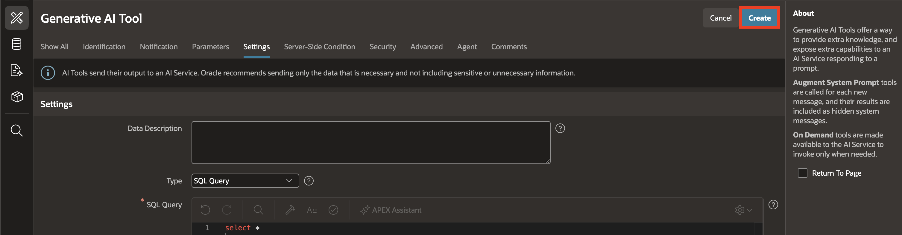

6. The `scm_v_supplier_delivery_performance` view pre-aggregates delivery metrics for both `QUARTER` (last 3 months) and `YEAR` (last 12 months) periods. It encapsulates the following tables:

    | Table | What it provides |
    | --- | --- |
    | `scm_business_partners` | Supplier identity |
    | `scm_inbound_receipts` | Header-level delivery timing |
    | `scm_inbound_receipt_lines` | Quantity, damage, shortage, and rejection data |
    {: title="Tables used by get_supplier_delivery_performance"}

## Task 4: Show Available Warehouses for a Supplier

With a supplier chosen, the conversation turns to where the order should go. A purchase order needs a destination warehouse, but asking the user to type a warehouse ID is a poor experience and prone to error. This tool presents only the warehouses that the chosen supplier has actually delivered to before, giving the user a grounded, relevant list to choose from. The agent waits for the user's selection and uses the matching warehouse ID internally. The user never sees a number.

**Type:** Retrieve Data | **Execution:** On Demand

1. On the **Procurement Agent** page, in the **Tools** section, select **Add Tool**.

    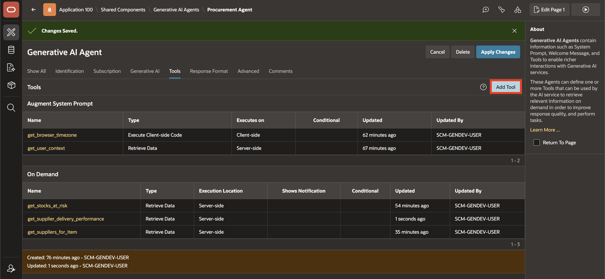

2. Enter/select the following configuration:

    - Under **Identification**:

        - Name: **show\_warehouses\_by\_supplier**
        - Type: **Retrieve Data**
        - Execution Point: **On Demand**
        - Description: copy and paste the following:

            ```text
            <copy>
            Returns the list of active warehouses that the given supplier has previously delivered to. Only call this tool if the user's role scope is not warehouse-specific or the user explicitly requests a different warehouse. Present only warehouse_code and warehouse_name to the user. Never show warehouse_id. If the user has already named a warehouse, match it to the correct row and use that row's warehouse_id as WH_ID in raise_purchase_order without asking again. Keep warehouse_id internal.
            </copy>
            ```

    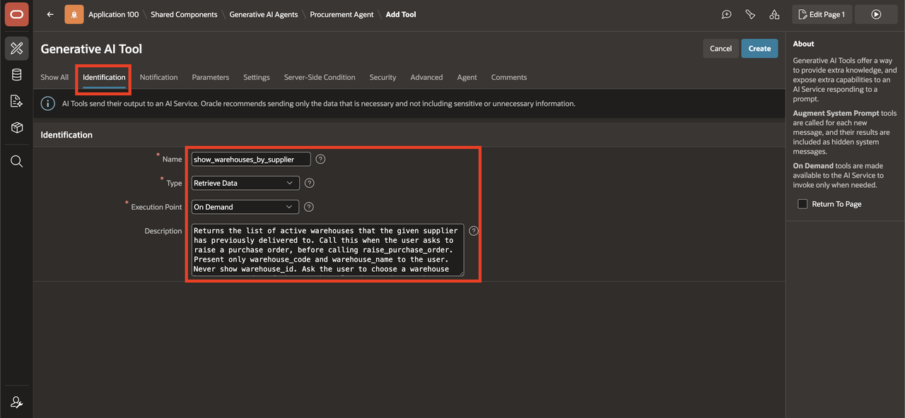

3. Under **Parameters** tab, click **Add Parameter** and add the following parameter:

    | Parameter | Description | Data Type | Required |
    | --- | --- | --- | --- |
    | `SUPPLIER_ID` | Selected supplier identifier. | NUMBER | Yes |
    {: title="show_warehouses_by_supplier Parameters"}

    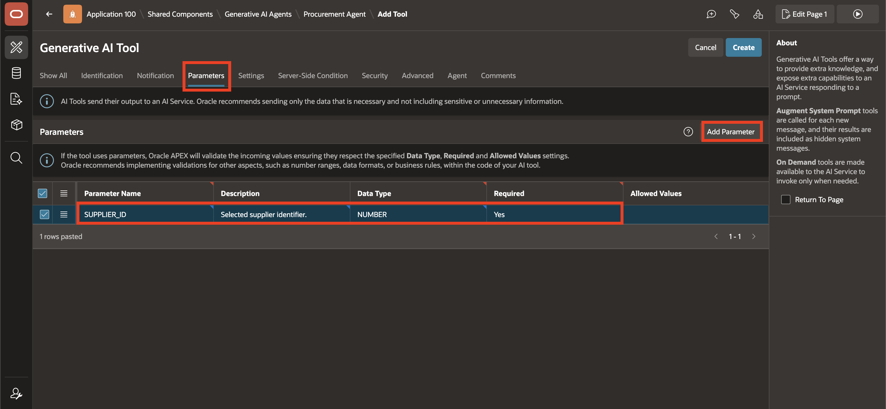

4. Under **Settings**, for **SQL Query**, copy and paste the following:

    ```sql
    <copy>
    select warehouse_id,
           warehouse_code,
           warehouse_name,
           total_deliveries,
           last_delivered_at
      from scm_v_warehouses_by_supplier
     where supplier_id = :SUPPLIER_ID
     order by total_deliveries desc, last_delivered_at desc
    </copy>
    ```

    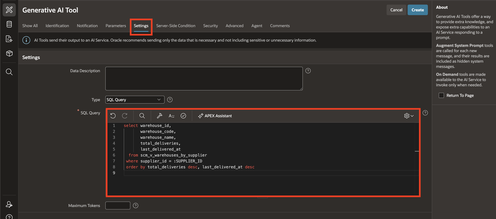

5. Click **Create**.

    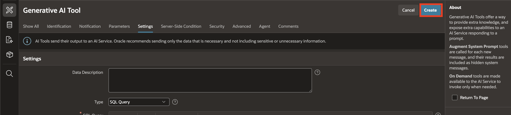

6. The `scm_v_warehouses_by_supplier` view encapsulates the following tables:

    | Table | What it provides |
    | --- | --- |
    | `scm_warehouses` | Warehouse identity and status |
    | `scm_inbound_receipts` | Historical supplier deliveries by warehouse |
    {: title="Tables used by show_warehouses_by_supplier"}

## Task 5: Request User Confirmation Before Any Write Action

At this point the agent has gathered everything it needs: the item, the supplier, the warehouse, the quantity, and the due date. Before it writes anything to the database, the user must explicitly approve. This is the human checkpoint that separates a recommendation from an action, a pattern every AI-powered write should follow.

This tool shows a browser confirmation dialog that summarises the full order and waits for the user to click OK or Cancel. If the user cancels, the agent stops and reports back. The purchase order is only raised after this tool returns `"confirmed"`.

**Type:** Execute Client-side Code | **Execution:** On Demand

> **Note:** In an **Execute Client-side Code** tool, `this.data` is a JavaScript object that contains the parameters passed by the agent to this tool call. For example, if the agent calls `confirm_action` with `MESSAGE = "Raise PO for 100 units..."`, then `this.data.MESSAGE` inside the code block holds that string. Any tool parameter can be accessed in this way.

1. On the **Procurement Agent** page, in the **Tools** section, select **Add Tool**.

    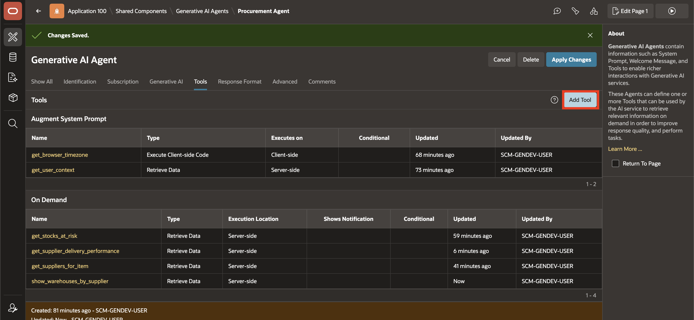

2. Enter/select the following configuration:

    - Under **Identification**:

        - Name: **confirm\_action**
        - Type: **Execute Client-side Code**
        - Execution Point: **On Demand**
        - Description: copy and paste the following:

            ```text
            <copy>
            Shows a browser confirmation dialog with the provided MESSAGE. Returns "confirmed" if the user clicks OK, or "denied" if they cancel. Always call this before raise_purchase_order. Build MESSAGE as a plain-English summary of the full order: item name, quantity, supplier name, warehouse name, due date, and PO owner. If the return value is "denied", stop and report back to the user.
            </copy>
            ```

    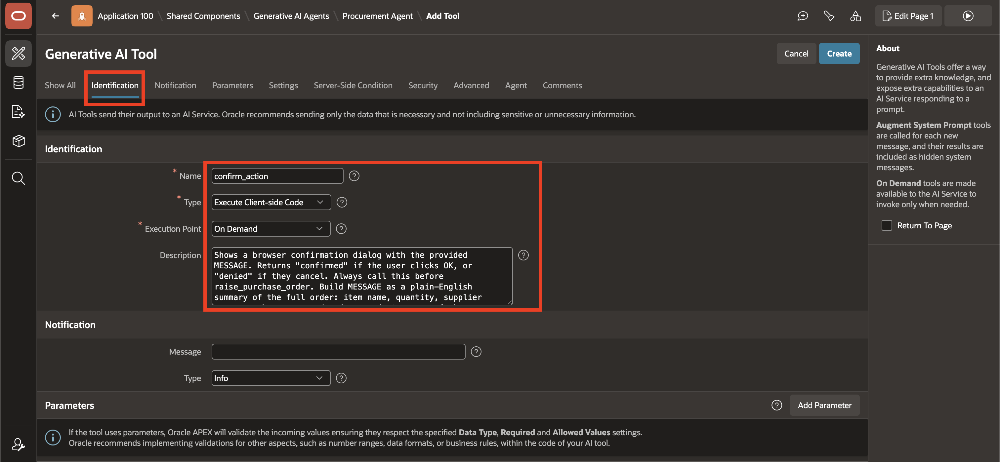

3. Under **Parameters** tab, click **Add Parameter** and add the following parameter:

    | Parameter | Description | Data Type | Required |
    | --- | --- | --- | --- |
    | MESSAGE | Confirmation text displayed to the user. | VARCHAR2 | Yes |
    {: title="confirm_action Parameters"}

    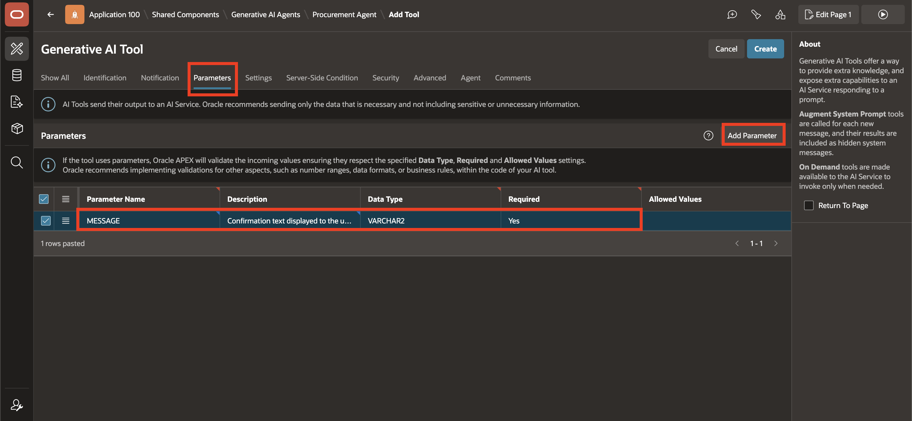

4. Under **Settings**, for **Code**, copy and paste the following:

    ```javascript
    <copy>
    return new Promise(resolve => {
        apex.message.confirm(this.data.MESSAGE, okPressed => {
            resolve(okPressed ? "confirmed" : "denied");
        });
    });
    </copy>
    ```

    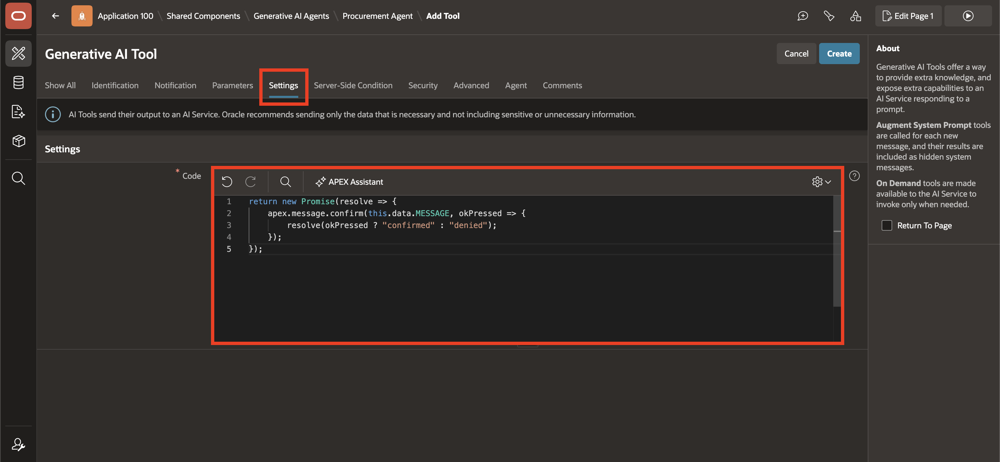

5. Click **Create**.

    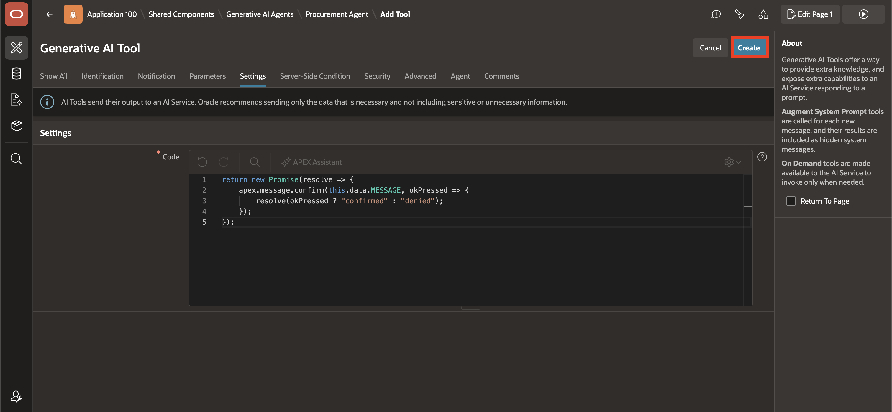

## Task 6: Create the Purchase Order and Action the Replenishment Alert

This is where the conversation becomes an action. The user has identified a shortage, chosen a supplier, picked a warehouse, specified a quantity and date, and confirmed. Now the agent executes. This tool writes the planned purchase order to the database, marks the replenishment alert as actioned so it no longer appears as open, and pushes a success notification back to the chat panel, all in a single PL/SQL block.

The agent only calls this tool after all previous steps are complete and `confirm_action` has returned `"confirmed"`.

**Type:** Execute Server-side Code | **Execution:** On Demand

> **Note:** In an **Execute Server-side Code** tool, `apex_ai.set_tool_result` can be called to return a result to the agent and optionally display a notification in the chat UI. The `p_result` parameter contains the text the agent receives to form its reply. The optional `p_notification_message` and `p_notification_type` parameters display a toast notification (`'success'`, `'warning'`, or `'error'`) in the APEX page. Without this call, the agent receives no confirmation that the write operation succeeded.

1. On the **Procurement Agent** page, in the **Tools** section, select **Add Tool**.

    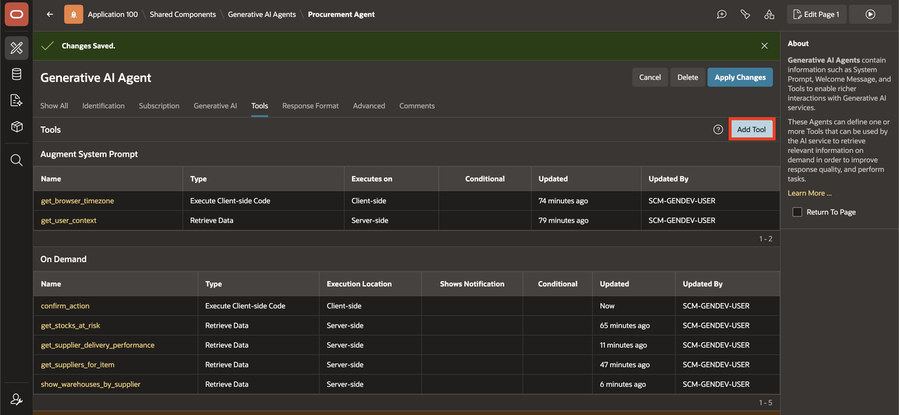

2. Enter/select the following configuration:

    - Under **Identification**:

        - Name: **raise\_purchase\_order**
        - Type: **Execute Server-side Code**
        - Execution Point: **On Demand**
        - Description: copy and paste the following:

            ```text
            <copy>
            Creates a planned purchase order as a PLANNED inbound receipt for the given item and supplier. Before calling this tool you must complete these steps in order: 1. Default to the user's warehouse from get_user_context as WH_ID. Only call show_warehouses_by_supplier if the user's role scope is not warehouse-specific or the user explicitly requests a different warehouse. 2. Ask the user how many units they need. Use their answer as QUANTITY. 3. Ask the user when they need delivery by. Use their answer as DUE_DATE in YYYY-MM-DD format. 4. Call confirm_action with a plain-English summary. Pass the exact return value from confirm_action as CONFIRMED. If CONFIRMED is not "confirmed", do not call this tool. Use full_name from get_user_context as the PO owner.
            </copy>
            ```

    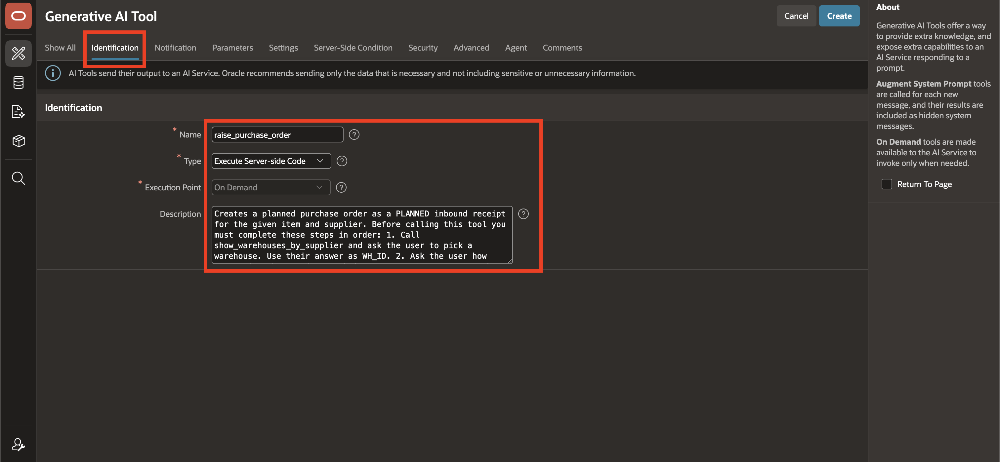

3. Under **Parameters** tab, click **Add Parameter** and add the following parameter:

    | Parameter | Description | Data Type | Required |
    | --- | --- | --- | --- |
    | `CONFIRMED` | Return value from confirm\_action. Must be "confirmed" to proceed. | VARCHAR2 | Yes |
    | `TIMEZONE` | Browser timezone value for due-date conversion. | VARCHAR2 | Yes |
    | `DUE_DATE` | Required delivery date in `YYYY-MM-DD` format. If the user gives a relative expression such as "next Tuesday" or "in two weeks", compute the exact calendar date using today's date and convert it to YYYY-MM-DD before passing. Never pass a natural language string. | VARCHAR2 | Yes |
    | `QUANTITY` | Requested purchase quantity. | NUMBER | Yes |
    | `WH_ID` | Chosen warehouse identifier. | NUMBER | Yes |
    | `SUPPLIER_ID` | Selected supplier identifier. | NUMBER | Yes |
    | `ITEM_ID` | Selected item identifier. | NUMBER | Yes |
    {: title="raise_purchase_order Parameters"}

    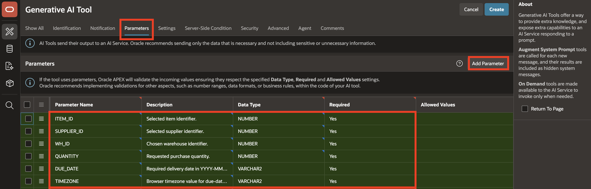

4. Under **Settings**, for **PL/SQL Code**, copy and paste the following:

    ```plsql
    <copy>
    scm_raise_purchase_order(
        p_confirmed   => :CONFIRMED,
        p_item_id     => :ITEM_ID,
        p_supplier_id => :SUPPLIER_ID,
        p_wh_id       => :WH_ID,
        p_quantity    => :QUANTITY,
        p_due_date    => :DUE_DATE,
        p_timezone    => :TIMEZONE,
        p_app_user    => :APP_USER
    );
    </copy>
    ```

    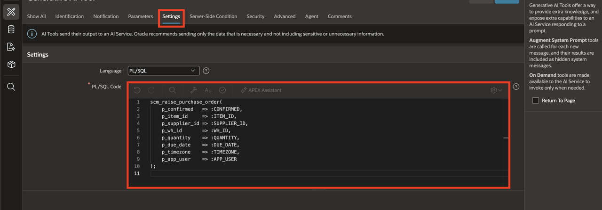

5. Click **Create**.

    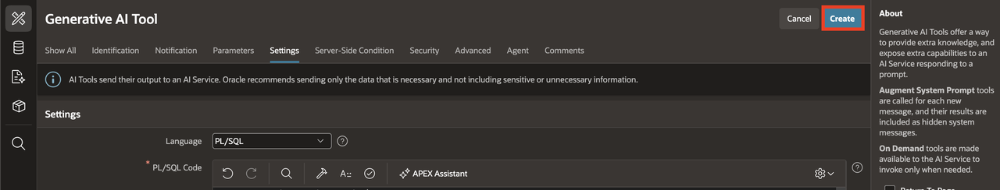

6. The `scm_raise_purchase_order` procedure handles the following:

    - Creates a planned supplier receipt with a sequential purchase order number
    - Inserts the receipt line for the selected item and quantity
    - Marks the relevant replenishment alert as `ACTIONED`
    - Pushes a success notification back to the chat UI with `apex_ai.set_tool_result`

        | Table | What it does |
        | --- | --- |
        | `scm_inbound_receipts` | Inserts the planned purchase-order header |
        | `scm_inbound_receipt_lines` | Inserts the purchase-order line |
        | `scm_replenishment_alerts` | Marks the alert as actioned |
        | `scm_application_users` | Resolves the current application user |
        | `scm_storage_locations` | Resolves the receiving location for the warehouse |
        | `scm_items` | Resolves item name and UOM |
        | `scm_business_partners` | Resolves supplier name |
        | `scm_warehouses` | Resolves warehouse name |
        {: title="Tables used by raise_purchase_order"}

## Summary

All eight tools are now in place: the two context tools from Lab 3 (`get_user_context` and `get_browser_timezone`) plus the six procurement tools added in this lab. The agent can now identify stock at risk, evaluate suppliers, review delivery performance, confirm the destination warehouse, obtain user confirmation, and raise a purchase order, all through a single guided conversation.

You may now **proceed to the next lab**.

## Acknowledgements

- **Author** - Sahaana Manavalan, Senior Product Manager, April 2026
- **Last Updated By/Date** - Sahaana Manavalan, Senior Product Manager, May 2026