# Add Agent to Application and Run Application

## Introduction

In this lab, you will complete the final three steps to bring the workshop together. First, you will add the **Procurement Agent** to the **Home Dashboard** by creating a button and attaching it to the AI Agent using a trigger action. Next, you will set up user access so the application can identify you when you sign in. Finally, you will run the application and walk through the complete procurement conversation: identifying low-stock items, evaluating suppliers, and raising a purchase order.

Estimated Time: 15 minutes

### Objectives

In this lab, you will:

- Add the **Procurement Agent** to the **Home Dashboard**

- Set up user access using Application Access Control and SQL

- Run the application and test the end-to-end procurement conversation

## Task 1: Add the Agent to the Application

In this task, you will configure the entry point that users will use to start the AI Assistant from the Operational Dashboard. You will add a button to Page 1 and attach a trigger action that opens **Procurement Agent** directly from the running application.

1. On the **Procurement Agent** page, select the **Application &lt;APP\_ID&gt;** in the breadcrumb to return to the Application home page.

    

2. From the Application home page, select **Page 1 - Home Dashboard** to open it in Page Designer.

    

3. In **Page Designer**, under **Rendering > Breadcrumb Bar**, right-click **Breadcrumb** and select **Create Button Below**.

    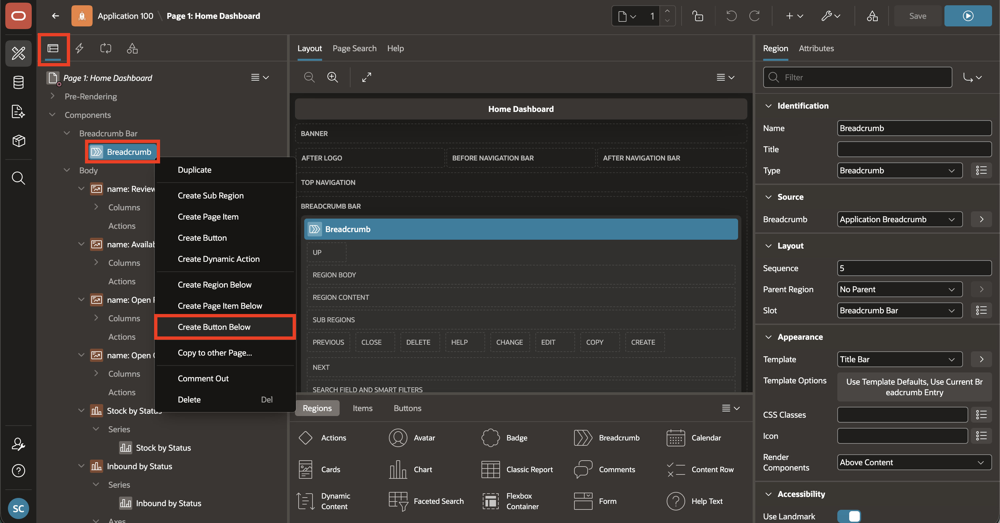

4. With the new button selected, enter/select the following in the **Property Editor**:

    - Under **Identification**:

        - Button Name: **PROCUREMENT_ASSISTANT**

    - Under **Layout**:

        - Region: **Breadcrumb**
        - Slot: **Next**

    - Under **Appearance**:

        - Button Template: **Text with Icon**
        - Hot: **Toggle ON**
        - Icon: **fa-ai-square**

    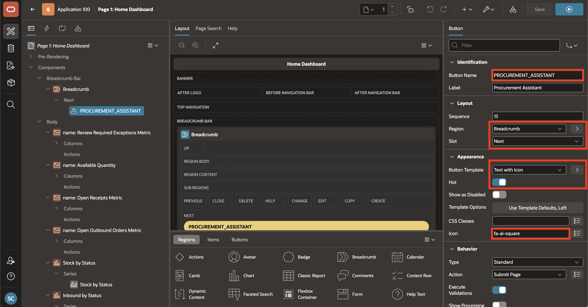

5. In the Rendering tree, **right-click** on the newly created **PROCUREMENT_ASSISTANT** button and select **Create Trigger Action**.

    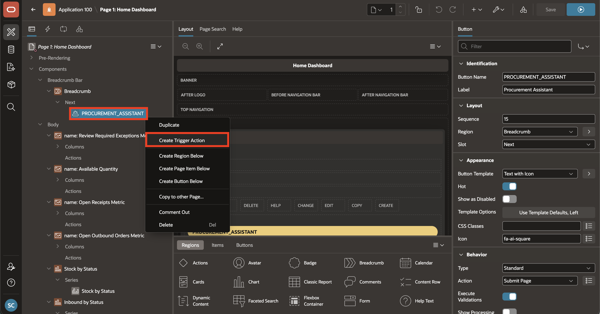

6. With the new trigger action selected, enter/select the following in the **Property Editor**:

    - Under **Identification**:

        - Action: **Show AI Assistant**

    - Under **Generative AI**:

        - Agent: **Procurement Agent**


    - Under **Quick Actions**:

        - Quick Message 1: **What items are low in stock?**

    

7. Click **Save** to persist the button and trigger action changes.

    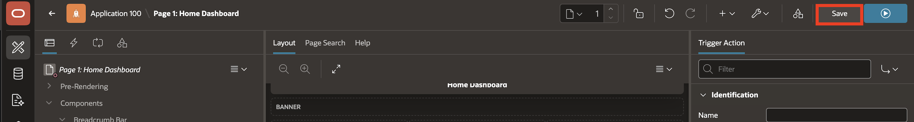

## Task 2: Set Up User Access

In this task, you will set up your user so the application recognises you when you sign in. This involves two steps: assigning yourself a role in the Application Access Control list, and inserting your user record into `scm_application_users` via SQL. Both are required. The Application Access Control assignment controls what pages you can access, and the `scm_application_users` entry is what the `get_user_context` tool queries to identify you, determine your warehouse, and scope every agent response to your context.

1. Click on **Shared Components** icon.

    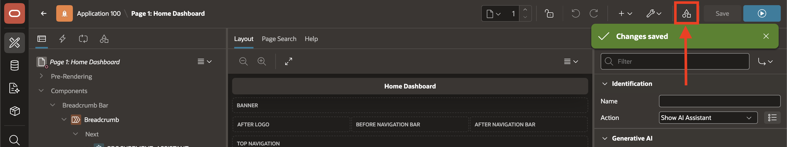

2. Click **Application Access Control**.

    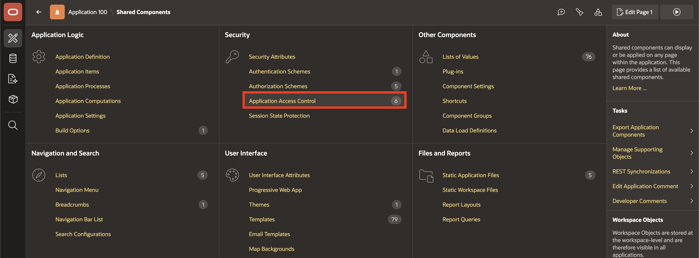

3. In the Application Access Control page, click **Add User Role Assignment**.

    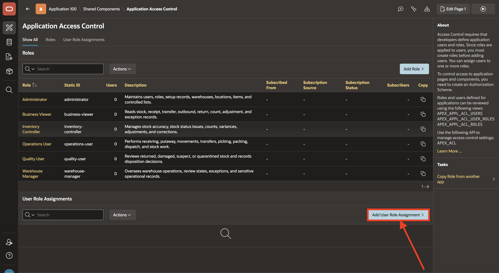

4. In the **User Name** field, enter your application username. Under **Application Role**, select **Warehouse Manager**, then click **Create Assignment**.

    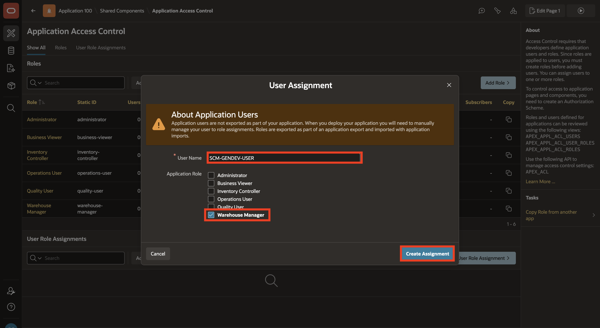

5. Navigate to **SQL Workshop > SQL Commands**. Hover over the left navigation bar, select **SQL Workshop**, then select **SQL Commands**.

    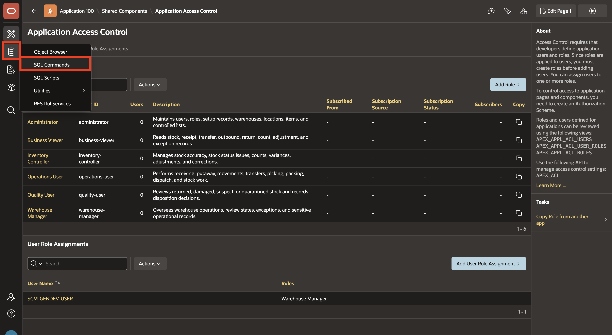

6. Copy and paste the following script into the editor. Replace the placeholder values, then select **Run**.

    ```sql
    <copy>
    declare
        v_user_id      number;
        v_warehouse_id number;
        v_role_id      number;
    begin
        select warehouse_id
          into v_warehouse_id
          from scm_warehouses
         where warehouse_code = 'PHX-WEST';

        select user_role_id
          into v_role_id
          from scm_user_roles
         where upper(role_name) = 'WAREHOUSE MANAGER';

        insert into scm_application_users (
            user_name,
            full_name,
            email_address,
            default_warehouse_id
        ) values (
            'YOUR_APEX_USERNAME',
            'Your Full Name',
            'your.email@example.com',
            v_warehouse_id
        ) returning application_user_id into v_user_id;

        insert into scm_user_role_assignments (
            application_user_id,
            user_role_id,
            assignment_status_code,
            is_primary_role
        ) values (
            v_user_id,
            v_role_id,
            'ACTIVE',
            true
        );

        commit;
    end;
    </copy>
    ```

    Replace `YOUR_APEX_USERNAME` with the exact username you use to sign in to the APEX workspace (case-insensitive match). Replace `Your Full Name` and `your.email@example.com` with your details. The script assigns you the **Warehouse Manager** role for the **PHX-WEST** warehouse, which is the primary demo warehouse for this workshop.

    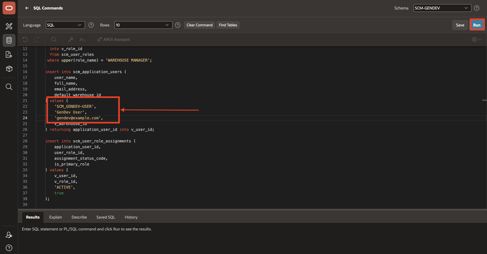

## Task 3: Run the Application

In this task, you will launch the application and validate the end-to-end procurement process. It begins with a stock shortage, continues through supplier evaluation, and ends with creation of a planned purchase order.

1. From the left navigation, select **App Builder**.

    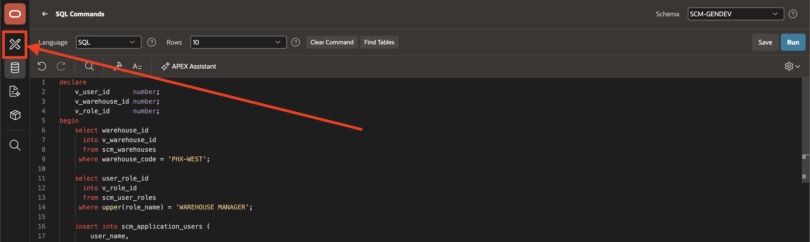

2. On the **App Builder** home page, hover over the application tile and select **Run** to launch the application.

    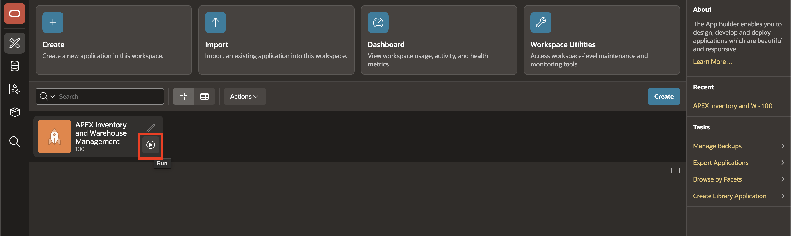

3. Sign in with the user you configured in Task 2.

    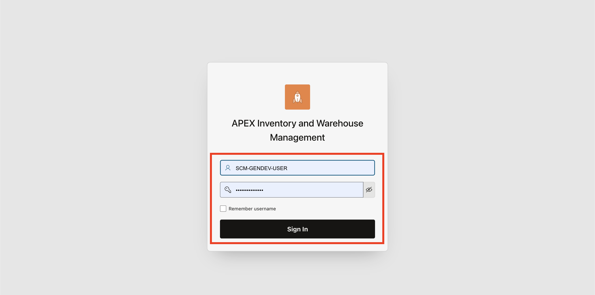

4. On the **Home Dashboard**, click **Procurement Assistant** to open the AI Assistant.

    

5. Begin the conversation with the quick message:

    ```text
    What items are low in stock?
    ```

    *Before processing your message, the agent automatically runs `get_user_context` and `get_browser_timezone` to inject your identity, warehouse, and timezone into every response. It then calls `get_stocks_at_risk` to return the items at or below their reorder point in your warehouse.*

    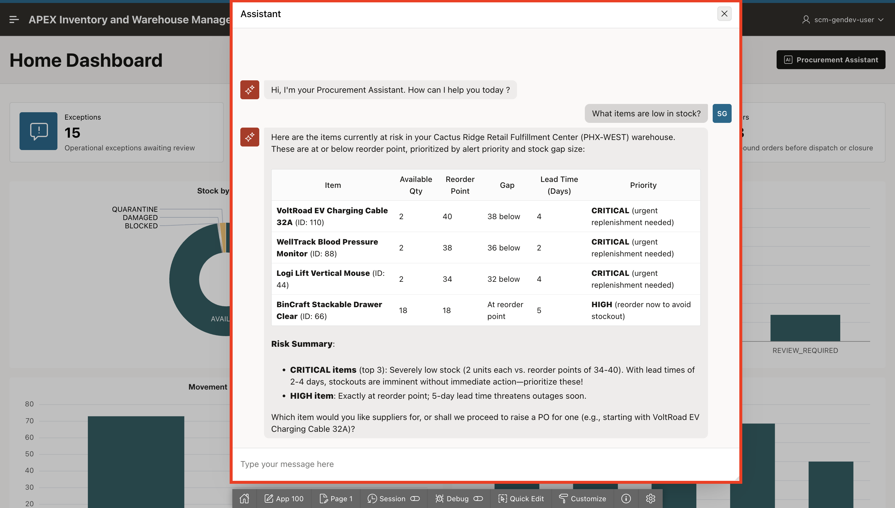

6. Ask the agent to show suppliers for the item:

    ```text
    Show me suppliers for Logi Lift Vertical Mouse.
    ```

    *Tool invoked: `get_suppliers_for_item`*

    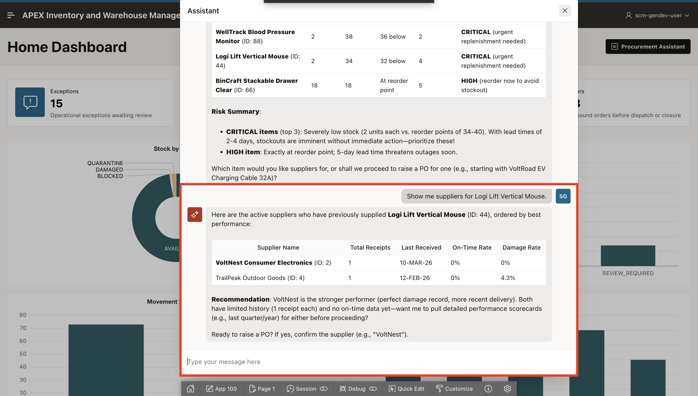

7. Request delivery performance for the supplier:

    ```text
    Show me delivery performance for VoltNest Consumer Electronics last quarter.
    ```

    *Tool invoked: `get_supplier_delivery_performance`*

    

8. Instruct the agent to raise a purchase order:

    ```text
    Yes, raise a PO.
    ```

    *Tool invoked: `show_warehouses_by_supplier` — the agent retrieves the warehouses this supplier has previously delivered to and asks you to choose one.*

    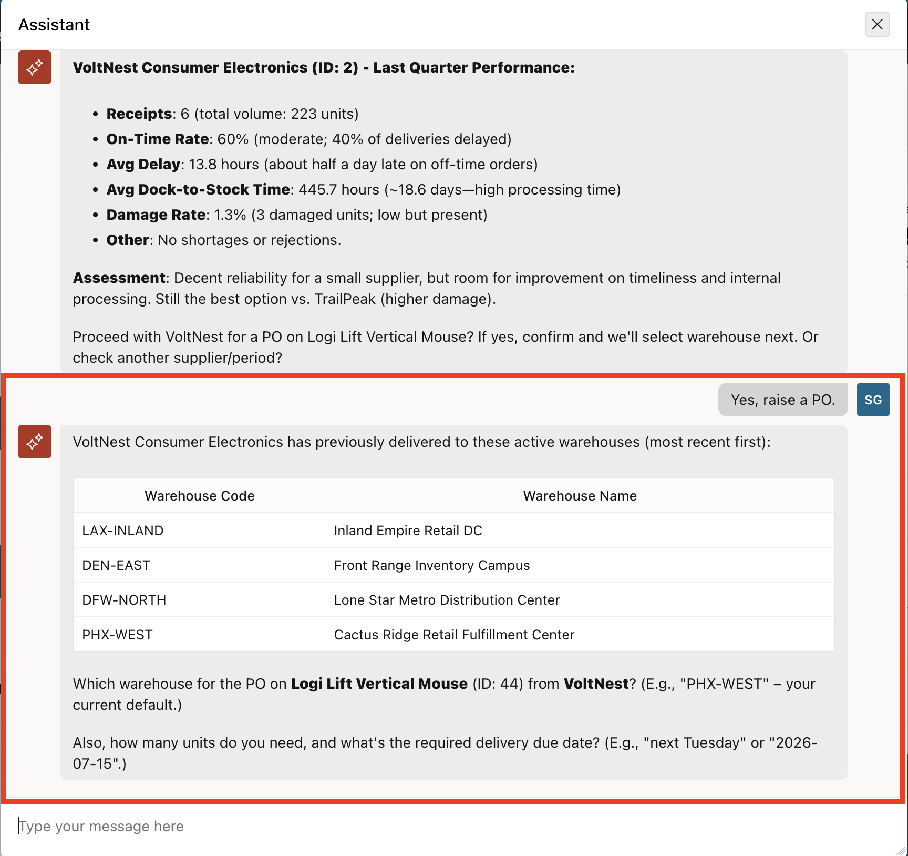

9. When the agent asks for the destination warehouse, quantity, and delivery date, reply with:

    ```text
    PHX-WEST, 50 units, deliver by 2026-06-25.
    ```

    *Tool invoked: `confirm_action` — the agent presents a summary of the purchase order and waits for your confirmation before proceeding.*

    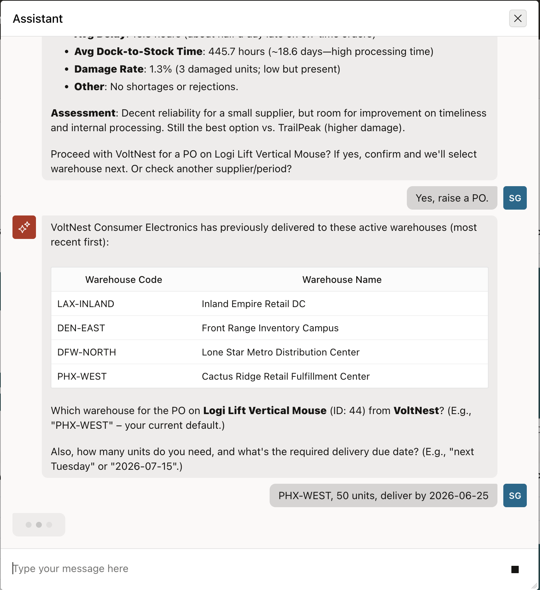

10. Confirm the browser dialog when it appears so the purchase order can be created.

    *Tool invoked: `raise_purchase_order` — the purchase order is inserted into the system.*

    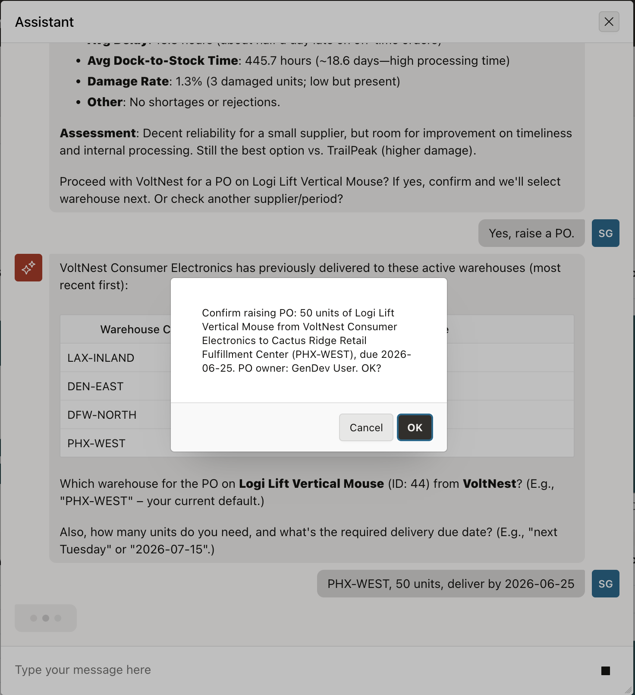

11. The agent confirms the purchase order in the chat, showing the PO number, item, quantity, supplier, warehouse, and expected delivery date. The purchase order is now a planned inbound receipt in the system.

    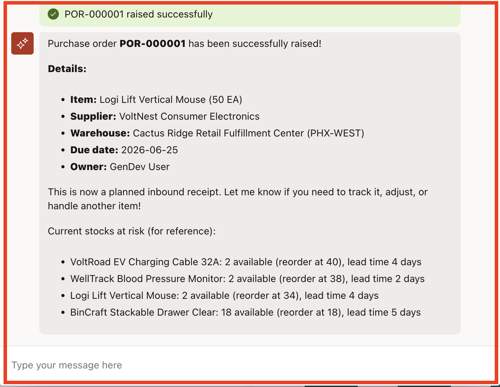

## Summary

You have completed the livelab. The Home Dashboard now launches the AI Agent from a dedicated button, and the Procurement Agent is ready to guide users through supplier evaluation and purchase order creation within a single conversation.

This is what AI Agents in Oracle APEX make possible: a user with a question can get a reasoned, data-driven answer and take a real action in the application, without leaving the page.

## Acknowledgements

- **Author** - Sahaana Manavalan, Senior Product Manager, April 2026
- **Last Updated By/Date** - Sahaana Manavalan, Senior Product Manager, April 2026
