# Add Agent to Application and Run Application

## Introduction

In this lab, you will complete the final two steps to bring the workshop together. First, you will add the **Procurement Agent** to the **Home Dashboard** by creating a button and attaching it to the AI Agent using a trigger action. Then you will run the application and walk through the complete procurement conversation: identifying low-stock items, evaluating suppliers, and raising a purchase order.

Estimated Time: 10 minutes

### Objectives

In this lab, you will:

- Add the **Procurement Agent** to the **Home Dashboard**

- Run the application and test the end-to-end procurement conversation

## Task 1: Add the Agent to the Application

In this task, you will configure the entry point that users will use to start the AI Assistant from the Operational Dashboard. You will add a button to Page 1 and attach a trigger action that opens **Procurement Agent** directly from the running application.

1. On the **Procurement Agent** page, select the **Application &lt;APP\_ID&gt;** in the breadcrumb to return to the Application home page.

    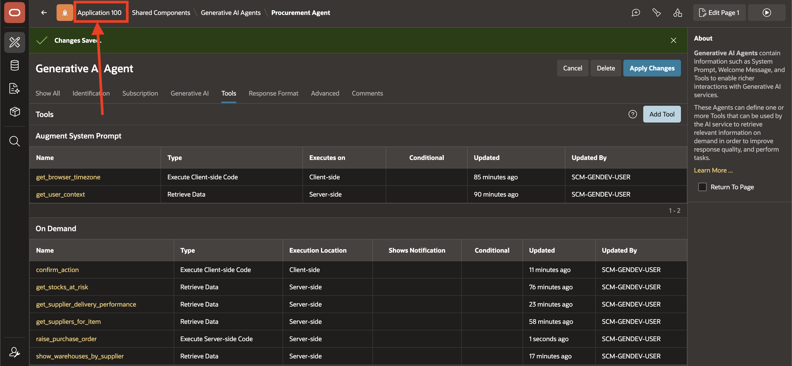

2. From the Application home page, select **Page 1 - Home Dashboard** to open it in Page Designer.

    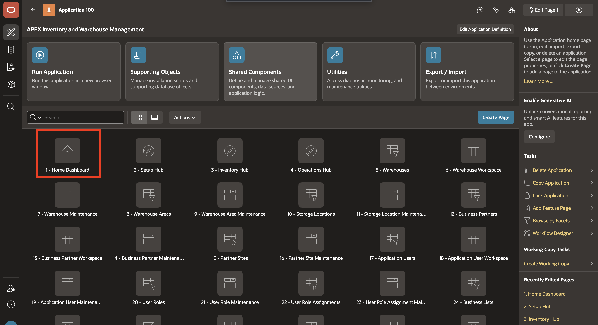

3. In **Page Designer**, under **Rendering > Breadcrumb Bar**, right-click **Breadcrumb** and select **Create Button Below**.

    

4. With the new button selected, enter/select the following in the **Property Editor**:

    - Under **Identification**:

        - Button Name: **PROCUREMENT_ASSISTANT**

    - Under **Layout**:

        - Region: **Breadcrumb**
        - Slot: **Next**

    - Under **Appearance**:

        - Button Template: **Text with Icon**
        - Hot: **Toggle ON**
        - Icon: **fa-ai-square**

    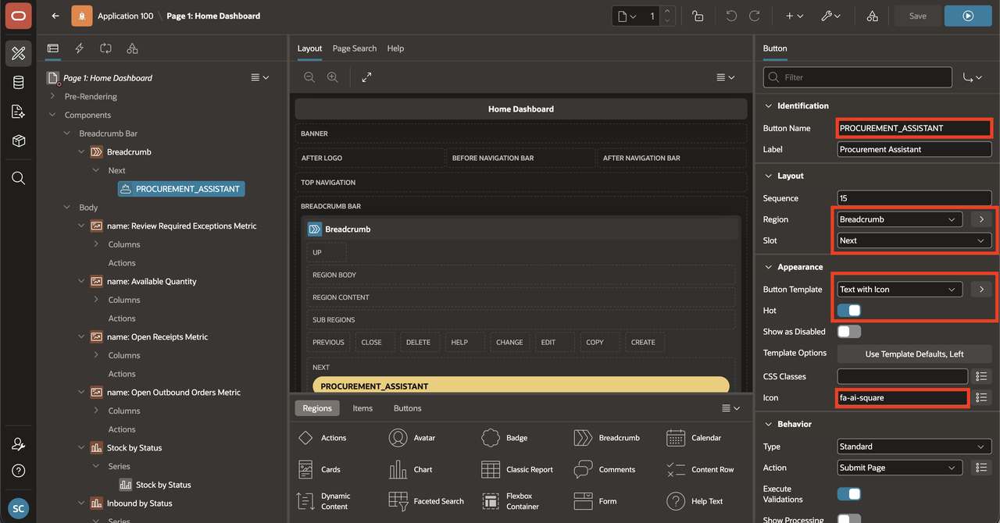

5. In the Rendering tree, **right-click** on the newly created **PROCUREMENT_ASSISTANT** button and select **Create Trigger Action**.

    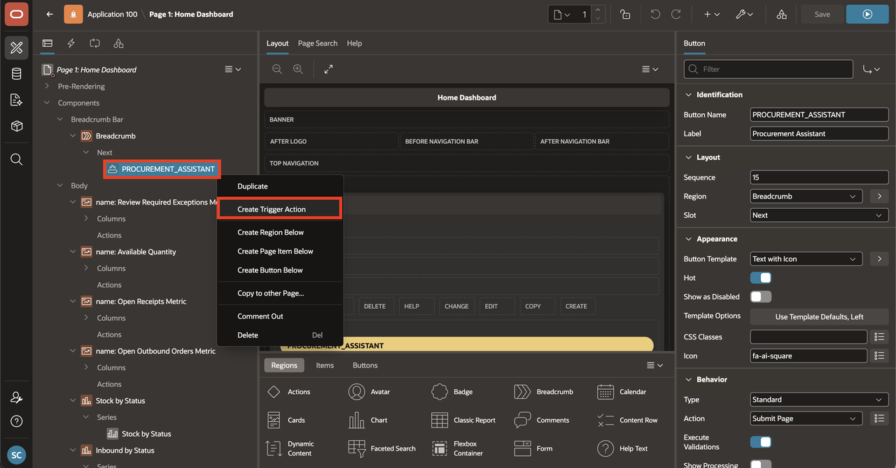

6. With the new trigger action selected, enter/select the following in the **Property Editor**:

    - Under **Identification**:

        - Action: **Show AI Assistant**

    - Under **Generative AI**:

        - Agent: **Procurement Agent**

    - Under **Quick Actions**:

        - Message 1: **What items are low in stock?**

    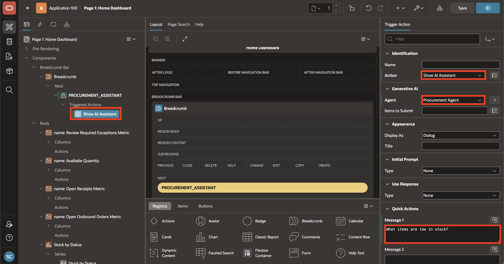

7. Click the **Save & Run** icon to save your changes and launch the application.

    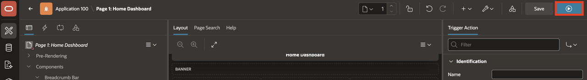

## Task 2: Run the Application

In this task, you will launch the application and validate the end-to-end procurement process. It begins with a stock shortage, continues through supplier evaluation, and ends with creation of a planned purchase order.

> **Note:** The agent's responses and screenshots shown are for reference only. Response format and wording may differ between sessions, as large language models are non-deterministic by nature.

1. Sign in with your APEX workspace credentials.

    

2. On the **Home Dashboard**, click **Procurement Assistant** to open the AI Assistant.

    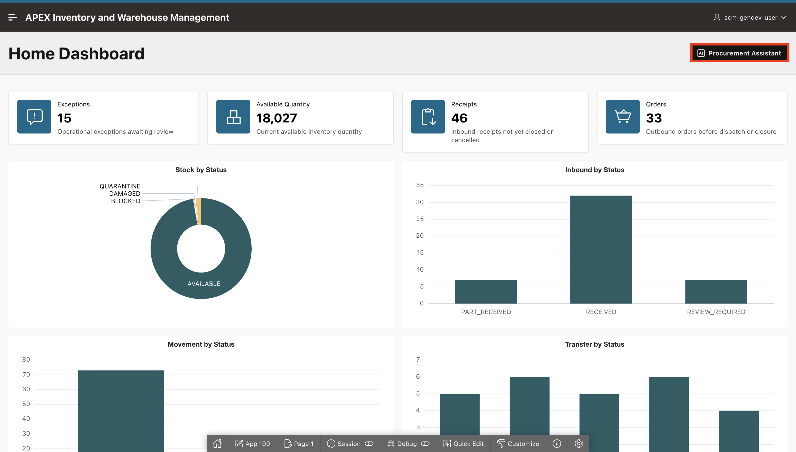

3. Begin the conversation with the quick message:

    ```text
    <copy>
    What items are low in stock?
    </copy>
    ```

    *Before processing your message, the agent automatically runs `get_user_context` and `get_browser_timezone` to inject your identity, warehouse, and timezone into every response. It then calls `get_stocks_at_risk` to return the items at or below their reorder point in your warehouse.*

    

4. Ask the agent to show suppliers for the item:

    ```text
    <copy>
    Show me suppliers for Logi Lift Vertical Mouse.
    </copy>
    ```

    *Tool invoked: `get_suppliers_for_item`*

    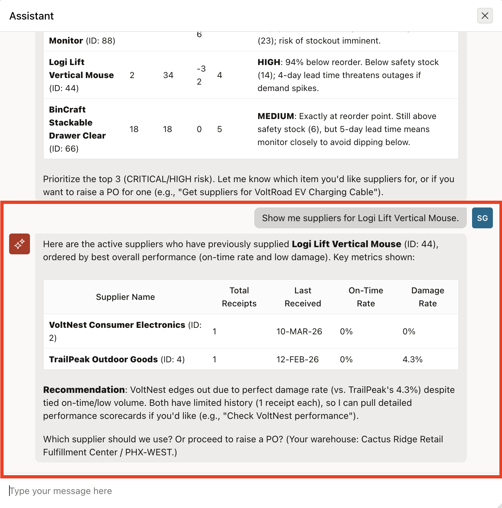

5. Request delivery performance for the supplier:

    ```text
    <copy>
    Show me delivery performance for VoltNest Consumer Electronics last quarter.
    </copy>
    ```

    *Tool invoked: `get_supplier_delivery_performance`*

    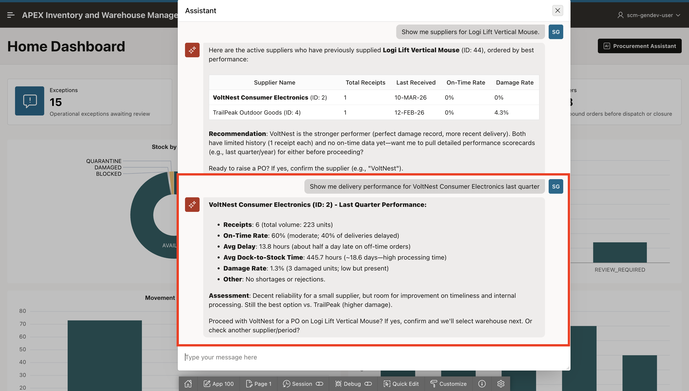

6. Instruct the agent to raise a purchase order:

    ```text
    <copy>
    Yes, raise a PO.
    </copy>
    ```

    *Tool invoked: `show_warehouses_by_supplier`. The agent retrieves the warehouses this supplier has previously delivered to and asks you to choose one.*

    

7. When the agent asks for the destination warehouse, quantity, and delivery date, reply with:

    ```text
    <copy>
    PHX-WEST, 50 units, deliver by 2026-06-25.
    </copy>
    ```

    *Tool invoked: `confirm_action`. The agent presents a summary of the purchase order and waits for your confirmation before proceeding.*

    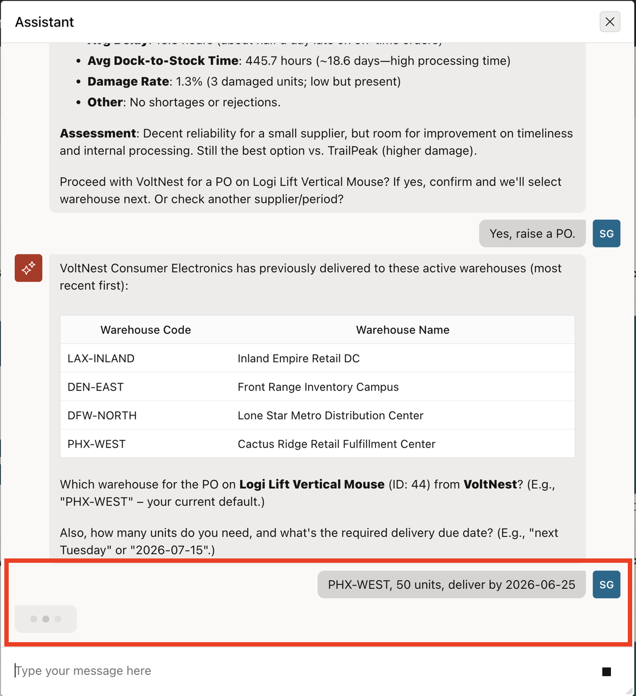

8. Confirm the browser dialog when it appears so the purchase order can be created.

    *Tool invoked: `raise_purchase_order`. The purchase order is inserted into the system.*

    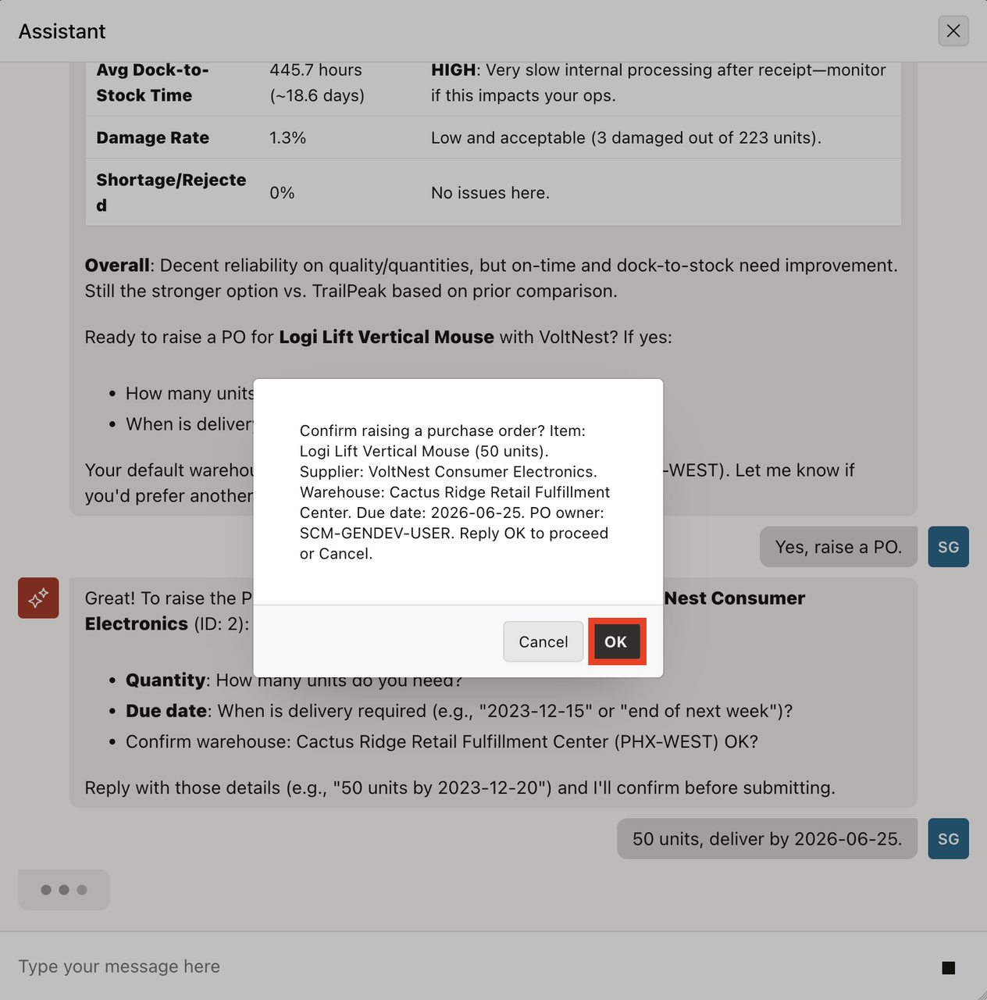

9. The agent confirms the purchase order in the chat, showing the PO number, item, quantity, supplier, warehouse, and expected delivery date. The purchase order is now a planned inbound receipt in the system.

    

## Summary

You have completed this LiveLab. The Home Dashboard now has a dedicated entry point for the Procurement Agent, and users can identify low stocks, evaluate suppliers, and raise a purchase order through a single guided conversation in Oracle APEX.

## Acknowledgements

- **Author** - Sahaana Manavalan, Senior Product Manager, April 2026
- **Last Updated By/Date** - Sahaana Manavalan, Senior Product Manager, May 2026
