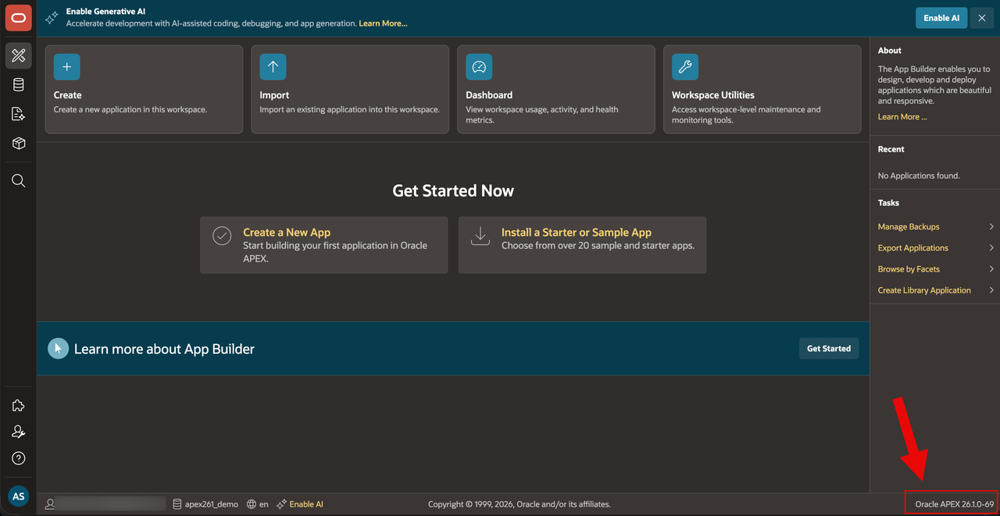
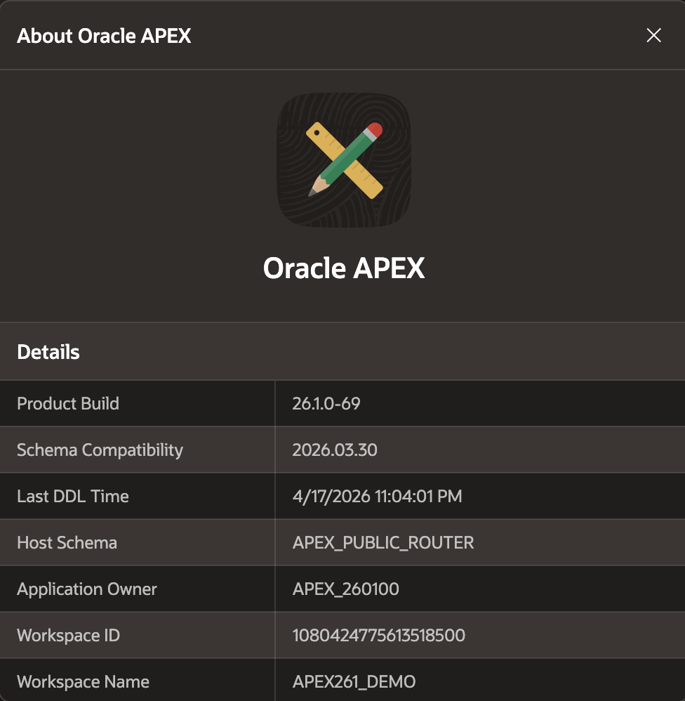
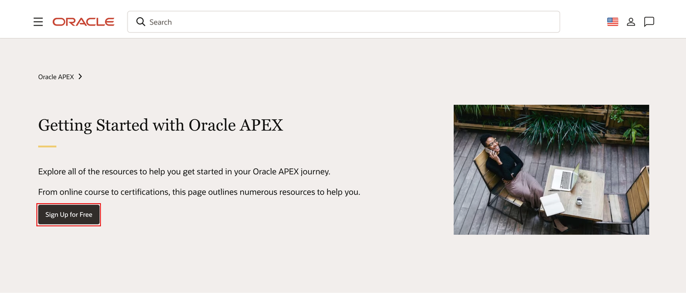
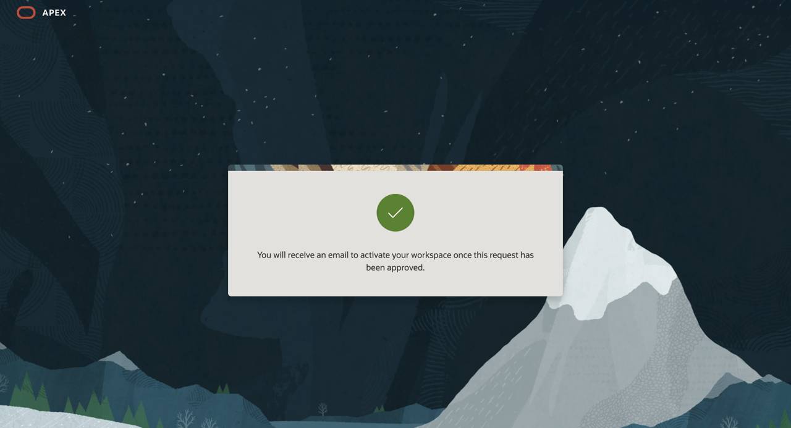
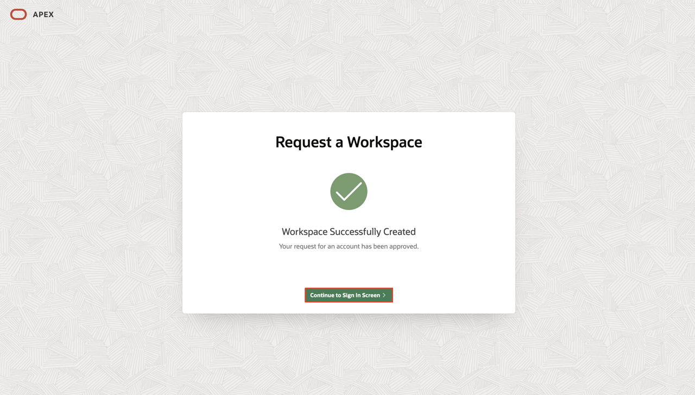
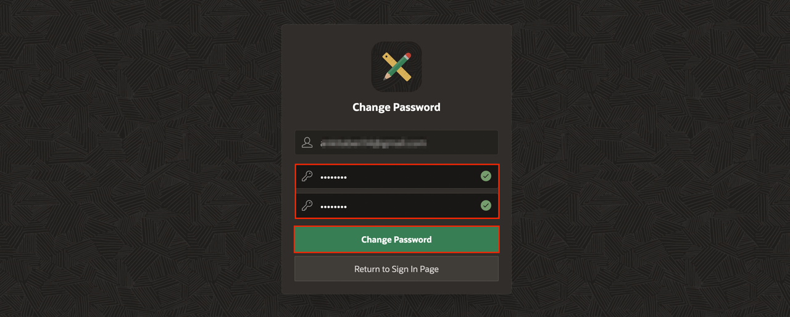

# Provision an APEX Workspace

## Introduction

Oracle APEX is an enterprise AI application platform for building secure, scalable web and mobile applications. Trusted by thousands of organizations, APEX powers systems that run core business operations every day. With Oracle AI Database and Oracle Cloud Infrastructure, every application inherits built-in reliability, governance, and security. APEX helps developers turn ideas into production-ready apps quickly, without sacrificing control or performance. To start this workshop, you will request a free workspace on oracleapex.com.

If you already have an APEX 26.1 workspace provisioned, you can skip this lab.

Estimated Time: 5 minutes
<!--
Watch the video below for a quick walk through of the lab.

-->

### What is an APEX Workspace?

An APEX Workspace is a logical domain where you define APEX applications. Each workspace is associated with one or more database schemas (database users) which are used to store the database objects, such as tables, views, packages, and more. APEX applications are built on top of these database objects.

### How Do I Find My APEX Release Version?

To determine which release of Oracle APEX you are currently running, do one of the following:

- View the release number on the Workspace home page:

  - Sign in to Oracle APEX. The workspace home page appears. The current release version is displayed in the bottom right corner.

    

    

- View the about APEX page:

  - Sign in to Oracle APEX. The workspace home page appears.

  - Click the help menu at the bottom-left of the page and select **About**. The about APEX page appears.

    

### Objectives

- Learn how to request a free workspace on oracleapex.com

### Prerequisites

- A valid email address to request and activate the workspace.

Use the steps below to request a free workspace on oracleapex.com.

## Option 1: oracleapex.com

Signing up for apex.oracle.com is simply a matter of providing details on the workspace you wish to create and then waiting for the approval email.

1. Go to [oracleapex.com](https://oracleapex.com/).

2. Click **Get Started**.

    

3. Under Getting Started with Oracle APEX, click **Sign Up for Free**.

    

4. On the **Request a Workspace** page, enter your identification details – **First Name, Last Name, Email, Workspace name**.

    *Note: For workspace, enter a unique name, such as first initial and last name.*

    Click **Request Workspace**.

    

    

5. Check your email. You should get an email from Oracle APEX within a few minutes.

    *Note: If you don’t get an email go back to Step 3 and make sure to enter your email correctly.*

    Within the email body, click **Create Workspace**.

    

6. Click **Continue to Sign In Screen**.

    

7. Enter your password, and click **Change Password**.

    

8. You should now be in the APEX Builder.

    

## Summary

At this point, you know how to create an APEX Workspace and you are ready to start building amazing apps, fast.

You may now proceed to the next lab.

## Acknowledgements

- **Author** -  Apoorva Srinivas, Principal Product Manager
- **Last Updated By/Date**: Apoorva Srinivas, Principal Product Manager, May 2026
