# Import the Data Model, Sample Data, and Base Application

## Introduction

Before you can build the AI Agent, the workspace needs a schema, sample data, and a base application to work from.

In this lab, you will load two SQL scripts, one that creates the warehouse tables and one that populates them with sample data, then import the SCM application export and connect a Generative AI Service. Once this lab is complete, the workspace is ready for you to add agent tools in the following labs.

Estimated Time: 10 minutes

### Objectives

In this lab, you will:

- Set up the SCM data model

- Load the Sample Data

- Import the SCM application for the workshop

- Add a workspace-level Generative AI Service and assign it to the application

## Task 1: Set Up the Data Model

In this task, you will upload and run the data model script. This creates the warehouse tables that the AI Agent tools will query in the later labs.

1. Sign in to your Oracle APEX workspace using the credentials provided for this workshop.

    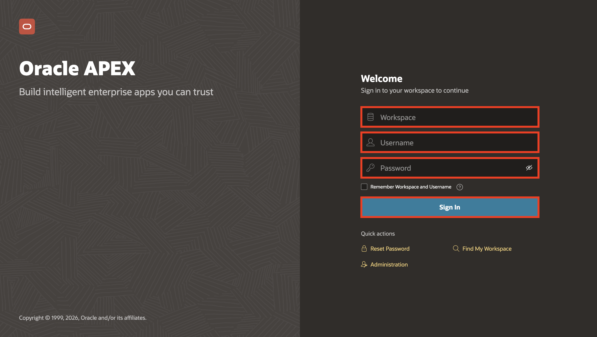

2. From the Oracle APEX Home page, select **SQL Workshop**.

    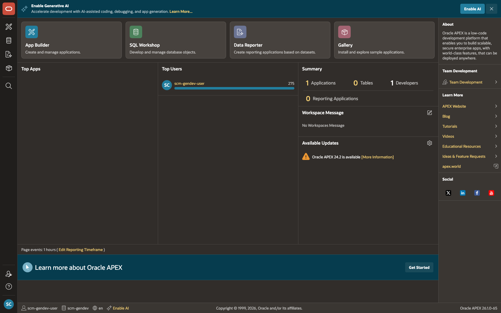

3. From the **SQL Workshop** page, select **SQL Scripts**.

    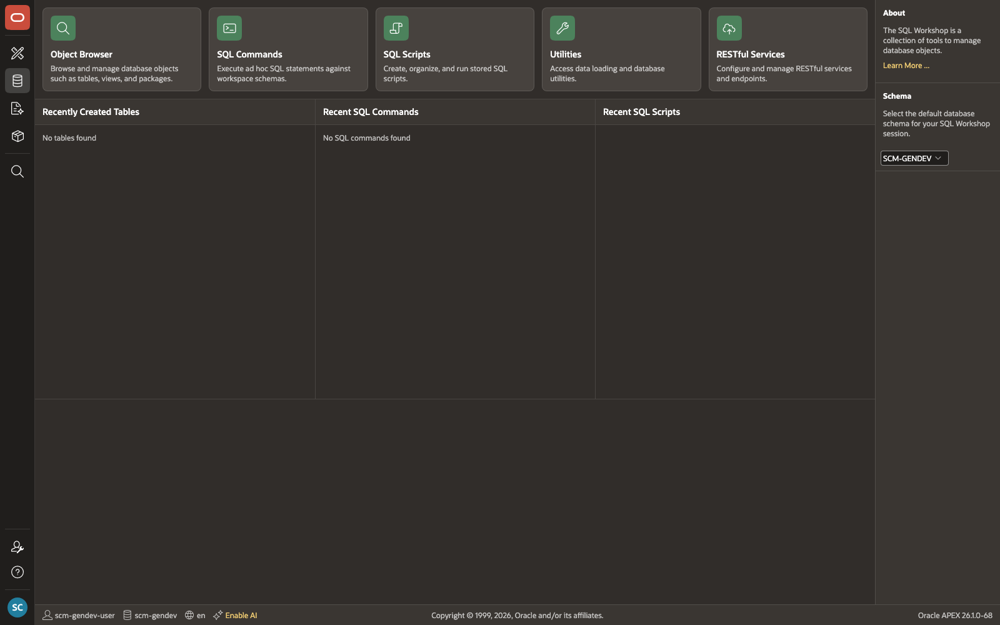

4. Select **Upload**.

    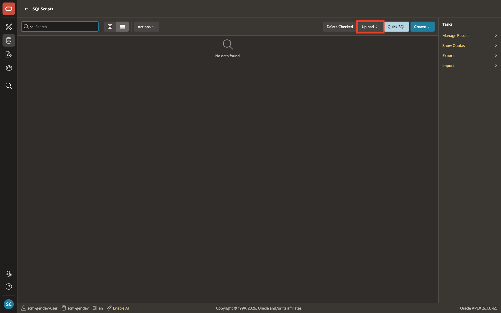

5. Download the [01\_SCM\_INV\_WMS\_DATAMODEL.sql](./files/01_SCM_INV_WMS_DATAMODEL.sql) file to your local machine.

6. In the **Upload Script** dialog, select the downloaded file, enter **`scm_data_model`** for **Script Name**, and select **Upload**.

    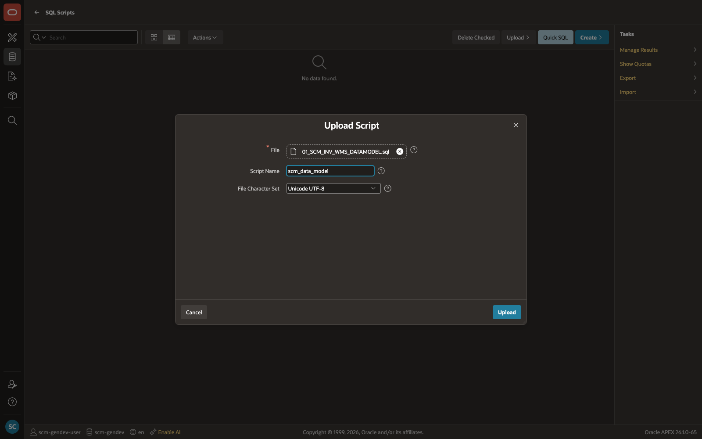

7. In the row for **`scm_data_model`**, select **Run**.

    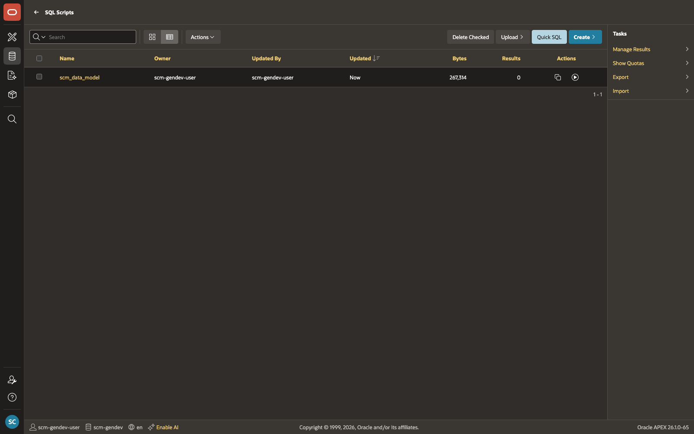

8. On the confirmation page, select **Run**.

    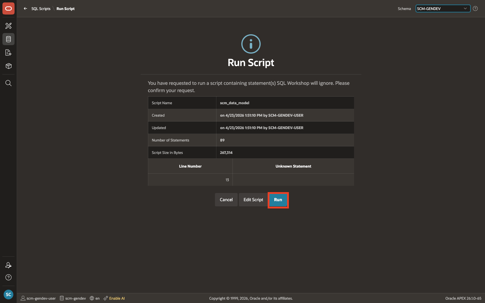

9. Verify that the script completes successfully and that the following tables are created:

    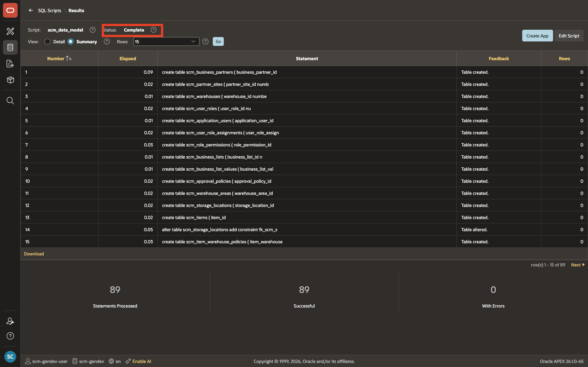

    | Table | Purpose |
    | --- | --- |
    | `scm_warehouses` | Warehouse master data |
    | `scm_user_roles` | Role definitions and authority levels |
    | `scm_application_users` | Application users and manager relationships |
    | `scm_user_role_assignments` | Primary and secondary role assignments |
    | `scm_warehouse_areas` | Warehouse zones such as storage and picking |
    | `scm_storage_locations` | Physical storage and pick locations |
    | `scm_items` | Inventory items |
    | `scm_item_warehouse_policies` | Reorder points, safety stock, and lead times per item per warehouse |
    | `scm_inventory_balances` | Available stock quantities per location |
    | `scm_replenishment_alerts` | Low-stock and out-of-stock alerts |
    | `scm_business_partners` | Supplier master data |
    | `scm_partner_sites` | Supplier site details |
    | `scm_inbound_receipts` | Supplier delivery headers |
    | `scm_inbound_receipt_lines` | Delivery line items and quality data |
    | `scm_operational_tasks` | Replenishment orders raised by the agent |
    {: title="Database Tables"}

## Task 2: Load the Sample Data

In this task, you will load the sample data that drives the procurement process. This includes the warehouse, users, items, and the CRITICAL replenishment alert that the agent will work through in Lab 4.

1. Select **SQL Scripts**.

    

2. Select **Upload**.

    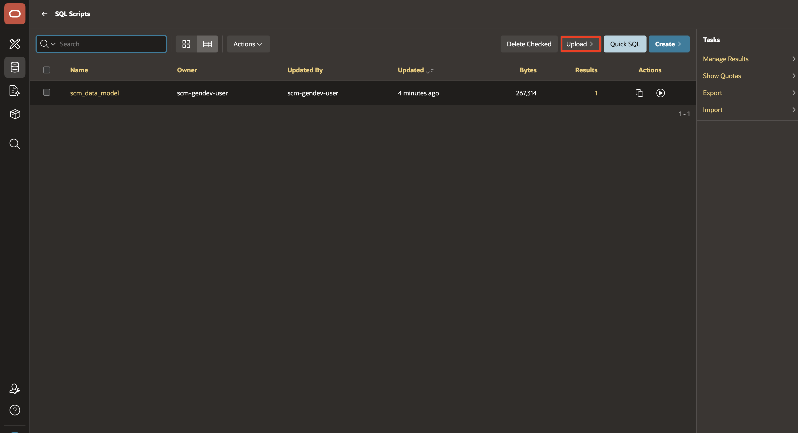

3. Download the [02\_SCM\_INV\_WMS\_SAMPLE\_DATALOAD.sql](./files/02_SCM_INV_WMS_SAMPLE_DATALOAD.sql) file to your local machine.

4. In the **Upload Script** dialog, select the downloaded file, enter **`scm_sample_data`** for **Script Name**, and select **Upload**.

    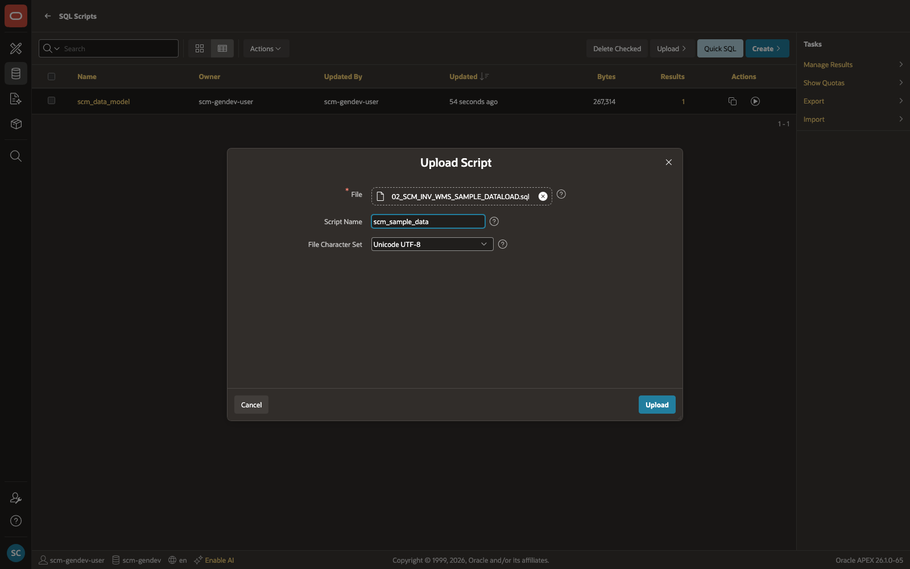

5. In the row for **`scm_sample_data`**, select **Run**.

    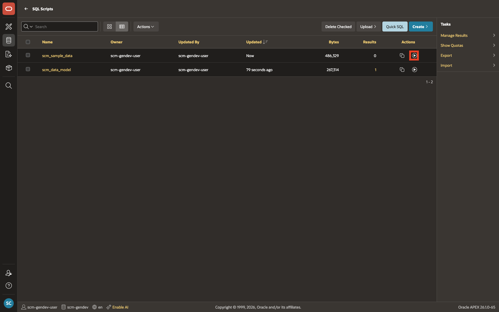

6. On the confirmation page, select **Run**.

    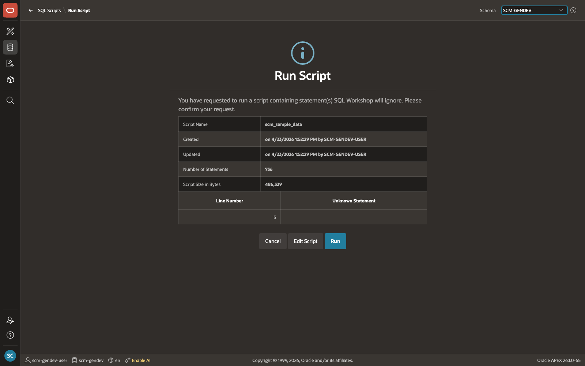

7. Verify that the script completes successfully. The sample data includes the following:

    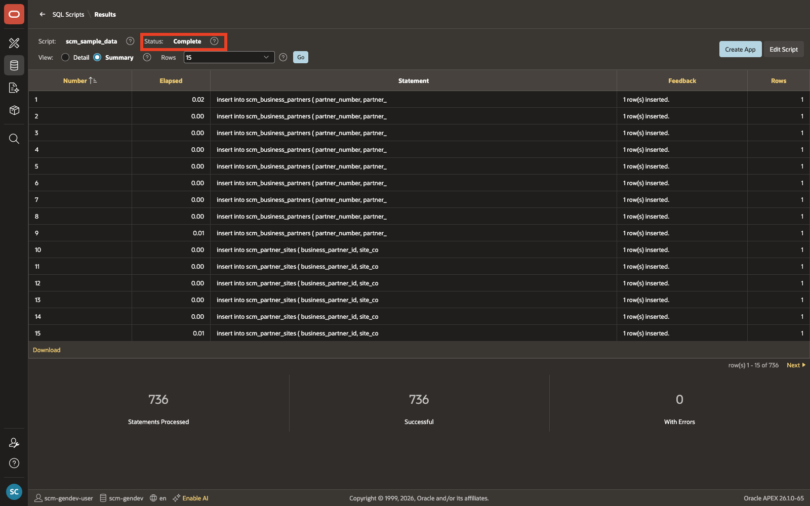

    | Data | Details |
    | --- | --- |
    | Warehouse | Central Distribution Warehouse (`WH-CDW`) |
    | Roles | Warehouse Manager, Warehouse Operative, Head of Supply Chain |
    | Users | John Carter, Jane Smith, Sahaana, Samanava, Tom Wilson |
    | Locations | `A-01-B` reserve storage and `P-12` pick face |
    | Items | SKU-4821, SKU-1130, SKU-2045 |
    | Alerts | 1 CRITICAL alert and 1 MEDIUM alert |
    {: title="Sample Data Summary"}

## Task 3: Import the SCM Application

In this task, you will import the base APEX application. It already contains the page layout and shared components, so you can focus entirely on building the AI Agent in the following labs rather than setting up pages from scratch.

1. From the left navigation, select **App Builder**.

    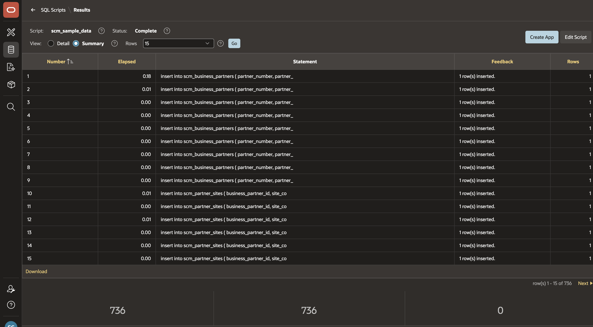

2. From the **App Builder** page, select **Import**.

    

3. Download the [SCM\_App.sql](./files/SCM_App.sql) file to your local machine.

4. In the import wizard, select the downloaded file to upload, then click **Next**.

    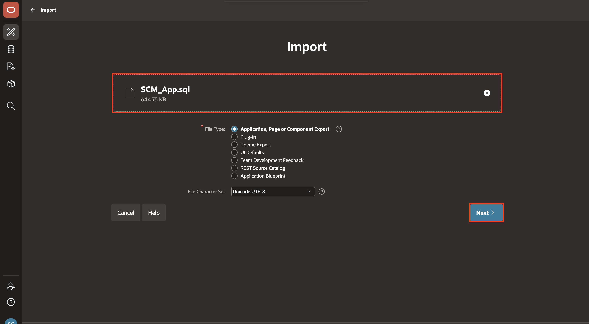

5. Review the import details and select **Import Application**.

    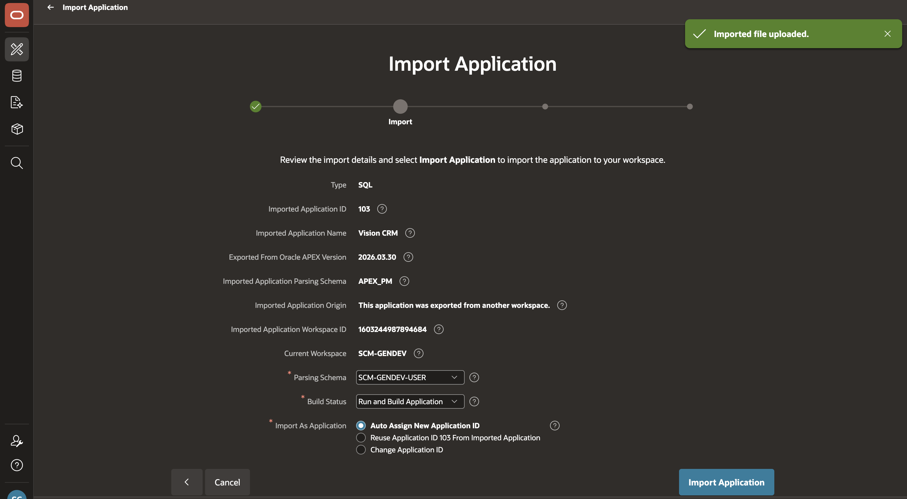

6. After the import completes, verify that the import finishes successfully and that the application is now available in **App Builder**.

    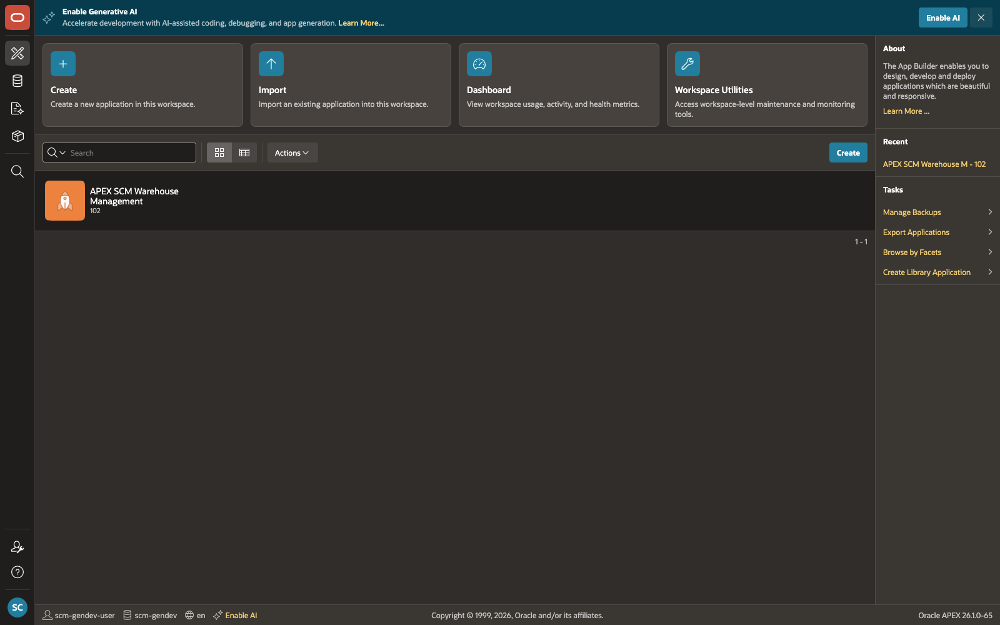

## Task 4: Configure Generative AI Service

In this task, you will configure OCI Generative AI as a service in your APEX workspace and assign it to the imported SCM application. This wires up the LLM backend that the AI Agent will use to process natural language queries later in the workshop.

1. From **App Builder**, select **Workspace Utilities**.

    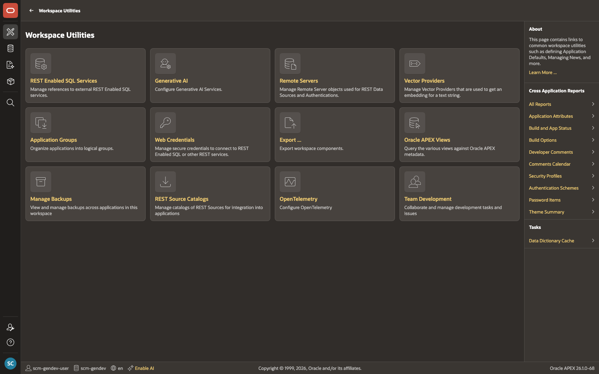

2. From **Workspace Utilities**, select **Generative AI**.

    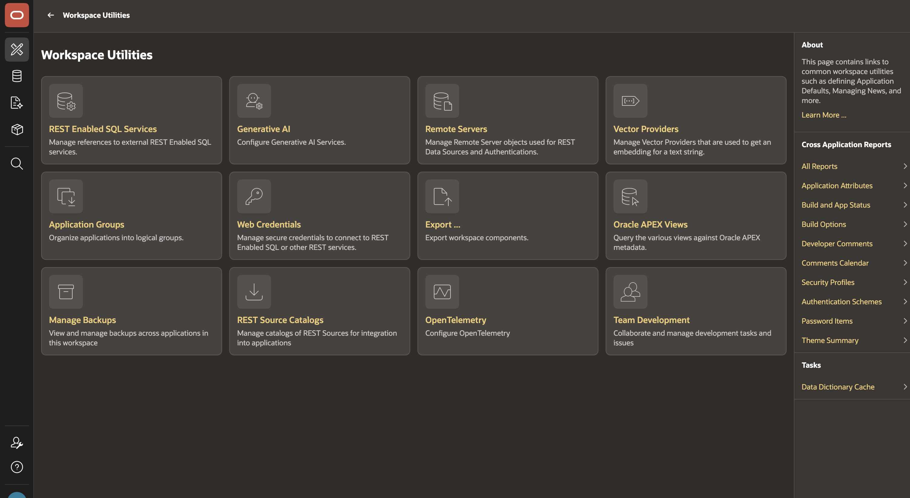

3. Select **Create**. On the **Create Generative AI Service** page, enter/select the following values for the workshop OCI setup:

    > **Note:** This workshop uses OCI Generative AI Service as the AI provider. However, Oracle APEX supports multiple Generative AI providers, including OpenAI, Azure OpenAI Service, Google Gemini, and Cohere, among others. You are not required to use OCI Generative AI; you may configure any supported provider that is available in your environment.

    - AI Provider: **OCI Generative AI Service**
    - Name: **OCI Gen AI**
    - Static ID: **oci\_gen\_ai**
    - Compartment ID: Enter your OCI Compartment ID. If you saved an OCI configuration file in Task 1 and you only have one compartment, you can reuse the compartment OCID from that file.
    - Region: **us-chicago-1**
    - Model ID: **meta.llama-3.3-70b-instruct**
    - Used by App Builder: **On**
    - Base URL: Leave the auto-generated value unchanged.
    - Credential: Select an existing OCI credential if one is already available in your workspace. Otherwise create a new OCI credential.

    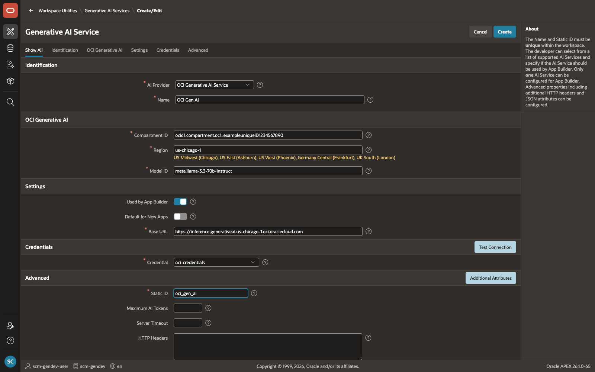

4. Select **Create**.

5. Verify that the new **OCI Gen AI** service appears in the **Generative AI Services** list.

    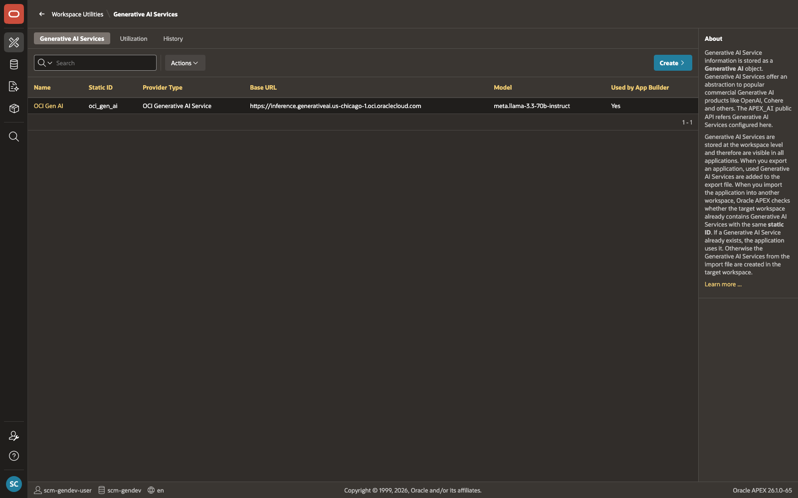

6. From the **Generative AI Services** page, select the **App Builder** icon in the left navigation.

    

7. Select the imported SCM application from the App Builder applications list.

    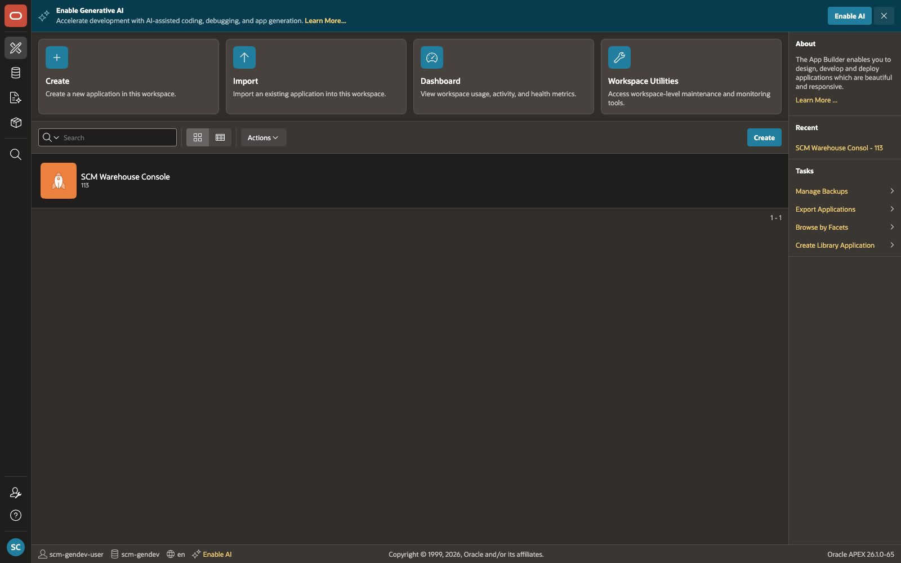

8. On the application home page, select **Shared Components**.

    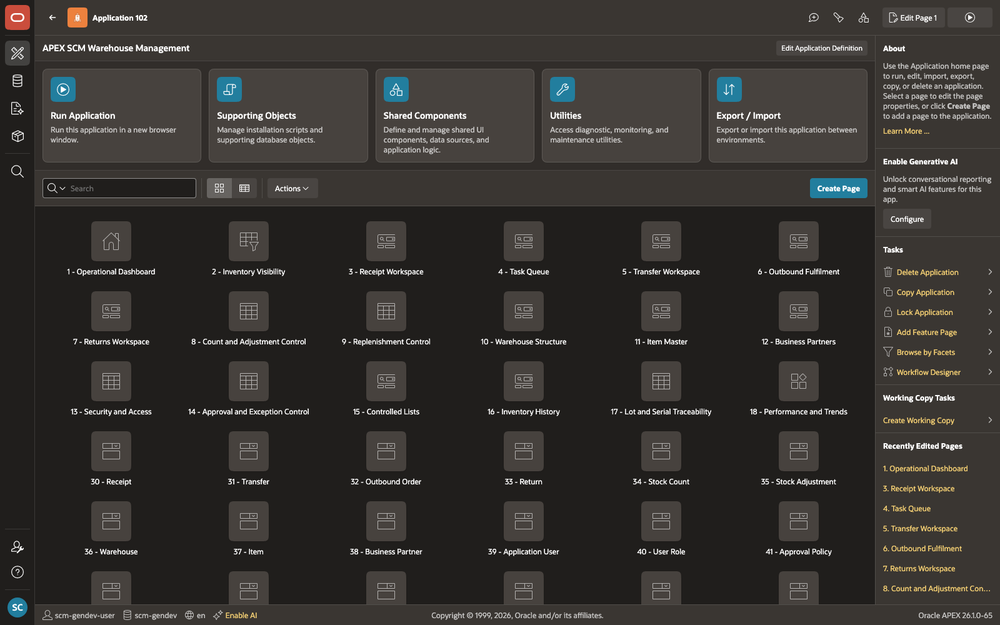

9. From **Shared Components**, select **AI Attributes**.

    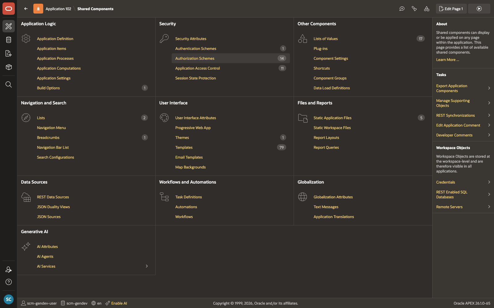

10. For **Generative AI Service**, select **OCI Gen AI**, then select **Apply Changes**.

    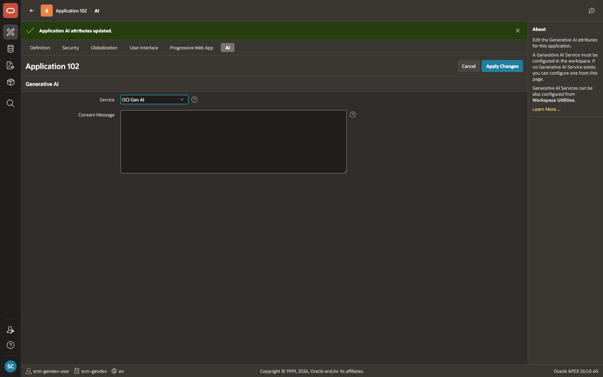

## Summary

The warehouse schema, sample data, sample application, and Generative AI service are now in place. You are ready to create the AI Agent and start adding tools in the next lab.

## Acknowledgements

- **Author** - Sahaana Manavalan, Senior Product Manager, April 2026
- **Last Updated By/Date** - Sahaana Manavalan, Senior Product Manager, April 2026
