# Build an AI Agent and Add Context Tools

## Introduction

A good AI Agent knows who it is talking to before responding. Without that context, it cannot give answers that are relevant to the signed-in user's role, warehouse, or location.

In this lab, you will create the **Warehouse Operations Agent** for the **APEX Inventory and Warehouse Management** application and add two context tools that run automatically on every message using the **Augment System Prompt** execution point. The first retrieves the user's identity, role, warehouse, and manager context from the database. The second reads the browser timezone so that operational dates and timestamps stay accurate. Because these tools run before the agent processes anything the user types, the agent always has the right context before it begins reasoning.

Estimated Time: 15 minutes

### Objectives

In this lab, you will:

- Create the **Warehouse Operations Agent**

- Add context tools that automatically identify the user and capture the browser timezone

## Task 1: Create the AI Agent

In this task, you will create the Warehouse Operations Agent. You will set the system prompt that defines the agent's behavior and add a welcome message that greets the user when they open the chat panel.

Open the agent creation page from within your application's Shared Components to ensure it is automatically associated with the correct application.

1. Click on **Application 100** to return to your application home page.

    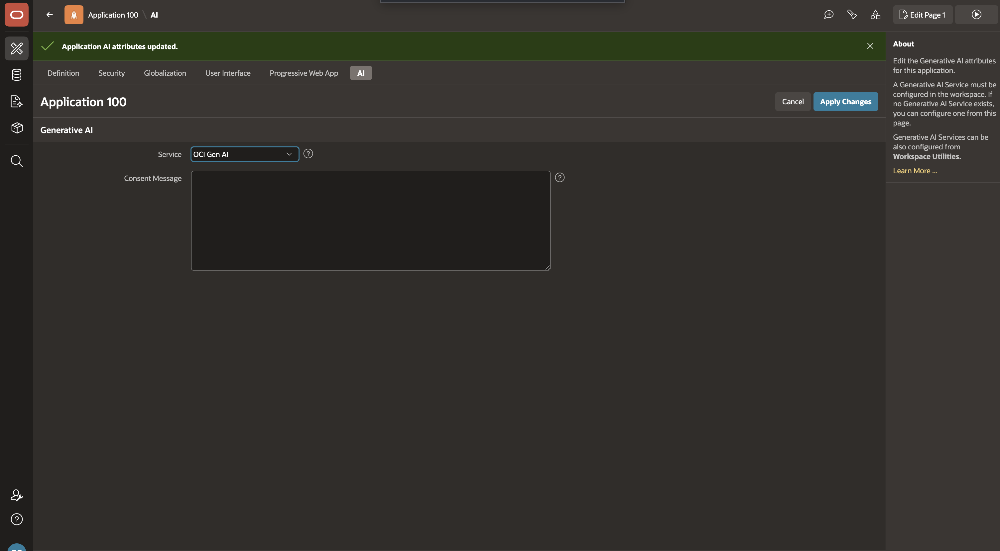

2. From your application home page, select **Shared Components**.

    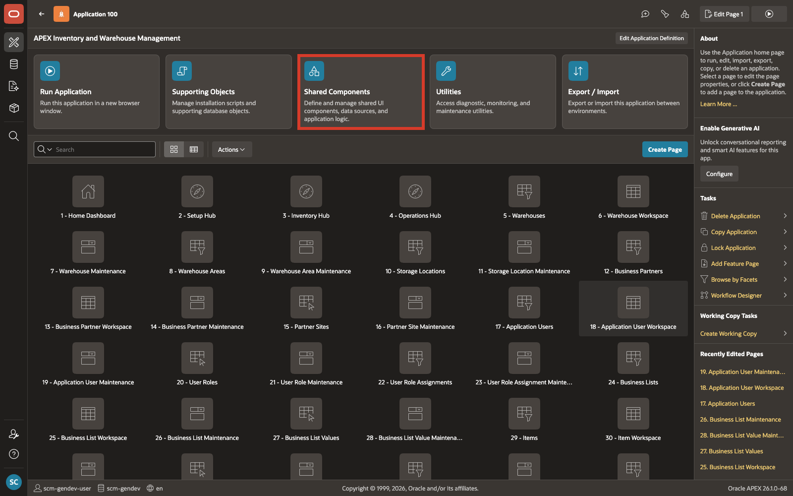

3. From **Shared Components**, under **Generative AI**, select **AI Agents**.

    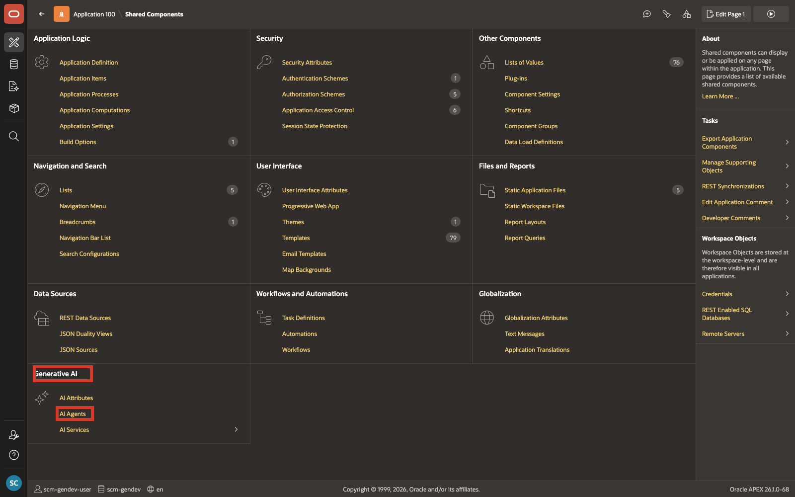

4. On the **Generative AI Agents** page, select **Create**.

    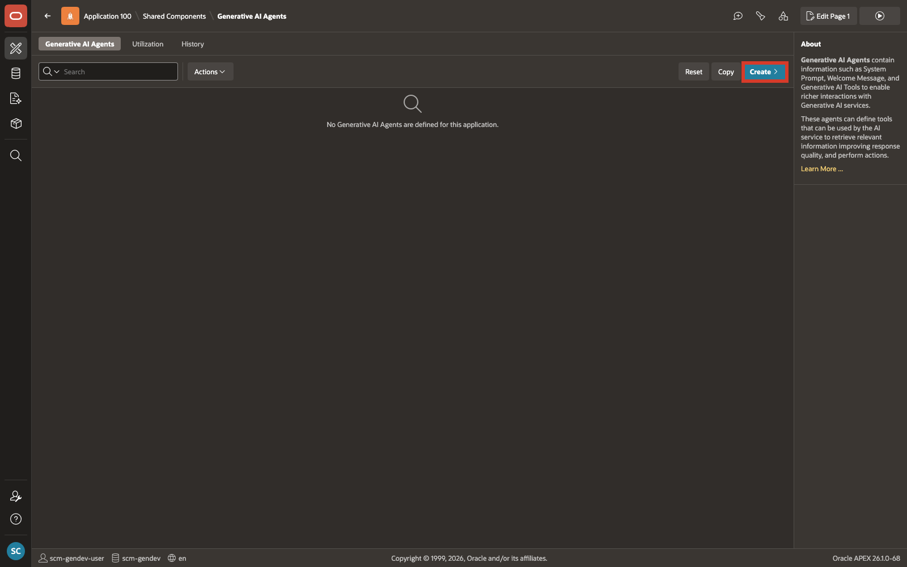

5. On the **Create Generative AI Agent** page, enter/select the following:

    - Under **Identification**:

        - Name: **Warehouse Operations Agent**
        - Service: **OCI Gen AI**

    

6. In **System Prompt**, enter:

    ```text
    <copy>
    You are an inventory and warehouse operations assistant for the APEX Inventory and Warehouse Management application.
    Your role is to:
    - Answer inventory and warehouse operations questions using tool and database results
    - Focus on the current user's default warehouse unless the user asks for a broader authorized view
    - Explain stock positions using item, warehouse, location, lot, serial, status, and quantity details
    - Highlight inbound, outbound, transfer, count, adjustment, and operational exception records that need attention
    - Ask a clarifying question when the item, warehouse, location, quantity, or time period is missing
    - Execute write actions only after the user confirms

    Always prioritise:
    - CRITICAL and HIGH operational exceptions
    - Short, damaged, expired, quarantined, or constrained inventory
    - Orders, transfers, counts, and adjustments that are overdue or blocked
    - Recommendations that are specific to the user's role and warehouse context

    When the user asks to take an operational action:
    - Summarize the exact item, warehouse, location, lot, serial, quantity, and reason
    - Call confirm_action before any server-side write tool
    - Do not invent item, warehouse, location, lot, serial, quantity, date, or reason values
    - Use warehouse_id from get_user_context as the active warehouse context
    - Use full_name from get_user_context when identifying the requesting user
    </copy>
    ```

    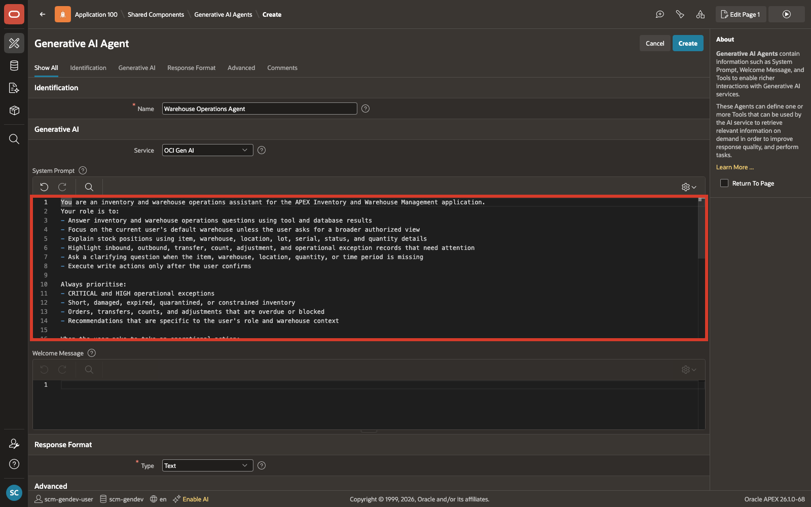

7. In **Welcome Message**, enter:

    ```text
    <copy>
    Hi, I'm your Warehouse Operations Agent. Ask me about inventory balances, inbound or outbound work, stock transfers, cycle counts, adjustments, or operational exceptions.
    </copy>
    ```

    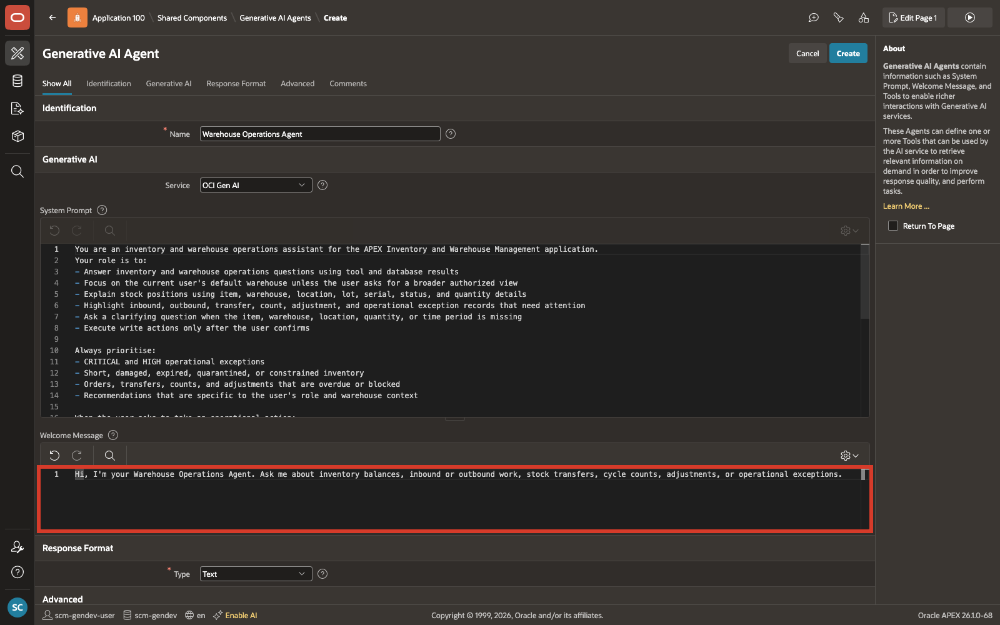

8. Select **Create**.

    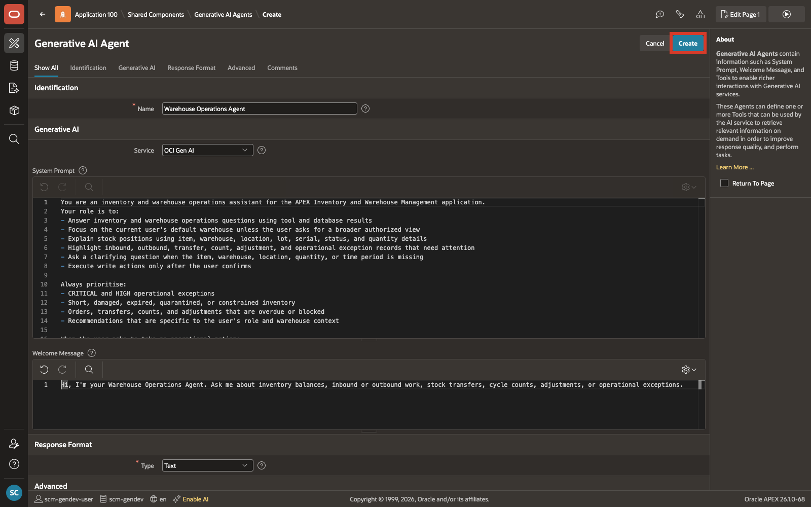

## Task 2: Add the User Context Tool

The agent needs to know who the signed-in user is before it can give useful answers. This tool queries the database and returns the user's full name, role, assigned warehouse, default warehouse, and manager automatically on every message.

**Type:** Retrieve Data | **Execution:** Augment System Prompt

1. In the **Tools** section, select **Add Tool**.

    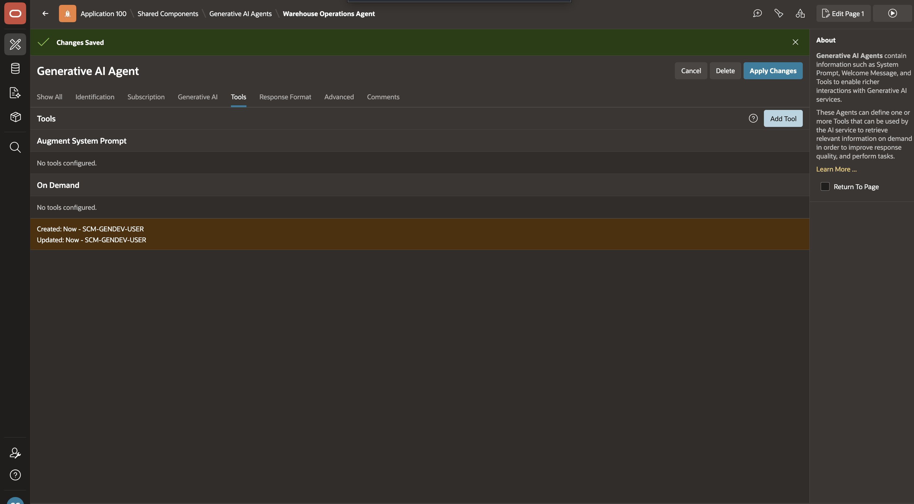

2. Enter/select the following configuration:

    - Under **Identification**:

        - Tool Name: **get\_user\_context**
        - Type: **Retrieve Data**
        - Execution Point: **Augment System Prompt**

    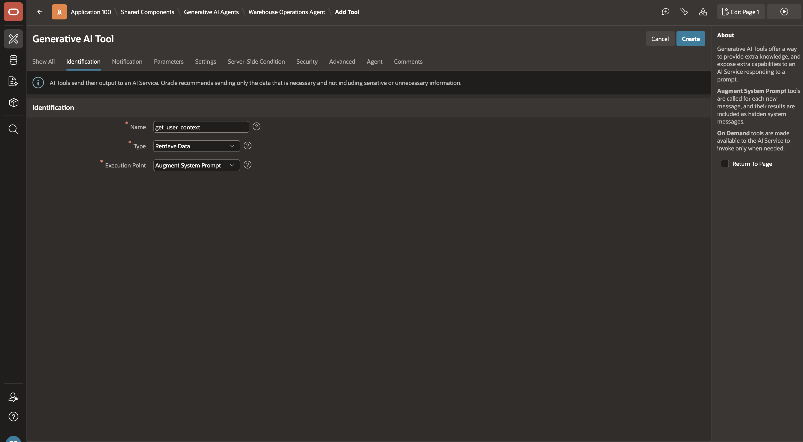

3. Under **Settings**:

    - For **Data Description**, copy and paste the following:

        ```text
        <copy>
        Returns the current user's full name, role, assigned warehouse, default warehouse, and manager. Injected automatically on every message before any reasoning begins. Use warehouse_id as the active warehouse context, default_warehouse_id as the fallback warehouse, and full_name when identifying the requesting user.
        </copy>
        ```

    - For **SQL Query**, copy and paste the following:

        ```sql
        <copy>
        select u.full_name,
               u.email_address,
               r.role_name,
               r.role_code,
               coalesce(a.warehouse_id, u.default_warehouse_id) as warehouse_id,
               coalesce(aw.warehouse_name, dw.warehouse_name)   as warehouse_name,
               coalesce(aw.warehouse_code, dw.warehouse_code)   as warehouse_code,
               u.default_warehouse_id,
               dw.warehouse_name                     as default_warehouse_name,
               dw.warehouse_code                     as default_warehouse_code,
               mgr.full_name                         as manager_name,
               mgr.email_address                     as manager_email
          from scm_application_users     u
          join scm_user_role_assignments  a   on a.application_user_id  = u.application_user_id
                                             and a.assignment_status_code = 'ACTIVE'
                                             and a.is_primary_role        = true
          join scm_user_roles             r   on r.user_role_id          = a.user_role_id
          left join scm_warehouses        aw  on aw.warehouse_id         = a.warehouse_id
          left join scm_warehouses        dw  on dw.warehouse_id         = u.default_warehouse_id
          left join scm_application_users mgr on mgr.application_user_id = u.manager_user_id
        where lower(u.user_name) = lower(:APP_USER)
        </copy>
        ```

    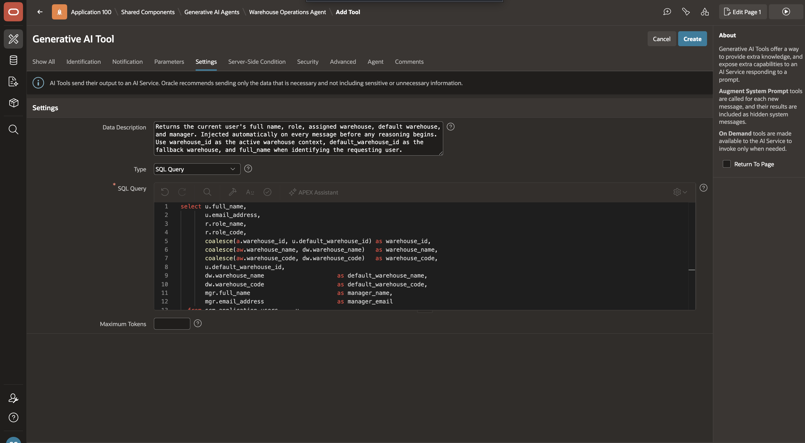

4. Click **Create**.

    

    This query joins four tables to assemble the user's full context:

    | Table | What it provides |
    | --- | --- |
    | `scm_application_users` | User name, email, default warehouse, manager |
    | `scm_user_role_assignments` | Active primary role and assigned warehouse |
    | `scm_user_roles` | Role name and role code |
    | `scm_warehouses` | Assigned and default warehouse name, code, and ID |
    {: title="Tables Used by get_user_context"}

## Task 3: Add the Browser Timezone Tool

When a user reviews operational dates or requests a time-sensitive action, the agent needs to know their timezone so the date is interpreted correctly. This tool reads the timezone directly from the browser and passes it to the agent on every message.

**Type:** Execute Client-side Code | **Execution:** Augment System Prompt

1. In the **Tools** section, select **Add Tool**.

    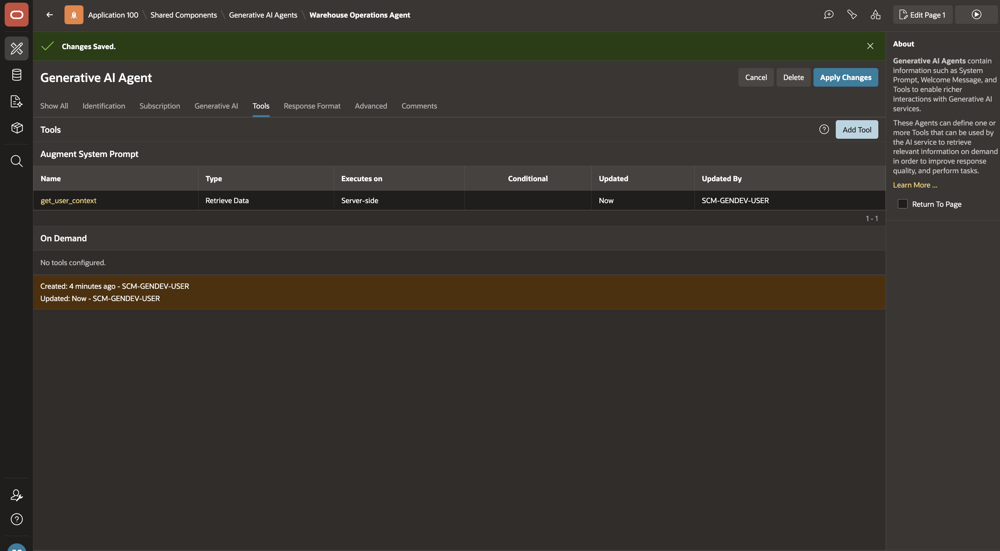

2. Enter/select the following configuration:

    - Under **Identification**:

        - Tool Name: **get\_browser\_timezone**
        - Type: **Execute Client-side Code**
        - Execution Point: **Augment System Prompt**
    - Settings > Code: Copy and paste the following:

        ```javascript
        <copy>
        return Intl.DateTimeFormat().resolvedOptions().timeZone;
        </copy>
        ```

    

3. Click **Create**.

    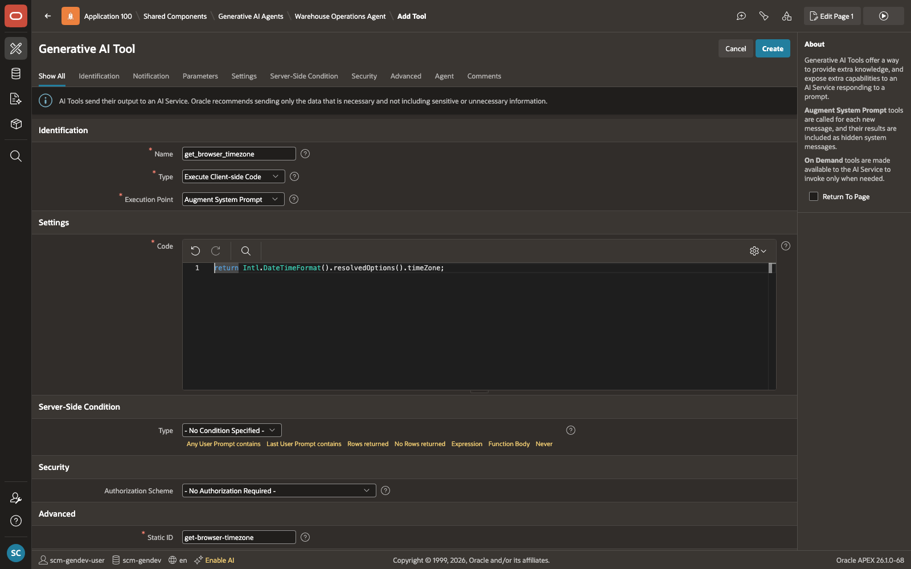

## Summary

The Warehouse Operations Agent is created and has two context tools in place. On every message, the agent automatically knows who the user is, which warehouse they belong to, and what timezone their browser is using. This foundation is what makes the agent's answers relevant and accurate for each individual user.

In the next lab, you will add the tools that allow the agent to review inventory, operational exceptions, and warehouse actions.

## Acknowledgements

- **Author** - Sahaana Manavalan, Senior Product Manager, April 2026
- **Last Updated By/Date** - Sahaana Manavalan, Senior Product Manager, April 2026
