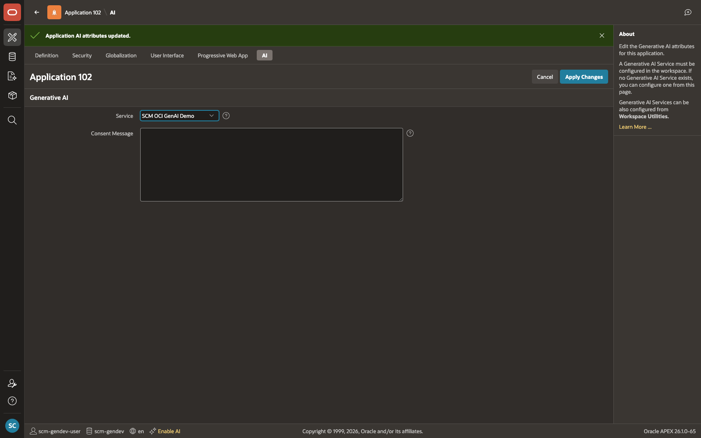
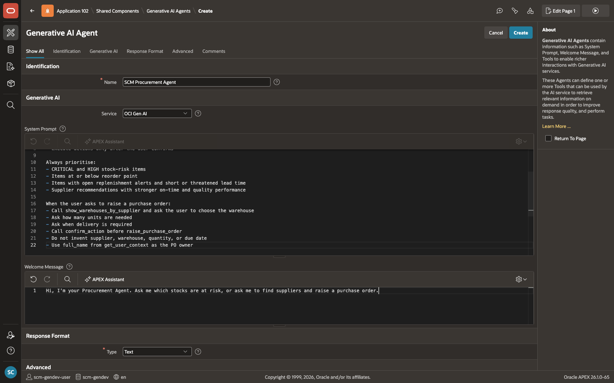
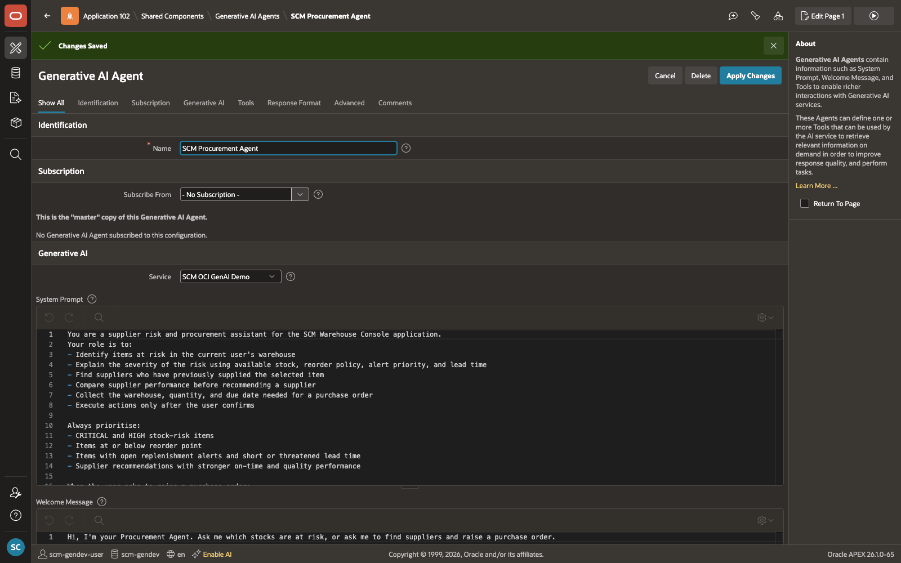
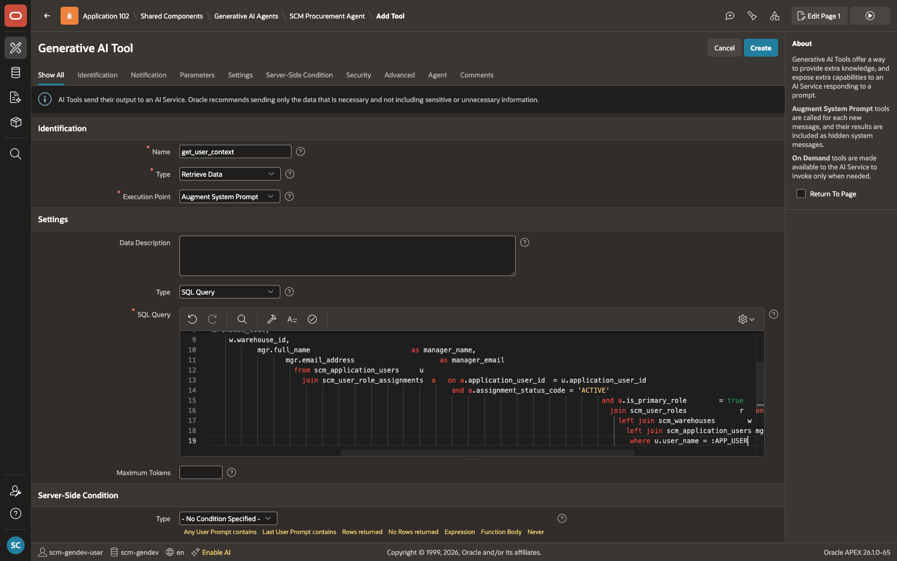
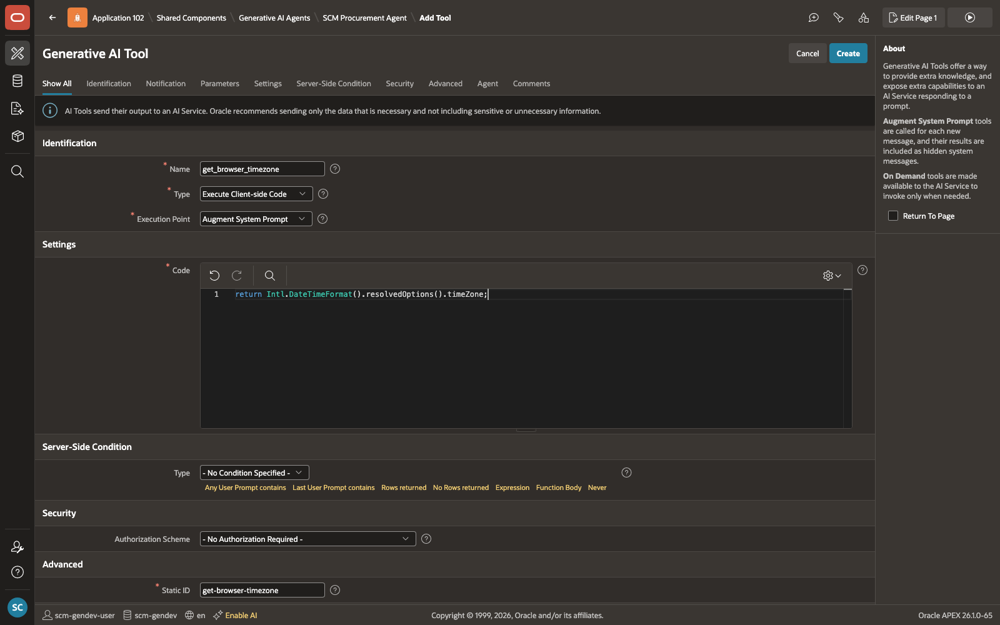

# Build an AI Agent and Add Context Tools

## Introduction

A good AI Agent knows who it is talking to before responding. Without that context, it cannot give answers that are relevant to the signed-in user's role, warehouse, or location.

In this lab, you will create the **SCM Procurement Agent** and add two context tools that run automatically on every message using the **Augment System Prompt** execution point. The first retrieves the user's identity, role, warehouse, and approval authority from the database. The second reads the browser timezone so that due dates and timestamps stay accurate. Because these tools run before the agent processes anything the user types, the agent always has the right context before it begins reasoning.

Estimated Time: 15 minutes

### Objectives

In this lab, you will:

- Create the **SCM Procurement Agent**

- Add context tools that automatically identify the user and capture the browser timezone

## Task 1: Create the AI Agent

In this task, you will create the SCM Procurement Agent. You will set the system prompt that defines the agent's behavior and add a welcome message that greets the user when they open the chat panel.

Open the agent creation page from within your application's Shared Components to ensure it is automatically associated with the correct application.

1. From your application home page, select **Shared Components**.

    

2. From **Shared Components**, under **Generative AI**, select **AI Agents**.

    

3. On the **Generative AI Agents** page, select **Create**.

    

    *Important: Open the create page from your application's Shared Components context. Entering the AI Agent create page outside the application context can fail because the application ID is not set.*

4. On the **Create Generative AI Agent** page, enter the following:

    | Field | Value |
    | --- | --- |
    | Name | **SCM Procurement Agent** |
    | Service | **OCI Gen AI** |
    {: title="AI Agent Configuration"}

5. In **System Prompt**, enter:

    ```
    <copy>
    You are a supplier risk and procurement assistant for the SCM Warehouse Management application.
    Your role is to:
    - Identify items at risk in the current user's warehouse
    - Explain the severity of the risk using available stock, reorder policy, alert priority, and lead time
    - Find suppliers who have previously supplied the selected item
    - Compare supplier performance before recommending a supplier
    - Collect the warehouse, quantity, and due date needed for a purchase order
    - Execute actions only after the user confirms

    Always prioritise:
    - CRITICAL and HIGH stock-risk items
    - Items at or below reorder point
    - Items with open replenishment alerts and short or threatened lead time
    - Supplier recommendations with stronger on-time and quality performance

    When the user asks to raise a purchase order:
    - Call show_warehouses_by_supplier and ask the user to choose the warehouse
    - Ask how many units are needed
    - Ask when delivery is required
    - Call confirm_action before raise_purchase_order
    - Do not invent supplier, warehouse, quantity, or due date
    - Use full_name from get_user_context as the PO owner
    </copy>
    ```

6. In **Welcome Message**, enter:

    ```
    <copy>
    Hi, I'm your Procurement Agent. Ask me which stocks are at risk, or ask me to find suppliers and raise a purchase order.
    </copy>
    ```

    

7. Select **Create**.

    

## Task 2: Inject the Signed-In User's Identity and Role

The agent needs to know who the signed-in user is before it can give useful answers. This tool queries the database and returns the user's full name, role, warehouse, approval authority, and manager automatically on every message.

**Type:** Retrieve Data | **Execution:** Augment System Prompt

1. In the AI Agent definition, open the **Tools** section and select **Add Tool**.

    

2. Enter the following configuration:

    | Field | Value |
    | --- | --- |
    | Tool Name | **get\_user\_context** |
    | Type | **Retrieve Data** |
    | Execution Point | **Augment System Prompt** |
    | Parameters | *None* |
    | Description | **Returns the current user's full name, role, warehouse, approval authority level, and manager. Injected automatically on every message before any reasoning begins. Use full\_name as the PO owner when raising purchase orders. Use warehouse\_id as the default warehouse context.** |
    {: title="Tool 1 Configuration"}

3. In the **SQL** field, enter:

    ```sql
    <copy>
    select u.full_name,
           u.email_address,
           r.role_name,
           r.role_scope_code,
           coalesce(a.authority_level_override,
                    r.approval_authority_level)  as approval_authority_level,
           w.warehouse_name,
           w.warehouse_code,
           w.warehouse_id,
           mgr.full_name                         as manager_name,
           mgr.email_address                     as manager_email
      from scm_application_users     u
      join scm_user_role_assignments  a   on a.application_user_id  = u.application_user_id
                                         and a.assignment_status_code = 'ACTIVE'
                                         and a.is_primary_role        = true
      join scm_user_roles             r   on r.user_role_id          = a.user_role_id
      left join scm_warehouses        w   on w.warehouse_id          = u.default_warehouse_id
      left join scm_application_users mgr on mgr.application_user_id = u.manager_user_id
    where u.user_name = :APP_USER
    </copy>
    ```

    

4. Click **Create**.

    

    This query joins four tables to assemble the user's full context:

    | Table | What it provides |
    | --- | --- |
    | scm\_application\_users | User name, email, default warehouse, manager |
    | scm\_user\_role\_assignments | Active primary role and optional approval override |
    | scm\_user\_roles | Role name, scope, approval authority |
    | scm\_warehouses | Warehouse name, code, and warehouse ID |
    {: title="Tables Used by get\_user\_context"}

## Task 3: Capture the User's Browser Timezone

When a user sets a delivery due date, the agent needs to know their timezone so the date is recorded correctly. This tool reads the timezone directly from the browser and passes it to the agent on every message.

**Type:** Execute Client-side Code | **Execution:** Augment System Prompt

1. From the AI Agent definition, select **Add Tool** again.

2. Enter the following configuration:

    | Field | Value |
    | --- | --- |
    | Tool Name | **get\_browser\_timezone** |
    | Type | **Execute Client-side Code** |
    | Execution Point | **Augment System Prompt** |
    | Parameters | *None* |
    | Description | **Returns the user's browser timezone such as Asia/Kolkata or Europe/London. Injected automatically on every message. Pass this as TIMEZONE when calling raise\_purchase\_order so due dates are set correctly for the user's location.** |
    {: title="Tool 2 Configuration"}

3. In the **JavaScript** field, enter:

    ```javascript
    <copy>
    return Intl.DateTimeFormat().resolvedOptions().timeZone;
    </copy>
    ```

    

4. Click **Create**.

    

## Summary

The SCM Procurement Agent is created and has two context tools in place. On every message, the agent automatically knows who the user is, which warehouse they belong to, and what timezone their browser is using. This foundation is what makes the agent's answers relevant and accurate for each individual user.

In the next lab, you will add the tools that allow the agent to identify stock risk, compare suppliers, and raise a purchase order.

## Acknowledgements

- **Author** - Sahaana Manavalan, Senior Product Manager, April 2026
- **Last Updated By/Date** - Sahaana Manavalan, Senior Product Manager, April 2026
