# Add Core Warehouse Operations Tools

## Introduction

In this lab, you will add the **On Demand** tools that power the Warehouse Operations Agent. These tools are called only when the conversation requires them, and they allow the agent to retrieve warehouse data and perform controlled operational actions.

Estimated Time: 25 minutes

### Objectives

In this lab, you will:

- Add tools to identify low stock, locate stock by location, and review inbound and outbound work
- Add a human confirmation checkpoint before any write action runs
- Add the tool that creates a stock adjustment record

## Task 1: Identify Low Stock Items in the Warehouse

When the user asks what is running low or what needs attention, the agent calls this tool to check the current warehouse. It returns items where available stock is below the minimum stock quantity defined for the warehouse.

**Type:** Retrieve Data | **Execution:** On Demand

1. On the **Warehouse Operations Agent** page, review the saved agent definition and confirm that the context tools from Lab 2 are available.

    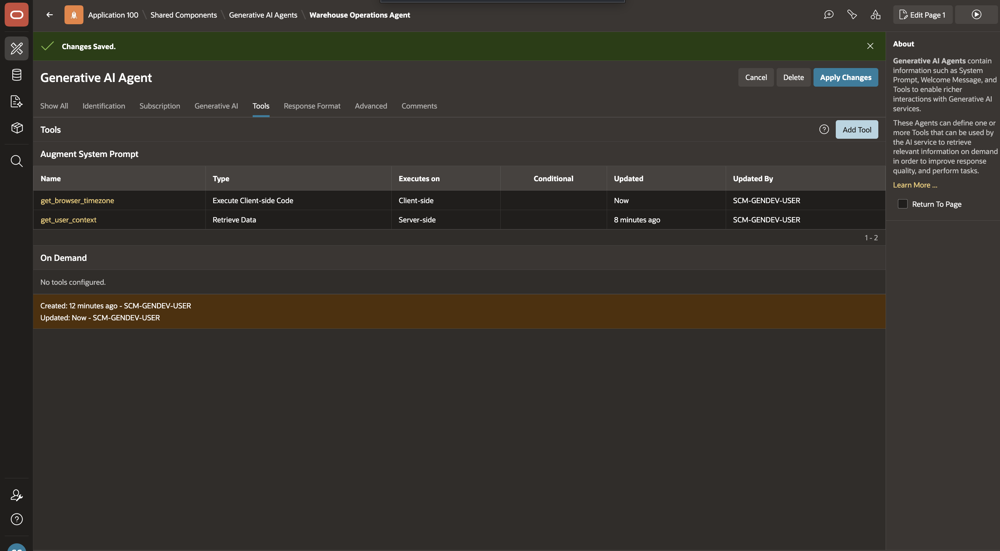

2. In the **Tools** section, select **Add Tool**.

    

3. Enter/select the following configuration:

    - Under **Identification**:

        - Name: **get\_low\_stock\_items**
        - Type: **Retrieve Data**
        - Execution Point: **On Demand**
        - Description: Copy and paste the following:

            ```text
            <copy>
            Returns items in the current user's warehouse where available stock is below the minimum stock quantity. Call this when the user asks about low stock, shortages, or what needs attention. Returns item details, minimum stock, available quantity, and shortfall.
            </copy>
            ```

    

    This tool does not require any parameters.

4. Under **Settings**, for **SQL Query**, copy and paste the following:

    ```sql
    <copy>
    select i.item_id,
           i.item_code,
           i.item_name,
           w.warehouse_id,
           w.warehouse_name,
           p.minimum_stock_quantity,
           nvl(bal.available_quantity, 0)                                    as available_quantity,
           greatest(p.minimum_stock_quantity - nvl(bal.available_quantity,0), 0) as shortfall_quantity
      from scm_item_warehouse_policies p
      join scm_items      i on i.item_id      = p.item_id
      join scm_warehouses w on w.warehouse_id = p.warehouse_id
      left join (
           select warehouse_id,
                  item_id,
                  sum(quantity_available) as available_quantity
             from scm_inventory_balances
            where stock_status_code = 'AVAILABLE'
            group by warehouse_id, item_id
      ) bal on bal.warehouse_id = p.warehouse_id
          and bal.item_id      = p.item_id
     where p.is_active = true
       and p.warehouse_id = (
             select coalesce(a.warehouse_id, u.default_warehouse_id)
               from scm_application_users      u
               left join scm_user_role_assignments a
                 on a.application_user_id    = u.application_user_id
                and a.assignment_status_code = 'ACTIVE'
                and a.is_primary_role        = true
              where lower(u.user_name) = lower(:APP_USER)
           )
       and nvl(bal.available_quantity, 0) < p.minimum_stock_quantity
     order by shortfall_quantity desc, i.item_name
    </copy>
    ```

    

5. Click **Create**.

    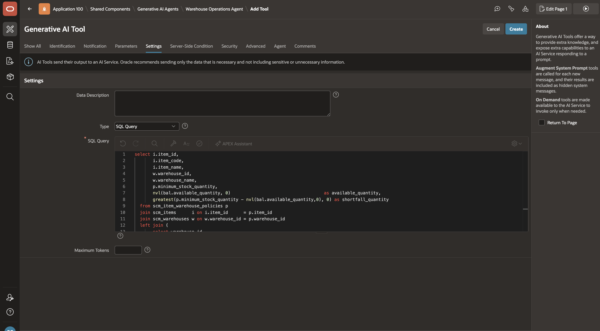

6. This query uses the following tables:

    | Table | What it provides |
    | --- | --- |
    | `scm_item_warehouse_policies` | Minimum stock quantity per item and warehouse |
    | `scm_items` | Item master data |
    | `scm_warehouses` | Warehouse identity |
    | `scm_inventory_balances` | Available stock by item in the warehouse |
    | `scm_application_users` | User to default warehouse mapping |
    | `scm_user_role_assignments` | Optional primary warehouse assignment |
    {: title="Tables used by get_low_stock_items"}

## Task 2: Review Location Balances for the Selected Item

Once a user identifies a low stock item, they often need to see where that item is stored and how much is available by location. This tool returns location-level inventory balances for a selected item in the current user's warehouse.

**Type:** Retrieve Data | **Execution:** On Demand

1. On the **Warehouse Operations Agent** page, in the **Tools** section, select **Add Tool**.

    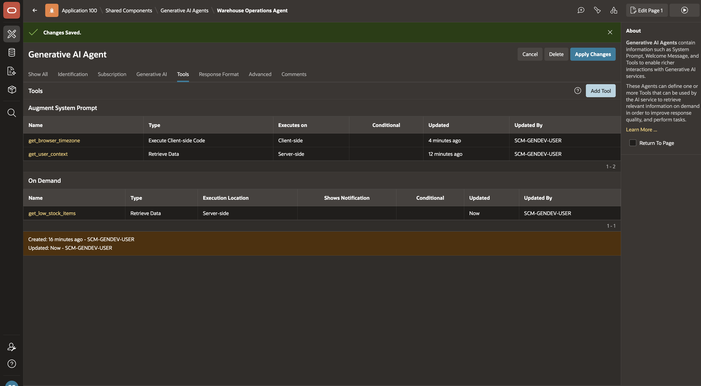

2. Enter/select the following configuration:

    - Under **Identification**:

        - Name: **get\_item\_location\_balances**
        - Type: **Retrieve Data**
        - Execution Point: **On Demand**
        - Description: Copy and paste the following:

            ```text
            <copy>
            Returns location-level stock balances for a selected item in the current user's warehouse. Pass item_id from get_low_stock_items. Use this when the user asks where an item is stored or how much is available by location.
            </copy>
            ```

    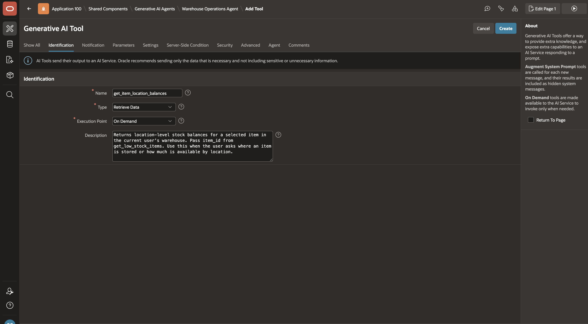

3. Under **Parameters**, click **Add Parameter** and add the following parameter:

    | Parameter | Description | Data Type | Required |
    | --- | --- | --- | --- |
    | `ITEM_ID` | Selected item identifier. | NUMBER | Yes |
    {: title="Tool Parameters"}

    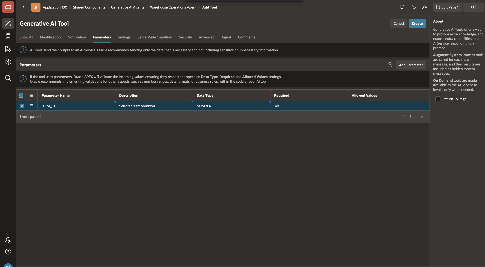

4. Under **Settings**, for **SQL Query**, copy and paste the following:

    ```sql
    <copy>
    select sl.storage_location_id,
           sl.location_code,
           sl.location_name,
           wa.area_code,
           ib.stock_status_code,
           sum(ib.quantity_on_hand)     as quantity_on_hand,
           sum(ib.quantity_reserved)    as quantity_reserved,
           sum(ib.quantity_available)   as quantity_available
      from scm_inventory_balances ib
      join scm_storage_locations  sl on sl.storage_location_id = ib.storage_location_id
      left join scm_warehouse_areas wa on wa.warehouse_area_id = sl.warehouse_area_id
     where ib.warehouse_id = (
             select coalesce(a.warehouse_id, u.default_warehouse_id)
               from scm_application_users      u
               left join scm_user_role_assignments a
                 on a.application_user_id    = u.application_user_id
                and a.assignment_status_code = 'ACTIVE'
                and a.is_primary_role        = true
              where lower(u.user_name) = lower(:APP_USER)
           )
       and ib.item_id = :ITEM_ID
     group by sl.storage_location_id, sl.location_code, sl.location_name, wa.area_code, ib.stock_status_code
     order by sl.location_code, ib.stock_status_code
    </copy>
    ```

    

5. Click **Create**.

    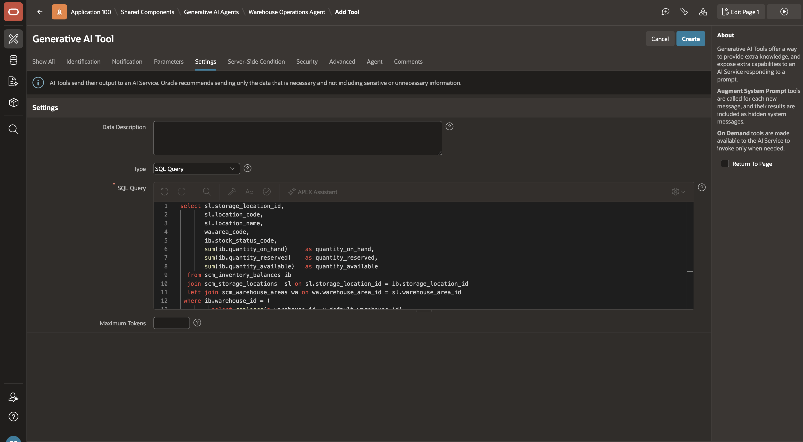

6. This query uses the following tables:

    | Table | What it provides |
    | --- | --- |
    | `scm_inventory_balances` | Location-level inventory quantities |
    | `scm_storage_locations` | Location identifiers and codes |
    | `scm_warehouse_areas` | Warehouse area classification |
    | `scm_application_users` | User to default warehouse mapping |
    | `scm_user_role_assignments` | Optional primary warehouse assignment |
    {: title="Tables used by get_item_location_balances"}

## Task 3: Review Inbound Receipts Needing Attention

Inbound receipts represent work arriving into the warehouse. This tool returns inbound receipts that are not yet closed so the agent can highlight what needs receiving or review.

**Type:** Retrieve Data | **Execution:** On Demand

1. On the **Warehouse Operations Agent** page, in the **Tools** section, select **Add Tool**.

    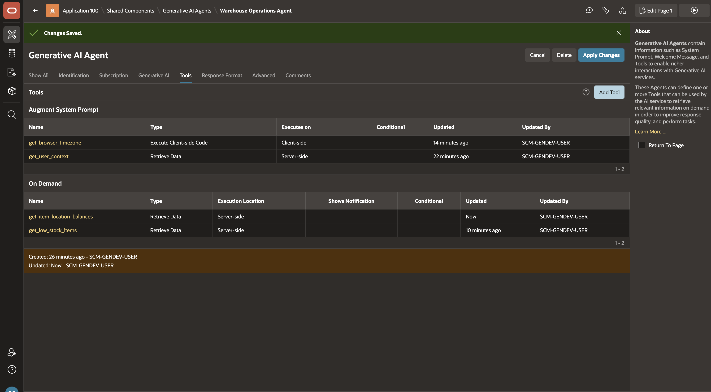

2. Enter/select the following configuration:

    - Under **Identification**:

        - Name: **get\_inbound\_receipts\_needing\_attention**
        - Type: **Retrieve Data**
        - Execution Point: **On Demand**
        - Description: Copy and paste the following:

            ```text
            <copy>
            Returns inbound receipts in the current user's warehouse that are planned, arrived, partially received, or require review. Call this when the user asks what is inbound, what has arrived, or what needs receiving attention.
            </copy>
            ```

    

    This tool does not require any parameters.

3. Under **Settings**, for **SQL Query**, copy and paste the following:

    ```sql
    <copy>
    select ir.inbound_receipt_id,
           ir.receipt_number,
           ir.receipt_source_code,
           bp.partner_name                            as source_partner_name,
           ir.source_document_number,
           ir.receipt_status_code,
           ir.review_status_code,
           ir.expected_arrival_at,
           ir.actual_arrival_at,
           ir.receiving_completed_at,
           au.full_name                               as assigned_to,
           count(distinct irl.inbound_receipt_line_id) as line_count,
           sum(nvl(irl.expected_quantity, 0))         as expected_quantity
      from scm_inbound_receipts ir
      left join scm_business_partners      bp on bp.business_partner_id = ir.source_partner_id
      left join scm_application_users      au on au.application_user_id = ir.assigned_user_id
      left join scm_inbound_receipt_lines irl on irl.inbound_receipt_id = ir.inbound_receipt_id
     where ir.warehouse_id = (
             select coalesce(a.warehouse_id, u.default_warehouse_id)
               from scm_application_users      u
               left join scm_user_role_assignments a
                 on a.application_user_id    = u.application_user_id
                and a.assignment_status_code = 'ACTIVE'
                and a.is_primary_role        = true
              where lower(u.user_name) = lower(:APP_USER)
           )
       and ir.receipt_status_code in ('PLANNED','ARRIVED','PART_RECEIVED','REVIEW_REQUIRED')
     group by ir.inbound_receipt_id, ir.receipt_number, ir.receipt_source_code,
              bp.partner_name, ir.source_document_number,
              ir.receipt_status_code, ir.review_status_code,
              ir.expected_arrival_at, ir.actual_arrival_at, ir.receiving_completed_at,
              au.full_name
     order by case ir.receipt_status_code
                  when 'REVIEW_REQUIRED' then 1
                  when 'ARRIVED'         then 2
                  when 'PART_RECEIVED'   then 3
                  when 'PLANNED'         then 4
                  else 5
              end,
              ir.expected_arrival_at nulls last
    </copy>
    ```

    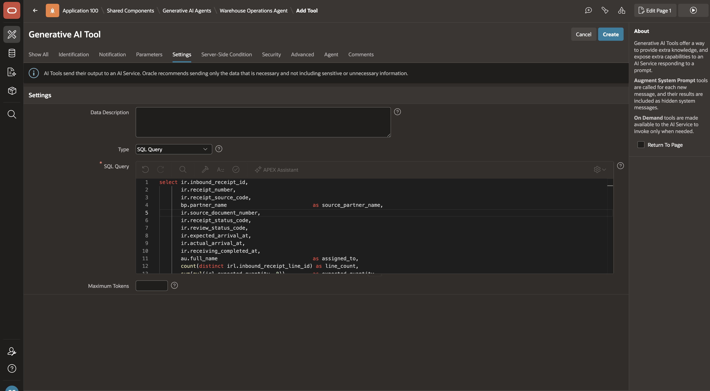

4. Click **Create**.

    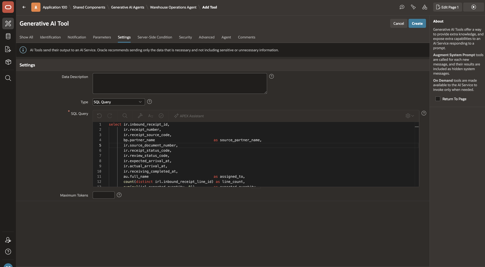

## Task 4: Review Outbound Orders Needing Attention

Outbound orders represent work leaving the warehouse. This tool returns outbound orders that are not yet dispatched or closed so the agent can highlight what is picking, packing, or awaiting release.

**Type:** Retrieve Data | **Execution:** On Demand

1. On the **Warehouse Operations Agent** page, in the **Tools** section, select **Add Tool**.

    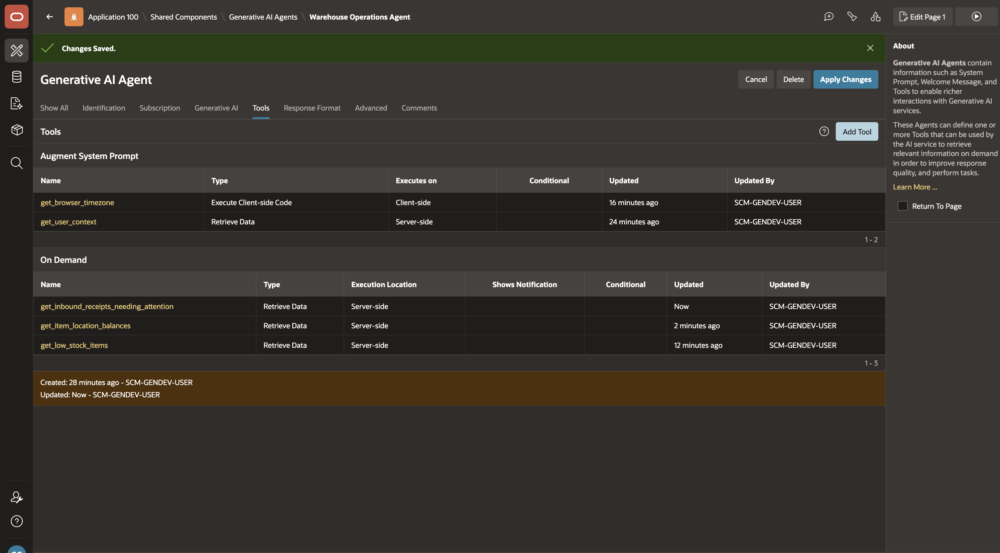

2. Enter/select the following configuration:

    - Under **Identification**:

        - Name: **get\_outbound\_orders\_needing\_attention**
        - Type: **Retrieve Data**
        - Execution Point: **On Demand**
        - Description: Copy and paste the following:

            ```text
            <copy>
            Returns outbound orders in the current user's warehouse that are not yet dispatched or closed. Call this when the user asks what is shipping today, what needs picking/packing, or which outbound orders are blocked.
            </copy>
            ```

    

    This tool does not require any parameters.

3. Under **Settings**, for **SQL Query**, copy and paste the following:

    ```sql
    <copy>
    select oo.outbound_order_id,
           oo.outbound_order_number,
           oo.order_type_code,
           oo.priority_code,
           oo.outbound_status_code,
           oo.requested_ship_at,
           bp.partner_name                            as customer_name,
           au.full_name                               as assigned_to,
           count(distinct ol.outbound_order_line_id)  as line_count,
           sum(nvl(ol.requested_quantity, 0))         as requested_quantity
      from scm_outbound_orders oo
      left join scm_business_partners     bp on bp.business_partner_id = oo.customer_partner_id
      left join scm_application_users     au on au.application_user_id = oo.assigned_user_id
      left join scm_outbound_order_lines  ol on ol.outbound_order_id   = oo.outbound_order_id
     where oo.ship_from_warehouse_id = (
             select coalesce(a.warehouse_id, u.default_warehouse_id)
               from scm_application_users      u
               left join scm_user_role_assignments a
                 on a.application_user_id    = u.application_user_id
                and a.assignment_status_code = 'ACTIVE'
                and a.is_primary_role        = true
              where lower(u.user_name) = lower(:APP_USER)
           )
       and oo.outbound_status_code not in ('DISPATCHED', 'CANCELLED', 'CLOSED')
     group by oo.outbound_order_id, oo.outbound_order_number, oo.order_type_code,
              oo.priority_code, oo.outbound_status_code, oo.requested_ship_at,
              bp.partner_name, au.full_name
     order by decode(oo.priority_code, 'CRITICAL', 1, 'HIGH', 2, 'MEDIUM', 3, 'LOW', 4, 5),
              oo.requested_ship_at nulls last
    </copy>
    ```

    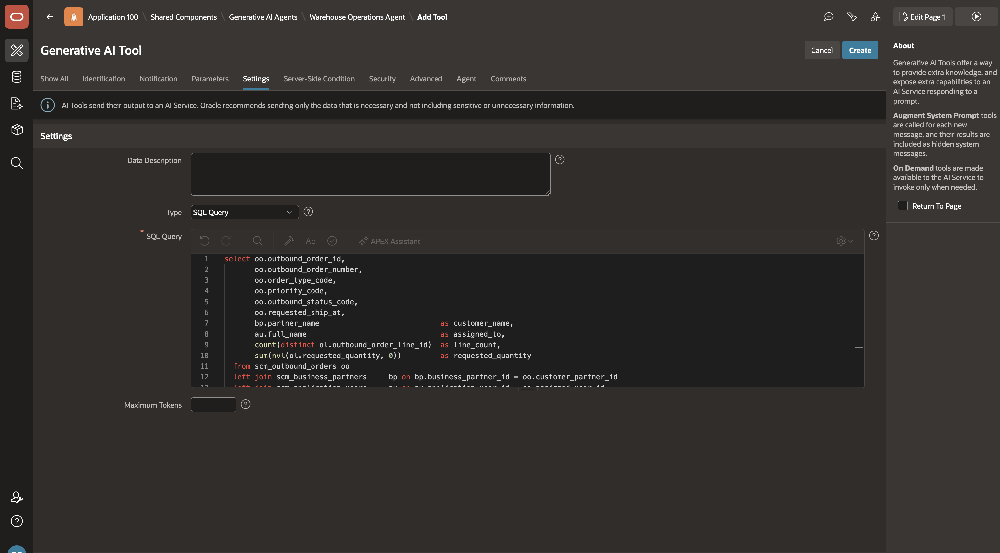

4. Click **Create**.

    

## Task 5: Add a Human Confirmation Checkpoint

To prevent unintended write actions, force an explicit user confirmation step before a server-side tool runs. This tool shows a browser confirmation dialog and returns `confirmed` or `denied` to the agent.

**Type:** Execute Client-side Code | **Execution:** On Demand

1. On the **Warehouse Operations Agent** page, in the **Tools** section, select **Add Tool**.

    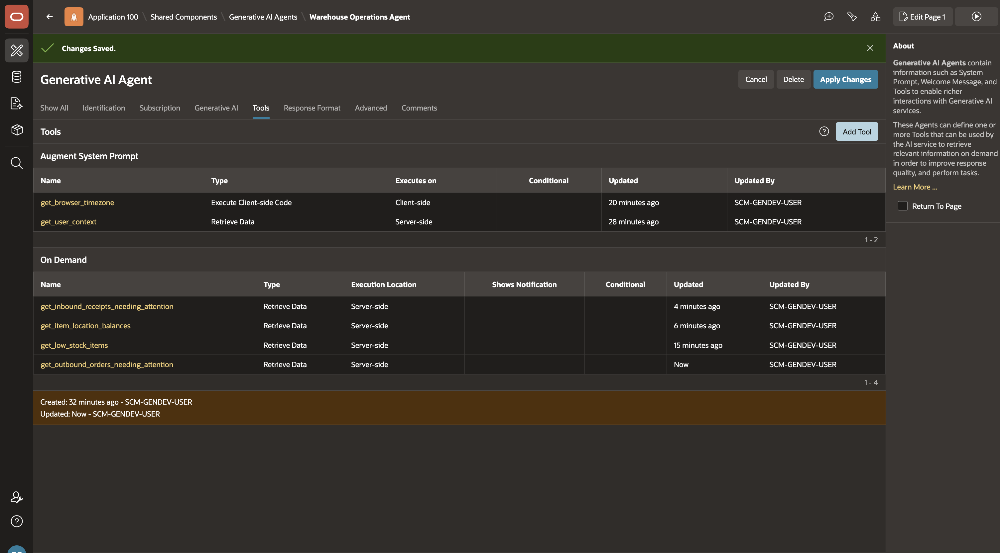

2. Enter/select the following configuration:

    - Under **Identification**:

        - Name: **confirm\_action**
        - Type: **Execute Client-side Code**
        - Execution Point: **On Demand**
        - Description: Copy and paste the following:

            ```text
            <copy>
            Shows a browser confirmation dialog with the provided MESSAGE. Returns "confirmed" if the user clicks OK, or "denied" if they cancel. Always call this before create_stock_adjustment.
            </copy>
            ```

    

3. Under **Parameters**, click **Add Parameter** and add the following parameter:

    | Parameter | Description | Data Type | Required |
    | --- | --- | --- | --- |
    | `MESSAGE` | Confirmation text displayed to the user. | VARCHAR2 | Yes |
    {: title="Tool Parameters"}

    

4. Under **Settings**, for **Code**, copy and paste the following:

    ```javascript
    <copy>
    return new Promise(resolve => {
      apex.message.confirm(this.data.MESSAGE, okPressed => {
        resolve(okPressed ? "confirmed" : "denied");
      });
    });
    </copy>
    ```

    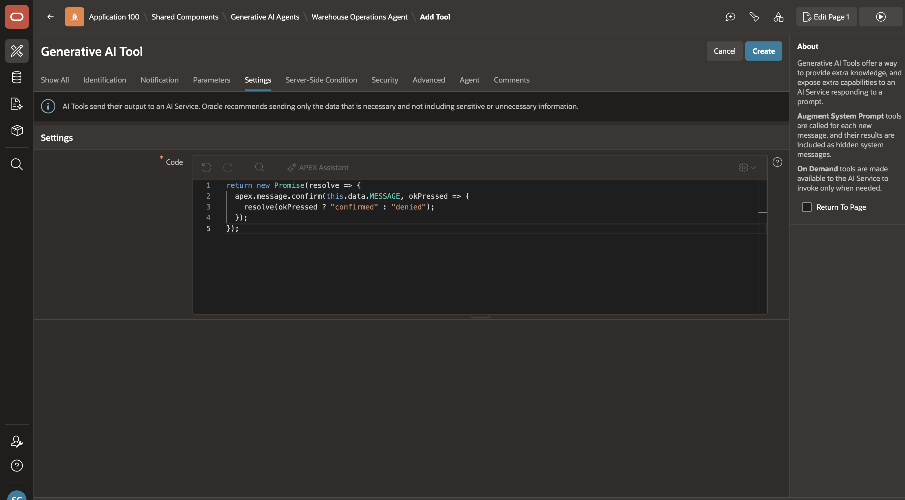

5. Click **Create**.

    

## Task 6: Create a Stock Adjustment

This tool creates a stock adjustment record and updates the `AVAILABLE` inventory balance for the selected item and location. Always call `confirm_action` before running this tool.

**Type:** Execute Server-side Code | **Execution:** On Demand

1. On the **Warehouse Operations Agent** page, in the **Tools** section, select **Add Tool**.

    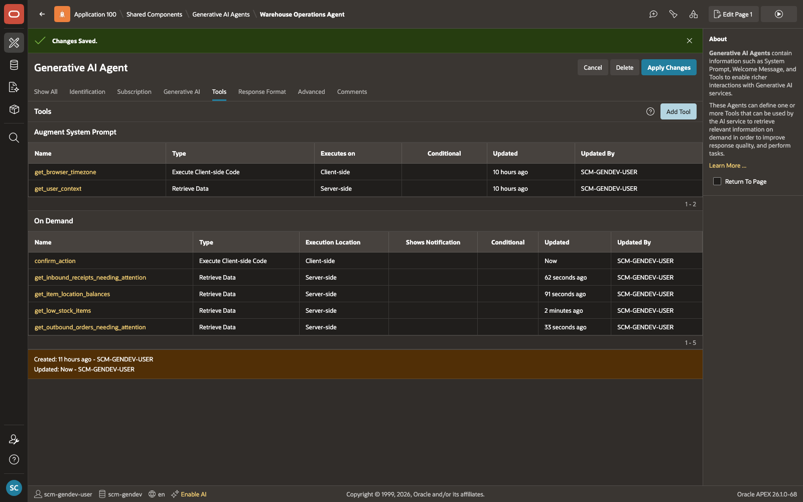

2. Enter/select the following configuration:

    - Under **Identification**:

        - Name: **create\_stock\_adjustment**
        - Type: **Execute Server-side Code**
        - Execution Point: **On Demand**
        - Description: Copy and paste the following:

            ```text
            <copy>
            Creates a stock adjustment and adjustment line for the selected item and location. Before calling this tool you must call confirm_action and wait for "confirmed". Use get_item_location_balances to help the user choose STORAGE_LOCATION_ID.
            </copy>
            ```

    

3. Under **Parameters**, click **Add Parameter** and add the following parameters:

    | Parameter | Description | Data Type | Required |
    | --- | --- | --- | --- |
    | `ITEM_ID` | Selected item identifier. | NUMBER | Yes |
    | `STORAGE_LOCATION_ID` | Selected storage location identifier. | NUMBER | Yes |
    | `ADJUSTMENT_DIRECTION` | `INCREASE` or `DECREASE`. | VARCHAR2 | Yes |
    | `ADJUSTMENT_QUANTITY` | Adjustment quantity (must be > 0). | NUMBER | Yes |
    | `REASON_CODE` | Reason code for the adjustment. | VARCHAR2 | Yes |
    | `REASON_DESCRIPTION` | Plain-English explanation for the line. | VARCHAR2 | Yes |
    {: title="Tool Parameters"}

    

4. Under **Settings**, for **PL/SQL Code**, copy and paste the following:

    ```plsql
    <copy>
    declare
       n varchar2(30); aid number; uid number; wh number; lwh number; oh number; rs number; nh number;
    begin
       if :ADJUSTMENT_DIRECTION not in ('INCREASE','DECREASE') then
          raise_application_error(-20001,'ADJUSTMENT_DIRECTION must be INCREASE or DECREASE.');
       end if;
       if nvl(:ADJUSTMENT_QUANTITY,0) <= 0 then
          raise_application_error(-20002,'ADJUSTMENT_QUANTITY must be greater than 0.');
       end if;
       select u.application_user_id, coalesce(a.warehouse_id,u.default_warehouse_id)
         into uid, wh
         from scm_application_users u
         left join scm_user_role_assignments a
           on a.application_user_id = u.application_user_id
          and a.assignment_status_code = 'ACTIVE' and a.is_primary_role = true
        where lower(u.user_name) = lower(:APP_USER);
       select warehouse_id
         into lwh
         from scm_storage_locations
        where storage_location_id = :STORAGE_LOCATION_ID;
       if lwh != wh then
          raise_application_error(-20003,'STORAGE_LOCATION_ID is not in the current user warehouse.');
       end if;
       select 'ADJ-' || lpad(nvl(max(to_number(regexp_substr(adjustment_number,'[0-9]+$'))), 0) + 1, 6, '0')
         into n
         from scm_stock_adjustments
        where adjustment_number like 'ADJ-%';
       insert into scm_stock_adjustments (
          adjustment_number, warehouse_id, adjustment_type_code,
          reason_code, requested_by_user_id, notes
       ) values (
          n, wh, 'MANUAL_ADJUSTMENT', :REASON_CODE, uid, :REASON_DESCRIPTION
       ) returning stock_adjustment_id into aid;
       insert into scm_stock_adjustment_lines (
          stock_adjustment_id, line_number, item_id, storage_location_id,
          from_status_code, adjustment_direction_code, adjustment_quantity, reason_description
       ) values (
          aid, 1, :ITEM_ID, :STORAGE_LOCATION_ID, 'AVAILABLE',
          :ADJUSTMENT_DIRECTION, :ADJUSTMENT_QUANTITY, :REASON_DESCRIPTION
       );
       begin
          select quantity_on_hand, quantity_reserved
            into oh, rs
            from scm_inventory_balances
           where warehouse_id = wh
             and storage_location_id = :STORAGE_LOCATION_ID
             and item_id = :ITEM_ID
             and inventory_lot_id is null and stock_status_code = 'AVAILABLE'
           for update;
       exception
          when no_data_found then
             if :ADJUSTMENT_DIRECTION = 'DECREASE' then
                raise_application_error(-20004,'No AVAILABLE inventory balance exists for that item and location.');
             end if;
             oh := 0; rs := 0;
             insert into scm_inventory_balances (
                warehouse_id, storage_location_id, item_id, inventory_lot_id,
                stock_status_code, quantity_on_hand, quantity_reserved, quantity_available, last_moved_at
             ) values (
                wh, :STORAGE_LOCATION_ID, :ITEM_ID, null, 'AVAILABLE', 0, 0, 0, systimestamp
             );
       end;
       if :ADJUSTMENT_DIRECTION = 'INCREASE' then
          nh := oh + :ADJUSTMENT_QUANTITY;
       else
          nh := oh - :ADJUSTMENT_QUANTITY;
       end if;
       if nh < 0 then
          raise_application_error(-20005,'Adjustment would make on-hand quantity negative.');
       end if;
       update scm_inventory_balances
          set quantity_on_hand = nh,
              quantity_available = greatest(0, nh - rs),
              last_moved_at = systimestamp
        where warehouse_id = wh
          and storage_location_id = :STORAGE_LOCATION_ID
          and item_id = :ITEM_ID
          and inventory_lot_id is null and stock_status_code = 'AVAILABLE';
       apex_ai.set_tool_result(
          p_result => 'Stock adjustment ' || n || ' created.',
          p_notification_message => n || ' created',
          p_notification_type => 'success'
       );
    end;
    </copy>
    ```

    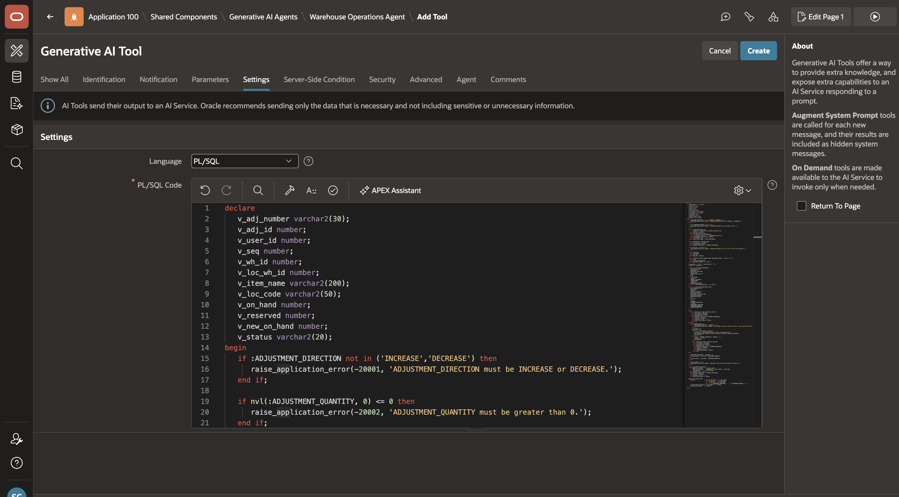

5. Click **Create**.

    

## Summary

The Warehouse Operations Agent now has the core On Demand tools required to review low stock, locate inventory, review inbound and outbound work, and perform a controlled stock adjustment with explicit user confirmation.

You may now **proceed to the next Lab**.

## Acknowledgements

- **Author** - Sahaana Manavalan, Senior Product Manager, April 2026
- **Last Updated By/Date** - Sahaana Manavalan, Senior Product Manager, April 2026
