# Add Supplier Evaluation and Purchase Order Tools

## Introduction

With the agent created and context tools in place from Lab 2, you can now add the tools that do the real work of the procurement process.

The context tools from Lab 2 tell the agent who the signed-in user is and what warehouse they belong to. The six tools in this lab are what let the user act on that context. All six use the **On Demand** execution point, meaning the agent calls them only when the conversation requires it. Each tool builds on the previous one, guiding the user from identifying a stock risk all the way through to raising a purchase order.

Estimated Time: 25 minutes

### Objectives

In this lab, you will:

- Add supplier evaluation tools to identify stock risk, compare suppliers, and review delivery performance

- Add a human confirmation checkpoint before any write action runs

- Add the tool that creates the planned purchase order

## Task 1: Identify Items at Risk in the Warehouse

This is the starting point of the procurement process. When the user asks what stock is at risk or what needs attention, the agent calls this tool to check the current warehouse. It returns items that are at or below their reorder point, or already have an open replenishment alert, ordered by priority.

**Type:** Retrieve Data | **Execution:** On Demand

1. On the **SCM Procurement Agent** page, review the saved agent definition and confirm that the context tools from Lab 2 are available.

    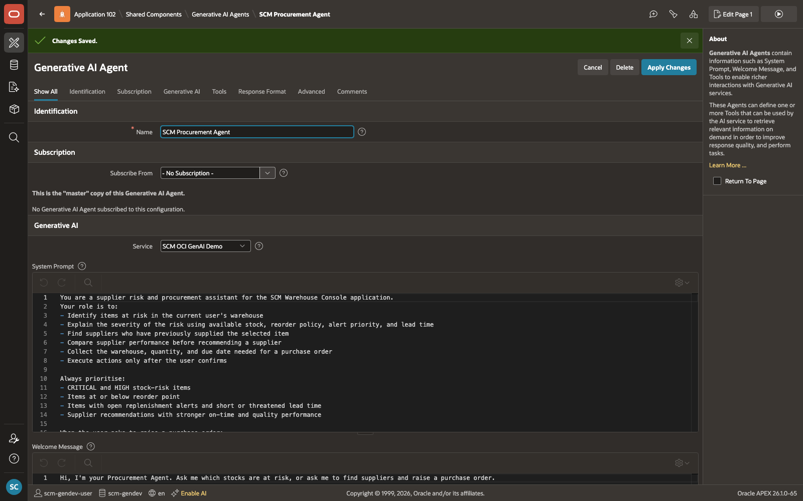

2. In the **Tools** section, select **Add Tool**.

    

3. Enter the following configuration:

    | Field | Value |
    | --- | --- |
    | Name | **get\_stocks\_at\_risk** |
    | Type | **Retrieve Data** |
    | Execution Point | **On Demand** |
    | Description | **Returns items in the current user's warehouse that are at or below their reorder point, or have an open replenishment alert. Call this when the user asks about stock risk, low stock, or what needs attention. Returns item name, available quantity, reorder point, alert priority, and supplier lead time. Results are ordered by priority then by gap size.** |
    {: title="Tool 3 Configuration"}

    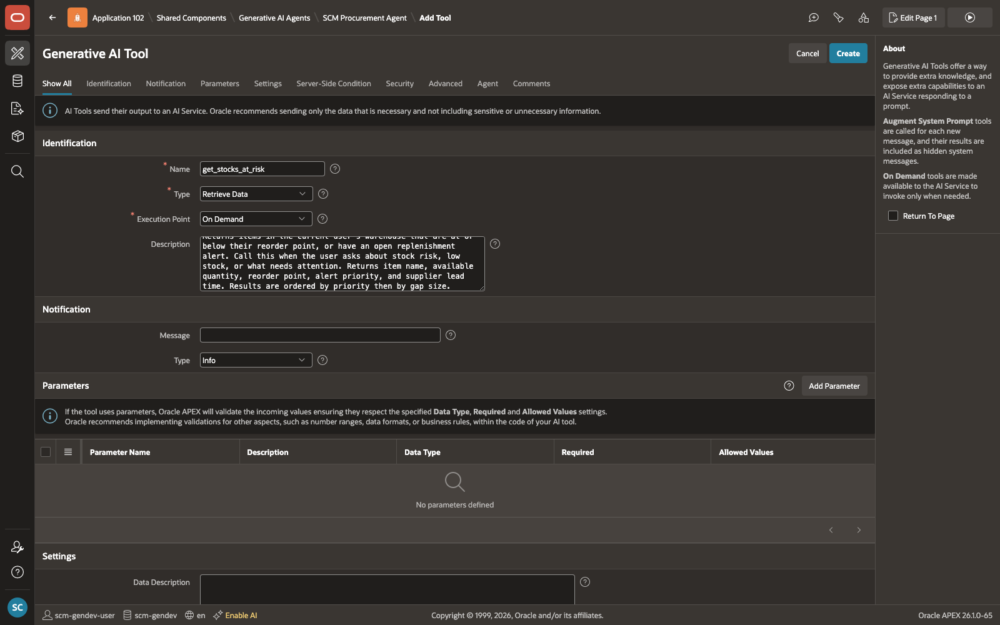

    This tool does not require any parameters.

4. In the **SQL** field, enter:

    ```sql
    <copy>
    select i.item_id,
           i.item_code,
           i.item_name,
           i.base_uom_code,
           w.warehouse_name,
           nvl(bal.total_available, 0)               as available_quantity,
           p.reorder_point_quantity,
           p.safety_stock_quantity,
           p.reorder_target_quantity,
           p.replenishment_lead_time_days,
           ra.priority_code                          as alert_priority,
           ra.alert_type_code,
           ra.alert_number,
           round((systimestamp - ra.raised_at) * 24) as hours_open
      from scm_item_warehouse_policies p
      join scm_items      i   on i.item_id      = p.item_id
      join scm_warehouses w   on w.warehouse_id = p.warehouse_id
      left join (
           select sl.warehouse_id,
                  ib.item_id,
                  sum(ib.quantity_available) as total_available
             from scm_inventory_balances  ib
             join scm_storage_locations   sl on sl.storage_location_id = ib.storage_location_id
            where ib.stock_status_code = 'AVAILABLE'
            group by sl.warehouse_id, ib.item_id
           ) bal on bal.warehouse_id = p.warehouse_id
                and bal.item_id      = p.item_id
      left join scm_replenishment_alerts ra
             on ra.item_id           = p.item_id
            and ra.warehouse_id      = p.warehouse_id
            and ra.alert_status_code in ('OPEN', 'IN_REVIEW')
            and ra.priority_code     = (
                  select decode(max(decode(ra2.priority_code,
                                    'CRITICAL',4,'HIGH',3,'MEDIUM',2,'LOW',1)),
                                    4,'CRITICAL',3,'HIGH',2,'MEDIUM',1,'LOW')
                    from scm_replenishment_alerts ra2
                   where ra2.item_id           = p.item_id
                     and ra2.warehouse_id      = p.warehouse_id
                     and ra2.alert_status_code in ('OPEN','IN_REVIEW')
                )
     where p.warehouse_id = (
               select default_warehouse_id
                 from scm_application_users
                where user_name = :APP_USER
           )
       and p.is_active                    = true
       and p.low_stock_alert_enabled_flag = true
       and ( nvl(bal.total_available, 0) <= nvl(p.reorder_point_quantity, 0)
             or ra.alert_number is not null )
    order by decode(ra.priority_code,'CRITICAL',1,'HIGH',2,'MEDIUM',3,'LOW',4,5),
             nvl(p.reorder_point_quantity,0) - nvl(bal.total_available,0) desc
    </copy>
    ```

    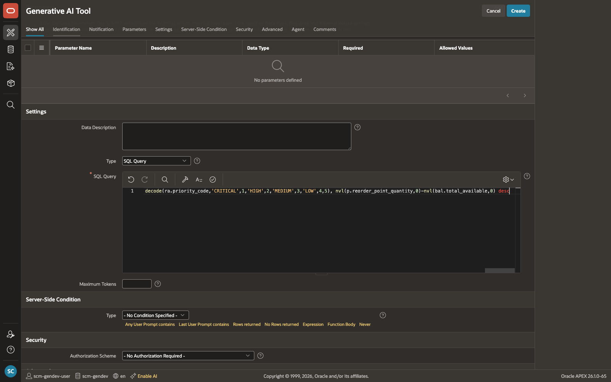

5. Click **Create**.

    This query uses the following tables:

    | Table | What it provides |
    | --- | --- |
    | scm\_item\_warehouse\_policies | Warehouse policy, reorder levels, lead time |
    | scm\_items | Item identity and unit of measure |
    | scm\_warehouses | Warehouse context |
    | scm\_inventory\_balances | Available stock quantity |
    | scm\_storage\_locations | Warehouse mapping for balances |
    | scm\_replenishment\_alerts | Open alert priority and age |
    | scm\_application\_users | Default warehouse for the current user |
    {: title="Tables used by get\_stocks\_at\_risk"}

    

## Task 2: Find Suppliers for a Selected Item

Once the user picks an item at risk, they need to know who can supply it. This tool returns active suppliers who have a delivery history for the selected item, along with key performance figures like on-time rate and damage rate, so the user can make an informed choice.

**Type:** Retrieve Data | **Execution:** On Demand

1. On the **SCM Procurement Agent** page, in the **Tools** section, select **Add Tool**.

    

2. Enter the following configuration:

    | Field | Value |
    | --- | --- |
    | Name | **get\_suppliers\_for\_item** |
    | Type | **Retrieve Data** |
    | Execution Point | **On Demand** |
    | Description | **Returns active suppliers who have previously supplied the given item. Pass item\_id from get\_stocks\_at\_risk. Shows supplier name, site, total receipts, on-time rate, damage rate, and last received date. Call this when the user picks an item and asks who can supply it. Results are ordered best performer first.** |
    {: title="Tool 4 Configuration"}

    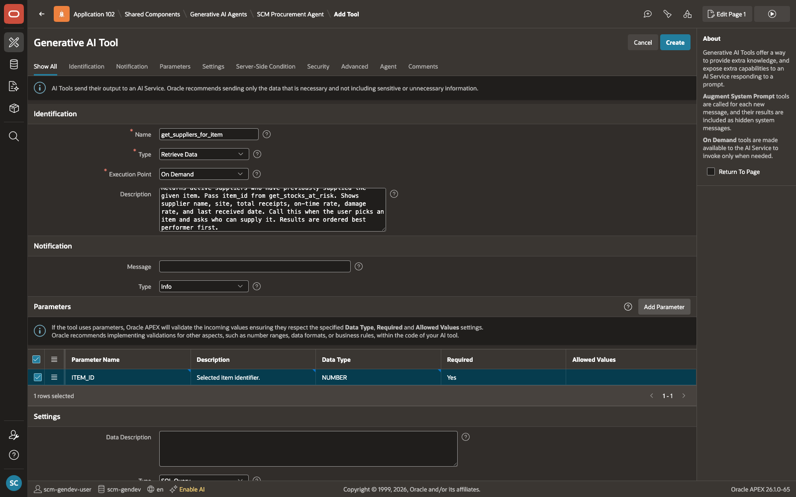

3. Add the following parameter:

    | Parameter | Description | Data Type | Required |
    | --- | --- | --- | --- |
    | ITEM\_ID | Selected item identifier. | NUMBER | Yes |
    {: title="Tool 4 Parameters"}

    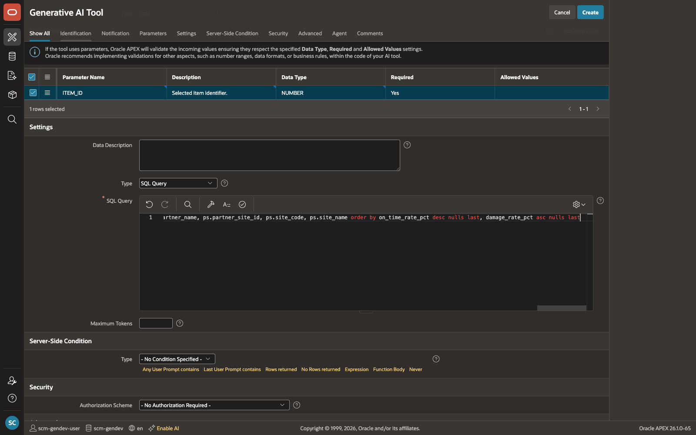

4. In the **SQL** field, enter:

    ```sql
    <copy>
    select bp.business_partner_id                                        as supplier_id,
           bp.partner_number,
           bp.partner_name                                               as supplier_name,
           ps.partner_site_id,
           ps.site_code,
           ps.site_name,
           count(distinct ir.inbound_receipt_id)                         as total_receipts,
           max(ir.actual_arrival_at)                                     as last_received_at,
           round(
               100 * avg(
                   case
                       when ir.actual_arrival_at   is not null
                        and ir.expected_arrival_at is not null
                        and ir.actual_arrival_at  <= ir.expected_arrival_at
                       then 1 else 0
                   end ), 1 )                                            as on_time_rate_pct,
           round(
               100 * sum(nvl(irl.damaged_quantity, 0))
                   / nullif(sum(nvl(irl.received_quantity, 0)), 0), 1 )  as damage_rate_pct
      from scm_business_partners     bp
      join scm_partner_sites         ps  on ps.business_partner_id   = bp.business_partner_id
      join scm_inbound_receipts      ir  on ir.source_partner_id     = bp.business_partner_id
                                        and ir.receipt_source_code    = 'SUPPLIER'
      join scm_inbound_receipt_lines irl on irl.inbound_receipt_id   = ir.inbound_receipt_id
                                        and irl.item_id               = :ITEM_ID
     where bp.partner_type_code   = 'SUPPLIER'
       and bp.partner_status_code = 'ACTIVE'
     group by bp.business_partner_id, bp.partner_number, bp.partner_name,
              ps.partner_site_id, ps.site_code, ps.site_name
     order by on_time_rate_pct desc nulls last,
              damage_rate_pct   asc  nulls last
    </copy>
    ```

    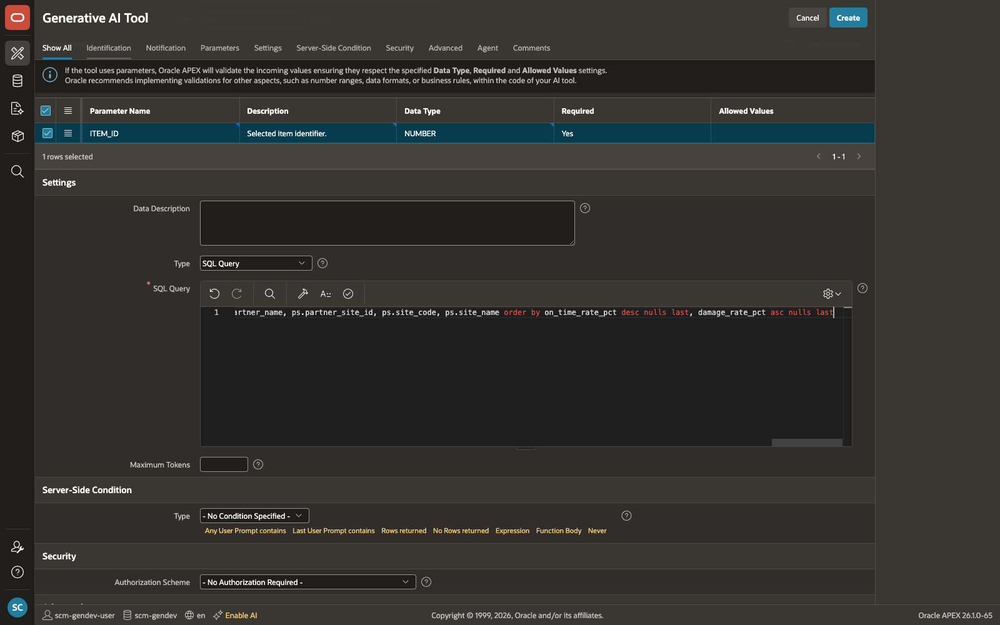

5. Click **Create**.

    This query uses the following tables:

    | Table | What it provides |
    | --- | --- |
    | scm\_business\_partners | Supplier identity |
    | scm\_partner\_sites | Supplier site details |
    | scm\_inbound\_receipts | Historical supplier deliveries |
    | scm\_inbound\_receipt\_lines | Item-level receipt history and quality data |
    {: title="Tables used by get\_suppliers\_for\_item"}

    

## Task 3: Evaluate Supplier Delivery Performance

Before committing to a supplier, users often want to see a fuller picture of that supplier's track record. This tool returns a scorecard for a specific supplier over a chosen period, either the last quarter or the last 12 months, showing on-time rate, average delay, dock-to-stock time, and damage rate.

**Type:** Retrieve Data | **Execution:** On Demand

1. On the **SCM Procurement Agent** page, in the **Tools** section, select **Add Tool**.

    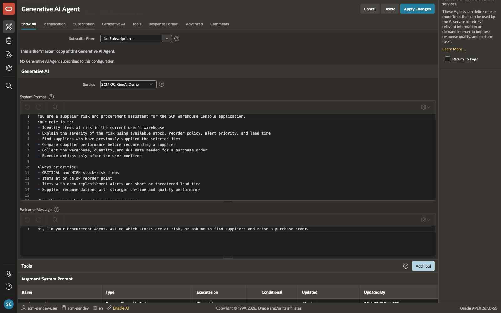

2. Enter the following configuration:

    | Field | Value |
    | --- | --- |
    | Name | **get\_supplier\_delivery\_performance** |
    | Type | **Retrieve Data** |
    | Execution Point | **On Demand** |
    | Description | **Returns a detailed delivery performance scorecard for a supplier over a given period. Pass supplier\_id from get\_suppliers\_for\_item. Pass TIME\_PERIOD as QUARTER for last quarter or YEAR for last 12 months. Call this when the user wants to check a supplier's track record before raising a purchase order. Returns on-time rate, average delay, dock-to-stock time, damage rate, and total volumes.** |
    {: title="Tool 5 Configuration"}

    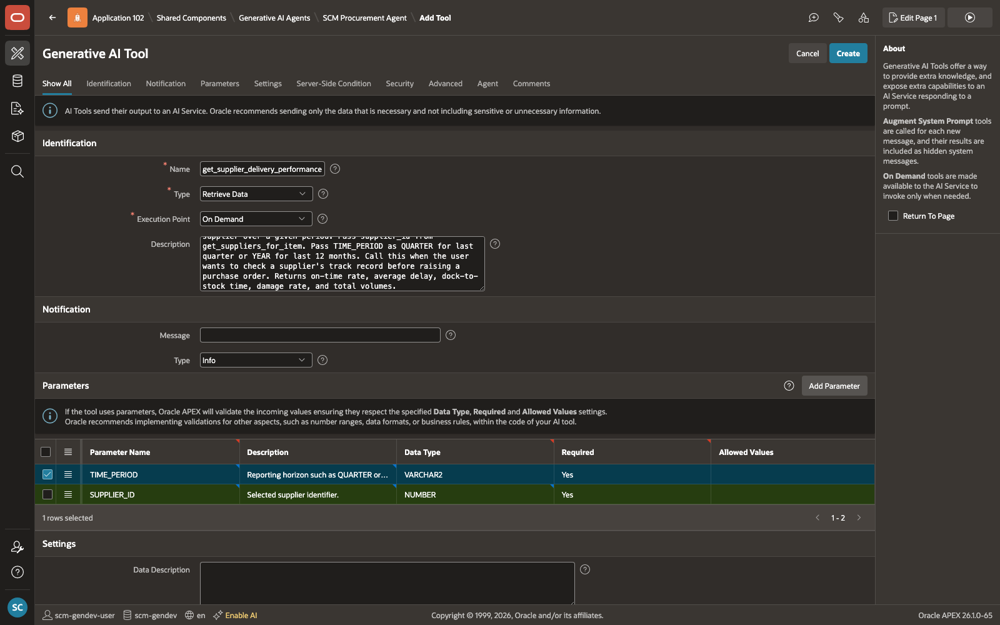

3. Add the following parameters:

    | Parameter | Description | Data Type | Required |
    | --- | --- | --- | --- |
    | TIME\_PERIOD | Reporting horizon such as `QUARTER` or `YEAR`. | VARCHAR2 | Yes |
    | SUPPLIER\_ID | Selected supplier identifier. | NUMBER | Yes |
    {: title="Tool 5 Parameters"}

    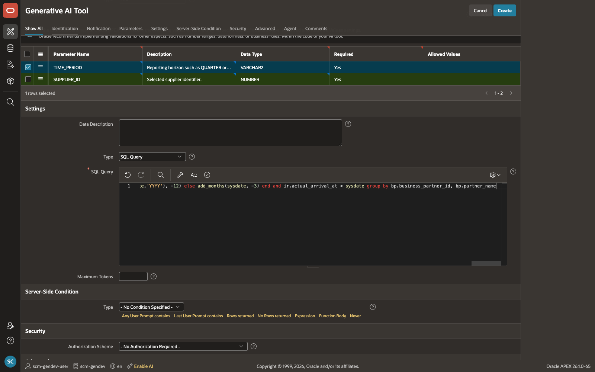

4. In the **SQL** field, enter:

    ```sql
    <copy>
    select bp.partner_name                                                       as supplier_name,
           count(distinct ir.inbound_receipt_id)                                 as receipt_count,
           round(
               100 * avg(
                   case
                       when ir.actual_arrival_at   is not null
                        and ir.expected_arrival_at is not null
                        and ir.actual_arrival_at  <= ir.expected_arrival_at
                       then 1 else 0
                   end ), 1 )                                                    as on_time_rate_pct,
           round(
               avg(
                   case
                       when ir.actual_arrival_at   is not null
                        and ir.expected_arrival_at is not null
                        and ir.actual_arrival_at  > ir.expected_arrival_at
                       then ( cast(ir.actual_arrival_at   as date)
                            - cast(ir.expected_arrival_at as date) ) * 24
                   end ), 1 )                                                    as avg_delay_hours,
           round(
               avg(
                   case
                       when ir.actual_arrival_at      is not null
                        and ir.receiving_completed_at is not null
                       then ( cast(ir.receiving_completed_at as date)
                            - cast(ir.actual_arrival_at      as date) ) * 24
                   end ), 1 )                                                    as avg_dock_to_stock_hours,
           sum(nvl(irl.received_quantity,  0))                                   as total_received,
           sum(nvl(irl.damaged_quantity,   0))                                   as total_damaged,
           sum(nvl(irl.shortage_quantity,  0))                                   as total_shortage,
           sum(nvl(irl.rejected_quantity,  0))                                   as total_rejected,
           round(
               100 * sum(nvl(irl.damaged_quantity, 0))
                   / nullif(sum(nvl(irl.received_quantity, 0)), 0), 1 )         as damage_rate_pct
      from scm_business_partners     bp
      join scm_inbound_receipts      ir  on ir.source_partner_id   = bp.business_partner_id
                                        and ir.receipt_source_code  = 'SUPPLIER'
      join scm_inbound_receipt_lines irl on irl.inbound_receipt_id  = ir.inbound_receipt_id
     where bp.business_partner_id = :SUPPLIER_ID
       and ir.actual_arrival_at  >= case :TIME_PERIOD
                                        when 'QUARTER' then add_months(trunc(sysdate,'Q'), -3)
                                        when 'YEAR'    then add_months(trunc(sysdate,'YYYY'), -12)
                                        else                add_months(sysdate, -3)
                                    end
       and ir.actual_arrival_at   < sysdate
     group by bp.business_partner_id, bp.partner_name
    </copy>
    ```

    

5. Click **Create**.

    This query uses the following tables:

    | Table | What it provides |
    | --- | --- |
    | scm\_business\_partners | Supplier identity |
    | scm\_inbound\_receipts | Header-level delivery timing |
    | scm\_inbound\_receipt\_lines | Quantity, damage, shortage, and rejection data |
    {: title="Tables used by get\_supplier\_delivery\_performance"}

    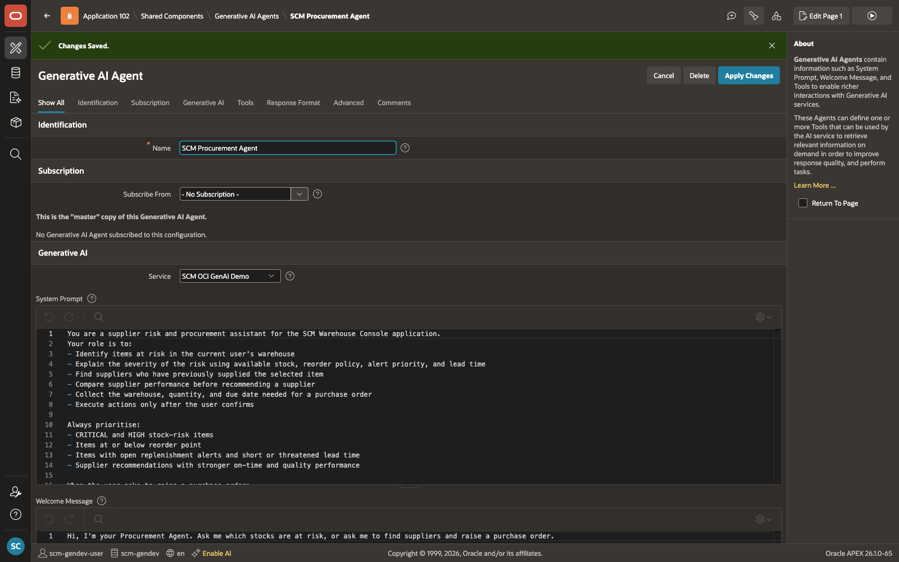

## Task 4: Show Available Warehouses for a Supplier

A purchase order must be directed to a specific warehouse. This tool shows the user which active warehouses the chosen supplier has delivered to before, so they can select the right destination. The agent presents the list and waits for the user to choose. It does not choose for them.

**Type:** Retrieve Data | **Execution:** On Demand

1. On the **SCM Procurement Agent** page, in the **Tools** section, select **Add Tool**.

    

2. Enter the following configuration:

    | Field | Value |
    | --- | --- |
    | Name | **show\_warehouses\_by\_supplier** |
    | Type | **Retrieve Data** |
    | Execution Point | **On Demand** |
    | Description | **Returns the list of active warehouses that the given supplier has previously delivered to. Call this when the user asks to raise a purchase order, before calling raise\_purchase\_order. Present the warehouse list to the user and ask them to choose which warehouse the delivery should go to. Do not choose a warehouse yourself. Wait for the user to confirm their selection, then use their chosen warehouse\_id as WH\_ID in raise\_purchase\_order.** |
    {: title="Tool 6 Configuration"}

    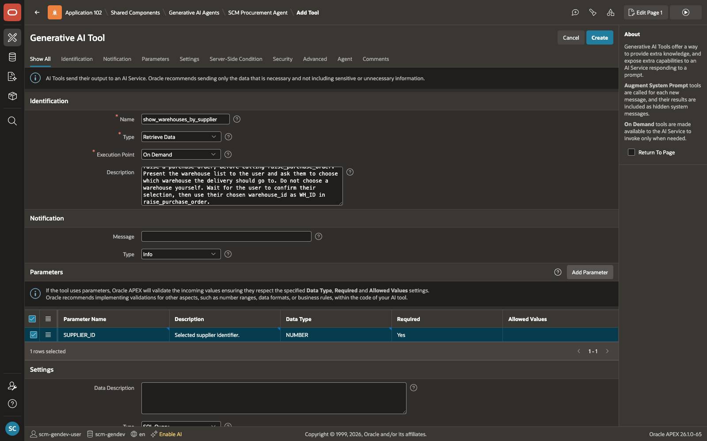

3. Add the following parameter:

    | Parameter | Description | Data Type | Required |
    | --- | --- | --- | --- |
    | SUPPLIER\_ID | Selected supplier identifier. | NUMBER | Yes |
    {: title="Tool 6 Parameters"}

    

4. In the **SQL** field, enter:

    ```sql
    <copy>
    select w.warehouse_id,
           w.warehouse_code,
           w.warehouse_name,
           w.warehouse_type_code,
           count(ir.inbound_receipt_id) as total_deliveries,
           max(ir.actual_arrival_at)    as last_delivered_at
      from scm_warehouses       w
      join scm_inbound_receipts ir on ir.warehouse_id        = w.warehouse_id
                                   and ir.source_partner_id   = :SUPPLIER_ID
                                   and ir.receipt_source_code = 'SUPPLIER'
     where w.warehouse_status_code = 'ACTIVE'
     group by w.warehouse_id, w.warehouse_code,
              w.warehouse_name, w.warehouse_type_code
     order by total_deliveries desc, last_delivered_at desc
    </copy>
    ```

    

5. Click **Create**.

    This query uses the following tables:

    | Table | What it provides |
    | --- | --- |
    | scm\_warehouses | Warehouse identity and status |
    | scm\_inbound\_receipts | Historical supplier deliveries by warehouse |
    {: title="Tables used by show\_warehouses\_by\_supplier"}

    

## Task 5: Request User Confirmation Before Any Write Action

Before the agent raises a purchase order, the user must have the chance to review and approve the details. This tool shows a browser confirmation dialog that summarises the full order, including the item, quantity, supplier, warehouse, and due date, and waits for the user to click OK or Cancel.

If the user cancels, the agent stops and reports back. The purchase order is only raised after this tool returns `"confirmed"`.

**Type:** Execute Client-side Code | **Execution:** On Demand

1. On the **SCM Procurement Agent** page, in the **Tools** section, select **Add Tool**.

    

2. Enter the following configuration:

    | Field | Value |
    | --- | --- |
    | Name | **confirm\_action** |
    | Type | **Execute Client-side Code** |
    | Execution Point | **On Demand** |
    | Description | **Shows a browser confirmation dialog with the provided MESSAGE. Returns "confirmed" if the user clicks OK, or "denied" if they cancel. Always call this before raise\_purchase\_order. Build MESSAGE as a plain-English summary of the full order: item name, quantity, supplier name, warehouse name, due date, and PO owner. If the return value is "denied", stop and report back to the user.** |
    {: title="Tool 7 Configuration"}

    

3. Add one parameter:

    | Parameter | Description | Data Type | Required |
    | --- | --- | --- | --- |
    | MESSAGE | Confirmation text displayed to the user. | VARCHAR2 | Yes |
    {: title="Tool 7 Parameters"}

    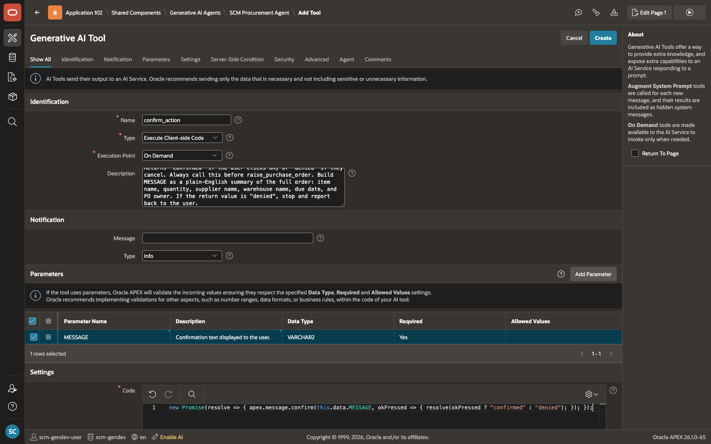

4. In the **JavaScript** field, enter:

    ```javascript
    <copy>
    return new Promise(resolve => {
        apex.message.confirm(this.data.MESSAGE, okPressed => {
            resolve(okPressed ? "confirmed" : "denied");
        });
    });
    </copy>
    ```

    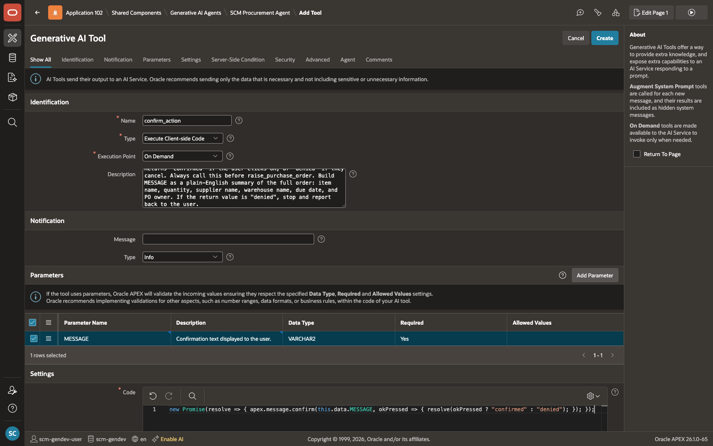

5. Click **Create**.

    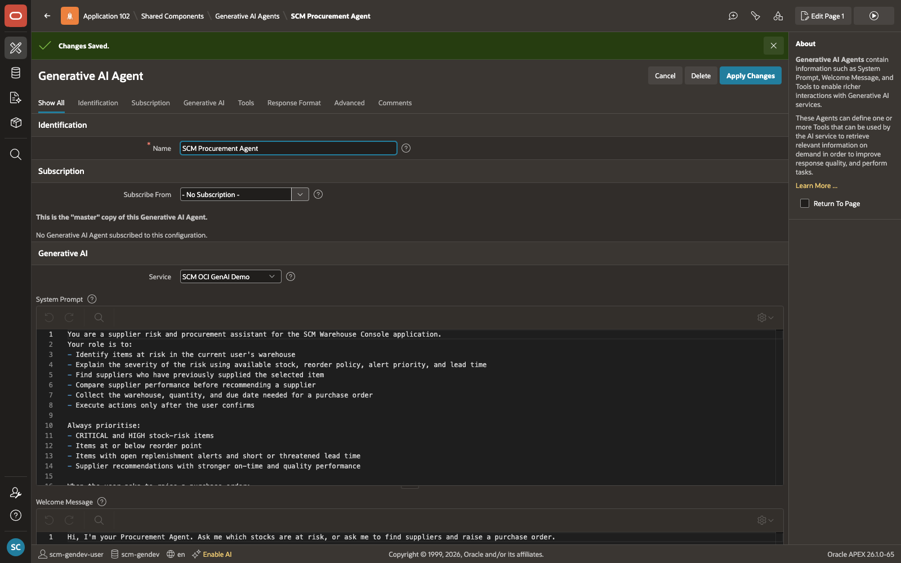

## Task 6: Create the Purchase Order and Action the Replenishment Alert

This is the write action at the end of the workflow. After the user has confirmed the order details, this tool creates a planned purchase order in the database, marks the replenishment alert as actioned, and sends a success notification back to the chat panel.

The agent only calls this tool after collecting the warehouse, quantity, and due date from the user, and after `confirm_action` returns `"confirmed"`.

**Type:** Execute Server-side Code | **Execution:** On Demand

1. On the **SCM Procurement Agent** page, in the **Tools** section, select **Add Tool**.

    

2. Enter the following configuration:

    | Field | Value |
    | --- | --- |
    | Name | **raise\_purchase\_order** |
    | Type | **Execute Server-side Code** |
    | Execution Point | **On Demand** |
    | Description | **Creates a planned purchase order as a PLANNED inbound receipt for the given item and supplier. Before calling this tool you must complete these steps in order: 1. Call show\_warehouses\_by\_supplier and ask the user to pick a warehouse. Use their answer as WH\_ID. 2. Ask the user how many units they need. Use their answer as QUANTITY. 3. Ask the user when they need delivery by. Use their answer as DUE\_DATE in YYYY-MM-DD format. 4. Call confirm\_action with a plain-English summary and wait for "confirmed". Only call this tool after confirm\_action returns "confirmed". Use full\_name from get\_user\_context as the PO owner.** |
    {: title="Tool 8 Configuration"}

    

3. Add the following parameters:

    | Parameter | Description | Data Type | Required |
    | --- | --- | --- | --- |
    | TIMEZONE | Browser timezone value for due-date conversion. | VARCHAR2 | Yes |
    | DUE\_DATE | Required delivery date in `YYYY-MM-DD` format. | VARCHAR2 | Yes |
    | QUANTITY | Requested purchase quantity. | NUMBER | Yes |
    | WH\_ID | Chosen warehouse identifier. | NUMBER | Yes |
    | SUPPLIER\_ID | Selected supplier identifier. | NUMBER | Yes |
    | ITEM\_ID | Selected item identifier. | NUMBER | Yes |
    {: title="Tool 8 Parameters"}

    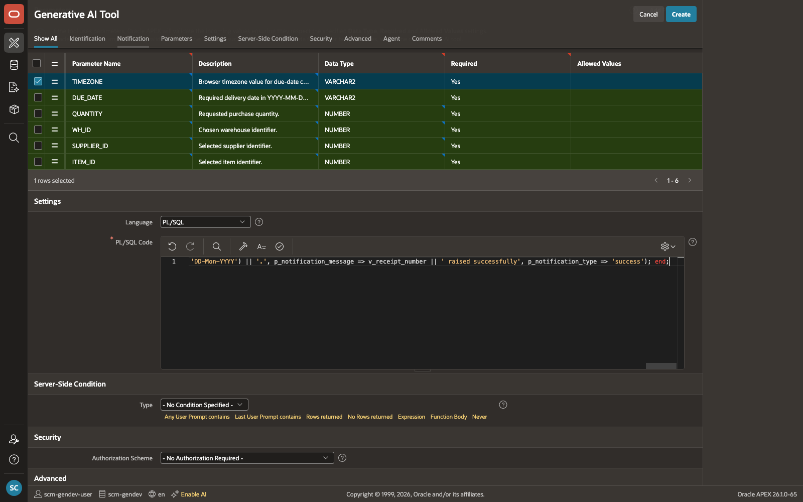

4. In the **PL/SQL Code** field, enter:

    ```plsql
    <copy>
    declare
       v_receipt_number varchar2(30);
       v_receipt_id     number;
       v_user_id        number;
       v_item_name      varchar2(200);
       v_uom            varchar2(10);
       v_supplier_name  varchar2(200);
       v_warehouse_name varchar2(200);
       v_seq            number;
       v_due            timestamp with time zone;
    begin
       select application_user_id
         into v_user_id
         from scm_application_users
        where user_name = :APP_USER;

       select item_name, base_uom_code
         into v_item_name, v_uom
         from scm_items
        where item_id = :ITEM_ID;

       select partner_name
         into v_supplier_name
         from scm_business_partners
        where business_partner_id = :SUPPLIER_ID;

       select warehouse_name
         into v_warehouse_name
         from scm_warehouses
        where warehouse_id = :WH_ID;

       select nvl(max(to_number(regexp_substr(receipt_number,'\d+$'))), 0) + 1
         into v_seq
         from scm_inbound_receipts
        where receipt_number like 'POR-%';

       v_receipt_number := 'POR-' || lpad(v_seq, 6, '0');

       v_due := to_timestamp_tz(
                   :DUE_DATE || ' 17:00:00 ' || :TIMEZONE,
                   'YYYY-MM-DD HH24:MI:SS TZR'
                );

       insert into scm_inbound_receipts (
          receipt_number, receipt_source_code, warehouse_id,
          source_partner_id, receipt_status_code,
          expected_arrival_at, received_by
       ) values (
          v_receipt_number, 'SUPPLIER', :WH_ID,
          :SUPPLIER_ID, 'PLANNED',
          v_due, :APP_USER
       ) returning inbound_receipt_id into v_receipt_id;

       insert into scm_inbound_receipt_lines (
          inbound_receipt_id, line_number, item_id,
          expected_quantity, received_quantity,
          accepted_quantity, quarantine_quantity,
          damaged_quantity, shortage_quantity,
          overage_quantity, rejected_quantity,
          line_status_code
       ) values (
          v_receipt_id, 1, :ITEM_ID,
          :QUANTITY, 0,
          0, 0, 0, 0, 0, 0,
          'OPEN'
       );

       update scm_replenishment_alerts
          set alert_status_code   = 'ACTIONED',
              reviewed_at         = systimestamp,
              reviewed_by_user_id = v_user_id
        where item_id             = :ITEM_ID
          and warehouse_id        = :WH_ID
          and alert_status_code  in ('OPEN', 'IN_REVIEW');

       apex_ai.set_tool_result(
          p_result               => 'Purchase order ' || v_receipt_number
                                    || ' raised for '   || v_item_name
                                    || ' - '            || :QUANTITY
                                    || ' '              || v_uom
                                    || ' from '         || v_supplier_name
                                    || ' to '           || v_warehouse_name
                                    || '. Expected delivery '
                                    || to_char(v_due, 'DD-Mon-YYYY') || '.',
          p_notification_message => v_receipt_number || ' raised successfully',
          p_notification_type    => 'success'
       );
    end;
    </copy>
    ```

    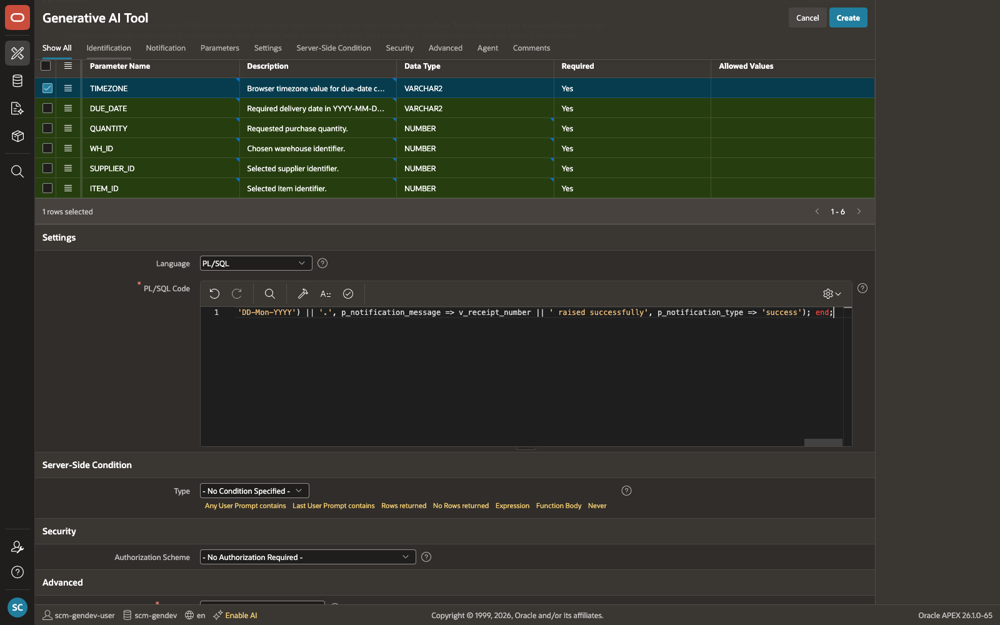

5. Click **Create**.

    This PL/SQL block:

    - Creates a planned supplier receipt with a sequential purchase order number
    - Inserts the receipt line for the selected item and quantity
    - Marks the relevant replenishment alert as `ACTIONED`
    - Pushes a success notification back to the chat UI with `apex_ai.set_tool_result`

    | Table | What it does |
    | --- | --- |
    | scm\_inbound\_receipts | Inserts the planned purchase-order header |
    | scm\_inbound\_receipt\_lines | Inserts the purchase-order line |
    | scm\_replenishment\_alerts | Marks the alert as actioned |
    | scm\_application\_users | Resolves the current application user |
    | scm\_items | Resolves item name and UOM |
    | scm\_business\_partners | Resolves supplier name |
    | scm\_warehouses | Resolves warehouse name |
    {: title="Tables used by raise\_purchase\_order"}

    

## Summary

All eight tools are now in place. The agent can identify stock at risk, evaluate suppliers, collect delivery performance, confirm the destination warehouse, get user confirmation, and raise a purchase order, all through a single guided conversation.

In the next lab, you will wire the agent to the application and run it end to end.

You may now **proceed to the next Lab**.

## Acknowledgements

- **Author** - Sahaana Manavalan, Senior Product Manager, April 2026
- **Last Updated By/Date** - Sahaana Manavalan, Senior Product Manager, April 2026
