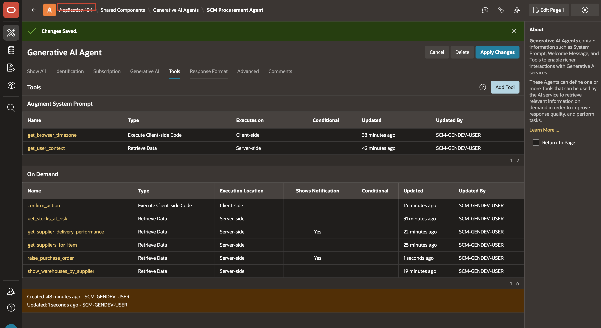
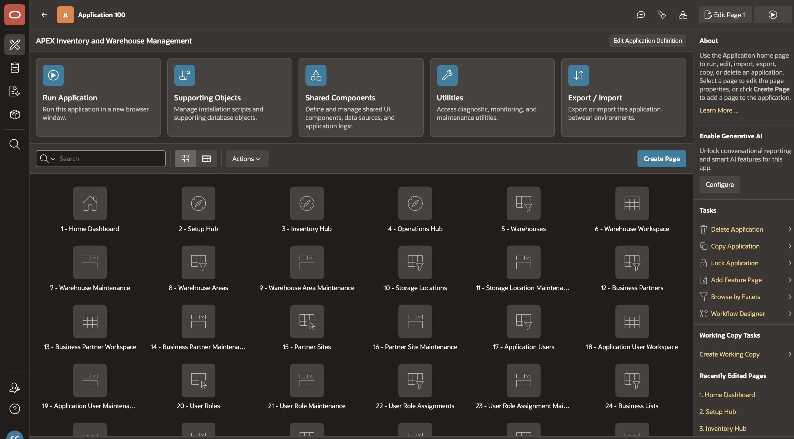
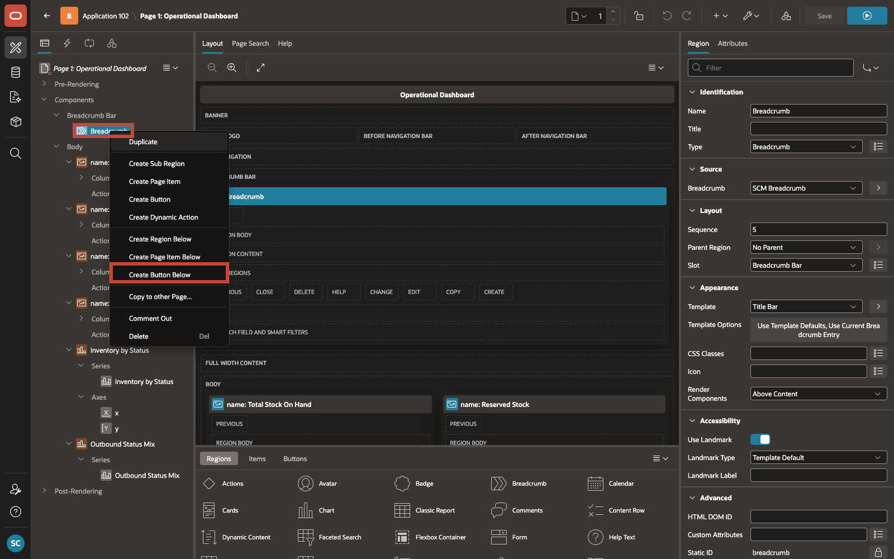
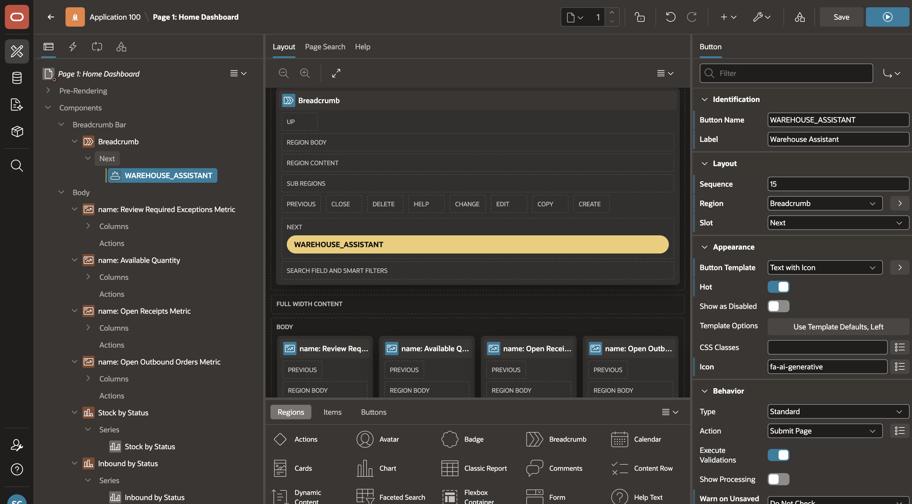
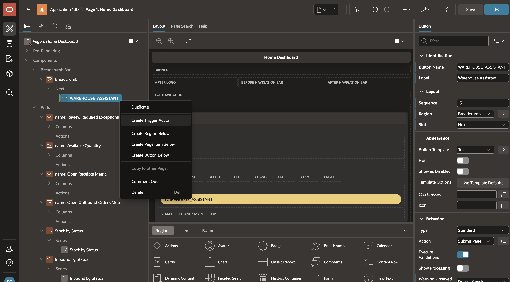
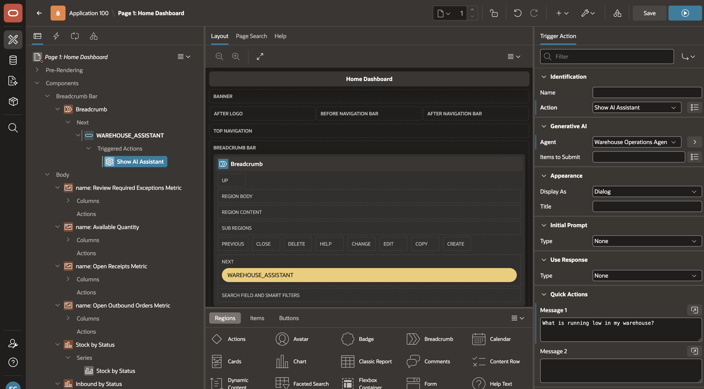
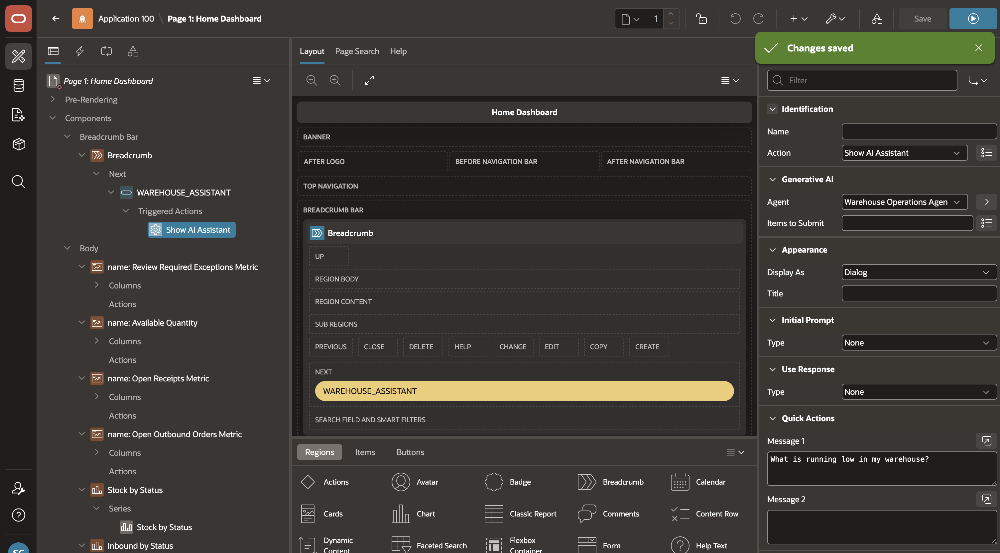
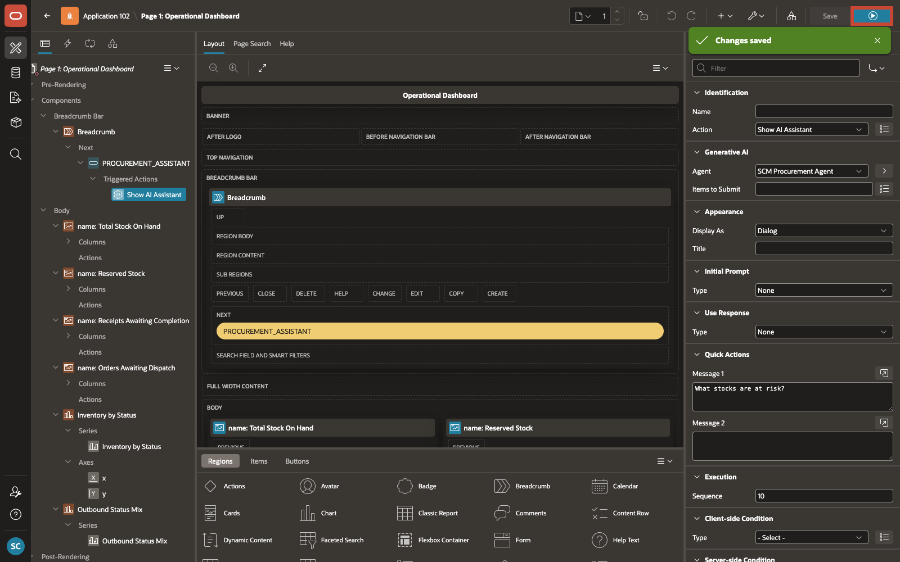

# Add the Agent to the Application and Run the Application

## Introduction

In this lab, you will wire the **Warehouse Operations Agent** to the **APEX Inventory and Warehouse Management** application and run an end-to-end warehouse operations flow to verify it works correctly.

Estimated Time: 10 minutes

### Objectives

In this lab, you will:

- Add the **Warehouse Operations Agent** to the **Operational Dashboard**

- Run the application and test the end-to-end warehouse operations process

## Task 1: Add the Agent to the Application

In this task, you will configure the entry point that users will use to start the AI Assistant from the Operational Dashboard. You will add a button to Page 1 and attach a trigger action that opens **Warehouse Operations Agent** directly from the running application.

1. On the **Warehouse Operations Agent** page, select the App ID to return to the application home page.

    

2. From the application home page, select **Page 1 - Operational Dashboard** to open it in Page Designer.

    

3. In **Page Designer**, under **Rendering > Breadcrumb Bar**, right-click **Breadcrumb** and select **Create Button Below**.

    

4. With the new button selected, enter/select the following in the **Property Editor**:

    - Under **Identification**:

        - Button Name: **WAREHOUSE_ASSISTANT**
        - Label: **Warehouse Assistant**

    - Under **Layout**:

        - Region: **Breadcrumb**
        - Slot: **Next**

    - Under **Appearance**:

        - Button Template: **Text with Icon**
        - Hot: Toggle **On**
        - Icon: **fa-ai-sparkle-generate-audio**

    

5. In the **Rendering** tree, right-click **Warehouse Assistant** and select **Create Trigger Action**.

    

6. With the new trigger action selected, enter/select the following in the **Property Editor**:

    - Under **Identification**:

        - Action: **Show AI Assistant**

    - Under **Settings**:

        - Agent: **Warehouse Operations Agent**
        - Quick Message 1: **What is running low in my warehouse?**

    

7. Click **Save** to persist the button and trigger action changes.

    

## Task 2: Verify Prerequisites

In this task, you will confirm that the user you will sign in with is set up correctly before launching the application.

1. Confirm that the user you will sign in with maps to a row in `scm_application_users`.

    If you are using Workspace Authentication, either:

    - create workspace users that match the sample usernames such as `JOHN.CARTER`, `JANE.SMITH`, `SAHAANA`, and `SAMANAVA`, or

    - add your own workspace login to `scm_application_users` and the related role tables

## Task 3: Run the Application

In this task, you will launch the application and validate an end-to-end warehouse operations flow. It begins with identifying low stock, continues through locating where inventory is held, and ends with creating a controlled stock adjustment.

1. From the saved **Page Designer** screen, click **Run** to launch the application.

    

2. Sign in with a user that exists in `scm_application_users`.

3. On **Operational Dashboard**, click **Warehouse Assistant** to open the AI Assistant, then begin the conversation with the quick message:

    ```
    What is running low in my warehouse?
    ```

4. As the conversation progresses, the expected tool flow is:

    | Step | Tool Called | Purpose |
    | --- | --- | --- |
    | Auto | `get_user_context` | Adds the user's identity, role, warehouse, default warehouse, and manager |
    | Auto | `get_browser_timezone` | Adds the browser timezone |
    | On Demand | `get_low_stock_items` | Returns low-stock items in the user's warehouse |
    | On Demand | `get_item_location_balances` | Returns location-level balances for the selected item |
    | On Demand | `get_inbound_receipts_needing_attention` | Returns inbound receipts that need receiving or review |
    | On Demand | `get_outbound_orders_needing_attention` | Returns outbound orders that need picking, packing, or release |
    | On Demand | `confirm_action` | Requests human confirmation before the stock adjustment is created |
    | On Demand | `create_stock_adjustment` | Inserts the stock adjustment and updates inventory balance |
    {: title="Expected Tool Flow"}

5. Continue the process with prompts such as:

    ```
    Show me location balances for Industrial Bearings.
    ```

    ```
    What inbound receipts need attention?
    ```

    ```
    Create a stock adjustment to increase Industrial Bearings by 10 in the primary location.
    ```

6. When the agent asks for the location, direction, quantity, and reason, provide the values required for the stock adjustment.

7. Confirm the browser dialog when it appears so the stock adjustment can be created.

8. Verify that a new record appears in `scm_stock_adjustments`, that a related line appears in `scm_stock_adjustment_lines`, and that the inventory balance is updated in `scm_inventory_balances`.

## Summary

You have completed the workshop. The Operational Dashboard now launches the AI Assistant from a dedicated button, and the Warehouse Operations Agent is ready to guide users through low stock review, operational work review, and controlled stock adjustments within a single conversation.

This is what AI Agents in Oracle APEX make possible: a user with a question can get a reasoned, data-driven answer and take a real action in the application, without leaving the page.

## Acknowledgements

- **Author** - Sahaana Manavalan, Senior Product Manager, April 2026
- **Last Updated By/Date** - Sahaana Manavalan, Senior Product Manager, April 2026
