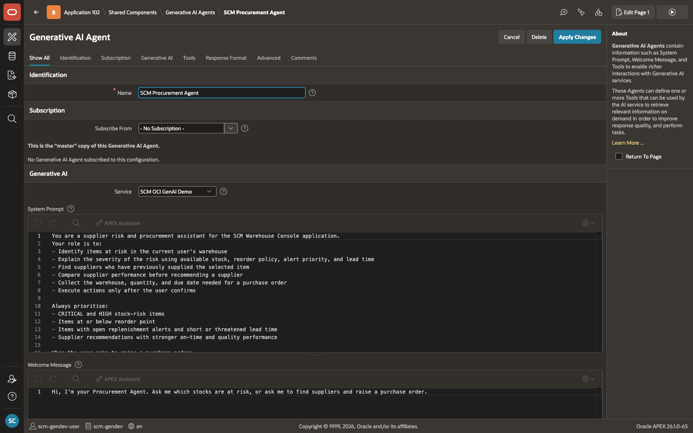
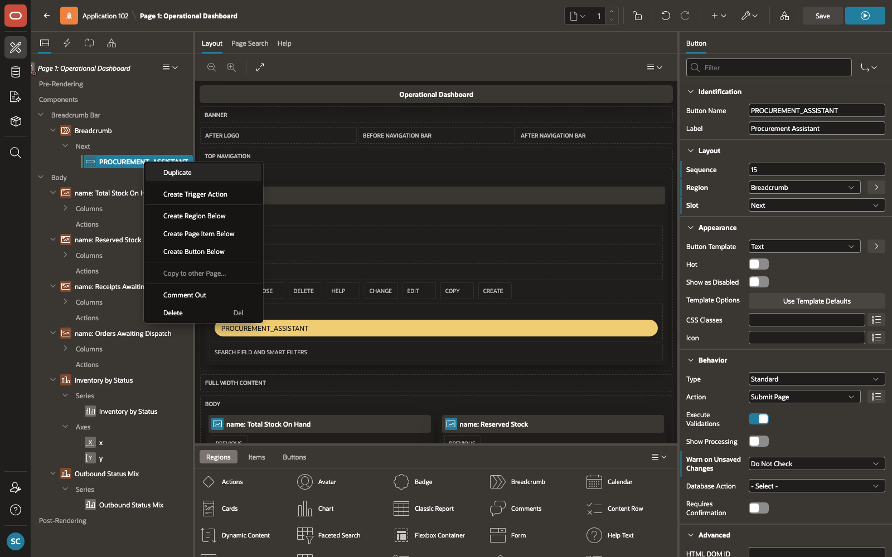

# Add the Agent to the Application and Run the Application

## Introduction

In this lab, you will wire the **SCM Procurement Agent** to the application and run the end-to-end procurement process to verify it works correctly.

Estimated Time: 10 minutes

### Objectives

In this lab, you will:

- Add the **SCM Procurement Agent** to the **Operational Dashboard**

- Run the application and test the end-to-end procurement process

## Task 1: Add the Agent to the Application

In this task, you will configure the entry point that users will use to start the AI Assistant from the Operational Dashboard. You will add a button to Page 1 and attach a trigger action that opens **SCM Procurement Agent** directly from the running application.

1. On the **SCM Procurement Agent** page, select **Edit Page 1** to open **Page 1 - Operational Dashboard** in **Page Designer**.

    

2. In **Page Designer**, under **Rendering > Breadcrumb Bar**, right-click **Breadcrumb** and select **Create Button Below**.

    

3. With the new button selected, configure the following values in the **Property Editor**:

    | Field | Value |
    | --- | --- |
    | Button Name | **PROCUREMENT\_ASSISTANT** |
    | Label | **Procurement Assistant** |
    | Region | **Breadcrumb** |
    | Slot | **Next** |
    {: title="Button Configuration"}

    

4. In the **Rendering** tree, right-click **Procurement Assistant** and select **Create Trigger Action**.

    

5. With the new trigger action selected, configure the following values in the **Property Editor**:

    | Field | Value |
    | --- | --- |
    | Action | **Show AI Assistant** |
    | Agent | **SCM Procurement Agent** |
    | Quick Message 1 | **What stocks are at risk?** |
    {: title="Trigger Action Configuration"}

    

6. Click **Save** to persist the button and trigger action changes.

    

## Task 2: Verify Prerequisites

In this task, you will confirm that the user you will sign in with is set up correctly before launching the application.

1. Confirm that the user you will sign in with maps to a row in `scm\_application\_users`.

    If you are using Workspace Authentication, either:

    - create workspace users that match the sample usernames such as `JOHN.CARTER`, `JANE.SMITH`, `SAHAANA`, and `SAMANAVA`, or

    - add your own workspace login to `scm\_application\_users` and the related role tables

## Task 3: Run the Application

In this task, you will launch the application and validate the end-to-end procurement process. It begins with a stock shortage, continues through supplier evaluation, and ends with creation of a planned purchase order.

1. From the saved **Page Designer** screen, click **Run** to launch the application.

2. Sign in with a user that exists in `scm\_application\_users`.

3. On **Operational Dashboard**, click **Procurement Assistant** to open the AI Assistant, then begin the conversation with the quick message:

    ```
    What stocks are at risk?
    ```

4. As the conversation progresses, the expected tool flow is:

    | Step | Tool Called | Purpose |
    | --- | --- | --- |
    | Auto | get\_user\_context | Adds the user's identity, role, warehouse, approval authority, and manager |
    | Auto | get\_browser\_timezone | Adds the browser timezone |
    | On Demand | get\_stocks\_at\_risk | Returns the stock-risk items in the user's warehouse |
    | On Demand | get\_suppliers\_for\_item | Returns suppliers for the selected item |
    | On Demand | get\_supplier\_delivery\_performance | Returns detailed supplier performance for the requested period |
    | On Demand | show\_warehouses\_by\_supplier | Returns the warehouses that supplier has delivered to |
    | On Demand | confirm\_action | Requests human confirmation before the purchase order is raised |
    | On Demand | raise\_purchase\_order | Inserts the planned purchase order and raises a success notification |
    {: title="Expected Tool Flow"}

5. Continue the process with prompts such as:

    ```
    Show me suppliers for Industrial Bearings.
    ```

    ```
    Show me delivery performance for Apex Industrial last quarter.
    ```

    ```
    Yes, raise a PO.
    ```

6. When the agent asks for the destination warehouse, quantity, and delivery date, provide the values required for the purchase order.

7. Confirm the browser dialog when it appears so the purchase order can be created.

8. Verify that a new planned record appears in `scm\_inbound\_receipts`, that the related line appears in `scm\_inbound\_receipt\_lines`, and that the replenishment alert is marked as actioned.

## Summary

You have completed the workshop. The Operational Dashboard now launches the AI Assistant from a dedicated button, and the SCM Procurement Agent is ready to guide users through supplier evaluation and purchase order creation within a single conversation.

This is what AI Agents in Oracle APEX make possible: a user with a question can get a reasoned, data-driven answer and take a real action in the application, without leaving the page.

## Acknowledgements

- **Author** - Sahaana Manavalan, Senior Product Manager, April 2026
- **Last Updated By/Date** - Sahaana Manavalan, Senior Product Manager, April 2026
