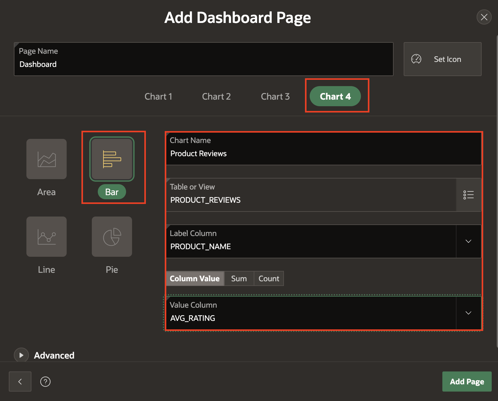
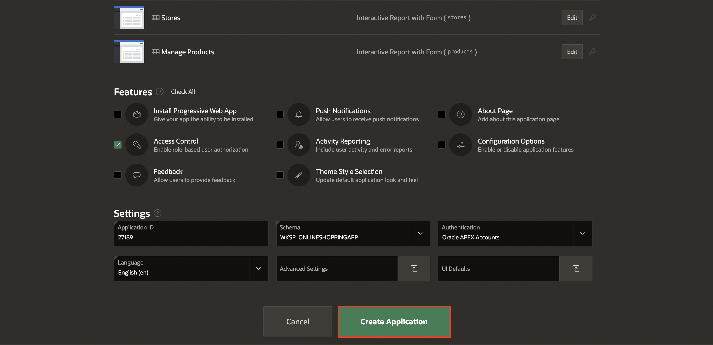
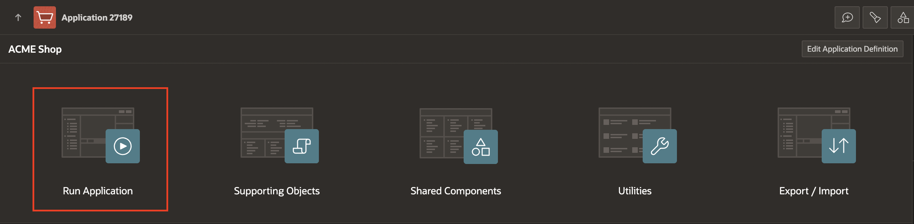

# Create the application

## Introduction

In this lab, you build an application based on the data structures you built in previous labs.

Estimated Time: 15 minutes

Watch the video below for a quick walk-through of the lab.
[Create the Application](videohub:1_4qg90epw)

### Objectives

In this lab, you will:

- Create an application using the tables and data that you already have installed.

## Task 1: Create an Application

1. Navigate to **App Builder** and select **Create**.

    

2. Click **Use Create App Wizard**.

    

## Task 2: Add a Name and Icon to the Application

1. In the Create Application wizard, for Name, enter **ACME Shop** and click the application icon.

    

2. Click **Upload your own icon** to select an icon or simply drag and drop the image. Download a sample icon [here](./images/shopping-cart.png).

    

3. Adjust the icon if needed and click **Save Icon**.

    

## Task 3: Add the Dashboard Page

A dashboard page is a great way to show important information using various charts. When you installed the Sample Dataset, it also created a number of views, which join data from various tables. These views are ideal as the basis for the dashboard charts.

1. In the Create Application wizard, click **Add Page**.

    

2. Click **Dashboard**.

    

3. Select **Chart 1**, enter/select the following:

    - Chart Type: **Bar**

    - Chart Name: **Top 10 Products**

    - Table or View: **PRODUCT_ORDERS**

    - Label Column: **PRODUCT_NAME**

    - Type: **Sum**

    - Value Column: **TOTAL_SALES**

    

4. Select **Chart 2**, enter/select the following:

    - Chart Type: **Pie**

    - Chart Name: **Top 5 Stores**

    - Table or View: **STORE_ORDERS**

    - Label Column: **STORE_NAME**

    - Type: **Sum**

    - Value Column: **TOTAL_SALES**

    

5. Select **Chart 3**, enter\select the following:

    - Chart Type: **Pie**

    - Chart Name: **Order Status**

    - Table or View: **CUSTOMER\_ORDER\_PRODUCTS**

    - Label Column: **ORDER_STATUS**

    - Type: **Count**

    - Value Column: **ORDER_ID**

    

6. Select **Chart 4**, enter/select the following:

    - Chart Type: **Bar**

    - Chart Name: **Product Reviews**

    - Table or View: **PRODUCT_REVIEWS**

    - Label Column: **PRODUCT_NAME**

    - Type: **Column Value**

    - Value Column: **AVG_RATING**

    

7. Navigate to **Advanced**, check **Set as Administration Page** and Click **Add Page**.

    Setting a page as Administration Page will make that only certain users can run the page. In this case, only users with Administration Rights will be able to run the Dashboard page, which means that this page will require authentication.

    

## Task 4: Add the Products Page

1. In the **Create an Application** wizard, click **Add Page**.

    

2. Click **Faceted Search**.

    

3. On the **Add Faceted Search Page**, enter/select the following:

    - Page Name: **Products**

    - Select **Cards**

    - Table: **PRODUCTS**

    - Select **Grid**

    - Title Column: **PRODUCT_NAME**

    - Body Column: **- Select Column -** (to unselect the default column chosen)

    

4. Navigate to **Advanced**, check **Set as Home Page** and select **Add Page**.

    

## Task 5: Delete Original Home Page

Since we designated the product faceted search page as the application's home page, we no longer need the default home page that the wizard included in the list of pages. Therefore, in this task, we will remove the original home page.

1. Navigate to the original page named "Home" and click **Edit**.

    

2. Click **Delete**.

    

3. Confirm the deletion by clicking **OK** on the dialog.

    

## Task 6: Add Multiple Reports

1. In the **Create an Application** wizard, click **Add Page**.

2. Navigate **Additional Pages** to see additional page types and select **Multiple Reports**.

    

3. On the **Add Multiple Reports** dialog, select the following tables:

    - CLOTHING_LOOKUP
    - COLOR_LOOKUP
    - CUSTOMERS
    - DEPARTMENT_LOOKUP
    - PRODUCT_REVIEWS
    - STORES

4. Click **Add Pages**.

    

## Task 7: Set Multiple Reports as Administration Pages

1. Edit each of the following pages to set it as an Administration Page:
    - CLOTHING_LOOKUP
    - COLOR_LOOKUP
    - CUSTOMERS
    - DEPARTMENT_LOOKUP
    - PRODUCT_REVIEWS
    - STORES

    

2. For each page you edit, navigate to **Advanced** and check **Set as Administration Page**.

3. Click **Save Changes**.

    

## Task 8: Add Manage Products Page

1. In the **Create an Application** wizard, click **Add Page**.

2. Click **Interactive Report**.

    

3. On the **Add Report Page**, enter/select the following:

    - Page Name: **Manage Products**

    - Table: **PRODUCTS**

    - Check **Include Form**

4. Navigate to **Advanced**, check **Set as Administration Page** and select **Add Page**.

    

## Task 9: Set Features

Features are a set of optional application capabilities Oracle APEX can include for your new application. Access Control enables role-based user authorization with a single click.

1. Under **Features** section, check **Access Control**.

    

## Task 10: Finish Creating the Application

Now that you have added all the pages, it is time to generate the app and review it.

1. Scroll to the bottom of the page, and click **Create Application**.

    

2. Once the application is created, you will find the new app on the application home page.
Click **Run Application**.

    

## Task 11: Run the Application

1. Enter your user credentials. Click **Sign In**.

    

2. The new application will be displayed. Explore the pages that you just created by clicking on the navigation menu.

    

## Summary

You now know how to create an application with a number of different page types based on existing database objects. You may now **proceed to the next lab**.

## Acknowledgments

- **Author(s)** - Apoorva Srinivas, Senior Product Manager; Mónica Godoy, Principal Product Manager;
- **Last Updated By/Date** - Ankita Beri, Product Manager, January 2025
