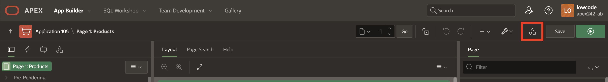

# Build AI Generative text and Chat Assistant for Product Reviews and Customer Enquiries

## Introduction

In this lab, you'll learn how to create an AI-powered text generation and chat assistant to summarize product reviews and handle customer inquiries effectively. By setting up generative AI configurations and integrating RAG sources, you'll equip your application with the capability to dynamically generate text and answer questions related to products.

Estimated Time: 20 minutes

### Objectives

- Configure AI attributes to integrate a generative AI service.

- Set up AI configurations and RAG sources.

- Create Dynamic Actions for Text Generation using AI.

- Add a chat assistant to handle product-related enquiries.

>*Note: Before beginning this lab, ensure that AI is configured.*

## Task 1: Configure AI Attributes

In this task, you'll configure AI attributes, which form the foundation for integrating generative AI into your application.

1. From the Page Designer toolbar, navigate to **Shared Components**.

    

2. Under **Generative AI**, select **AI Attributes**.

    

3. Now, in the AI Attributes page, enter/select the following:

    - Generative AI > Service:  **Open AI**

4. Click **Apply Changes**.

    

## Task 2: Create AI Configuration and RAG Sources

In this task, you will set up an AI configuration and then add RAG sources to it.

1. Within AI Attributes Page, click **Shared Components**.

    

2. Under **Generative AI**, click **AI Configurations**.

    

3. Click **Create**.

    

4. In the Generative AI Configuration page, enter/select the following:

    - Identification > Name : **Summarize Project Details**

    - Generative AI > System Prompt: **Analyze the provided information and generate a concise summary in a single paragraph.**

5. Click **Create**.

    

6. In the newly created Generative AI Configuration, navigate to **RAG Sources** tab and select **Create RAG Source**.

    

7. Enter/select the following:

    - Identification > Name: **Product Details Query**

    - Source > SQL Query: Copy and paste the below SQL Query

        ```
        <copy>
        SELECT
            'Product Name : '
            || PRODUCT_NAME
            || CHR(10)
            || CHR(13)
            || 'Unit Price : '
            || UNIT_PRICE
            || CHR(10)
            || CHR(13) AS CONCATENATED_RESULT
        FROM
            PRODUCTS
        </copy>
        ```

8. Click **Create**

    

9. Again, click **Create RAG Source**.

    

10. Enter/select the following:

    - Identification > Name: **Product Reviews**

    - Source > SQL Query: Copy and paste the below SQL Query

        ```
        <copy>
        SELECT
            'Product Name : '
            || PRODUCT_NAME
            || CHR(10)
            || CHR(13)
            || 'Average Rating : '
            || AVG_RATING
            || CHR(10)
            || CHR(13)
            || 'Customer Review : '
            || REVIEW
            || CHR(10)
            || CHR(13)
            || 'RATING : '
            || RATING
            || CHR(10)
            || CHR(13) AS CONCATENATED_RESULT
        FROM
            PRODUCT_REVIEWS
        WHERE UPPER(PRODUCT_NAME) = UPPER(:P18_PRODUCT_NAME)
        </copy>
        ```

11. Click **Create**

    

12. Click **Apply Changes**.

    

    >*Note: The SQL query may vary depending on the data model created in the first step. Ensure your query is error-free and retrieves all necessary details from the Project Management View. Also, we will change this SQL Query and append a Where class in the next steps.*

## Task 3: Add Generate Text with AI dynamic action

1. From your AI Configurations Page, navigate to **App xxx**.

    

2. Select root node **Page 18:Manage your Cart**.

    

3. In the **Rendering** tab, right-click **Button Bar** and select **Create Page Item**.

    

4. In the Property Editor, enter/select the following:

    - Under Identification:

        - Name: **P18\_PRODUCT\_NAME**

        - Type: **Hidden**

    

5. In the **Rendering** tab, navigate to **Components**. Right-click **Components** and select **Create Page Item**.

    

6. In the Property Editor, enter/select the following:

    - Under Identification:

        - Name: **P18\_REVIEW\_SUMMARY**

        - Type: **Display Only**

    - Label > Label: **Review Summary**

    - Settings > Send On Page Submit: Toggle **OFF**

    

7. Navigate to **Dynamic Action** tab, right-click **Page Load** and select **Create Dynamic Action**.

    

8. In the Property Editor, for Name: enter **Generate Summary**.

    

9. Under **True** action, navigate to **Show** and enter/select the following:

    - Identification > Action: **Generate Text With AI**

    - Generative AI > Configuration: **Summarise Product Details**

    - Under Input Value:

        - Type: **Item**

        - Item: **P18\_PRODUCT\_NAME**

    - User Response:

        - Type: **Item**

        - Item: **P18\_REVIEW\_SUMMARY**

    

10. Click **Save**.

11. In the Page Designer toolbar, navigate to Page Finder and select page **1**.

    

12. In the **Rendering** tab, navigate to **Search Results** region. Under **Actions**, select **Full Card**. In the Property Editor, under Link > Target, select **Page 18** and set the following items:

    | Name | Value |
    | ---- | ----- |
    | P18\_PRODUCT\_NAME | &PRODUCT_NAME. |

    Click **OK**.

    

13. Click **Save**.

## Task 4: Add a Chat Assistant for Product Enquiries

1. On Page **1**, in the **Rendering** tab, right-click **Button Bar** and select **Create Button**.

    

2. In the Property Editor, enter/select the following:

    - Identification > Button Name: **Enquiry**

    - Layout > Slot: **Create**

    - Under Appearance:

        - Button Template: **Text with Icon**

        - Hot: Toggle **On**

        - Icon: **fa-chatbot**

    

3. Right-click **Enquiry** button and select **Create Dynamic Action**.

    

4. In the Property Editor, for Name: enter **Show Chat Widget**.

    

5. Under **True** action, navigate to **Show** and enter/select the following:

    - Identification > Action: **Show AI Assistant**

    - Generative AI > Configuration: **Summarise Product Details**

    - Under Quick Actions:

        - Message 1: **Products Available**

        - Message 2: **Cost of Products**

    

    

6. Click **Save and Run**.

## Task 5: Run the New Application

1. In the Runtime environment, select any Product and view the Review summary of all reviews given by the customers using AI Generative text Dynamic Action.

    

    

2. Now, close the dialog box and navigate to **Enquiry** button.

    

3. A Chat Assistant dialog box will open. Now, play around with the Chat Assistant and ask any question related to the products.

    

    

## Summary

You know now how to create a view, configure AI attributes, and set up generative AI configurations to build a foundation for AI-powered applications. You also integrated RAG sources to enhance the AI's knowledge and explored text generation features to add dynamic capabilities to your projects.

## Learn More - *Useful Links*

- APEX on Autonomous:   [https://apex.oracle.com/autonomous](https://apex.oracle.com/autonomous)
- APEX Collateral:   [https://apex.oracle.com](https://apex.oracle.com)
- Tutorials:   [https://apex.oracle.com/en/learn/tutorials](https://apex.oracle.com/en/learn/tutorials)
- Community:  [https://apex.oracle.com/community](https://apex.oracle.com/community)
- External Site + Slack:   [http://apex.world](http://apex.world)

## Acknowledgments

- **Author** - Ankita Beri, Product Manager
- **Last Updated By/Date** - Ankita Beri, Product Manager, January 2025
