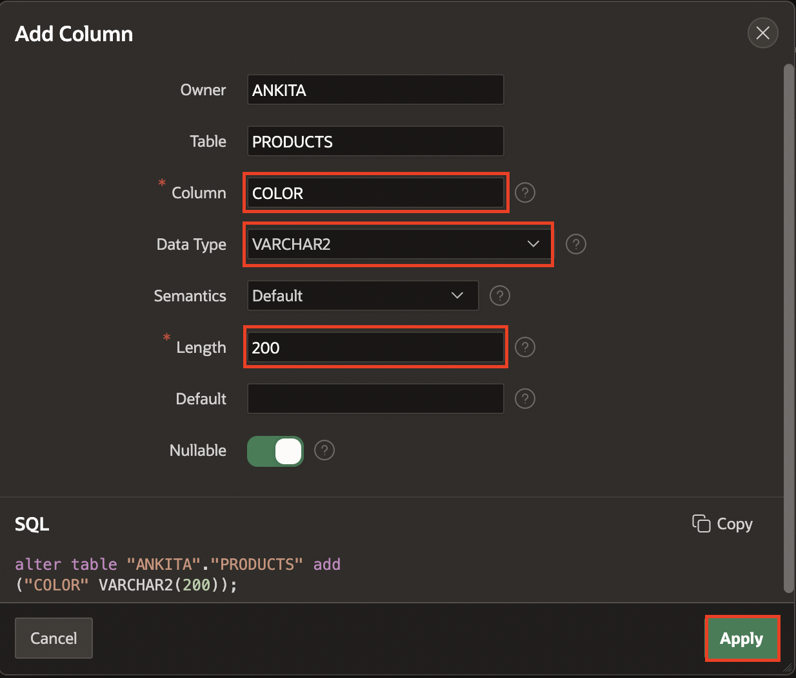
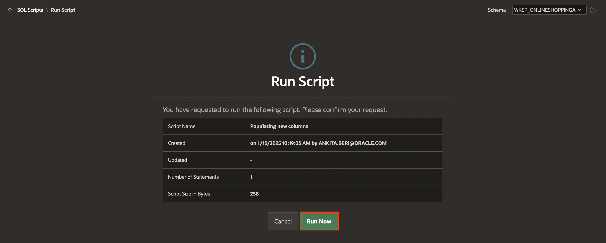
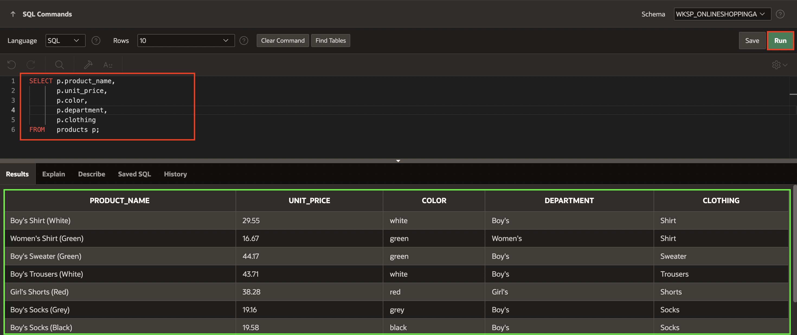
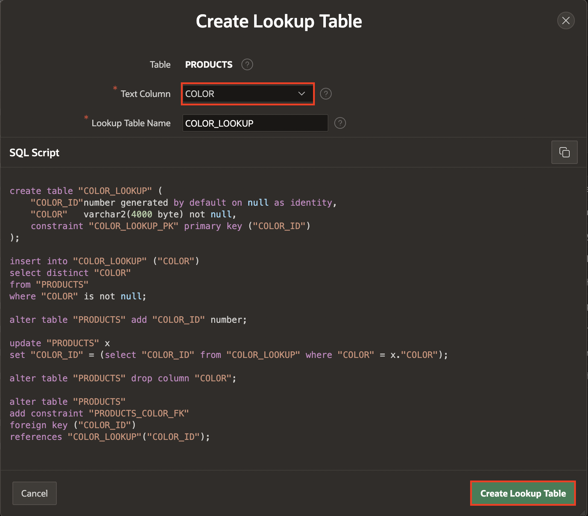
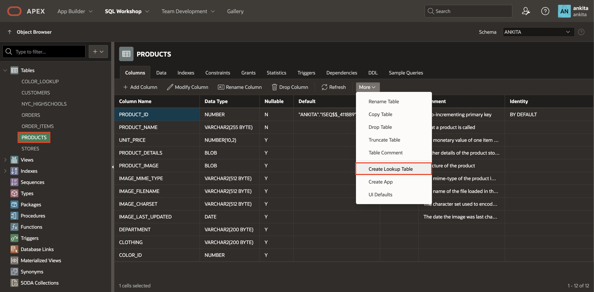
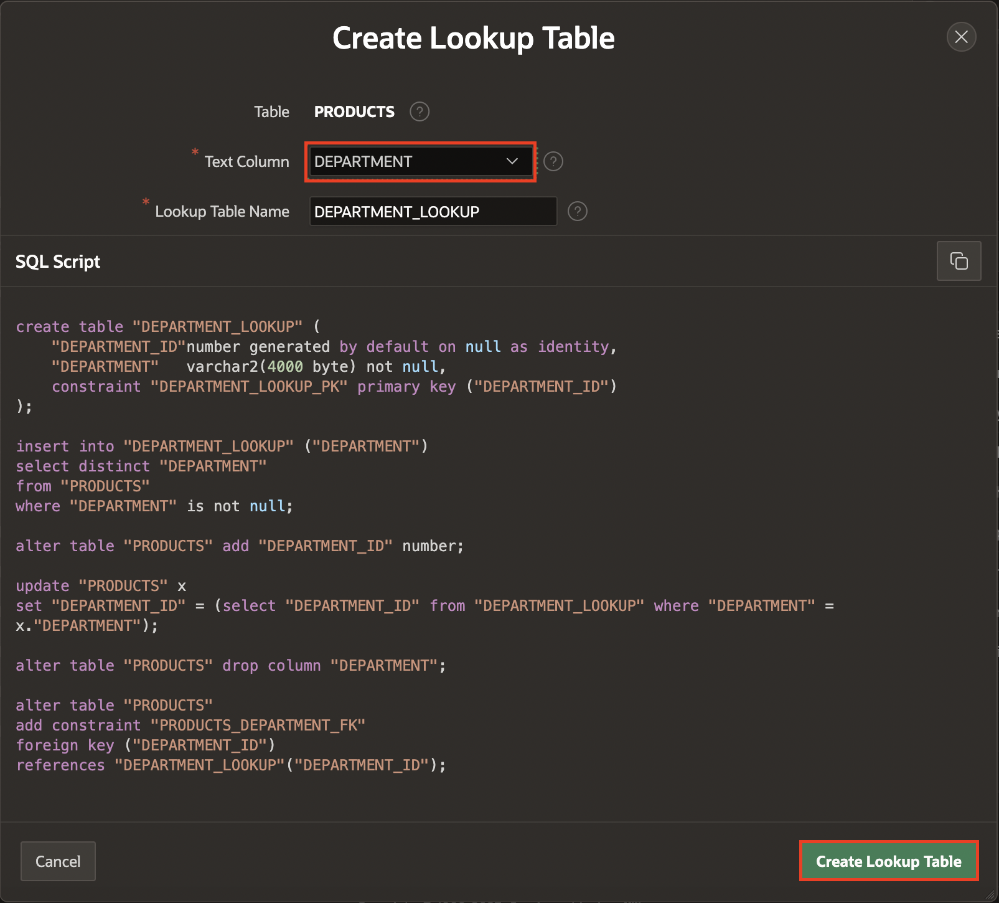
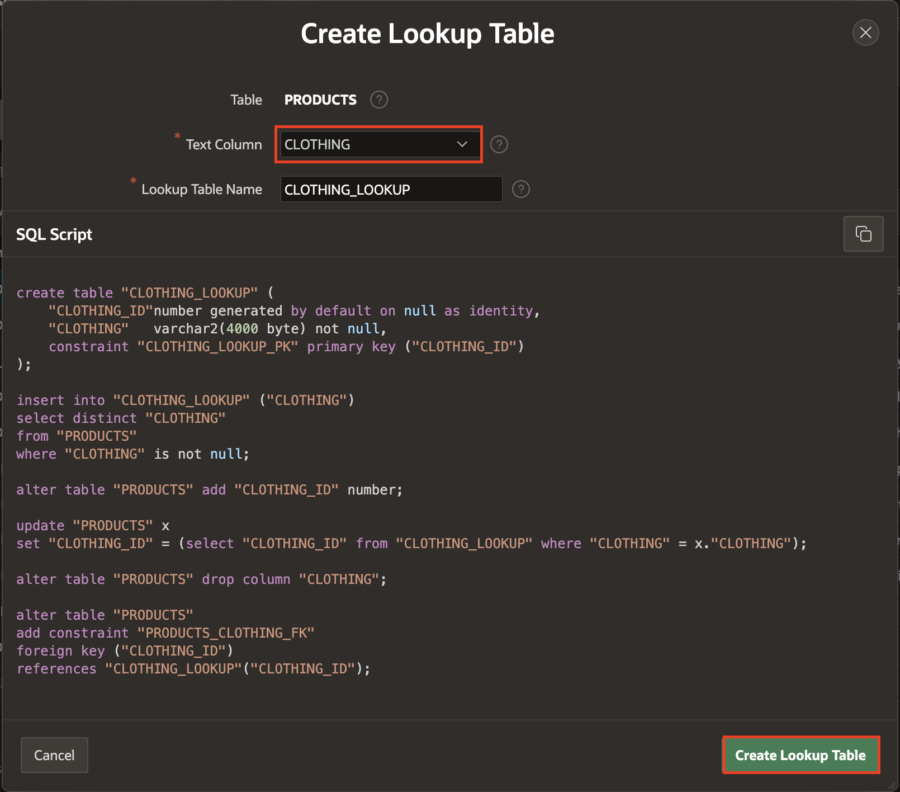
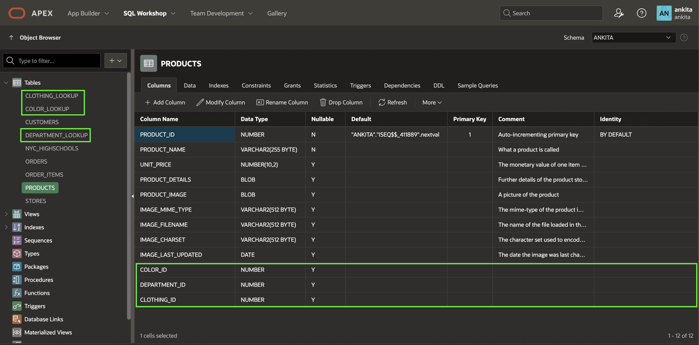

# Add columns to the products table

## Introduction

The **PRODUCTS** table includes some columns such as image, price, and details. But there are other characteristics that customers would appreciate knowing about the product, like color, type of clothing, and department. For that reason, you will add these columns to the Products table. 
To avoid data redundancy, you will need to create three additional tables to normalize the data. Instead of creating these three tables for yourself, you'll use the **Create Lookup Table** feature.

In this lab, you will learn how to add these three new columns to the **PRODUCTS** table and then create lookup tables for those new columns.

Estimated Time: 10 minutes

Watch the video below for a quick walk through of the lab.

[](youtube:klrFD971TtI)

### Objectives
In this lab, you will:
- Add new columns to the existing Products table
- Populate the new columns
- Create lookup tables

## Task 1: Add Columns to the Products Table

1. From your APEX workspace home page, click **SQL Workshop**.

2. Click **Object Browser**.

3. Navigate to **PRODUCTS** Table.

    

4. Click **Add Column** button.

5. For Color column, enter the following:

    * Add Column - enter **COLOR**
    * Type - select **VARCHAR2**
    * Length - enter **200**.

6. Click **Next**.

    

7. Click **Finish**.

8. Click **Add Column** button.

9.  For Department column, enter the following:

    * Add Column - enter **DEPARTMENT**
    * Type - select **VARCHAR2**
    * Length - enter **200**.

10. Click **Next**.

    

11. Click **Finish**.

12. Click **Add Column** button.

13. For Clothing column, enter the following:

    * Add Column - enter **CLOTHING**
    * Type - select **VARCHAR2**
    * Length - enter **200**.

14. Click **Next**.

    

15. Click **Finish**.

## Task 2: Populate the new columns

1. From the Oracle APEX Home, click **SQL Workshop**.

2. Click **SQL Scripts**.

3. Click **Create**.

4. For Script Name, enter **Populating new columns**.

5. Copy the following script and paste into the editor.
    ```
    <copy>
    UPDATE
        (
                SELECT p.product_id,
                        p.product_name,
                        p.clothing,
                        p.color,
                        p.department,
                        p.product_details
                FROM   products p ) p
    SET    p.clothing = Substr(product_name, Instr(product_name, ' ',1,1)+1, Instr(product_name, ' ',1, 2)+1 - Instr(product_name, ' ',1,1)- 2),
        p.color =
        (
                SELECT c.color
                FROM   json_table (p.product_details, '$' COLUMNS ( color VARCHAR2(4000) path '$.colour') ) c),
        p.department =
        (
                SELECT g.department
                FROM   json_table (p.product_details, '$' COLUMNS ( department VARCHAR2(4000) path '$.gender') ) g)
    ```

    This script inserts the unique product type values (e.g. Shirt, Jacket, Skirt, etc.) into the CLOTHING column in the **Products** table. Similary, it inserts the unique department names (e.g. Boy's, Girl's, Men's, Women's) and color names into the DEPARTMENT and COLOR columns respectively based on information found in the JSON product details column in the **Products** table.

5. Click **Run**.

6. Click **Run Now**.

    

7. The Script Results page is displayed listing the statements processed, successful, and with errors.

    

8. To check the values in the Products table, click **SQL Workshop** and click **SQL Commands**.

9. Copy the following SQL Query.
    ```
    <copy>
    SELECT p.product_name,
           p.unit_price,
           p.color,
           p.department,
           p.clothing
    FROM   products p; 
    ```

10. Click **Run**.

    

## Task 3: Create Lookup Tables
Since multiple products may have the same values for Color, Department, and Clothing, to avoid repetition and make updates easy, you can create a lookup table for each. A lookup table stores the value of the available colors, departments, or clothing in a single place, and then each product can reference the value from the lookup table.

You will create lookup tables based on the new three columns, after you will have created a lookup table, you will notice that a new table was created and the column in the PRODUCTS table has been renamed and the data type was changed to NUMBER.

1. From your APEX workspace home page, click **SQL Workshop**.

2. Click **Object Browser**.

3. Navigate to **PRODUCTS** Table.

4. Click **Create Lookup Table** button.

    

5. For Column, select **COLOR - varchar2**.

6. Click **Next**.

    

7. Leave the table and sequence name by default:

    * New Table Name: **COLOR_LOOKUP**
    * New Sequence: **COLOR\_LOOKUP\_SEQ**

8. Click **Next**.

    

9. Click **Create Lookup Table**.

    

    *Note: Click the **Create Lookup Table** button only once. Then you will find the new table listed in the Object Browser.*

10. To create **Department** lookup table, navigate back to the **Products** table and Click **Create Lookup Table** button.

    

11. For Column, select **DEPARTMENT - varchar2**.

12. Click **Next**.

    

13. Leave the table and sequence name by default:

    * New Table Name: **DEPARTMENT_LOOKUP**
    * New Sequence: **DEPARTMENT\_LOOKUP\_SEQ**

14. Click **Next**.

    
    
15. Click **Create Lookup Table**.

    
    *Note: Click the **Create Lookup Table** button only once. Then you will find the new table listed in the Object Browser.*
    
16. To create **Clothing** lookup table, navigate back to the **Products** table and Click **Create Lookup Table** button.

    

17. For Column, select **CLOTHING - varchar2**.

18. Click **Next**.

    

19. Leave the table and sequence name by default:

    * New Table Name: **CLOTHING_LOOKUP**
    * New Sequence: **CLOTHING\_LOOKUP\_SEQ**

20. Click **Next**.

    

21. Click **Create Lookup Table**.

    
    *Note: Click the **Create Lookup Table** button only once. Then you will find the new table listed in the Object Browser.*

22. The columns COLOR, DEPARTMENT, and CLOTHING in the **Products** table are renamed to COLOR\_ID, DEPARTMENT\_ID, and CLOTHING\_ID respectively, and their data type changed to NUMBER. Also, there are new tables containing the values of the products:
    - COLOR_LOOKUP
    - DEPARTMENT_LOOKUP
    - CLOTHING_LOOKUP

The numeric value of the COLOR\_ID column will now store a reference to the system-assigned unique id of a particular color, whose name is stored in the new COLOR\_LOOKUP table. Similarly, the DEPARTMENT\_ID column references the id of a row in the DEPARTMENT\_LOOKUP table and CLOTHING\_ID references the id of a row in the CLOTHING\_LOOKUP table.    




You now know how to add new columns to your existing tables, how to create lookup tables for reference information, and how to create and run a SQL script to populate your tables. You may now **proceed to the next lab**. 

## Acknowledgments

- **Author** - Mónica Godoy, Principal Product Manager
- **Last Updated By/Date** - Arabella Yao, Database Product Manager, October 2021