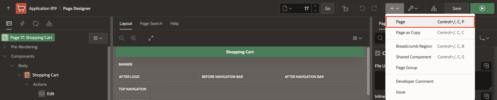
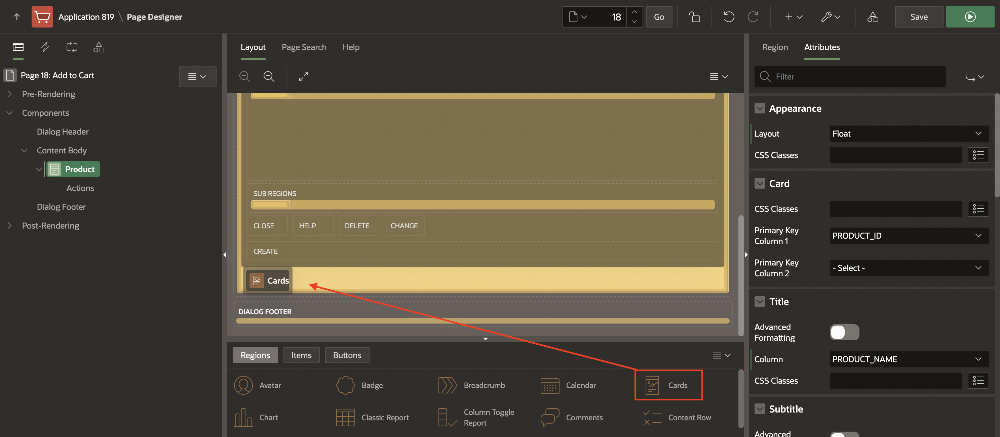
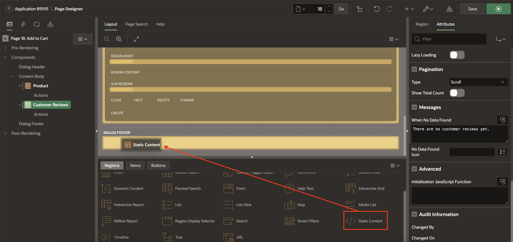
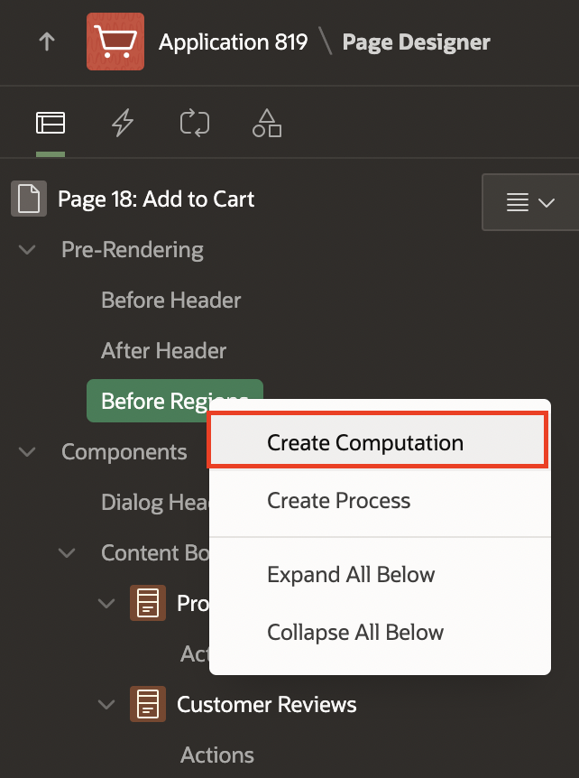
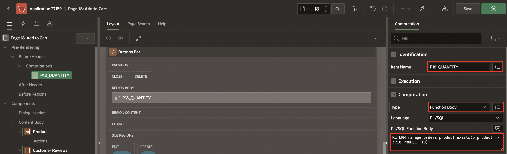
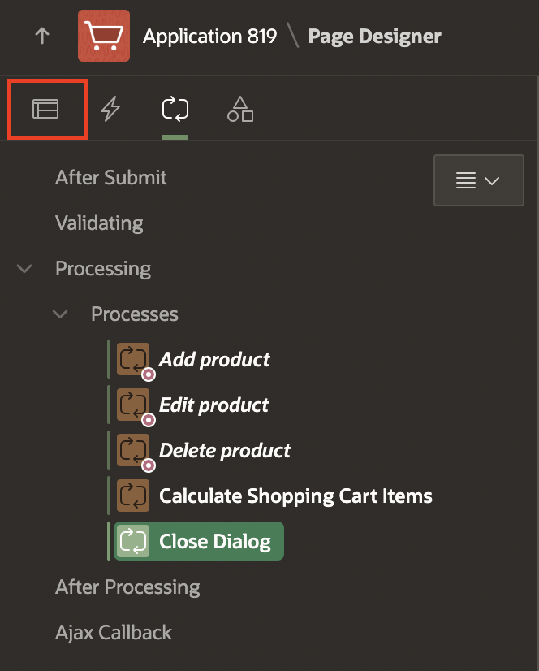

# Create the add to cart page

## Introduction

In this lab, you will create a new modal page to add or edit existing items in the Shopping Cart.

Once you have finished the workshop and updated all the products as described in the steps, your page will look like the following image:


Customers will be able to:
- Review the product details
- Add, edit, or remove the product from the shopping cart
- Read the customer reviews

Estimated Time: 20 minutes

Watch the video below for a quick walk through of the lab.

[](youtube:8HoOOhY8omU)

### Objectives
In this lab, you will:
- Create a page that allows users to add and edit products in the Shopping Cart

## Task 1: Create a Modal Page
Create a Modal Page to add products to the cart.

1. Navigate to Create button and click **Page**.
       
2. Select **Blank Page** and click **Next**.
3. Enter the following and click **Next**.
    - Page Number - enter **18**
    - For Name - enter **Add to Cart**
    - For Page Mode - select **Modal Dialog**
4. For Navigation Preference, select **Do not associate this page with a navigation menu entry** and click **Next**.
5. Click **Finish**.

## Task 2: Add Cards Region for Product Details
This region allows users to review the details of the product, such as brand, price, description, and more.

1. In the new modal page created, navigate to the **Gallery Menu**.
2. Drag a **Cards** region and drop it to the Content Body section.
       
3. In the Property Editor, enter the following:
    - For Title, enter **Product**
    - Under Source section:
        - For Type - select **SQL Query**
        - For SQL Query - enter the following SQL Code:

            ```
            <copy>
            SELECT product_id,
                product_name,
                unit_price,
                product_details,
                product_image,
                image_mime_type,
                image_filename,
                image_charset,
                image_last_updated,
                color_id,
                department_id,
                clothing_id,
                d.description,
                b.brand
            FROM   products p,
                json_table (p.product_details, '$' columns ( description varchar2(4000) path '$.description') ) d,
                json_table (p.product_details, '$' columns ( brand       varchar2(4000) path '$.brand') ) b
            WHERE  product_id = :p18_product_id
            </copy>
            ```

    - For Template Options - check **Use Template Defaults**
         
        - For **Style** - select **Style C**
        - Click **Ok**

4. Click **Attributes** and enter the following:
      

    - Under Appearance section:
        - For Layout - select **Float**

    - Under Title section:
        - For Column - select **PRODUCT_NAME**

    - Under Subtitle section:
        - For Column - select **BRAND**

    - Under Body section:
        - For Column - select **DESCRIPTION**

    - Under Secondary Body section:    
        - Set Advanced Formatting to **On**.
        - For HTML Expression - enter the following:
            
            ``` 
            <copy>
            Price: &UNIT_PRICE.
            </copy>
            ```   

    - Under Media section:
        - For Source - select **BLOB Column**
        - For BLOB Column - select **PRODUCT_IMAGE**
        - For Position - select **First**
        - For Appearance - select **Square**
        - For Sizing - select **Fit**

    - Under Card section:
        - For Primary Key Column 1 - select **PRODUCT_ID**    
    
## Task 3: Add Cards Region for Customer Reviews
This region lets users read the customer reviews for this product.

1. Navigate to the **Gallery Menu**.
2. Drag a **Cards** region and drop it to the Content Body section under **Product** region.
       
3. In the Property Editor, enter the following:
    - For Title - enter **Customer Reviews**
    - Under Source section:
        - For **Type** - select **SQL Query**
        - For **SQL Query** - enter the following SQL Code:

            ```
            <copy>
            SELECT m.rating,
                m.review
            FROM   products p,
                product_reviews m
            WHERE  p.product_name = m.product_name
                AND p.product_id = :p18_product_id 
                order by m.rating desc
            </copy>
            ```
    - Under Appearance section:
        - For Template - select **Standard**

4. Click **Attributes** and enter the following:
       
    - Under Appearance section:
        - For Layout - select **Horizontal (Row)**

    - Under Title section:
        - Set Advanced Formatting to **On**
        - For HTML Expression - enter the following:
            
            ``` 
            <copy>
            <b>Review:</b> &REVIEW. <br>
            <b>Rating:</b> &RATING.
            </copy>
            ```  

    - Under Messages:
        - For When No Data Found - enter **There are no customer reviews yet.**
     
## Task 4: Add Items and Buttons
In this task, you will create four-page items:
- PRODUCT_ID: To get the product ID
- ACTION: To identify the action (Add / Edit / Delete) made for the customer
- QUANTITY: To permit customers to select the number of items to add or edit in the shopping cart
- SHOPPING\_CART\_ITEMS: To get the number of items (total) in the shopping cart after an action is made


1. Navigate to the **Gallery Menu**.
2. Drag a **Static Content** region and drop it to the **Dialog Footer**.
       

3. In the Property Editor, enter the following:
    - For Title - enter **Buttons Bar**
    - For Template - select **Buttons Container**
4. In the Rendering tree (left pane), navigate to **Buttons Bar** region.
5. Right-click the **Buttons Bar** region and click  **Create Page Item**.
      
6. Create four items as follows. In the Property Editor, do the following:

    | Name |  Type  | Label  | Template | 
    | ---  |  ---   | ---    | --- | 
    | P18_ACTION | Hidden |
    | P18\_PRODUCT\_ID | Hidden |
    | P18_SHOPPING\_CART\_ITEMS | Hidden |
    | P18_QUANTITY | Select List | Quantity | Required | 

    For **P18_QUANTITY** item, do the following: 
    - Under List of Values section:
        - For Type - select **Static Values**
        - For Static Values - click **Display1, Display2** and enter the following:

            | Display Value |  Return Value  |
            | --- |  --- |
            | 1 | 1 |
            | 2 | 2 |
            | 3 | 3 |
            | 4 | 4 |
            | 5 | 5 |

    - Click **Ok** 
    - Set Display Extra Values to **Off**
    - Set Display Null Value to **Off**

7. Navigate to **Buttons Bar** region (left side).
8. Right-click the region and click **Create Button**.
      
9. Create three buttons as follows:

    | Name | Label | Button Position |Button Template | Hot | 
    | ---  | ---   | ---             | --- | ---             | 
    | Add          | Add to Cart | Next |Text  |  On  |  On |
    | Edit         | Update Quantity| Create   |Text  |  On | |
    | Delete       | Remove from Cart | Edit   |Text  |  Off | 

     Under Server-side Condition section:
    | Name | Type | Item |
    | ---  | ---   | ---             | 
    | Add  | Item is zero | P18_QUANTITY |
    | Edit         | Item is NOT zero | P18_QUANTITY |
    | Delete       | Item is NOT zero | P18_QUANTITY |

          

10. For **Delete** button, apply the following changes:
    - Under Appearance section, click Template Options:
        - For Type - select **Danger**
        - For Style -select **Display as Link**
        - For Spacing Right, select **Large**
    - Click **Ok**.

## Task 5: Add Computation to Calculate the Number of Items for a Product
1. In the Rendering tree (left pane), expand the **Pre-Rendering**.
2. Right-click **Before Regions** and click **Create Computation**.
         
3. In the Property Editor, enter the following:
    - Under Identification section:
        - For Item Name - select **P18_QUANTITY**
    - Under Computation:
        - For Type - select **Function Body**
        - For PL/SQL Function Body - enter the following PL/SQL Code:

        ```
        <copy>
        RETURN manage_orders.product_exists(p_product => :P18_PRODUCT_ID);
        </copy>
        ```
               

## Task 6: Add Process to Add Products to the Shopping Cart
In this Task, you will call the *manage\_orders.add_product* procedure that add the product temporarily in the APEX collection.

1. In the Rendering tree (left pane), navigate to **Processing** tab.  
         
2. Right click **Processing** and click **Create Process**.
        
3. In the Property Editor, enter the following:
    - For Name - enter **Add product**
    - For Type - select **Execute Code**
    - For PL/SQL Code - enter the following code:

        ```
        <copy>
        BEGIN
            IF manage_orders.product_exists(p_product => :P18_PRODUCT_ID) = 0 THEN
                manage_orders.add_product (p_product  => :P18_PRODUCT_ID,
                                        p_quantity => :P18_QUANTITY);
            END IF;
            :P18_ACTION := 'ADD';
        END; 
        </copy>
        ```

    - Under Server-side Condition section:
        - For When Button Pressed - select **Add**      

## Task 7: Add Process to Edit Products in the Shopping Cart
In this Task, you will call the *manage\_orders.remove\_product* and *manage\_orders.add\_product* procedures to remove the product from the shopping cart and add it again with the updated quantity.

1. In the **Processing** tab.    
2. Right click **Processing** and click **Create Process**.
3. In the Property Editor, enter the following:
    - For Name - enter **Edit product**
    - For Type - select **Execute Code**
    - For PL/SQL Code - enter the following PL/SQL code:

        ```
        <copy>
        BEGIN
            IF manage_orders.product_exists(p_product => :P18_PRODUCT_ID) > 0 THEN
                manage_orders.remove_product(p_product => :P18_PRODUCT_ID);
                manage_orders.add_product (p_product  => :P18_PRODUCT_ID,
                                        p_quantity => :P18_QUANTITY);
            END IF;
            :P18_ACTION := 'EDIT';
        END; 
        </copy>
        ```

    - Under Server-side Condition section:
        - For When Button Pressed, select **Edit**

## Task 8: Add Process to Delete Products from the Shopping Cart
In this Task, you will call the *manage\_orders.remove\_product* to remove the product from the shopping cart.

1. In the **Processing** tab.    
2. Right click **Processing** and click **Create Process**.
       
3. In the Property Editor, enter the following:
    - For Name - enter **Delete product**
    - For Type - select **Execute Code**
    - For PL/SQL Code - enter the following code:

        ```
        <copy>
        BEGIN
            IF manage_orders.product_exists(p_product => :P18_PRODUCT_ID) > 0 THEN
                manage_orders.remove_product(p_product => :P18_PRODUCT_ID);
            END IF;
            :P18_ACTION := 'DELETE';
        END; 
        </copy>
        ```

    - Under Server-side Condition section:
        - For When Button Pressed - select **Delete**    

## Task 9: Add Process to Calculate the Shopping Cart Items
In this task, you will call the *manage\_orders.get\_quantity* to get the total of products in the shopping cart.

1. In the **Processing** tab.    
2. Right click **Processing** and click  **Create Process**.
       
3. In the Property Editor, enter the following:
    - For Name - enter **Calculate Shopping Cart Items**
    - For Type - select **Execute Code**
    - For PL/SQL Code - enter the following PL/SQL code:

        ```
        <copy>
        BEGIN
            :P18_SHOPPING_CART_ITEMS := manage_orders.get_quantity;
        END;  
        </copy>
        ```

## Task 10: Add Process to Close the Modal Page
After the customer has taken action (add/edit/delete) about the product, the modal page will close and continue the shopping process.

1. In the **Processing** tab.    
2. Right click **Processing** and click **Create Process**.
       
3. In the Property Editor, enter the following:
    - Under Identification section:
        - For Name - enter **Close Dialog**
        - For Type - select **Close Dialog**
    - Under Settings section:
        - For Items to Return - enter **P18\_SHOPPING\_CART\_ITEMS,P18\_PRODUCT\_ID,P18\_ACTION,P18\_QUANTITY** 

## Task 11: Enhance the Modal Page

1. Navigate to **Rendering** tab (left pane).
       

2. Navigate to **Page 18: Add to Cart** 
3. In the Property Editor, do the following changes:
    - Under Identification section:
        For Title, enter **Manage your Cart**
    - Under Dialog section:
        - For Width, enter **600**
        - For Height, enter **600**
          

4. Click **Save**. 


You now know how to customize and enhance the APEX page. You may now **proceed to the next lab**. 

## Acknowledgments

- **Author** - Mónica Godoy, Principal Product Manager
- **Contributors** - Shakeeb Rahman, Architect
- **Last Updated By/Date** - Arabella Yao, Database Product Manager, October 2021