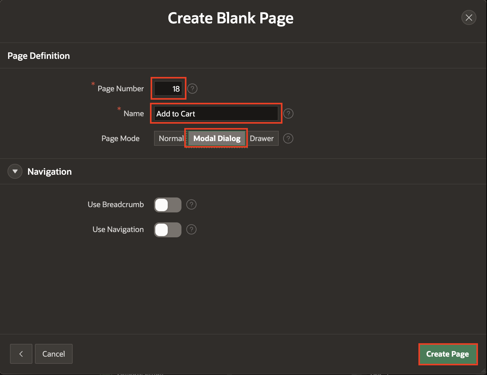
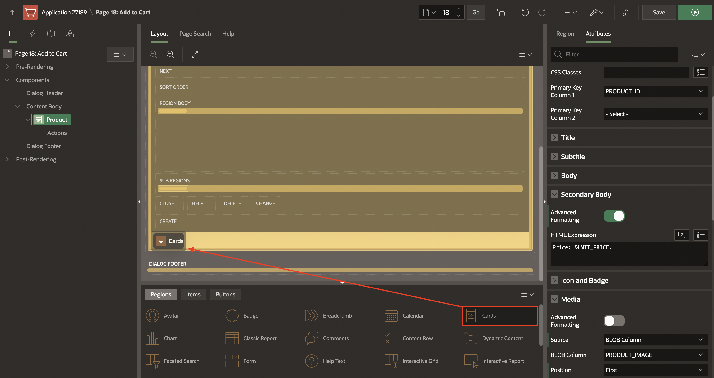
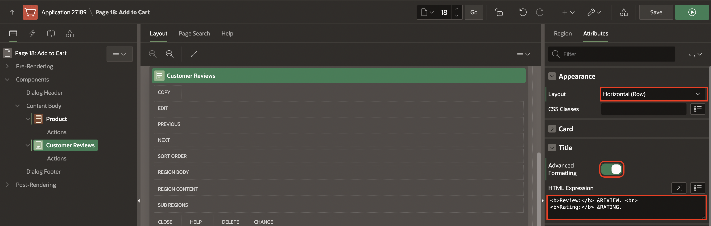
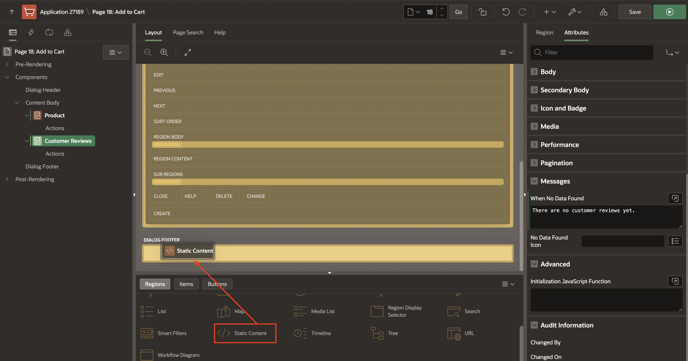
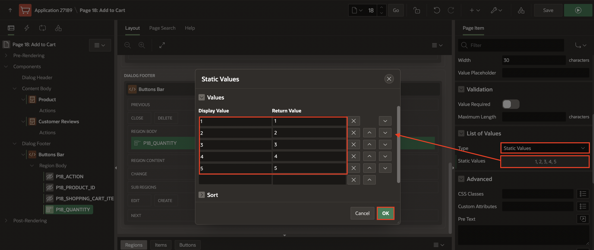
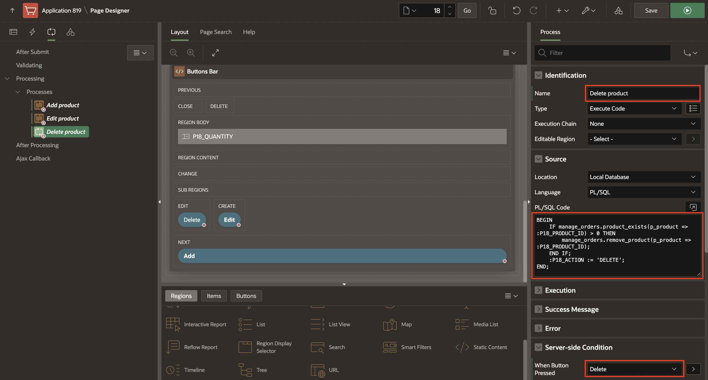

# Create the add to cart page

## Introduction

In this lab, you will create a new modal page to add or edit existing items in the Shopping Cart.

Once you have finished the workshop and updated all the products as described in the steps, your page will look like the following image:


Customers will be able to:

- Review the product details
- Add, edit, or remove the product from the shopping cart
- Read the customer reviews

Estimated Time: 20 minutes

<!--
Watch the video below for a quick walk through of the lab.

[](youtube:8HoOOhY8omU)
-->

Watch the video below for a quick walk-through of the lab.
[Create the add to cart page](videohub:1_3adj5cnf)

### Objectives
In this lab, you will:
- Create a page that allows users to add and edit products in the Shopping Cart

## Task 1: Create a Modal Page

Create a Modal Page to add products to the cart.

1. Navigate to Create button and click **Page**.

       

2. Select **Blank Page** and click **Next**.

3. Enter the following and click **Next**.

    - Page Number: **18**

    - Name: **Add to Cart**

    - Page Mode: **Modal Dialog**

4. Click **Create Page**.

      

## Task 2: Add Cards Region for Product Details

This region allows users to review the details of the product, such as brand, price, description, and more.

1. In the new modal page created, navigate to the **Gallery Menu**.

2. Drag a **Cards** region and drop it to the Content Body section.

     

3. In the Property Editor, enter/select the following:

    - Identification > Name: **Product**

    - Under Source:

        - Type: **SQL Query**

        - SQL Query: Enter the following SQL Code:

            ```
            <copy>
            SELECT product_id,
                product_name,
                unit_price,
                product_details,
                product_image,
                image_mime_type,
                image_filename,
                image_charset,
                image_last_updated,
                color_id,
                department_id,
                clothing_id,
                d.description,
                b.brand
            FROM   products p,
                json_table (p.product_details, '$' columns ( description varchar2(4000) path '$.description') ) d,
                json_table (p.product_details, '$' columns ( brand       varchar2(4000) path '$.brand') ) b
            WHERE  product_id = :p18_product_id
            </copy>
            ```

  

    - Template Options: click **Use Template Defaults**

        - **Style**: **Style C**

        - Click **Ok**

  

4. Click **Attributes** and enter/select the following:

    - Under Appearance:

        - Layout: **Float**

  

    - Under Title:

        - Column: **PRODUCT_NAME**

    - Under Subtitle:

        - Column: **BRAND**

    - Under Body:

        - Column: **DESCRIPTION**

    - Under Secondary Body:    

        - Advanced Formatting: **Toggle On**.

        - HTML Expression: enter the following:

            ```
            <copy>
            Price: &UNIT_PRICE.
            </copy>
            ```  

  

    - Under Media:

        - Source: **BLOB Column**

        - BLOB Column: **PRODUCT_IMAGE**

        - Position: **First**

        - Appearance: **Auto**

        - Sizing: **Fit**

  

    - Under Card:

        - For Primary Key Column 1 - select **PRODUCT_ID**

  

## Task 3: Add Cards Region for Customer Reviews

This region lets users read the customer reviews for a product.

1. Navigate to the **Gallery Menu**.

2. Drag a **Cards** region and drop it to the Content Body section under the **Product** region.

       

3. In the Property Editor, enter/select the following:

    - Identification > Name: **Customer Reviews**

    - Under Source:

        - **Type**: **SQL Query**

        - **SQL Query**: Enter the following SQL Code:

            ```
            <copy>
            SELECT m.rating,
                m.review
            FROM   products p,
                product_reviews m
            WHERE  p.product_name = m.product_name
                AND p.product_id = :p18_product_id
                order by m.rating desc
            </copy>
            ```
    - Under Appearance:

        - Template: **Standard**

  

4. Click **Attributes** and enter the following:

    - Appearance > Layout: **Horizontal (Row)**

    - Under Title:

        - Advanced Formatting: **Toggle On**

        - HTML Expression: Enter the following:

            ```
            <copy>
            <b>Review:</b> &REVIEW. <br>
            <b>Rating:</b> &RATING.
            </copy>
            ```  

    - Under Messages:

        - When No Data Found: **There are no customer reviews yet.**

    

## Task 4: Add Items and Buttons
In this task, you will create four-page items:

- **PRODUCT_ID**: To get the product ID

- **ACTION**: To identify the action (Add / Edit / Delete) made for the customer

- **QUANTITY**: To permit customers to select the number of items to add or edit in the shopping cart

- **SHOPPING\_CART\_ITEMS**: To get the number of items (total) in the shopping cart after an action is made


1. Navigate to the **Gallery Menu**.

2. Drag a **Static Content** region and drop it to the **Dialog Footer**.

       

3. In the Property Editor, enter/select the following:

    - Identification > Title: **Buttons Bar**

    - Appearance > Template: **Buttons Container**

  

4. In the Rendering tree (left pane), navigate to **Buttons Bar** region.

5. Right-click the **Buttons Bar** region and click  **Create Page Item**.

     

6. Create four items as follows. In the Property Editor, do the following:

    | Name |  Type  | Label  | Template |
    | ---  |  ---   | ---    | --- |
    | P18_ACTION | Hidden |
    | P18\_PRODUCT\_ID | Hidden |
    | P18_SHOPPING\_CART\_ITEMS | Hidden |
    | P18_QUANTITY | Select List | Quantity | Required |
    {: title="Details of the Page Items"}

    For **P18_QUANTITY** item, do the following:

    - Under List of Values:

        - Type: **Static Values**

        - Static Values:  **Display1, Display2** and enter the following:

            | Display Value |  Return Value  |
            | --- |  --- |
            | 1 | 1 |
            | 2 | 2 |
            | 3 | 3 |
            | 4 | 4 |
            | 5 | 5 |
            {: title="List of Static Values"}

    - Click **Ok**

    - Display Extra Values: **Toggle Off**

    - Display Null Value: **Toggle Off**

  

7. Navigate to **Buttons Bar** region (left side).

8. Right-click the region and click **Create Button**.

     

9. Create three buttons as follows:

    | Name | Label | Slot |Button Template | Hot |
    | ---  | ---   | ---             | --- | ---             |
    | Add          | Add to Cart | Next |Text  |  On  |  On |
    | Edit         | Update Quantity| Create   |Text  |  On | |
    | Delete       | Remove from Cart | Edit   |Text  |  Off |
    {: title="Details of the Buttons"}

     Under Server-side Condition section:
    | Name | Type | Item |
    | ---  | ---   | ---             |
    | Add  | Item is zero | P18_QUANTITY |
    | Edit         | Item is NOT zero | P18_QUANTITY |
    | Delete       | Item is NOT zero | P18_QUANTITY |
    {: title="Server-side conditions for the Buttons"}

        

10. For **Delete** button, apply the following changes:
    - Under Appearance, click **Use Template Defaults**:

        - Type: **Danger**

        - Style: **Display as Link**

        - Spacing Right: **Large**

    - Click **OK**.

    

## Task 5: Add Computation to Calculate the Number of Items for a Product

1. In the Rendering tree (left pane), expand the **Pre-Rendering**.

2. Right-click **Before Regions** and click **Create Computation**.

         

3. In the Property Editor, enter/select the following:

    - Under Identification:

        - Item Name: **P18_QUANTITY**

    - Under Computation:

        - Type: **Function Body**

        - PL/SQL Function Body: Enter the following PL/SQL Code:

        ```
        <copy>
        RETURN manage_orders.product_exists(p_product => :P18_PRODUCT_ID);
        </copy>
        ```

              

## Task 6: Add Process to Add Products to the Shopping Cart
In this Task, you will call the *manage\_orders.add_product* procedure that will add the product temporarily in the APEX collection.

1. In the Rendering tree (left pane), navigate to **Processing** tab.  

2. Right click **Processing** and click **Create Process**.

        

3. In the Property Editor, enter/select the following:

    - Name: **Add product**

    - PL/SQL Code: Enter the following code:

        ```
        <copy>
        BEGIN
            IF manage_orders.product_exists(p_product => :P18_PRODUCT_ID) = 0 THEN
                manage_orders.add_product (p_product  => :P18_PRODUCT_ID,
                                        p_quantity => :P18_QUANTITY);
            END IF;
            :P18_ACTION := 'ADD';
        END;
        </copy>
        ```

    - Server-side Condition > When Button Pressed: **Add**

         

## Task 7: Add Process to Edit Products in the Shopping Cart
In this Task, you will call the *manage\_orders.remove\_product* and *manage\_orders.add\_product* procedures to remove the product from the shopping cart and add it again with the updated quantity.

1. In the **Processing** tab.   

2. Right click **Processing** and click **Create Process**.

    

3. In the Property Editor, enter/select the following:

    - Name: **Edit product**

    - PL/SQL Code: Enter the following PL/SQL code:

        ```
        <copy>
        BEGIN
            IF manage_orders.product_exists(p_product => :P18_PRODUCT_ID) > 0 THEN
                manage_orders.remove_product(p_product => :P18_PRODUCT_ID);
                manage_orders.add_product (p_product  => :P18_PRODUCT_ID,
                                        p_quantity => :P18_QUANTITY);
            END IF;
            :P18_ACTION := 'EDIT';
        END;
        </copy>
        ```

    - Server-side Condition > When Button Pressed: **Edit**

  

## Task 8: Add Process to Delete Products from the Shopping Cart
In this Task, you will call the *manage\_orders.remove\_product* to remove the product from the shopping cart.

1. In the **Processing** tab.    

2. Right click **Processing** and click **Create Process**.

3. In the Property Editor, enter/select the following:

    - Name: **Delete product**

    - PL/SQL Code: Enter the following code:

        ```
        <copy>
        BEGIN
            IF manage_orders.product_exists(p_product => :P18_PRODUCT_ID) > 0 THEN
                manage_orders.remove_product(p_product => :P18_PRODUCT_ID);
            END IF;
            :P18_ACTION := 'DELETE';
        END;
        </copy>
        ```

    - Server-side Condition > When Button Pressed: **Delete**    

  

## Task 9: Add Process to Calculate the Shopping Cart Items
In this task, you will call the *manage\_orders.get\_quantity* to get the total of products in the shopping cart.

1. In the **Processing** tab.

2. Right click **Processing** and click  **Create Process**.

       

3. In the Property Editor, enter /select the following:

    - Name: **Calculate Shopping Cart Items**

    - PL/SQL Code: Enter the following PL/SQL code:

        ```
        <copy>
        BEGIN
            :P18_SHOPPING_CART_ITEMS := manage_orders.get_quantity;
        END;  
        </copy>
        ```

    

## Task 10: Add Process to Close the Modal Page
After the customer has taken action (add/edit/delete) about the product, the modal page will close and continue the shopping process.

1. In the **Processing** tab.  

2. Right click **Processing** and click **Create Process**.

3. In the Property Editor, enter/select the following:

    - Under Identification:

        - Name: **Close Dialog**

        - Type: **Close Dialog**

    - Settings > Items to Return: **P18\_SHOPPING\_CART\_ITEMS,P18\_PRODUCT\_ID,P18\_ACTION,P18\_QUANTITY**

    

## Task 11: Enhance the Modal Page

1. Navigate to **Rendering** tab (left pane).

2. Navigate to **Page 18: Add to Cart**

3. In the Property Editor, enter/select the following changes:

    - Identification > Title: **Manage your Cart**

    - Under Dialog:

        - Width: **600**

        - Height: **600**

       

4. Click **Save**.

    

## Summary

You now know how to customize and enhance an APEX page. You may now **proceed to the next lab**.

## Acknowledgments

- **Author** - Apoorva Srinivas, Senior Product Manager; Mónica Godoy, Principal Product Manager
- **Contributors** - Shakeeb Rahman, Architect
- **Last Updated By/Date** - Ankita Beri, Product Manager, June 2024
