# Create the order page

## Introduction

In this lab, you will create a new page that will allow customers to view the details of their recent order.
Customers will find the following details of the order:

- Order number
- Order date
- Status
- Total price
- Quantity and price of the items.

Once you have finished the workshop and updated all the products as described in the steps, your page will look like the following image:


Estimated Time: 15 minutes

Watch the video below for a quick walk-through of the lab.
[Create the Order Page](videohub:1_w9hncfg8)

### Objectives

In this lab, you will:

- Create a page to review the items that the customer recently bought.

## Task 1: Create a Normal Page - Order Information

Create a Normal Page to review the Order that customer has made.

1. In the **App Builder**, navigate to the *ACME Shop application* and click **Create Page**.

    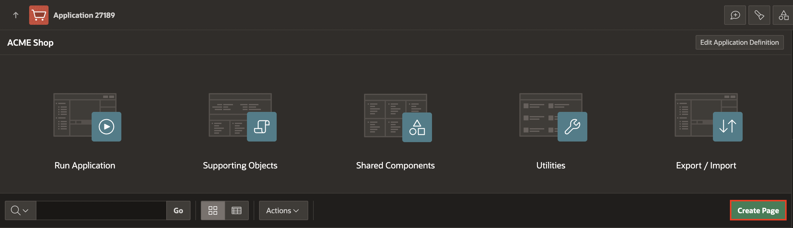

2. Select **Blank Page**.

    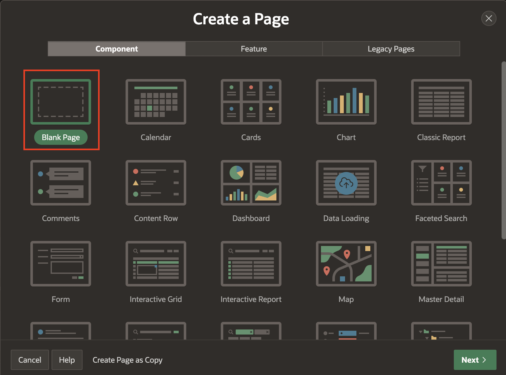

3. Enter/select the following and click **Next**.

    - Under Page Definition:

        - Page Number: **16**

        - Name: **Order Information**

    - Under Navigation

        - Use Breadcrumb: **Toggle Off**

        - Use Navigation: **Toggle Off**

4. Click **Create Page**.

    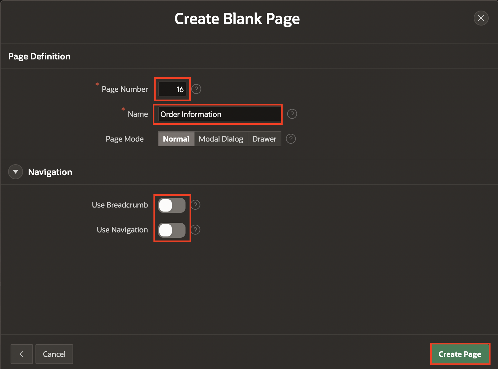

## Task 2: Add a Region

Add a region to the page to display order details.

1. In the newly created page, navigate to the **Gallery Menu** at the bottom of the page showing Regions, Items, and Buttons categories and ensure that **Regions** is selected.

2. Drag a **Static Content** region and drop it to the Body section.

    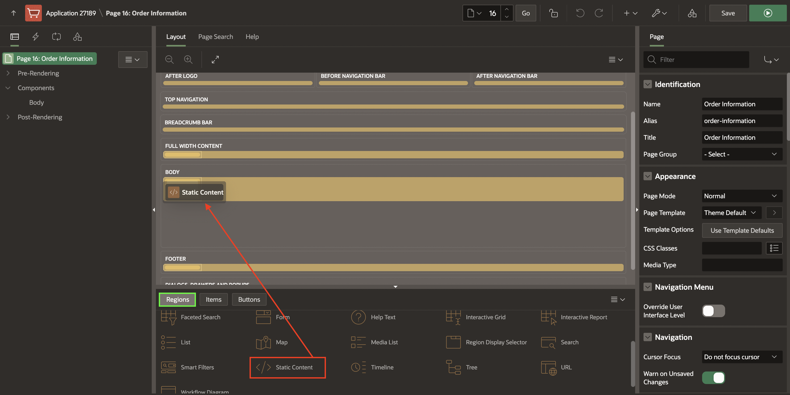

3. In the Property Editor, enter/select the following:

    - Identification > Name: **Thank you for your order!**

    - Under Appearance:

        - Template: **Content Block**

        - Template Options > Use Template Defaults:   Check **Show Region Icon** and click **Ok**

        - Icon: **fa-heart**

    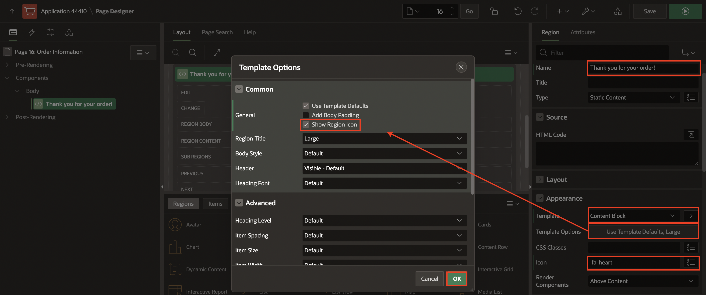

## Task 3: Add Items to the Page

Add a hidden item to store the order ID without the user being able to see it.

1. Under **Rendering** tab, navigate to the **Thank you for your order!** region.

2. Right-click the region and select **Create Page Item**.

    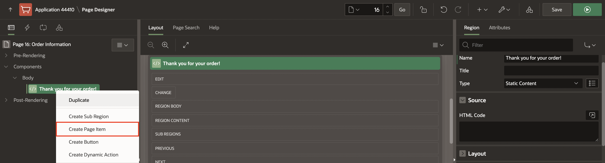

3. In the property editor, set the name and type as follows:

    | Name |  Type  |
    | --- |  --- |
    | P16_ORDER | Hidden |
    {: title="Page Item values"}

    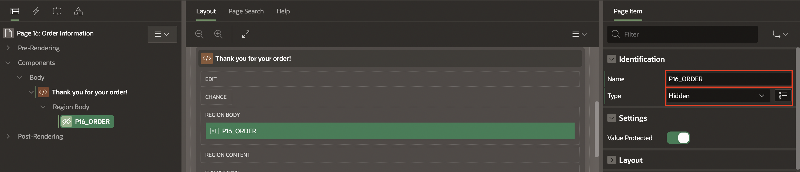

## Task 4: Add Static Content Region

Add a region to contain Order details and items.

1. Under **Rendering** tab, navigate to the **Thank you for your order!** region.

2. Right-click the region and select **Create Sub Region**.

    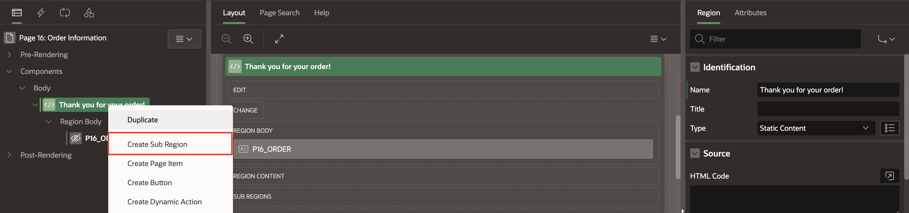

3. In the Property Editor, enter/select the following:

    - Under Identification:

        - Name: **Order: &P16_ORDER.** (including the period)

        - Type: **Static Content**

  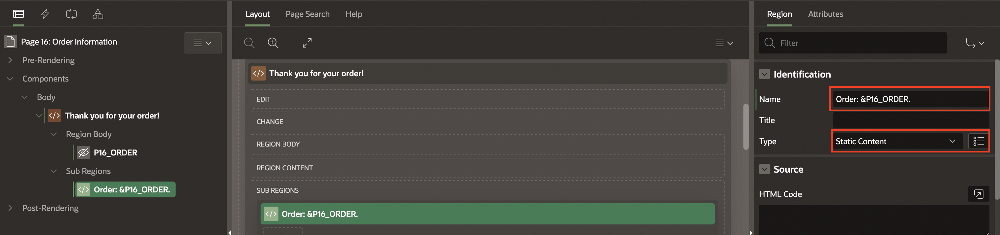

## Task 5: Add Order Details Region

Add a region to display Order details.

1. Under **Rendering** tab, navigate to the **Order: &P16_ORDER.** region.

2. Right-click the region and select **Create Sub Region**.

    

3. In the Property Editor, enter/select the following:

    - Under Identification:

        - Name: **Order Details**

        - Type: **Cards**

    - Under Source:

        - Type: **SQL Query**

        - SQL Query: Enter the following SQL Query:

            ```
            <copy>
            SELECT o.order_id,
                o.order_datetime,
                o.customer_id,
                o.order_status,
                o.store_id,
                (SELECT Sum(unit_price * quantity)
                    FROM   order_items i
                    WHERE  i.order_id = o.order_id) total
            FROM   orders o
            WHERE  order_id = :P16_ORDER
            </copy>
            ```

    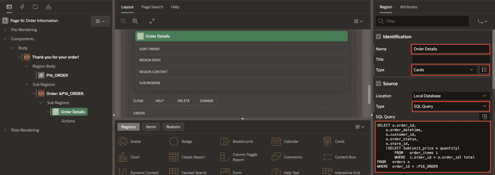

4. Navigate to **Attributes** tab and enter/select the following:

    - Under Secondary Body:

        - Advanced Formatting: **Toggle On**

        - HTML Expression: Copy and Paste the following code:

            ```
            <copy>
            <b> Order Placed:</b> &ORDER_DATETIME. <br>
            <b> Status: </b>&ORDER_STATUS. <br>
            <b> Total: </b>&TOTAL.
            </copy>
            ```

    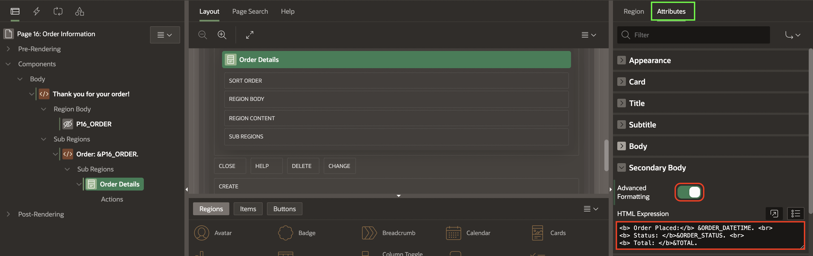

## Task 6: Add Items Region

Add a region to display items in the order.

1. Under **Rendering** tab, navigate to the **Order: &P16_ORDER.** region.

2. Right-click the region and select **Create Sub Region**.

    

3. In the Property Editor, enter the following:

    - Under Identification:

        - Name: **Items**

        - Type: **Cards**

    - Under Source:

        - Type: **SQL Query**

        - SQL Query: Enter the following SQL Query:

            ```
            <copy>
            SELECT  o.line_item_id                Item,
                    p.product_name                Product,
                    o.unit_price,
                    o.quantity,
                    ( o.unit_price * o.quantity ) Subtotal,
                    p.product_image
            FROM   order_items o,
                products p
            WHERE  p.product_id = o.product_id
            AND  order_id = :P16_ORDER
            </copy>
            ```

    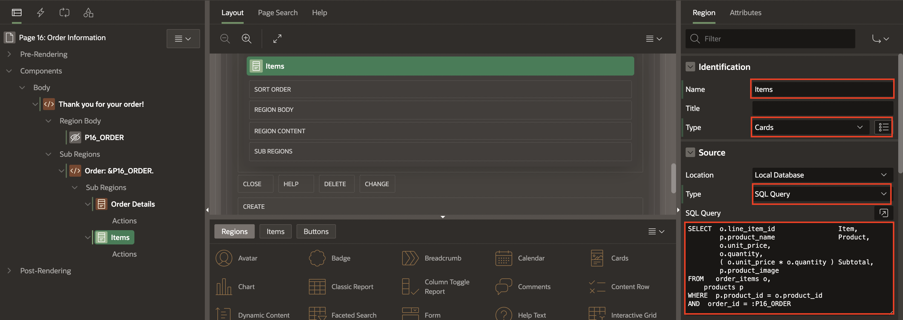

4. In the Property editor, navigate to **Attributes** tab and enter/select the following:

    - Title > Column: **PRODUCT**

    - Under Secondary Body:

        - Advanced Formatting: **Toggle On**

        - HTML Expression: enter the following code:

            ```
            <copy>
            <b>Quantity: </b> &QUANTITY. <br>
            <b>Unit Price: </b>&UNIT_PRICE.
            </copy>
            ```

    - Under Media:

        - Source: **BLOB Column**

        - BLOB Column: **PRODUCT_IMAGE**

        - Position: **Body**

        - Appearance: **Auto**

        - Sizing : **Fit**

    - Card > Primary Key Column 1: **ITEM**

    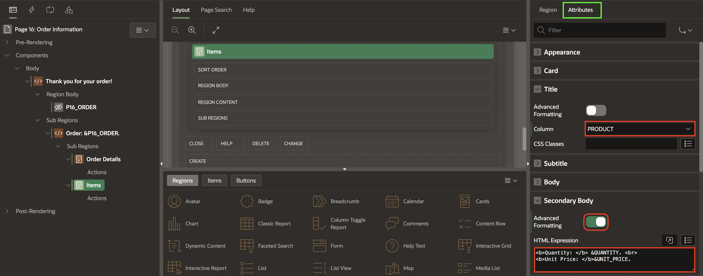

    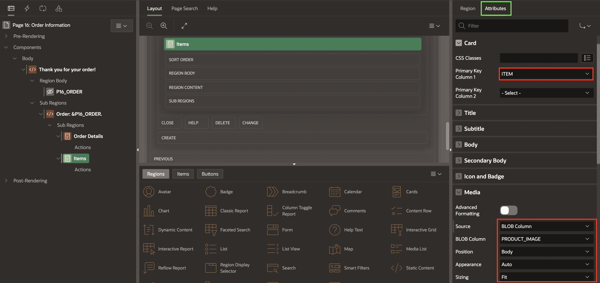

5. Click **Save**.

## Summary

You now know how to add a new page to your existing APEX Application and add regions to define the page's content using the Page Designer. You may now **proceed to the next lab**.

## Acknowledgments

- **Author** - Apoorva Srinivas, Senior Product Manager; Mónica Godoy, Principal Product Manager
- **Last Updated By/Date** - Ankita Beri, Product Manager, January 2025
