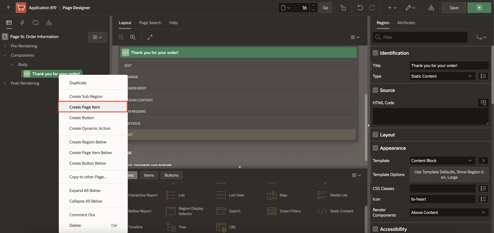
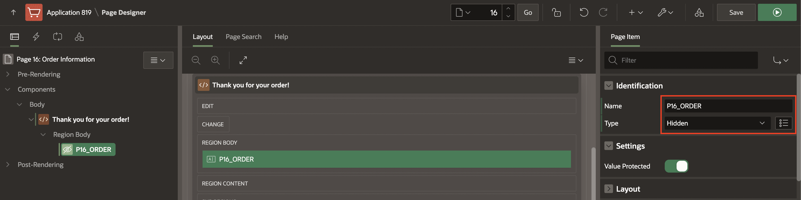
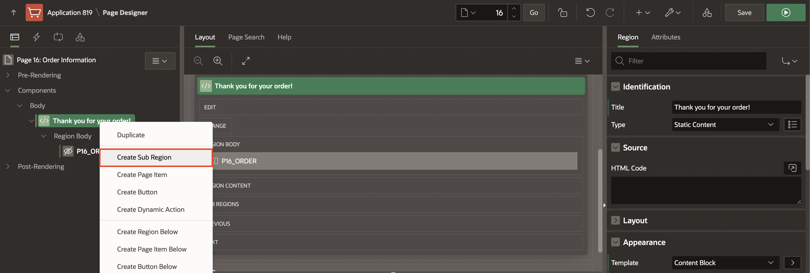
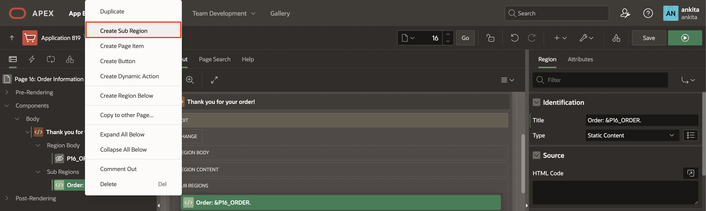
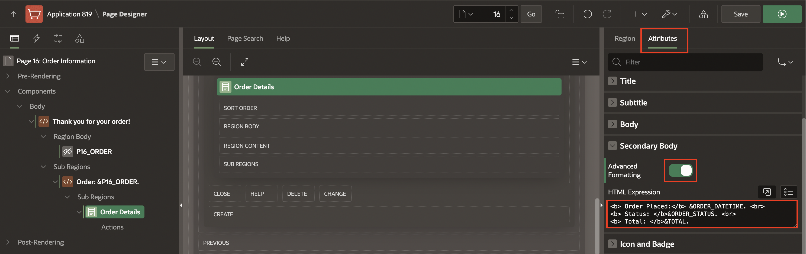
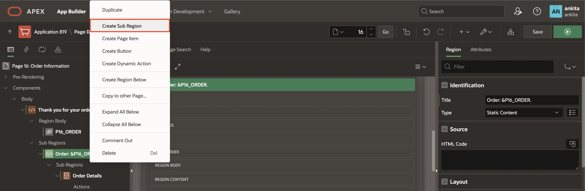
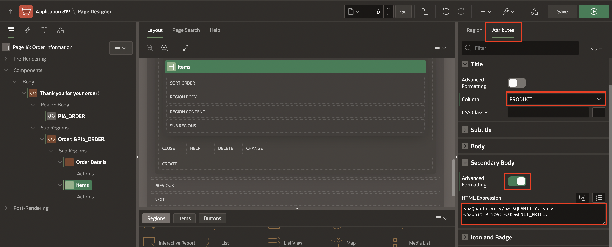

# Create the order page

## Introduction

In this lab, you will create a new page that will allow customers to view the details of their recent order.
Customers will find the details of the order:
- Order number
- Order date
- Status
- Total price
- Quantity and price of the items.

Once you have finished the workshop and updated all the products as described in the steps, your page will look like the following image:


Estimated Time: 15 minutes

Watch the video below for a quick walk through of the lab.

[](youtube:qskWwkxJmcM)

### Objectives
In this lab, you will:
- Create a page to review the items that customer just bought

## Task 1: Create a Normal Page - Order Information
Create a Normal Page to review the Order that customer has made.

1. In the **App Builder**, click **Create Page**.
    
2. Select **Blank Page** and click **Next**.
    
3. Enter the following and click **Next**.
    - Page Number - enter **16**
    - Name - enter **Order Information**
    - Page Mode - select **Normal**
    - Breadcrumb - select **- don't use breadcrumbs on page -** 
4. For Navigation Preference, select **Do not associate this page with a navigation menu entry** and click **Next**.
5. Click **Finish**.

## Task 2: Add a Region 
Add a region to the page to display order details.

1. In the new page created, navigate to the **Gallery Menu** at the bottom of the page showing Regions, Items, and Buttons categories and ensure that **Regions** is selected.
2. Drag a **Static Content** region and drop it to the Content Body section.
    
3. In the Property Editor, enter the following:
    - For Title - enter **Thank you for your order!**
    - For Template - select **Content Block**
    - For Template Options - check **Show Region Icon** and click **Ok**
        
    - For Icon, enter **fa-heart**

## Task 3: Add Items to the Page
Add a hidden item used to store the order ID without the user's being able to see it.

1. In the Rendering tree (left pane), navigate to the **Thank you for your order!** region.
2. Right-click the region and click **Create Page Item**.
    
3. In the property editor, set the name and type as follows:

    | Name |  Type  | 
    | --- |  --- | 
    | P16_ORDER | Hidden |

        
    
## Task 4: Add Static Content Region
Add a region to contain Order details and items.

1. In the Rendering tree (left pane), navigate to the **Thank you for your order!** region.
2. Right click the region and click **Create Sub Region**.
    
3. In the Property Editor, enter the following:
    - For Title - enter the expression (including the period) **Order: &P16_ORDER.**
    - For Type - select **Static Content**

## Task 5: Add Order Details Region
Add a region to display Order details.

1. In the Rendering tree (left pane), navigate to the **Order: &P16_ORDER.** region.
2. Right click the region and click **Create Sub Region**.
    
3. In the Property Editor, enter the following:
    - For Title - enter **Order Details**
    - For Type - select **Cards**
    - Under Source section:
        - For Type - select **SQL Query**
        - For SQL Query - enter the following SQL Query:

            ``` 
            <copy>
            SELECT o.order_id,
                o.order_datetime,
                o.customer_id,
                o.order_status,
                o.store_id,
                (SELECT Sum(unit_price * quantity)
                    FROM   order_items i
                    WHERE  i.order_id = o.order_id) total
            FROM   orders o
            WHERE  order_id = :P16_ORDER 
            </copy>
            ```
4. Click **Attributes**.
    
    -  Search for Secondary Body in the filter and do the following:
        - Set Advanced Formatting to **On**
        - For HTML Expression - enter:

            ``` 
            <copy>
            <b> Order Placed:</b> &ORDER_DATETIME. <br> 
            <b> Status: </b>&ORDER_STATUS. <br> 
            <b> Total: </b>&TOTAL.    
            </copy>
            ```

## Task 6: Add Items Region
Add a region to display items in the order.

1. In the Rendering tree (left pane), navigate to the **Order: &P16_ORDER.** region.
2. Right-click the region and click **Create Sub Region**.
    
3. In the Property Editor, enter the following:
    - For Title - enter **Items**
    - For Type - select **Cards**
    - Under Source section:
        - For Type - select **SQL Query**
        - For SQL Query - enter the following SQL Query: 

            ``` 
            <copy>
            SELECT  o.line_item_id                Item,
                    p.product_name                Product,
                    o.unit_price,
                    o.quantity,
                    ( o.unit_price * o.quantity ) Subtotal,
                    p.product_image
            FROM   order_items o,
                products p
            WHERE  p.product_id = o.product_id
            AND  order_id = :P16_ORDER 
            </copy>
            ```
4. Click **Attributes** and do the following:
    

    - Under Title section:
        - For Column - select **PRODUCT**    

    - Under Secondary Body:
        - Set Advanced Formatting to **On**
        - For HTML Expression - enter: 
    
            ``` 
            <copy>
            <b>Quantity: </b> &QUANTITY. <br> 
            <b>Unit Price: </b>&UNIT_PRICE.    
            </copy>
            ```

    - Under Media section:
        - For Source - select **BLOB Column**   
        - For BLOB Column - select **PRODUCT_IMAGE**  
        - For Position - select **Body**  
        - For Appearance - select **Auto**  
        - For Sizing - select **Fit**   

    - Under Card:
        - For Primary Key Column 1 - select **ITEM**    

5. Click **Save**.


You now know how to add a new page to your existing APEX Application and add regions to define the page's content using the Page Designer. You may now **proceed to the next lab**. 

## Acknowledgments

- **Author** - Mónica Godoy, Principal Product Manager
- **Last Updated By/Date** - Arabella Yao, Database Product Manager, October 2021