# Create the shopping cart page

## Introduction

In this lab, you will create a new page to review the items added to the Shopping Cart.

Once you have finished the workshop and updated all the products as described in the steps, your page will look like the following image:


Customers will be able to:

- Review the items in the shopping cart
- Edit the quantity of the items
- Remove an item
- Clear the shopping cart
- Proceed to checkout

Estimated Time: 20 minutes

Watch the video below for a quick walk-through of the lab.
[Create the shopping cart page](videohub:1_3n85gmue)

### Objectives

In this lab, you will:

- Create a page to list the products in the Shopping Cart.

- Create Application Items, Application Processes, and Dynamic Actions to manage the Shopping Cart.

## Task 1: Create Application Items

These items are needed to count the number of items in the shopping cart and the icon to display in the Navigation Bar.

1. On the Page Designer toolbar, navigate to **Shared Components** icon.

    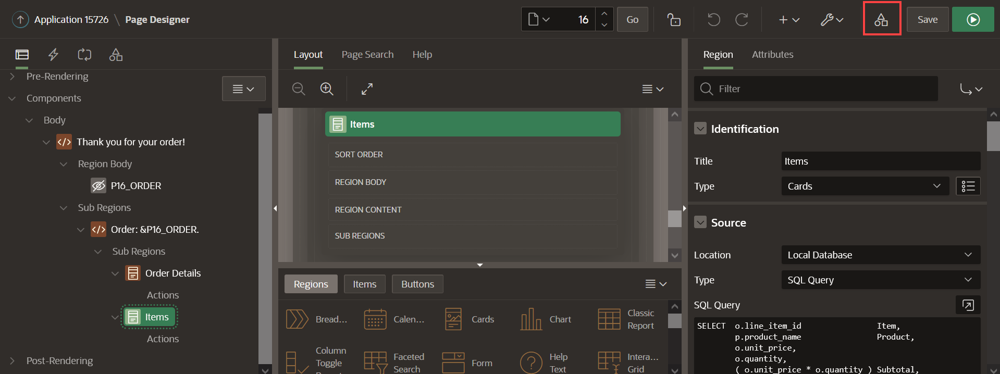

2. Under **Application Logic**, click **Application Items**.

    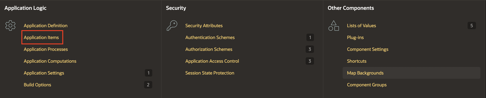

3. Click **Create**.

    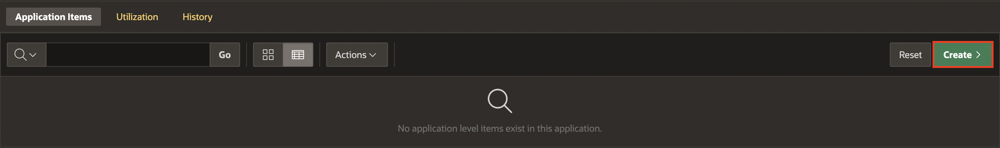

4. Now, create two application items one after the other:

    | Name |  Scope  |
    | --- |  --- |
    | SHOPPING\_CART\_ICON  | Application|
    | SHOPPING\_CART\_ITEMS | Application |
    {: title="Application items"}

5. Click **Create Application Item** and create the second item.

    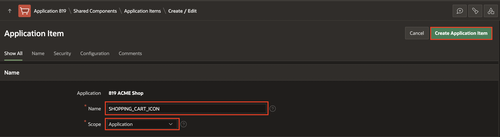

    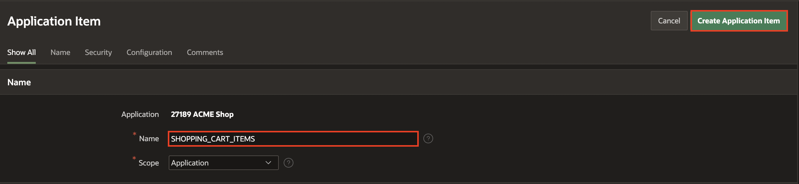

## Task 2: Create Application Process

This process is needed to refresh the number of items in the Shopping Cart, which will be shown in the navigation bar.

1. Navigate to **Shared Components**.

    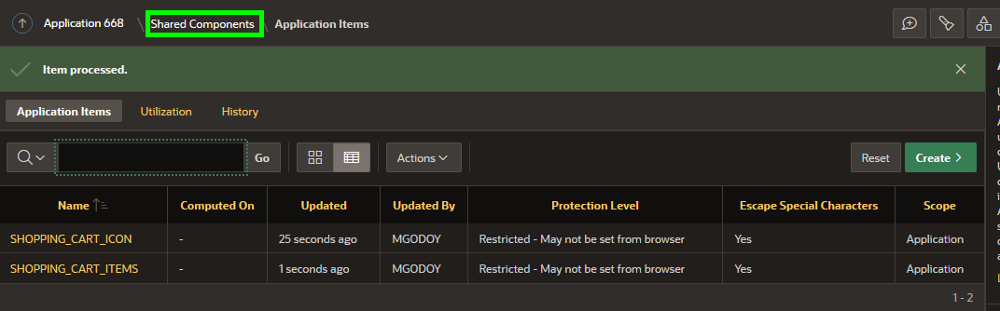
2. Under **Application Logic**, click **Application Processes**.

    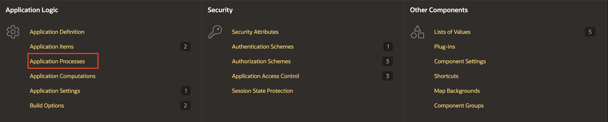

3. Click **Create** and enter/select the following:

    - Name: **Initialize Shopping Cart Header**

    - Process Point: **On Load: Before Header (page template header)**

    Click **Next**.

    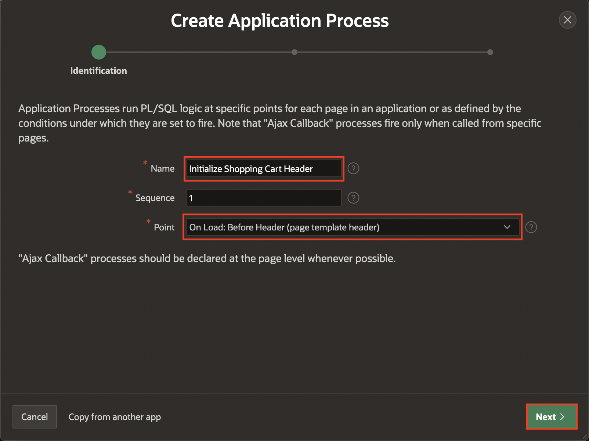

4. For **Code**, copy and paste the following PL/SQL code:

    ```
    <copy>
    -- Initialize shopping cart navigation bar to show appropriate icon and count
    DECLARE
        l_cnt NUMBER := manage_orders.get_quantity;
    BEGIN
        IF l_cnt > 0 THEN
            :SHOPPING_CART_ITEMS := l_cnt;
            :SHOPPING_CART_ICON := 'fa-cart-full';
        ELSE
            :SHOPPING_CART_ITEMS := '';
            :SHOPPING_CART_ICON := 'fa-cart-empty';
        END IF;
    END;
    </copy>
    ```

5. Click **Next**.

    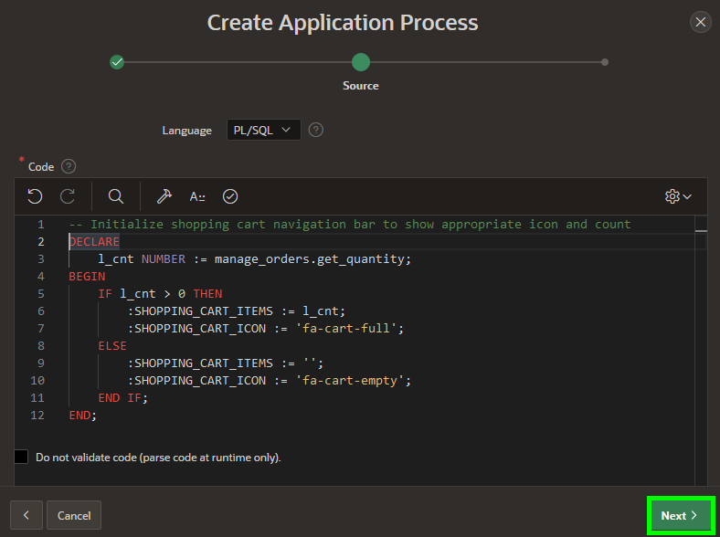

6. Click **Create Process**.

    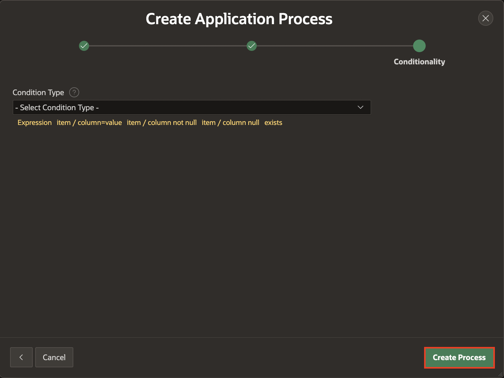

## Task 3: Create a Normal Page - Shopping Cart

The shopping cart page allows users to review and edit the products in the cart. Additionally, users can create the order or clear the shopping cart.

1. Navigate to Application ID.  ***The ID of your application may vary***.

    

2. Click **Create Page**.

    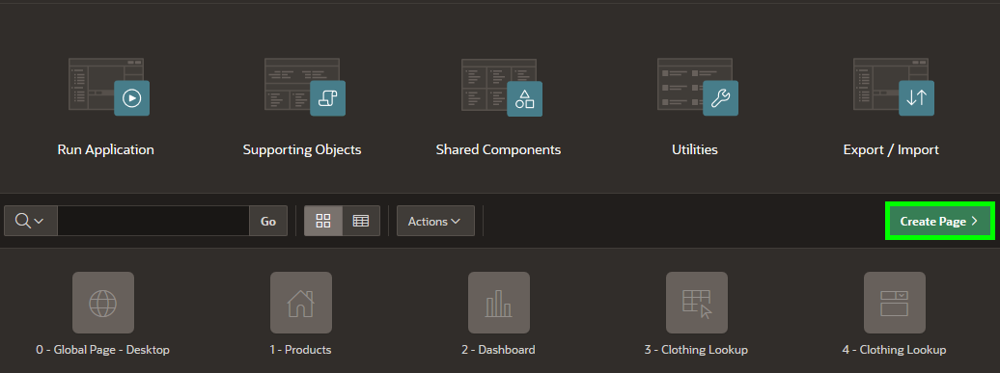

3. Select **Blank Page**.

    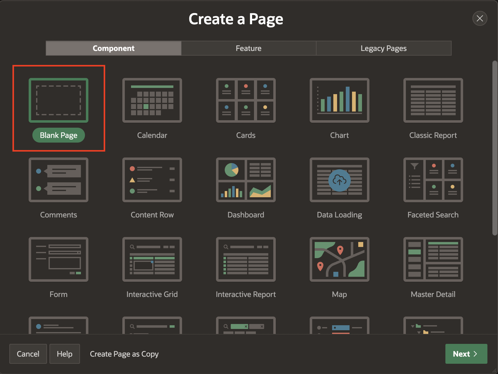

4. Enter/select the following:

    - Under Page Definition:

        - Page Number: **17**

        - Name: **Shopping Cart**

    - Under Navigation:

        - Use Breadcrumb: **Toggle Off**

        - Use Navigation: **Toggle Off**

    Click **Create Page**.

   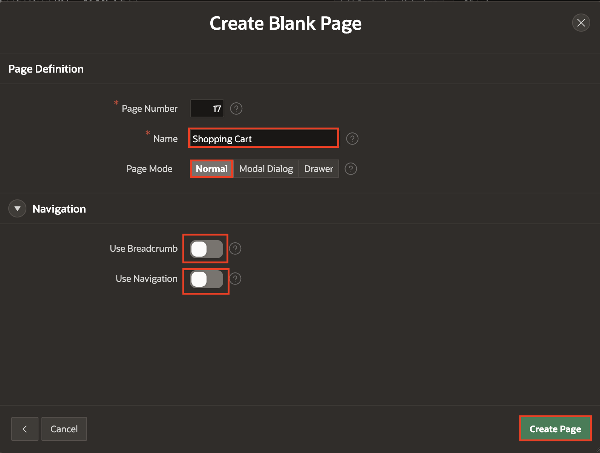

## Task 4: Add a Cards Region

This region will list the items that have been added temporarily to the shopping cart.

1. In the new page created, navigate to the **Gallery Menu**.

2. Drag a **Cards** region and drop it to the **Body** section.

    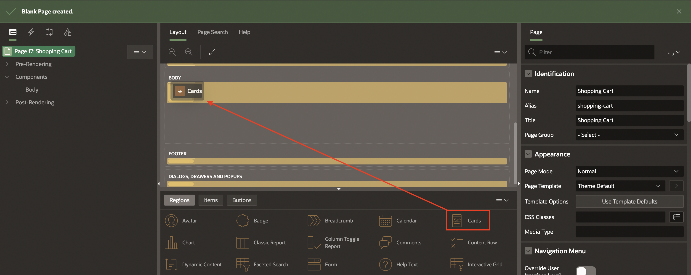

3. In the Property Editor, enter/select the following:

    - Identification > Name: **Shopping Cart**

    - Under Source:

        - Type: **SQL Query**

        - SQL Query: Enter the following SQL Query:

            ```
            <copy>
            SELECT seq_id item,
                p.product_image,
                p.product_id,
                p.product_name name,
                p.unit_price,
                n002               quantity,
                p.unit_price* n002 subtotal,
                b.brand
            FROM   apex_collections a,
                products p,
                json_table (p.product_details, '$' columns ( brand varchar2(4000) path '$.brand') ) b
            WHERE  collection_name = 'PRODUCTS'
            AND    p.product_id = a.n001
            </copy>
             ```

    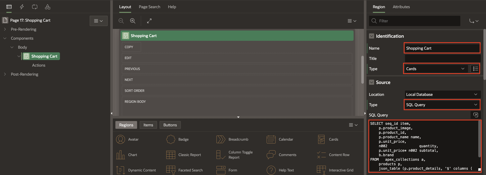

4. Navigate to **Attributes** and in the Property editor, enter/select the following:

    - Appearance > Layout: **Horizontal (Row)**

    - Title > Column: **NAME**

    - Subtitle > Column: **BRAND**

    - Under Body:

        - Advanced Formatting: **Toggle Off**

        - HTML Expression: Enter the following:

            ```
            <copy>
            Quantity: &QUANTITY.
            </copy>
            ```

    - Under Secondary Body:

        - Advanced Formatting: **Toggle On**

        - HTML Expression: Enter the following:

            ```
            <copy>
            <b>Unit Price: &UNIT_PRICE. </b> <BR>
            <b>Subtotal: &SUBTOTAL. </b>
            </copy>
            ```

    - Under Media:

        - Source: **BLOB Column**

        - BLOB Column: **PRODUCT_IMAGE**

    - Under Messages:

        - When No Data Found: **Your shopping cart is empty!**

        - No Data Found Icon: **fa-cart-empty**

    - Card > Primary Key Column 1: **ITEM**

    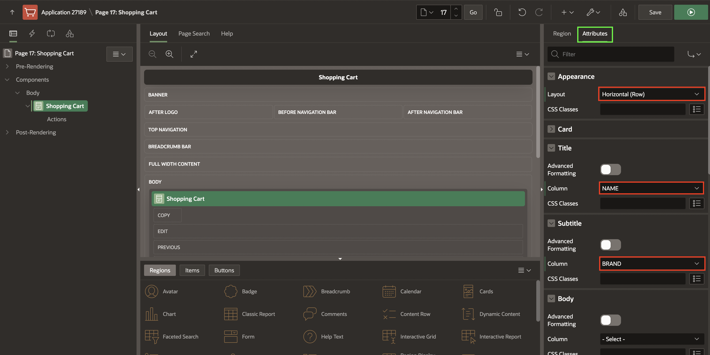

    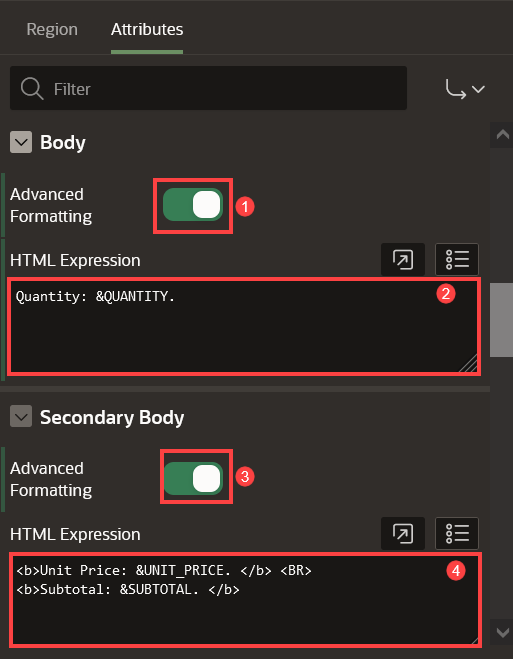

    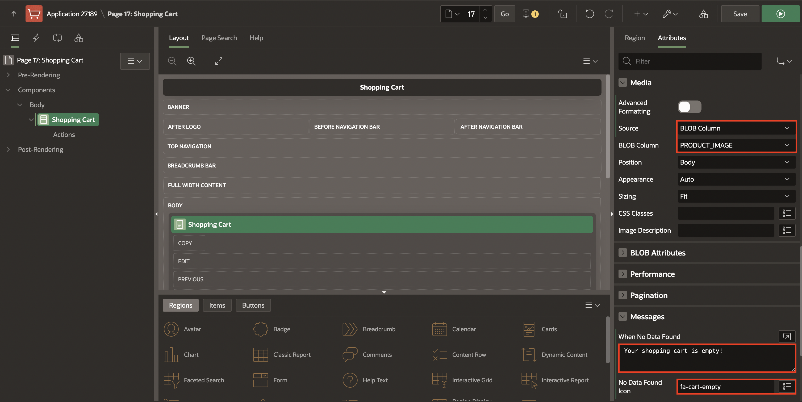

    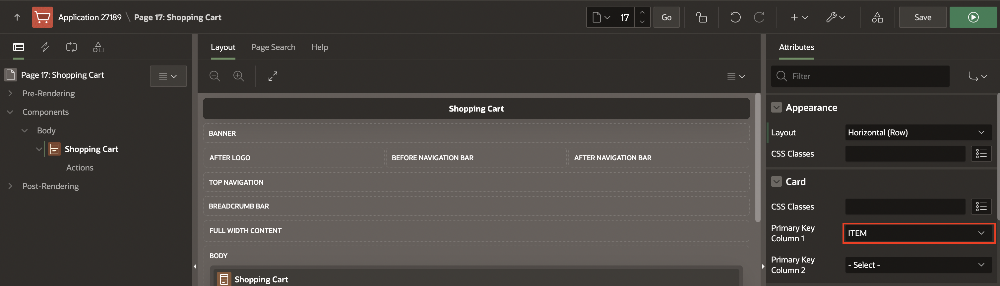

## Task 5: Add an Action to the Shopping Cart

This action allows customers to open a page to edit a particular item in the shopping cart.

1. Under **Rendering** tab (left pane), navigate to **Shopping Cart** region and select **Actions**.

2. Right-click **Actions** and select **Create Action**.

    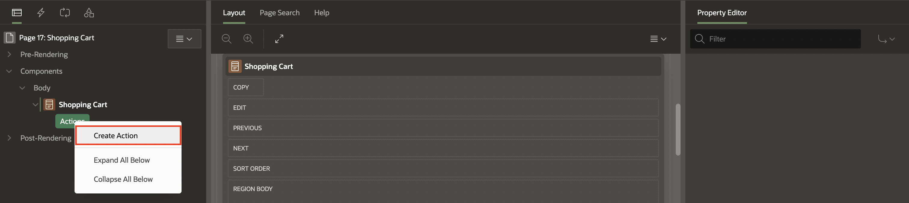

3. In the Property Editor, enter/select the following:

    - Identification > Label: **Edit**

    - Link > Target: click **No Link Defined**

        - Target > Page: **18**
        *{Note: Page 18 will be created in the next lab}*

        - Set items as follows:

            | Name             |  Value       |
            | ---              |  ---         |
            | P18\_PRODUCT\_ID | &PRODUCT_ID. |

        - Click **Ok**.

    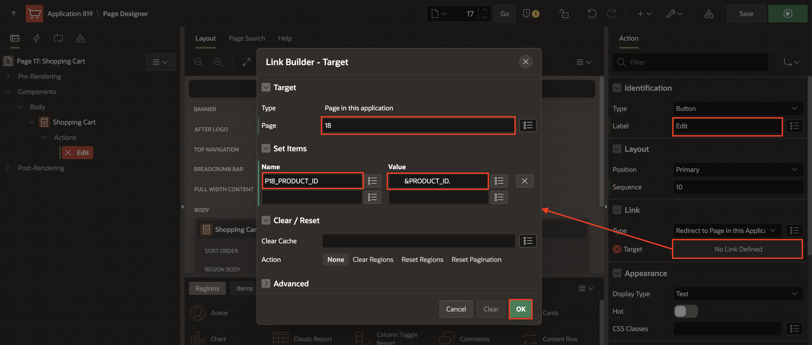

    - Display Type: **Text with Icon**

    - Icon: **fa-cart-edit**

    

    This configures the (Edit) button to open page 18, passing the value of the PRODUCT_ID column of the current card as the value for the page item P18\_PRODUCT\_ID in that called page.

## Task 6: Add Items and Buttons to the Page

1. Navigate to the **Gallery Menu**.

2. Drag a **Static Content** region and drop it to the right of the Shopping Cart region to create a second region of content.

    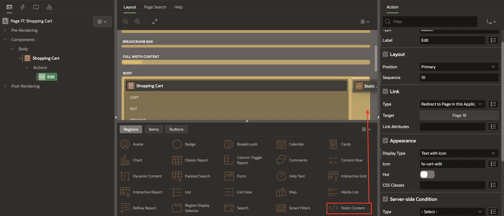

3. In the Property Editor, enter the following:

    - Identification > Name: **Order Information**

4. Navigate to the **Order Information** region.

5. Right-click the **Order Information** region and select **Create Page Item**.

    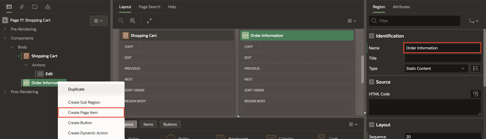

6. Create five page items one after the other:

    | Name |  Type  | Label  | Template | Value Required |
    | --- |  --- | --- | --- | --- |
    | P17\_CUSTOMER\_EMAIL | Text Field | Email Address | Optional - Floating | Off |
    | P17\_CUSTOMER\_FULLNAME | Text Field | Full Name | Optional - Floating | Off |
    | P17\_ORDER\_ID | Hidden |  | | |
    | P17\_CUSTOMER\_ID | Hidden |  | | |
    | P17_STORE | Select One | Store | Optional - Floating | Off |
    {: title="Details of the Page Items"}

7. For **P17_STORE** item, in the **list of values**, configure the type as follows:

    - Type: **SQL Query**

    - SQL Query: Enter the following SQL Query:

        ```
        <copy>
        select STORES.STORE_NAME as STORE_NAME,
            STORES.STORE_ID as STORE_ID
        from STORES STORES
        </copy>
        ```

    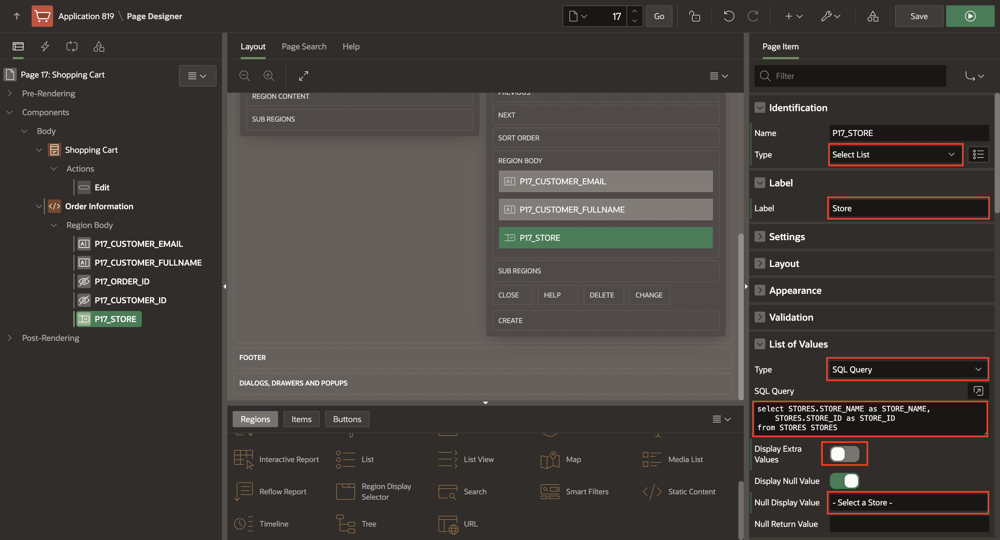

8. Navigate to the **Order Information** region.

9. Right-click the **Order Information** region and select **Create Button**.

    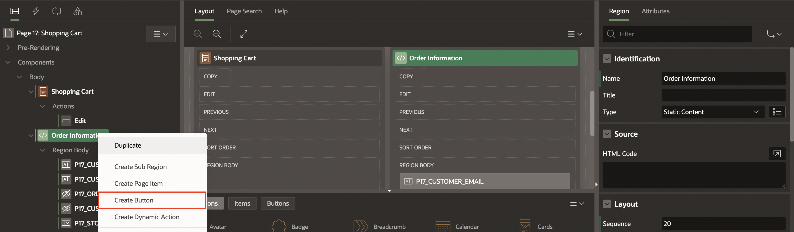

10. Create two buttons as follows:

    | Button Name | Label  | Slot | Button Template | Hot | Icon|
    | --- |  --- | --- |--- | --- | --- |
    | Proceed | Proceed to Checkout | Create | Text | On | |
    | Clear | Clear Shopping Cart | Change | Text with Icon | Off | fa-cart-empty |
    {: title="Details of the 2 Buttons"}

     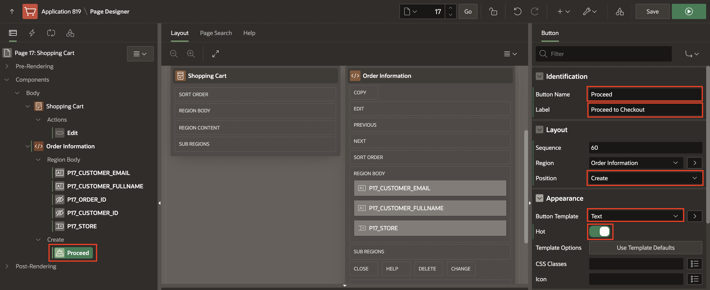

     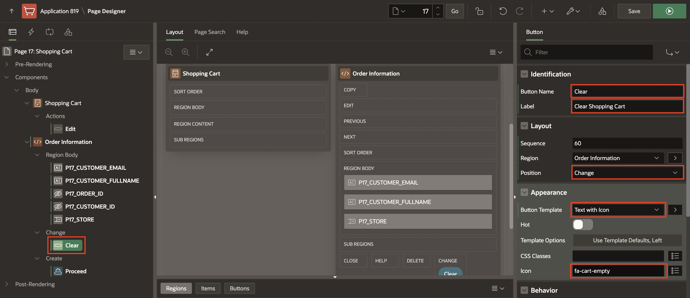

    - Under **Server-side Condition**:

    | Button Name | Type  | Item |
    | --- |  --- | --- |
    | Proceed | Item is NOT NULL | SHOPPING\_CART\_ITEMS |
    | Clear | Item is NOT NULL | SHOPPING\_CART\_ITEMS |
    {: title="Server Side Condition for the 2 Buttons"}

    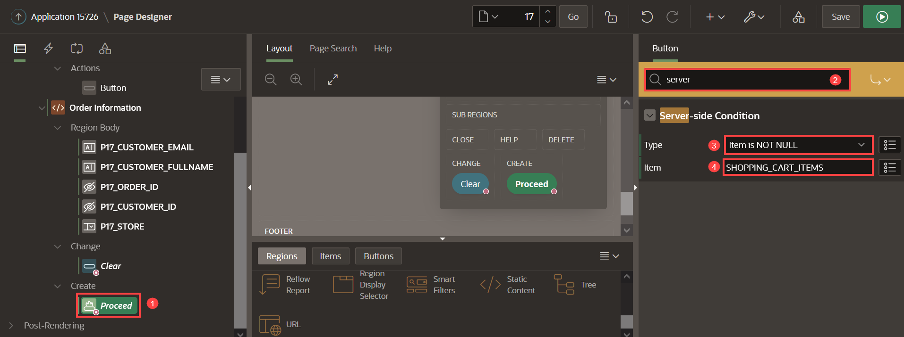

    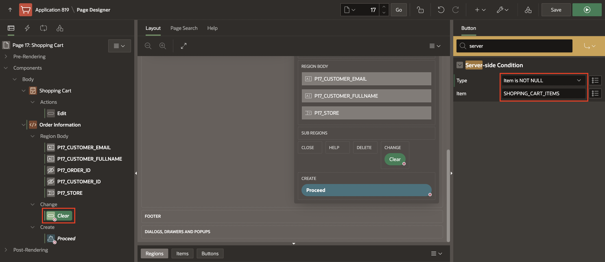

## Task 7: Add Validations to the Page

1. Navigate to **Processing** tab.

2. Right-click **Validating**, and select **Create Validation**.

     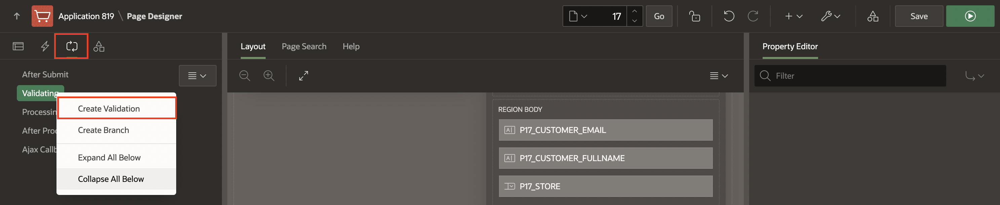

3. Create three validations for the following items: **Name**, **Email**, and **Store**

    | Name |  Validation > Type | Validation > Item |
    | --- |  --- | --- |
    | Validate Name | Item is NOT NULL | P17\_CUSTOMER\_FULLNAME |
    | Validate Email | Item is NOT NULL | P17\_CUSTOMER\_EMAIL |
    | Validate Store | Item is NOT NULL | P17_STORE |
    {: title="Validations for the Items"}

    - Under Error:

    | Error Message | Display Location | Associated Item |
    | --- |  --- | --- |
    | Please enter your name | Inline with Field and in Notification | P17\_CUSTOMER\_FULLNAME |
    | Please enter your email address | Inline with Field and in Notification | P17\_CUSTOMER\_EMAIL |
    | Please select a store | Inline with Field and in Notification | P17_STORE |
    {: title="Error Messages for the Validations"}

    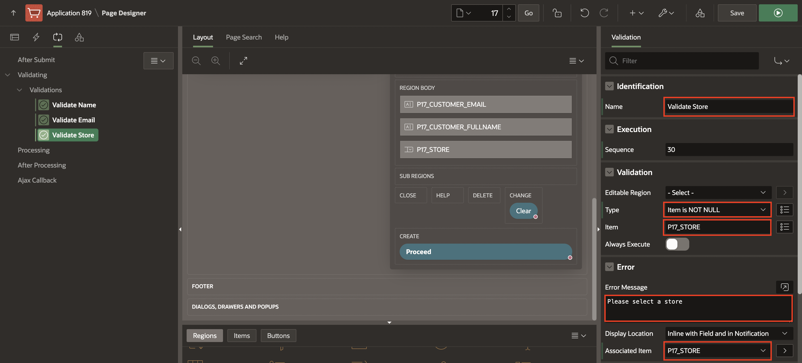

    As these validations only apply when user proceeds to checkout, let's create that condition.

    - Under Server-side Condition, set the following:

        | Name  | When Button Pressed |
        | ---   |  --- |
        | Validate Name  | Proceed |
        | Validate Email | Proceed |
        | Validate Store | Proceed |
        {: title="Server-side Conditions"}

    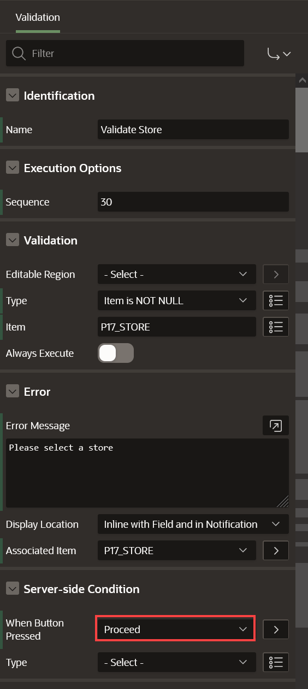

## Task 8: Add Process to Create the Order

1. On the **Processing** tab (left pane).

2. Right-click **Processing** and select **Create Process**.

    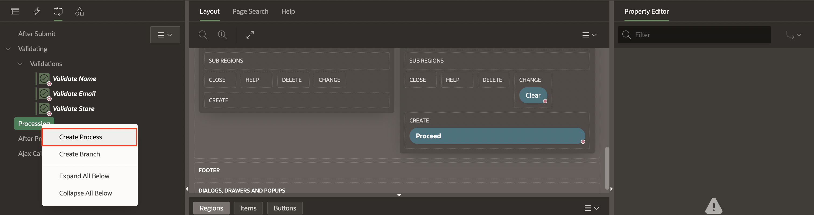

3. In the Property Editor, enter/select the following:

    - Under Identification:

        - Name: **Checkout**

        - Type: Invoke API

    - Under Settings:

        - Package: **MANAGE_ORDERS**

        - Procedure or Function: **CREATE_ORDER**

    - Success Message > Success Message: **Order successfully created: &P17\_ORDER\_ID.**

    - Server-side Condition > When Button Pressed: **Proceed**

    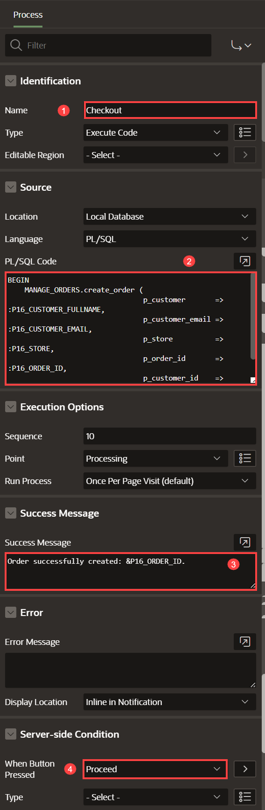

## Task 9: Add Process to Clear the Shopping Cart

1. On the **Processing** tab (left pane).

2. Right-click **Processing** and select **Create Process**.

    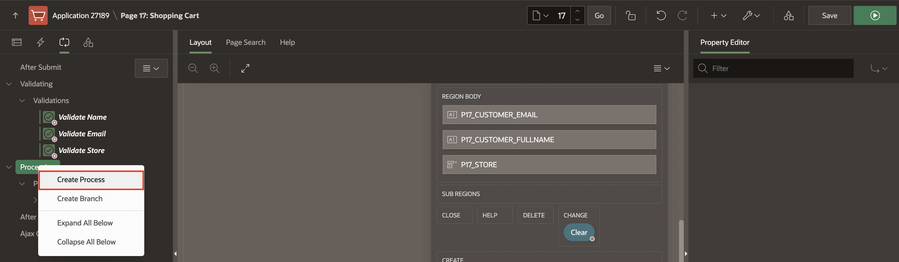

3. Create a second process to clear the shopping cart. In the Property Editor, enter/select the following:

    - Under Identification:

        - Name: **Clear Shopping Cart**

        - Type: Invoke API

    - Under Settings:

        - Package: **MANAGE_ORDERS**

        - Procedure or Function: **CLEAR_CART**

    - Server-side Condition > When Button Pressed: **Clear**

   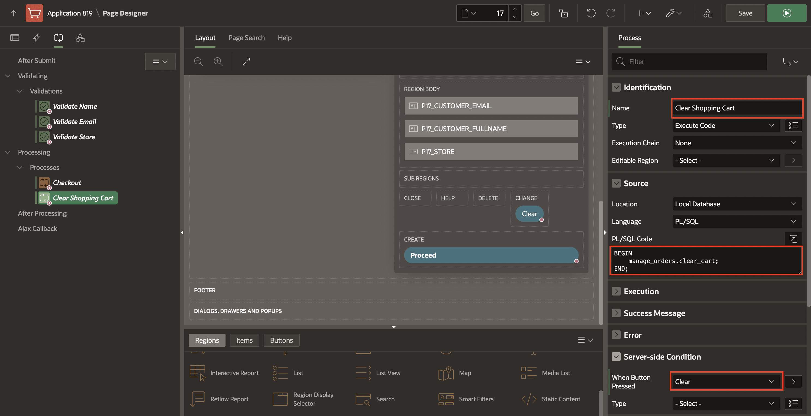

## Task 10: Add Branches to the Page

1. On the **Processing** tab (left pane).

2. Right-click **After Processing** and select **Create Branch**.

    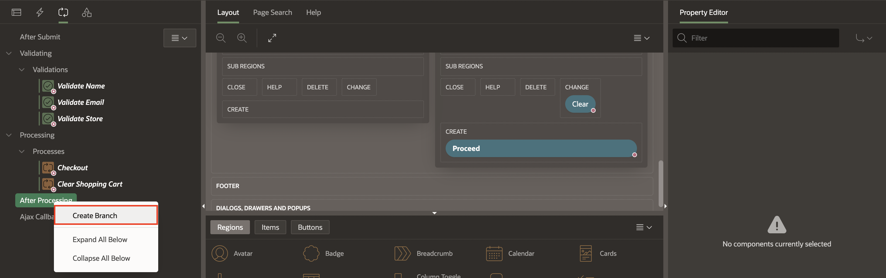

3. In the Property Editor, enter/select the following:

    - Identification > Name: **Go to Orders**

    - Behavior > Target: click **No Link Defined**

        - Page: **16**

        - Set Items: enter:

            | Name | Value  |
            | --- |  --- |
            | P16\_ORDER | &P17\_ORDER\_ID. |

        - Clear Cache: **16**.

        - Click **OK**.

    - Server-side Condition > When Button Pressed: **Proceed**.

    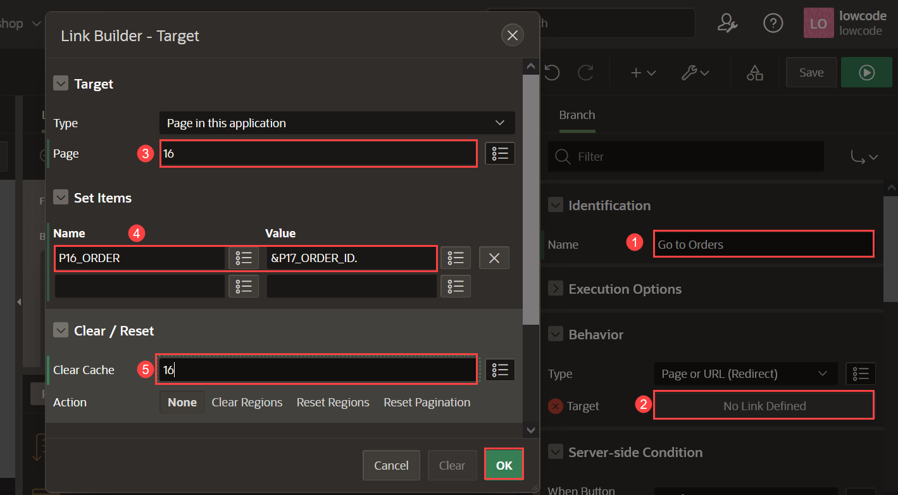

4. Create a second branch when user clears the shopping cart. Right-click **After Processing** and select **Create Branch**.

5. In the Property Editor, enter/select the following:

    - Name: **Go to Products**

    - Behavior > Target: click **No Link Defined**.

        - Page: **1**

        - Clear Cache: **1**

        - Click **OK**

    - Server-side Condition > When Button Pressed: **Clear**

    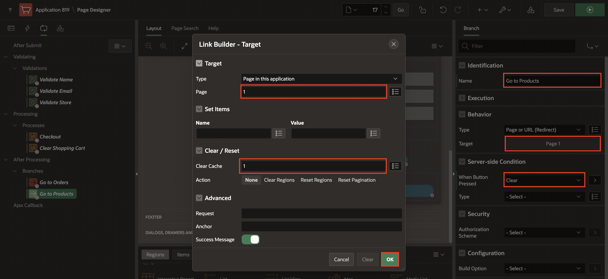

## Task 11: Add Dynamic Actions

In this task, you will create a dynamic action to:

- Update the badge and icon shown in the navigation bar after the customer has added / edited / removed a product from the shopping cart

- Refresh the shopping cart region

1. Navigate to **Dynamic Actions** tab (left pane).

2. Right-click **Dialog Closed** and select **Create Dynamic Action**.

     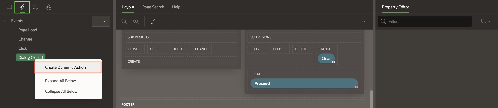

3. In the Property Editor, enter/select the following:

    - Identification > Name: **Update Shopping Cart Header**

    - Under When:

        - Selection Type: **Region**

        - Region: **Shopping Cart**

    - Under Client-side Condition:

        - Type: **JavaScript expression**

        - JavaScript Expression: Enter the following:

        ```
        <copy>
        parseInt(this.data.P18_SHOPPING_CART_ITEMS) > 0
        </copy>
        ```

    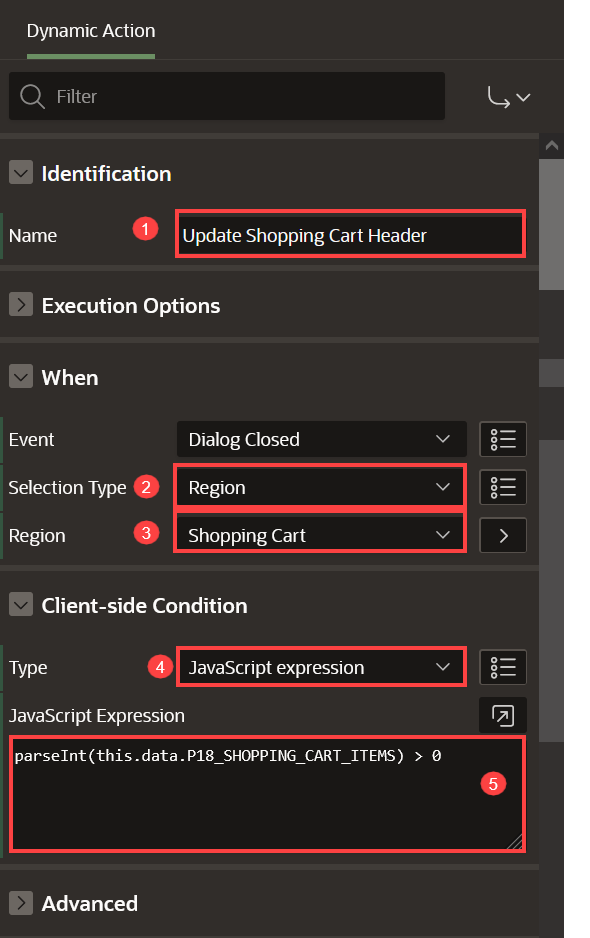

4. Navigate to **Refresh** Action.

    - Identification > Action: **Execute JavaScript Code**

    - Settings > Code: Enter the following JavaScript Code:

        ```
        <copy>
        // Update Badge Text
        apex.jQuery(".js-shopping-cart-item .t-Button-badge").text(this.data.P18_SHOPPING_CART_ITEMS);

        // Update Icon
        apex.jQuery(".js-shopping-cart-item .t-Icon").removeClass('fa-cart-empty').addClass('fa-cart-full');
        </copy>
        ```

    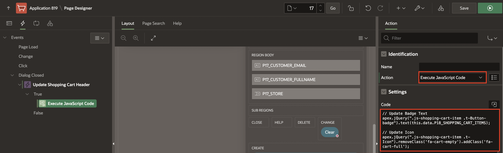

5. Create a second action. Navigate to **True** action under **Update Shopping Cart Header** Dynamic Action. Right-click **True** and select **Create TRUE Action**.

     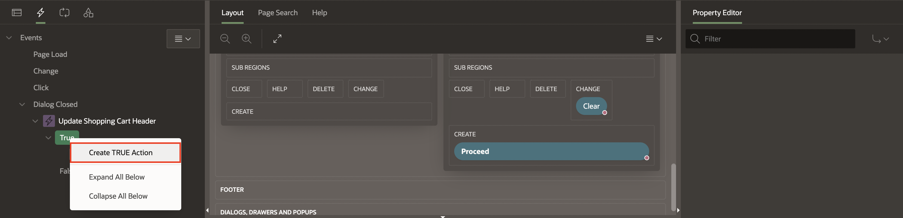

6. In the Property Editor, enter/select the following:

    - Identification > Action: **Refresh**

    - Under Affected Elements:

        - Selection Type: **Region**

        - Region: **Shopping Cart**

   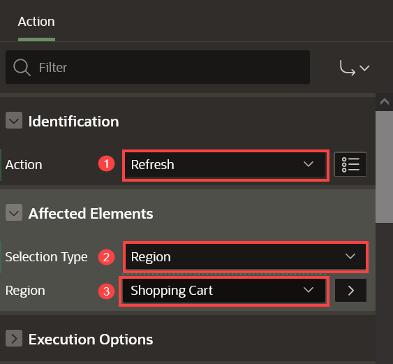

7. Create an opposite action. In the Dynamic Actions tab (left pane), navigate to **Execute JavaScript Code** action.

8. Right-click  **Execute JavaScript Code** action and select **Create Opposite Action**.

    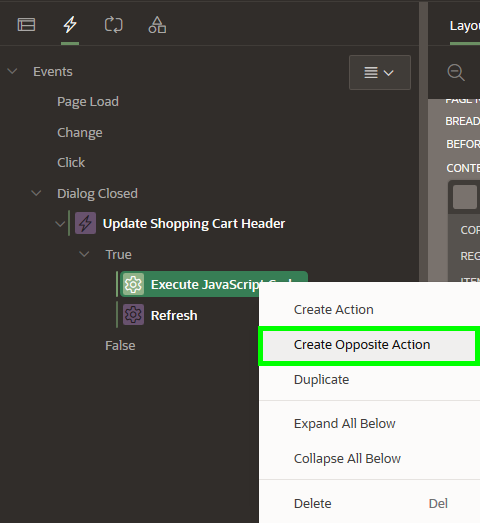

9. In the Property Editor, enter/select the following:

    - Settings > Code: Copy and replace the following JavaScript Code:

        ```
        <copy>
        // Update Badge Text
        apex.jQuery(".js-shopping-cart-item .t-Button-badge").text('');

        // Update Icon
        apex.jQuery(".js-shopping-cart-item .t-Icon").removeClass('fa-cart-full').addClass('fa-cart-empty');
        </copy>
        ```

    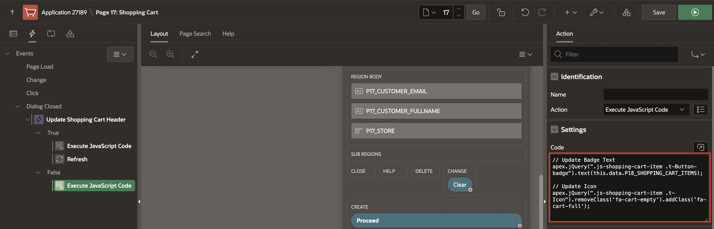

10. Create a second action. In the Dynamic Actions tab (left pane), navigate to **False** action under **Update Shopping Cart Header** Dynamic Action. Right-click **False** and select **Create FALSE Action**.

    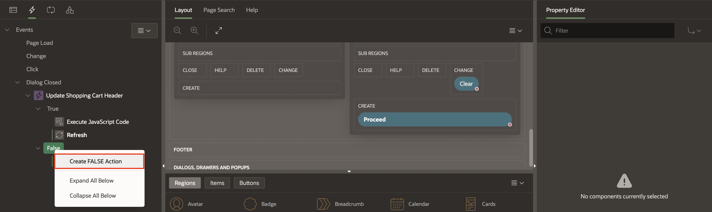

11. In the Property Editor, enter/select the following:

    - Identification > Action: **Refresh**

    - Under Affected Elements section:

        - Selection Type: **Region**

        - Region: **Shopping Cart**

    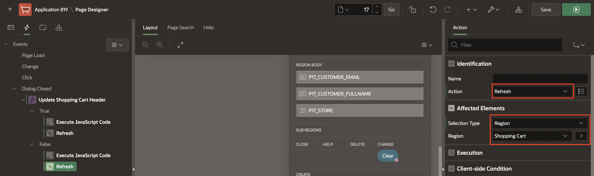

## Task 12: Format Products Image Size

1. Navigate to **Rendering** tab (left pane), select **Page 17: Shopping Cart**.

2. In the Property Editor (right pane), enter/select the following:

    - CSS > Inline: Copy and paste the following:

        ```
        <copy>
        img {
                width: 150px;
                height: 150px;
            }
        </copy>
        ```

    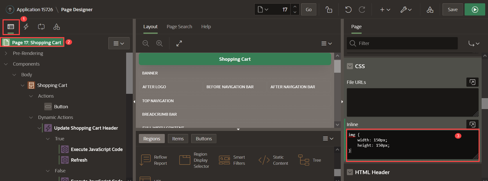

3. Click **Save**.

## Summary

You now know how to add validations, processes, branches, and dynamic actions to your APEX page. You may now **proceed to the next lab**.

## Acknowledgments

- **Author(s)** - Apoorva Srinivas, Senior Product Manager; Mónica Godoy, Principal Product Manager
- **Contributors** - Shakeeb Rahman, Architect
- **Last Updated By/Date** - Ankita Beri, Product Manager, January 2025
