# Create the shopping cart page

## Introduction

In this lab, you will create a new page to review the items added to the Shopping Cart.

Once you have finished the workshop and updated all the products as described in the steps, your page will look like the following image:


Customers will be able to:
- Review the items in the shopping cart
- Edit the quantity of the items
- Remove an item
- Clear the shopping cart
- Proceed to checkout

Estimated Time: 20 minutes

<!--
Watch the video below for a quick walk through of the lab.

[](youtube:Cvl9xMAqnm8)
-->

Watch the video below for a quick walk-through of the lab.
[Create the shopping cart page](videohub:1_3n85gmue)

### Objectives
In this lab, you will:
- Create a page to list the products in the Shopping Cart
- Create Application Items, Application Processes, and Dynamic Actions to manage the Shopping Cart

## Task 1: Create Application Items
These items are needed to count the number of items in the shopping cart and the icon to display in the Navigation Bar.

1. Click on **Shared Components**

    

2. Under Application Logic, click **Application Items**.

    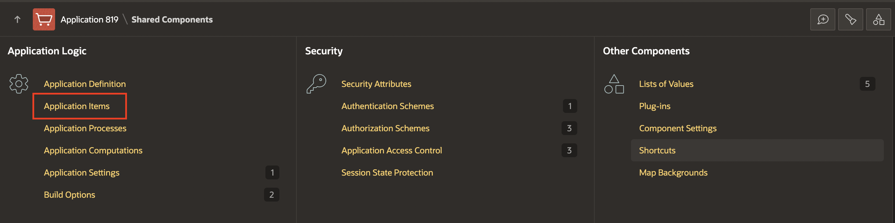

3. Click **Create**.

4. Create two items as follow:

    | Name |  Scope  |
    | --- |  --- |
    | SHOPPING\_CART\_ICON  | Application|
    | SHOPPING\_CART\_ITEMS | Application |
    {: title="Application items"}

5. Click **Create Application Item** and create the second item.

    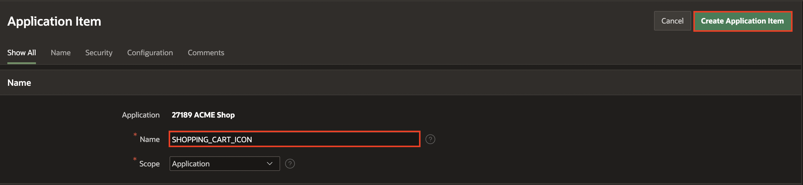

## Task 2: Create Application Process

This process is needed to refresh the number of items in the Shopping Cart, which will be shown in the navigation bar.

1. Click on **Shared Components**.
    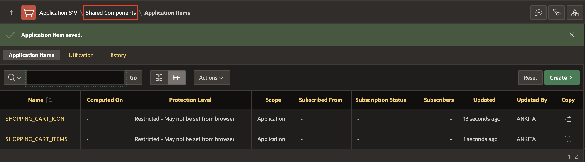
2. Under Application Logic, click **Application Processes**.
    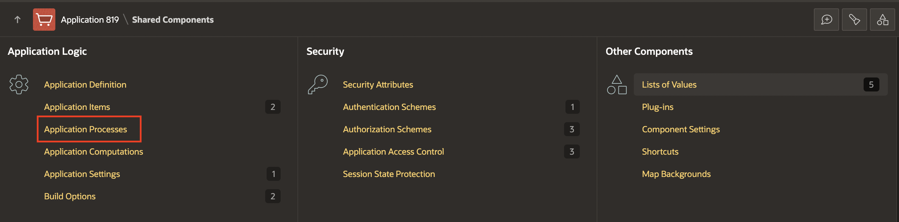
3. Click **Create** and enter the following:
    - For Name - enter **Initialize Shopping Cart Header**
    - For Process Point - select **On Load: Before Header (page template header)**
  Click **Next**.
        

5. For Code, enter:

    ```
    <copy>
    -- Initialize shopping cart navigation bar to show appropriate icon and count
    DECLARE
        l_cnt NUMBER := manage_orders.get_quantity;
    BEGIN
        IF l_cnt > 0 THEN
            :SHOPPING_CART_ITEMS := l_cnt;
            :SHOPPING_CART_ICON := 'fa-cart-full';
        ELSE
            :SHOPPING_CART_ITEMS := '';
            :SHOPPING_CART_ICON := 'fa-cart-empty';
        END IF;
    END;
    </copy>
    ```
    Click **Next**.
    

7. Click **Create Process**.   

## Task 3: Create a Normal Page - Shopping Cart

The shopping cart page allows users to review and edit the products in the cart. Additionally, users can create the order or clear the shopping cart.

1. Click on Application Home.  ***The ID of your application may vary***.

    

2. Click **Create Page**.    

    

3. Select **Blank Page** and click **Next**.

4. Enter the following and click **Next**.
    - Page Number - enter **17**
    - For Name - enter **Shopping Cart**
    - For Page Mode - select **Normal**

5. Under Navigation, deselect **Breadcrumb** and **Navigation** and click **Create Page**.

    

## Task 4: Add a Cards Region

This region will list the items that have been added temporarily to the shopping cart.

1. In the new page created, navigate to the **Gallery Menu**.

2. Drag a **Cards** region and drop it to the Content Body section.

    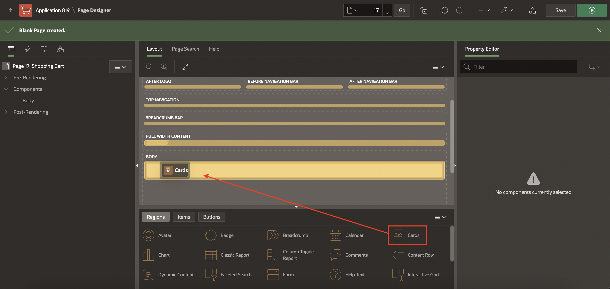

3. In the Property Editor, enter the following:

    - For Title - enter **Shopping Cart**
    - Under Source section:
        - For Type - select **SQL Query**
        - For SQL Query - enter the following SQL Query:

            ```
            <copy>
            SELECT seq_id item,
                p.product_image,
                p.product_id,
                p.product_name name,
                p.unit_price,
                n002               quantity,
                p.unit_price* n002 subtotal,
                b.brand
            FROM   apex_collections a,
                products p,
                json_table (p.product_details, '$' columns ( brand varchar2(4000) path '$.brand') ) b
            WHERE  collection_name = 'PRODUCTS'
            AND    p.product_id = a.n001
            </copy>
        ```
        

4. Click on **Attributes** and enter the following:

    - Under Appearance section:
        - For Layout - select **Horizontal (Row)**
        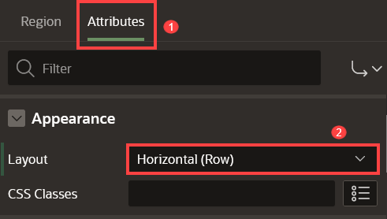

    - Under Title section:

        - For Column - select **NAME**

    - Under Subtitle section:

        - For Column - select **BRAND**    
        

    - Under Body section:

        - Set Advanced Formatting to **On**
        - For HTML Expression - enter the following:

            ```
            <copy>
            Quantity: &QUANTITY.
            </copy>
            ```

    - Under Secondary Body section:
        - Set Advanced Formatting to **On**
        - For HTML Expression - enter the following:

            ```
            <copy>
            <b>Unit Price: &UNIT_PRICE. </b> <BR>
            <b>Subtotal: &SUBTOTAL. </b>
            </copy>
            ```
          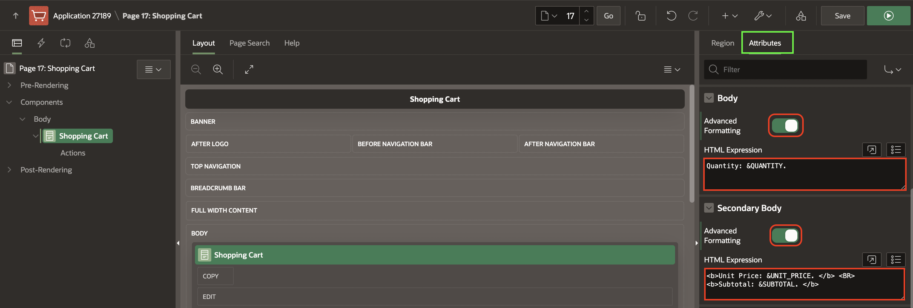

    - Under Media section:
        - For Source - select **BLOB Column**
        - For BLOB Column - select **PRODUCT_IMAGE**
          

    - Under Messages section:
        - For When No Data Found - enter: **Your shopping cart is empty!**
        - For No Data Found Icon - select **fa-cart-empty**
        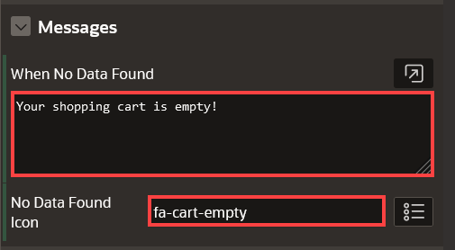

    - Under Card section:
        - For Primary Key Column 1 - select **ITEM**
        

## Task 5: Add an Action to the Shopping Cart

This action allows customers to open a page to edit a particular item in the shopping cart.

1. In the Rendering tree (left pane), navigate to **Actions** under **Shopping Cart**.

2. Right-click **Actions** and click **Create Action**.
    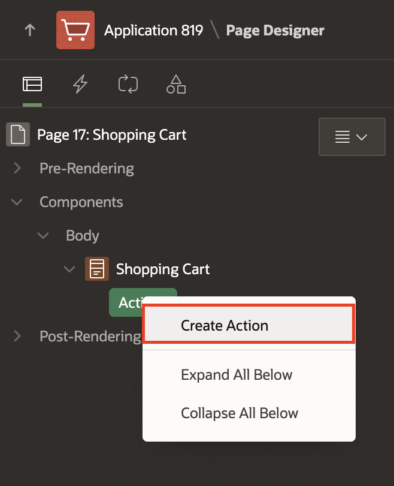

3. In the Property Editor, enter the following:

    - For Label - enter **Edit**
    - For Target - click **No Link Defined**:
        - For Page - enter **18**  
        *{Note: Page 18 will be created in the next lab}*
        - Set items as follows:
            | Name             |  Value       |
            | ---              |  ---         |
            | P18\_PRODUCT\_ID | &PRODUCT_ID. |

        - Click **Ok**.

        

    - For Display Type - select **Text with Icon**
    - For Icon - enter **fa-cart-edit**
        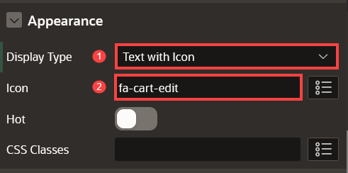
This configures the (Edit) button to open page 18, passing the value of the PRODUCT_ID column of the current card as the value for the page item P18\_PRODUCT\_ID in that called page.       

## Task 6: Add Items and Buttons to the Page

1. Navigate to the **Gallery Menu**.

2. Drag a **Static Content** region and drop it to the right of the Shopping Cart region to create a second region of content.
    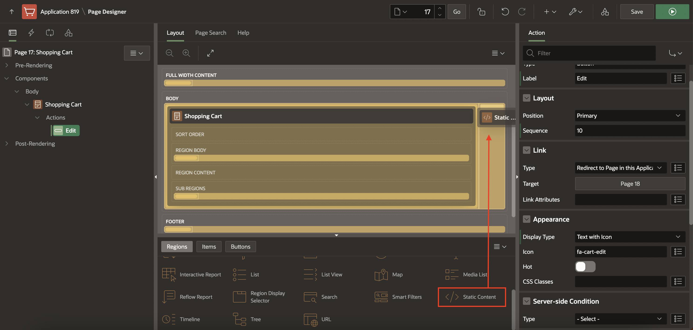

3. In the Property Editor, enter the following:
    - For Name - enter **Order Information**

4. Navigate to the **Order Information** (left pane) region.

5. Right-click the **Order Information** region and click **Create Page Item**.

    
6. Create five items as follows:


    | Name |  Type  | Label  | Template | Value Required |
    | --- |  --- | --- | --- | --- |
    | P17\_CUSTOMER\_EMAIL | Text Field | Email Address | Optional - Floating | Off |
    | P17\_CUSTOMER\_FULLNAME | Text Field | Full Name | Optional - Floating | Off |  
    | P17\_ORDER\_ID | Hidden |  | | |
    | P17\_CUSTOMER\_ID | Hidden |  | | |
    | P17_STORE | Select List | Store | Optional - Floating | Off |
    {: title="Details of the Page Items"}


    For **P17_STORE** item, in the list of values section, configure the type as follows:

    - For Type - select **SQL Query**
    - For SQL Query - enter the following SQL Query:

        ```
        <copy>
        select STORES.STORE_NAME as STORE_NAME,
            STORES.STORE_ID as STORE_ID
        from STORES STORES
        </copy>
        ```
    - Set Display Extra Values - to **Off**
    - For Null Display Value - enter **- Select a Store -**

7. Navigate to the **Order Information** (left pane) region.
8. Right-click the **Order Information** region  and click **Create Button**.
       
9. Create two buttons as follows:

    | Button Name | Label  | Position | Button Template | Hot | Icon |
    | --- |  --- | --- |
    | Proceed | Proceed to Checkout | Create | Text | On | |
    | Clear | Clear Shopping Cart | Change | Text with Icon | Off | fa-cart-empty |
    {: title="Details of the 2 Buttons"}

     Under Server-side Condition:
    | Button Name | Type  | Item |
    | --- |  --- | --- |
    | Proceed | Item is NOT NULL | SHOPPING\_CART\_ITEMS |
    | Clear | Item is NOT NULL | SHOPPING\_CART\_ITEMS |
    {: title="Server Side Condition for the 2 Buttons"}

     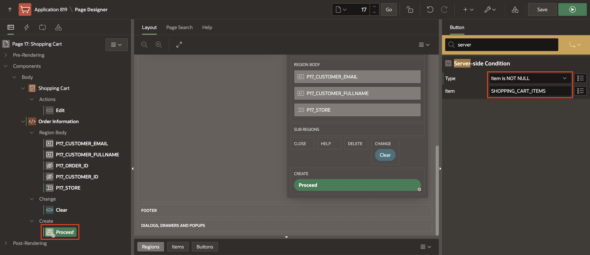      

## Task 7: Add Validations to the Page

1. In the Rendering tree (left pane), click **Processing** tab.

2. Right-click on **Validating**, and select **Create Validation**.

       

3. Create three validations for the following items: **Name**, **Email**, and **Store**

    | Name |  Type (under Validation) | Item |
    | --- |  --- | --- |
    | Validate Name | Item is NOT NULL | P17\_CUSTOMER\_FULLNAME |
    | Validate Email | Item is NOT NULL | P17\_CUSTOMER\_EMAIL |
    | Validate Store | Item is NOT NULL | P17_STORE |
    {: title="Validations for the Items"}

    Under Error:

    | Error Message | Display Location | Associated Item |
    | --- |  --- | --- |
    | Please enter your name | Inline with Field and in Notification | P17\_CUSTOMER\_FULLNAME |
    | Please enter your email address | Inline with Field and in Notification | P17\_CUSTOMER\_EMAIL |
    | Please select a store | Inline with Field and in Notification | P17_STORE |
    {: title="Error Messages for the Validations"}

     

     As these validations only apply when user proceeds to checkout, let's create that condition.
     Under Server-side Condition, set the following:

    | Name  | When Button Pressed |
    | ---   |  --- |
    | Validate Name  | Proceed |
    | Validate Email | Proceed |
    | Validate Store | Proceed |
    {: title="Server-side Conditions"}   

            

## Task 8: Add Process to Create the Order

1. On the **Processing** tab (left pane).

2. Right-click **Processing** and click **Create Process**.

3. In the Property Editor, enter the following:

     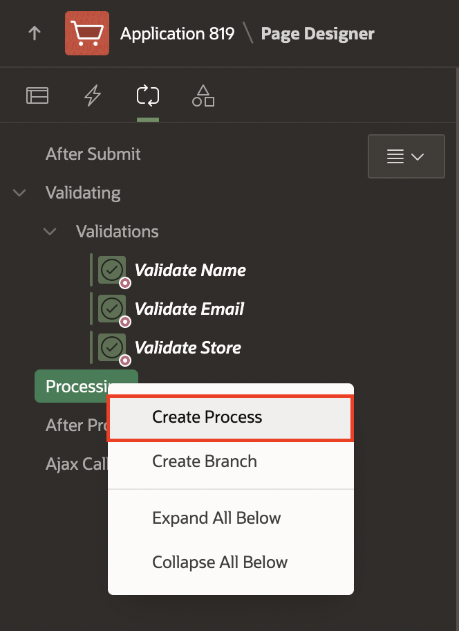  

    - For Name - enter **Checkout**
    - For Type -select **Execute Code**
    - For PL/SQL Code - enter the following PL/SQL code:

        ```
        <copy>
        BEGIN
            MANAGE_ORDERS.create_order (
                                        p_customer       => :P17_CUSTOMER_FULLNAME,
                                        p_customer_email => :P17_CUSTOMER_EMAIL,
                                        p_store          => :P17_STORE,
                                        p_order_id       => :P17_ORDER_ID,
                                        p_customer_id    => :P17_CUSTOMER_ID);   
        END;                                    
        </copy>
        ```

    - For Success Message, enter **Order successfully created: &P17\_ORDER\_ID.**
    - Under Server-side conditions, for When Button Pressed, select **Proceed**

    


## Task 9: Add Process to Clear the Shopping Cart

1. On the **Processing** tab (left pane).
2. Right-click **Processing** and click **Create Process**.
3. Create a second process to clear the shopping cart. In the Property Editor, enter the following:
    - For Name - enter **Clear Shopping Cart**
    - For Type - select **Execute Code**
    - For PL/SQL Code - enter the following PL/SQL code:

    ```
    <copy>
    BEGIN
        manage_orders.clear_cart;
    END;
    </copy>
    ```

    - For When Button Pressed, select **Clear**

    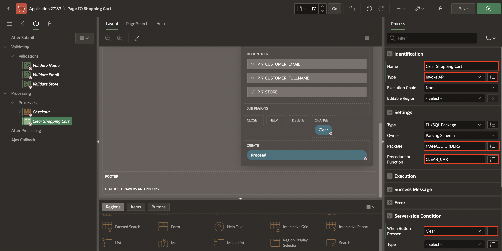


## Task 10: Add Branches to the Page

1. On the **Processing** tab (left pane).

2. Right-click **After Processing** and click **Create Branch**.

     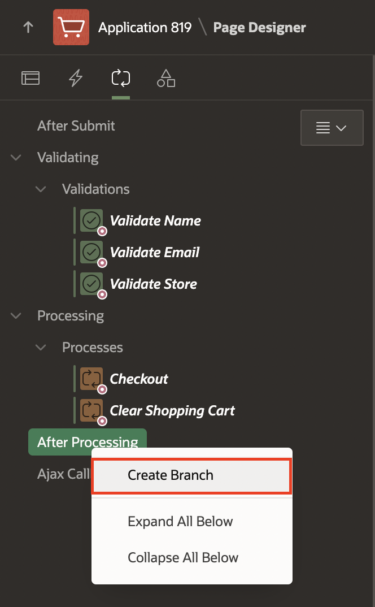  

3. In the Property Editor, enter the following:  

    - For Name - enter **Go to Orders**

    - Navigate to Target attribute and click **No Link Defined**.

        - For Type - select **Page in this application**

        - For Page - enter **16**

        - For Set Items - enter:

            | Name | Value  |
            | --- |  --- |
            | P16\_ORDER\_ID | &P17\_ORDER\_ID. |

        - For Clear Cache - enter **16**.

        - Click **OK**.

    - For When Button Pressed, select **Proceed**.

      

4. Create a second branch when user clears the shopping cart. Right-click on **After Processing** and click **Create Branch**.

5. In the Property Editor, enter the following:

    - For Name - enter **Go to Products**

    - Navigate to Target attribute and click **No Link Defined**

        - For Type - select **Page in this application**

        - For Page - enter **1**

        - For Clear Cache - enter **1**

        - Click **OK**

    - For When Button Pressed, select **Clear**

## Task 11: Add Dynamic Actions
In this task, you will create a dynamic action to:

- Update the badge and icon shown in the navigation bar after the customer has added / edited / removed a product from the shopping cart

- Refresh the shopping cart region

1. Navigate to **Dynamic Actions** tab (left pane).

     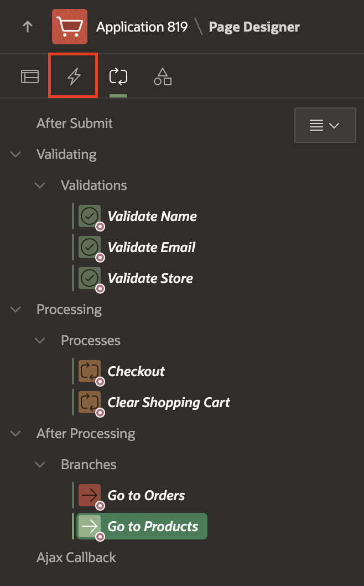  

2. Right-click **Dialog Closed** and click **Create Dynamic Action**.

       

3. In the Property Editor, enter the following:

    - Under Identification section:

        - For Name - enter **Update Shopping Cart Header**

    - Under When section:   

        - For Event - select **Dialog Closed**

        - For Selection Type - select **Region**

        - For Region - select **Shopping Cart**   

    - Under Client-side Condition:

        - For Type - select **JavaScript expression**

        - For JavaScript Expression, enter the following:

            ```
            <copy>
            parseInt(this.data.P18_SHOPPING_CART_ITEMS) > 0
            </copy>
            ```
          

4. Navigate to **Refresh** Action.

    - Under Identification section:

        - For Action - select **Execute JavaScript Code**

    - Under Settings section:       

        - For Code - enter the following JavaScript Code:

            ```
            <copy>
            // Update Badge Text
            apex.jQuery(".js-shopping-cart-item .t-Button-badge").text(this.data.P18_SHOPPING_CART_ITEMS);

            // Update Icon
            apex.jQuery(".js-shopping-cart-item .t-Icon").removeClass('fa-cart-empty').addClass('fa-cart-full');
            </copy>
            ```
             

5. Create a second action. In the Dynamic Actions tab (left pane), navigate to **True** under **Update Shopping Cart Header** Dynamic Action. Right-click on **True** and select **Create TRUE Action**.

     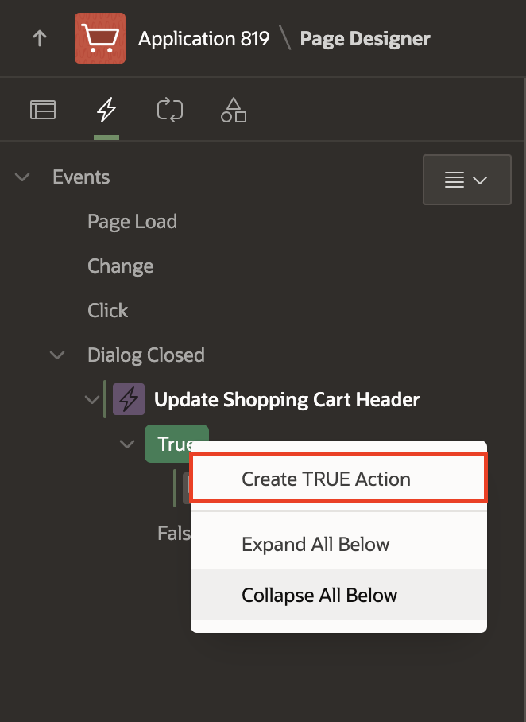

6. In the Property Editor, enter the following:  

    - Under Identification section:

        - For Action - select **Refresh**

    - Under Affected Elements section:   

        - For Selection Type - select **Region**

        - For Region - select **Shopping Cart**   

             

11. Create an opposite action. In the Dynamic Actions tab (left pane), navigate to **Execute JavaScript Code** action.

12. Right-click  **Execute JavaScript Code** action and click **Create Opposite Action**.

     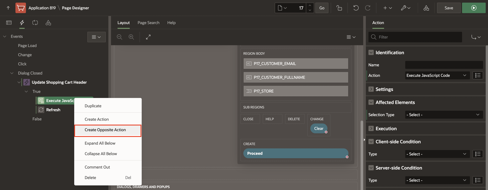

13. Navigate to **Execute JavaScript Code** Action.

    - Under Identification section:

        - For Action - select **Execute JavaScript Code**

    - Under Settings section:       

        - For Code - enter the following JavaScript Code:

            ```
            <copy>
            // Update Badge Text
            apex.jQuery(".js-shopping-cart-item .t-Button-badge").text('');

            // Update Icon
            apex.jQuery(".js-shopping-cart-item .t-Icon").removeClass('fa-cart-full').addClass('fa-cart-empty');
            </copy>
            ```

14. Create a second action. In the Dynamic Actions tab (left pane), navigate to **False** under **Update Shopping Cart Header** Dynamic Action. Right-click on **False** and select **Create FALSE Action**.

15. In the Property Editor, enter the following:

    - Under Identification section:

        - For Action - select **Refresh**

    - Under Affected Elements section:    

        - For Selection Type - select **Region**

        - For Region - select **Shopping Cart**    

## Task 12: Format Products Image Size

1. In the Rendering tree (left pane), navigate to **Page 17: Shopping Cart**.

2. In the Property Editor (right pane), do the following:

    - Under CSS section.

        -   For Inline - enter the following:

            ```
            <copy>    
            img {
                width: 150px;
                height: 150px;
            }
            </copy>
            ```
     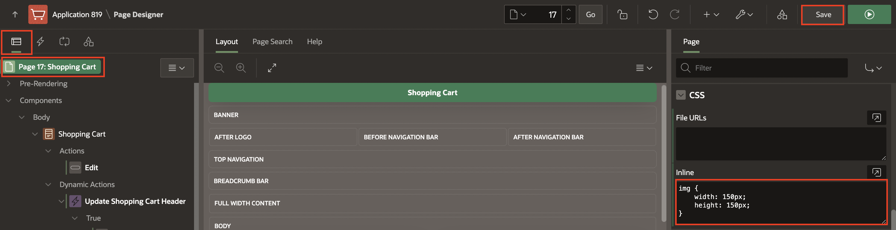             

3. Click **Save**.


You now know how to add validations, processes, branches, and dynamic actions to your APEX page. You may now **proceed to the next lab**.

## Acknowledgments

- **Author** - Apoorva Srinivas, Senior Product Manager; Mónica Godoy, Principal Product Manager
- **Contributors** - Shakeeb Rahman, Architect
- **Last Updated By/Date** - Ankita Beri, Product Manager, May 2023
