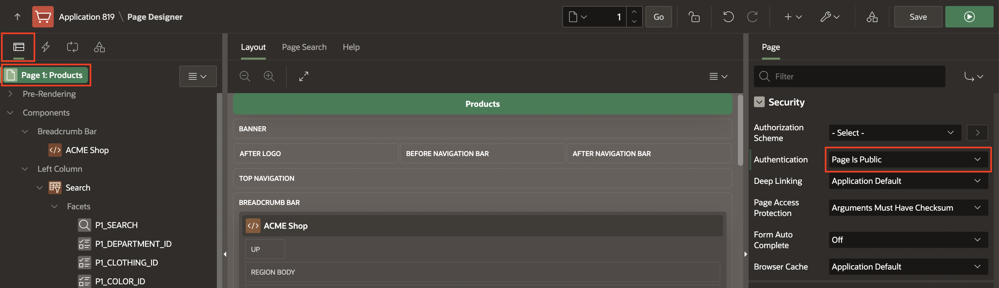
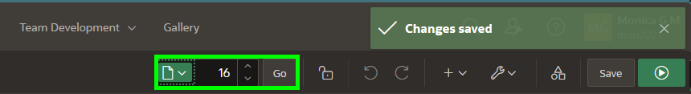
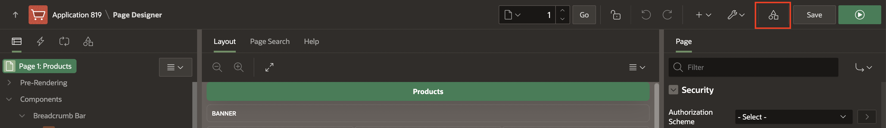
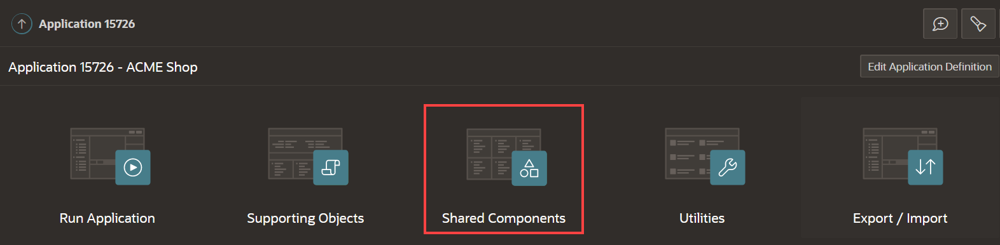
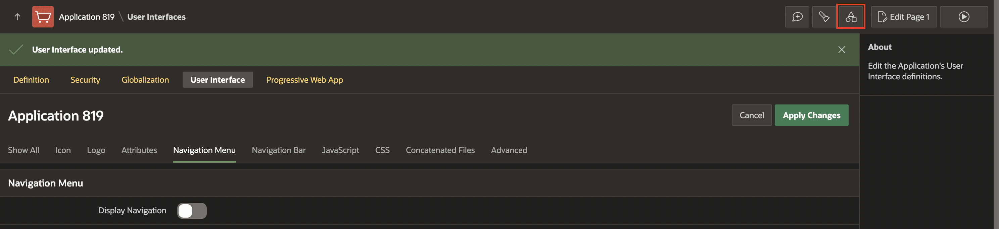
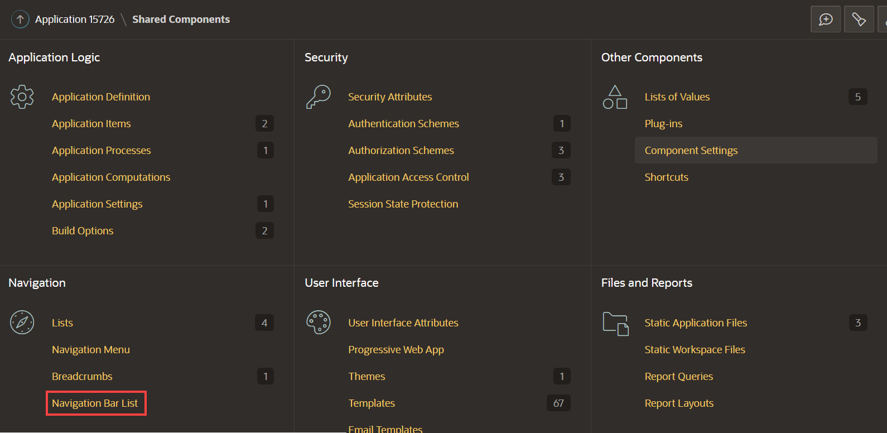
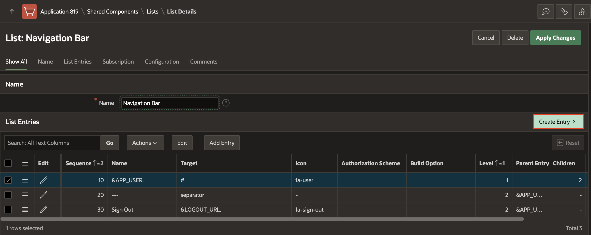
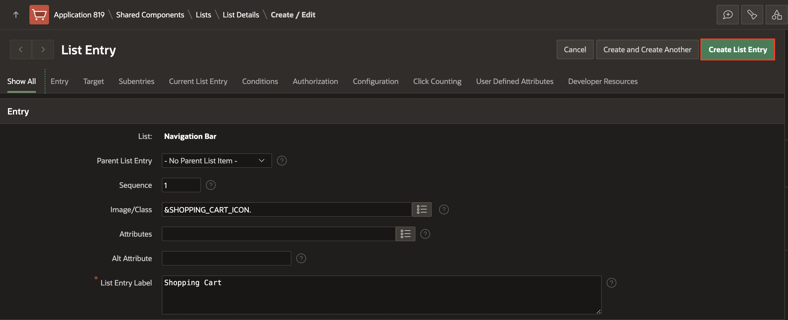
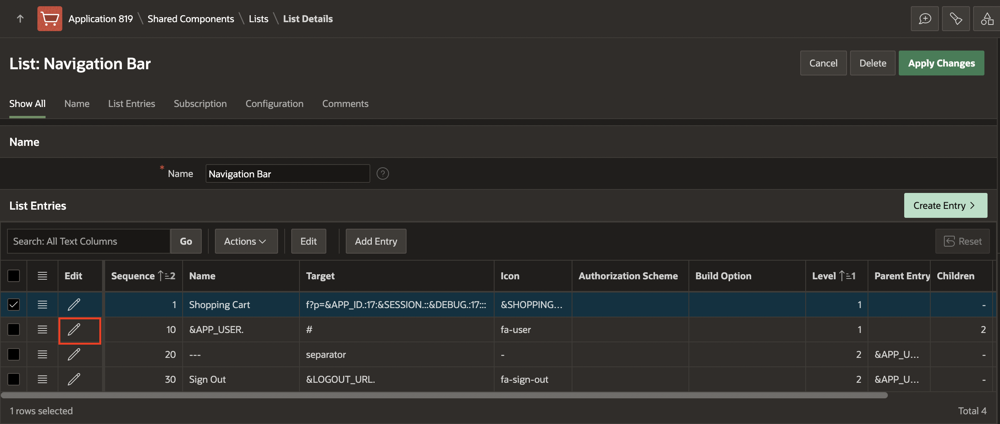
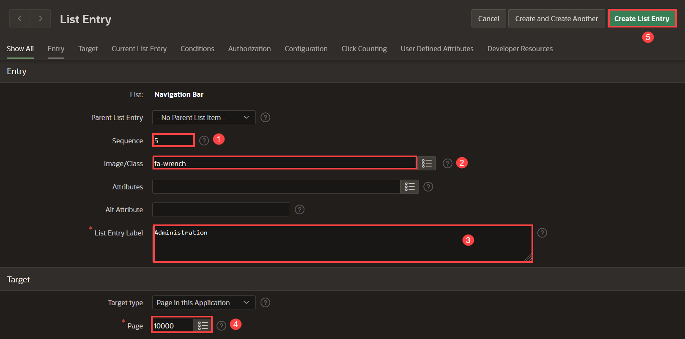

# Improve the application

## Introduction

In this lab, you will learn how to make some pages publicly accessible.

Estimated Time: 10 minutes

Watch the video below for a quick walk through of the lab.

### Objectives
In this lab, you will:
- Set the following pages as public pages:
    - Products
    - Shopping Cart
    - Order Information

- Disable the Navigation Menu

- Enhance the Navigation Bar

## Task 1: Set Pages to be Public
Your customers don't need to log in the app to shop the products, so let's set the following pages as public:
- Page  1: Products
- Page 16: Order Information
- Page 17: Shopping Cart
- Page 18: Add to Cart

Follow these steps for the four listed pages:

1. From the runtime application, navigate to the page.

    In the Developer Toolbar click **Edit Page x**.

2. Within Page Designer, in the Rendering tree (left pane), navigate to  **Page x: Name of the Page**.

    In the Property Editor (right pane), apply the following change:
    - Under Security section:
        - For Authentication - select **Page Is Public**

    

3. Click **Save**.

4. Navigate to Page Finder and go to the next page. 
    

## Task 2: Clean the Navigation Menu
Since the home page is the Products page and this is a public access page as some others too, it's not needed to have a navigation menu. 
In this task, you will turn off displaying the navigation menu.

1. Within Page Designer, click the Shared Components icon at the top right.

    
   Alternatively, if you are in the App Builder, click Shared Components.
   

2. Under User Interface, click **User Interface Attributes**.
    
3. Click **Navigation Menu**.

4. Set Display Navigation to **Off**.
    

5. Click **Apply Changes**.

## Task 3: Enhance the Navigation Bar List
Add a new navigation menu entry to allow:
- Customers to go directly to the Shopping Cart
- Administrators to login and access to administration page

1. Click the Shared Components icon at the top right.
    
2. Under Navigation, click **Navigation Bar List**.
    

3. Click **Desktop Navigation Bar**.

4. Click **Create Entry** and enter the following:

    - For Sequence - enter **1**
    - For Image/Class - **&SHOPPING\_CART\_ICON.**
    - For List Entry Label - **Shopping Cart**
    - For Page - select **17**
    - For Clear cache - enter **17**
    
5. Scroll under **User Defined Attributes** and enter the following:
    - For 1. Badge Value - enter  **&SHOPPING\_CART\_ITEMS.**
    - For 2. List Item CSS Classes - enter **js-shopping-cart-item**

5. Click **Create List Entry**.
    
    
6. Click **&APP_USER.** 
    

7. Under Authorization, for Authorization Scheme, select **Administration Rights**.

8. Click **Apply Changes**.
    

4. Click **Create Entry**  and enter the following:
    - For Sequence - enter **5**
    - For Image/Class - enter **fa-wrench**
    - For List Entry Label - enter **Administration**
    - For Page - select **10000**
    
5. Click **Create List Entry**.
    

You now know how to enhance and maintain both navigation menu and navigation bar.

## Acknowledgments

- **Author** - Monica Godoy, Principal Product Manager
- **Last Updated By/Date** - Arabella Yao, Database Product Manager, October 2021