# Improve the products page

## Introduction

In this lab, you will learn how to improve the Products page by adding new facets and customizing the cards.

Once you have finished the workshop and updated all the products as described in the steps, your page will look like the following image:


*Please note that customer can quickly identify the products that already have been added to the shopping cart.*

Estimated Time: 20 minutes

Watch the video below for a quick walk-through of the lab.
[Improve the products page](videohub:1_hjohajza)

### Objectives

In this lab, you will:

- Improve both Faceted Search and Cards region.

- Add Dynamic Actions to the page.

## Task 1: Create and Reorder Facets

The **Products** page is where your customers can explore the products and select what they wish to buy.
As you can see, it's hard to find the products and it would be beneficial to see additional details related to the products.

1. From the runtime application, navigate to the **Products** page in **Page Designer**.

    Given that you run this app from the APEX App Builder, you will find the Developer Toolbar at the bottom of the screen.
    *{Note: End users who log directly into the app will not see this toolbar.}*

    In the Developer Toolbar click **Page 1**.

    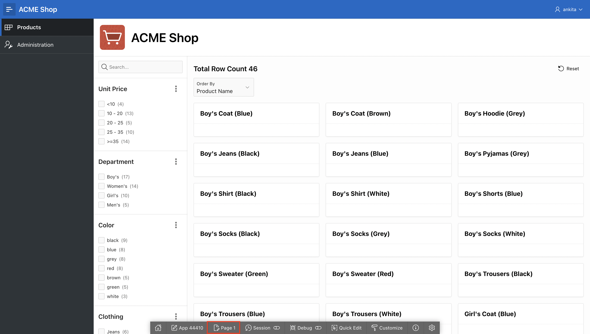

    Alternatively, you can also navigate back to the APEX App Builder tab in your browser manually by selecting the appropriate browser tab or window.
    Once in the App Builder click **1 - Products**.

    

    You should now be in Page Designer with **Page 1: Products** loaded.

2. In the left pane, under **Search** region, right-click **Facets** and select **Create Facet**.

    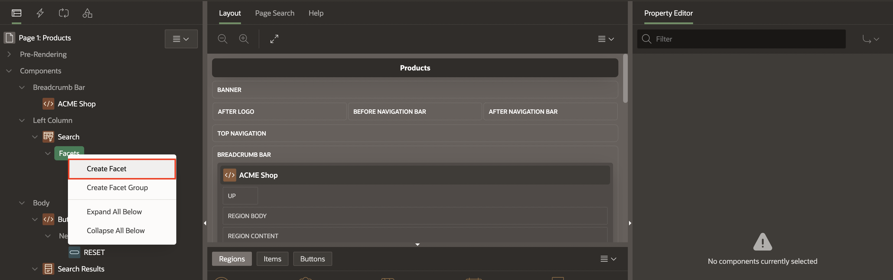

3. Create the following three Facets one after the other:

    | Name             |  Type   | Label | List of Values > Type | List of Values | Database Column |
    | ---------------  |  ------ |-----| ---------  | ------ | ------ |
    | P1\_DEPARTMENT\_ID | Checkbox Group | Department |Shared Component | DEPARTMENT\_LOOKUP.DEPARTMENT | DEPARTMENT\_ID |
    | P1\_COLOR\_ID | Checkbox Group | Color | Shared Component | COLOR\_LOOKUP.COLOR | COLOR\_ID |
    | P1\_CLOTHING\_ID | Checkbox Group | Clothing |Shared Component | CLOTHING\_LOOKUP.CLOTHING | CLOTHING\_ID |

    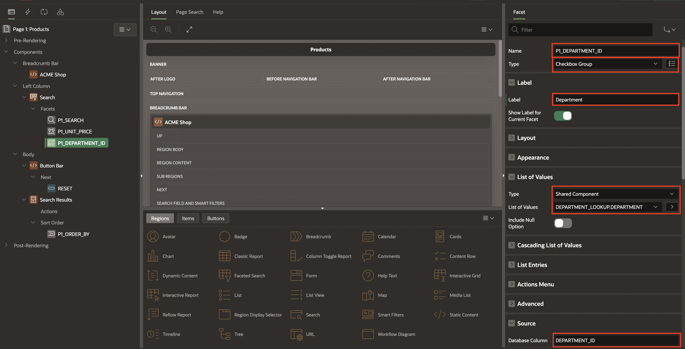

4. Unit price is not a common search criteria, so you want to put this facet at the bottom.
    In the Rendering tree (left pane), under Search, within Facets, click and hold **P1\_COLOR\_ID** and drag it down until it is under **P1\_CLOTHING\_ID**, then release the mouse. Also, drag **P1\_UNIT\_PRICE** under **P1\_CLOTHING\_ID**.
    Reorder the facets to display as in this image.

    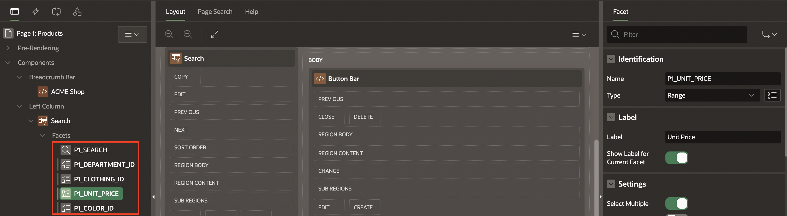

## Task 2: Enhance the Faceted Search

1. Under **Rendering** tab (left pane), navigate to **Search**.

2. In the Property Editor (right pane), click **Attributes** and enter/select the following:

    - Under Settings:

        - Total Row Count Label: **Total Products**

        - Show Charts: **No**

    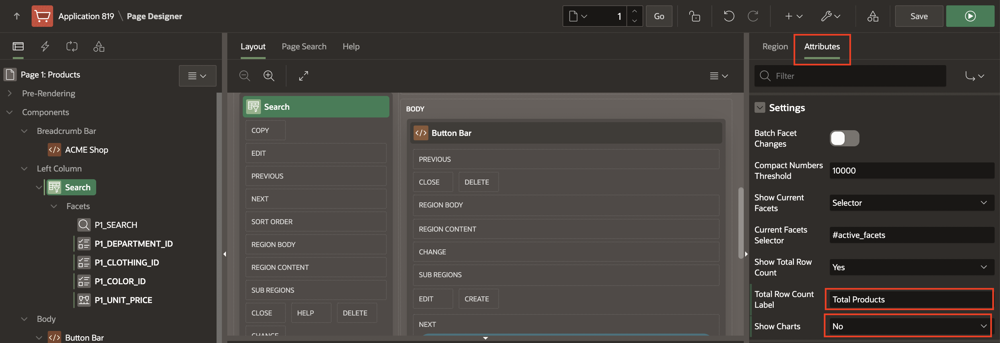

## Task 3: Enhance the Cards Region

1. Under **Rendering** tab (left pane), navigate to **Search Results** region and in the Property Editor (right pane), enter/select the following:

    - SQL Query: Copy and replace the following SQL code:

        ```
        <copy>
        SELECT "PRODUCT_ID",
            "PRODUCT_NAME",
            "UNIT_PRICE",
            "PRODUCT_DETAILS",
            "PRODUCT_IMAGE",
            "IMAGE_MIME_TYPE",
            "IMAGE_FILENAME",
            "IMAGE_CHARSET",
            "IMAGE_LAST_UPDATED",
            "COLOR_ID",
            (
                    SELECT l1."COLOR"
                    FROM   "COLOR_LOOKUP" l1
                    WHERE  l1."COLOR_ID" = m."COLOR_ID") "COLOR_ID_L$1",
            "DEPARTMENT_ID",
            (
                    SELECT l2."DEPARTMENT"
                    FROM   "DEPARTMENT_LOOKUP" l2
                    WHERE  l2."DEPARTMENT_ID" = m."DEPARTMENT_ID") "DEPARTMENT_ID_L$2",
            "CLOTHING_ID",
            (
                    SELECT l3."CLOTHING"
                    FROM   "CLOTHING_LOOKUP" l3
                    WHERE  l3."CLOTHING_ID" = m."CLOTHING_ID") "CLOTHING_ID_L$3",
            b.brand
        FROM   "PRODUCTS" m,
            json_table (m.product_details, '$' columns ( brand varchar2(4000) path '$.brand') ) b
        </copy>
        ```

    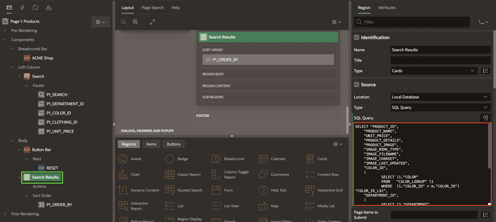

    - Under Appearance:

        - Template Options > Use Template Options:

            - Style > **Style A**

        Click **OK**.

    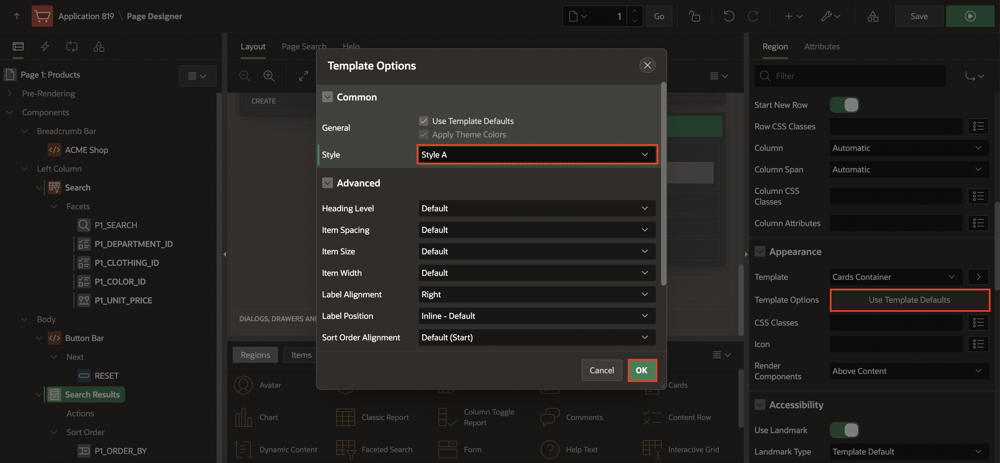

2. Navigate to **Attributes** tab and enter/select the following:

    - Under Subtitle:

        - Advanced Formatting: **Toggle On**

        - HTML Expression: Enter the following:

            ```
            <copy>
            <small>&BRAND.</small><br />
            <b class="u-success-text u-pullRight" id="message_&PRODUCT_ID.">
            {if QUANTITY/} &QUANTITY. in cart {endif/}
            </b>
            <b>$&UNIT_PRICE.</b>
            </copy>
            ```

    - Under Media:

        - Source: **BLOB Column**

        - BLOB Column: **PRODUCT_IMAGE**

        - Position: **First**

        - Appearance: **Widescreen**

    - Card > Primary Key Column 1: **PRODUCT_ID**

    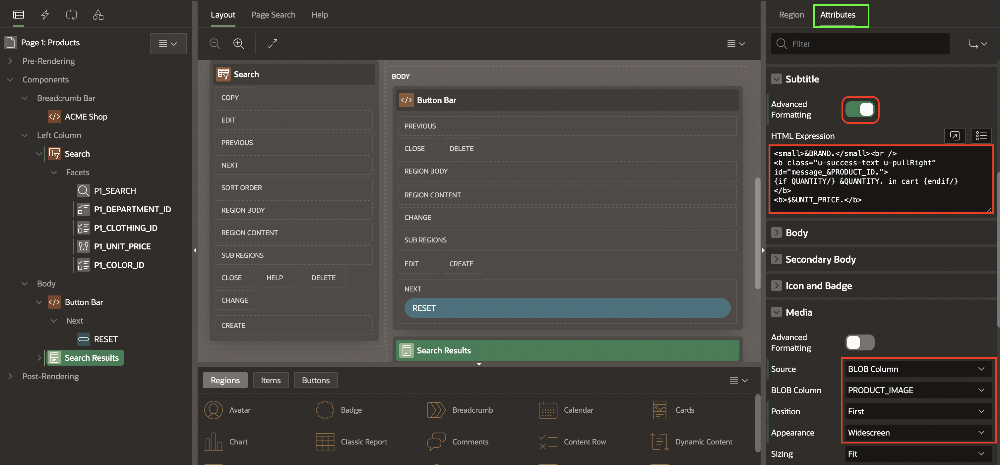

    

## Task 4: Create Actions

Customers need a way to shop the products, so in this task you will add an action to allow customers to learn more about the product.

1. Under **Search Results** region, right-click **Actions** and select **Create Action**.

    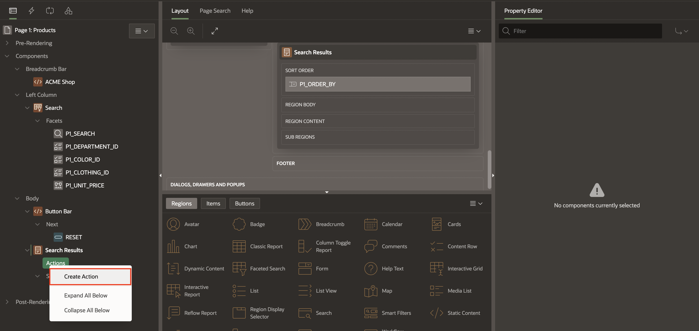

2. In the Property Editor (right pane), enter/select the following:

    - Type: **Full Card**

    - Target: Click **No Link Defined** and do the following:

        - Page: **18**

        - For Set Items, enter:

            | Name | Value |
            | --- | --- |
            | P18\_PRODUCT\_ID | &PRODUCT_ID. |

        - Clear Cache: **18**

        Click **OK**.

    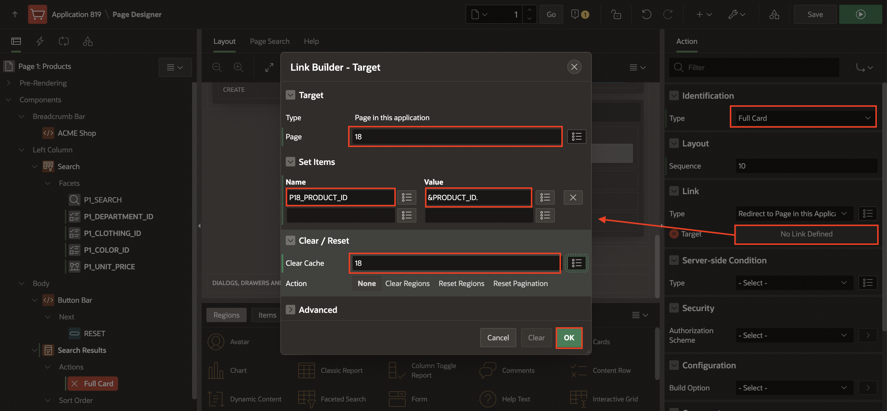

## Task 5: Add Dynamic Actions

In this task, you will create two dynamic actions:

- To show a success message when a product is added/edited/removed from the shopping cart.

- To update the badge and icon shown in the navigation bar after the customer has added/edited/removed a product from the shopping cart.

1. Navigate to **Dynamic Actions** tab (left pane).

2. Right-click **Dialog Closed** and select **Create Dynamic Action**.

    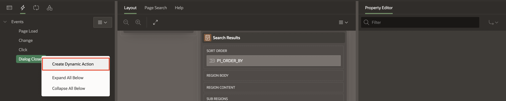

3. In the Property Editor, enter/select the following:

    - Identification > Name: **Show Success Message**

    - Under When:

        - Selection Type: **Region**

        - Region: **Search Results**

    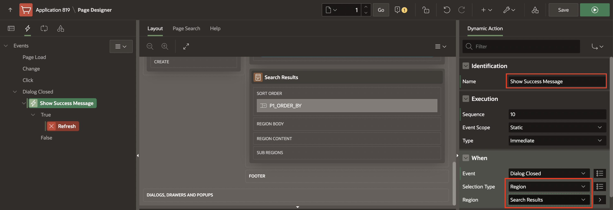

4. Navigate to **Refresh** Action.

    - Identification > Action: **Execute JavaScript Code**

    - Settings > Code: Copy and paste the following JavaScript Code:

        ```
        <copy>
        var productAction   = this.data.P18_ACTION,
        productQuantity = this.data.P18_QUANTITY,
        productCard$  = apex.jQuery("#message_" + this.data.P18_PRODUCT_ID);

        if (productAction === 'ADD') {
                productCard$.text("Added " + productQuantity + " to cart!");
        } else if (productAction === 'EDIT') {
                productCard$.text("Updated quantity to " + productQuantity + "!");
        } else if (productAction === 'DELETE') {
                productCard$.text("Removed from cart!");
         }
        </copy>
        ```

    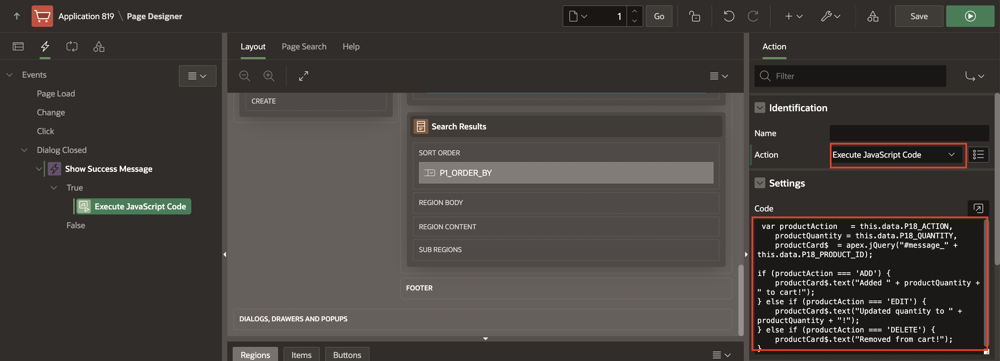

5. Create a second dynamic action. Right-click **Dialog Closed** and select **Create Dynamic Action**.

    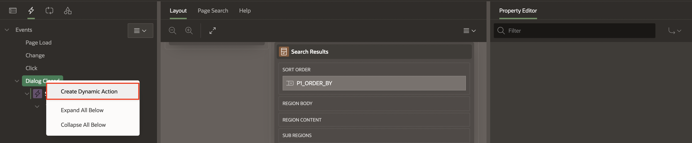

6. In the Property Editor, enter/select the following:

    - Identification > Name: **Update Shopping Cart Header**

    - Under When:

        - Selection Type: **Region**

        - Region: **Search Results**

    - Under Client-side Condition:

        - Type: **JavaScript expression**

        - JavaScript Expression: Enter the following:

            ```
            <copy>
            parseInt(this.data.P18_SHOPPING_CART_ITEMS) > 0
            </copy>
            ```

    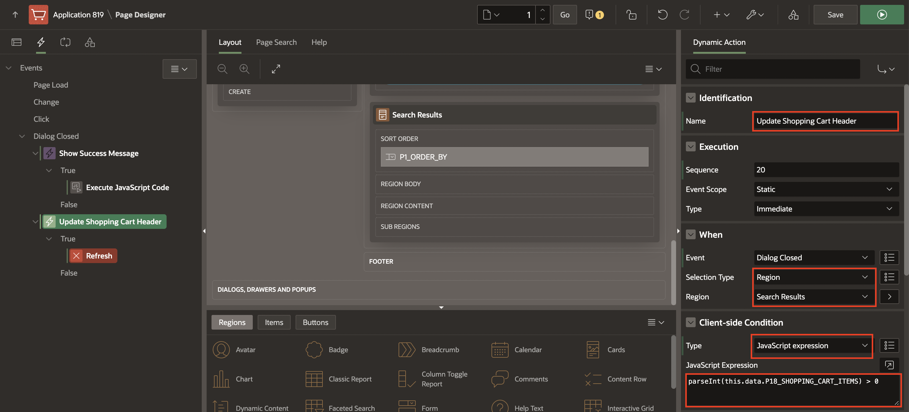

7. Navigate to **Refresh** Action.

    - Identification > Action: **Execute JavaScript Code**

    - Under Settings:

        - Code: Enter the following JavaScript Code:

            ```
            <copy>
            // Update Badge Text
            apex.jQuery(".js-shopping-cart-item .t-Button-badge").text(this.data.P18_SHOPPING_CART_ITEMS);

            // Update Icon
            apex.jQuery(".js-shopping-cart-item .t-Icon").removeClass('fa-cart-empty').addClass('fa-cart-full');
            </copy>
            ```

    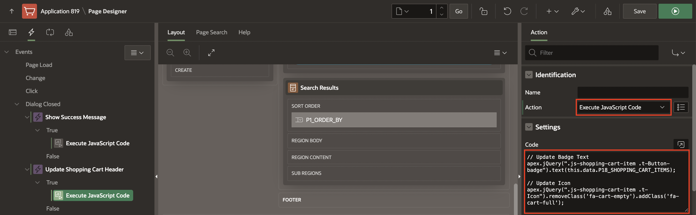

8. Create an opposite action. In the Dynamic Actions tab (left pane), navigate to the newly dynamic action.

9. Under **Update Shopping Cart Header** dynamic action, right-click **Execute JavaScript Code** and select **Create Opposite Action**.

    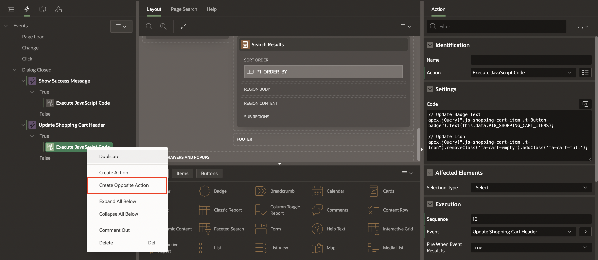

10. In the Property Editor, enter/select the following:

    - Settings > Code: Copy and replace the following JavaScript Code:

        ```
        <copy>
        // Update Badge Text
        apex.jQuery(".js-shopping-cart-item .t-Button-badge").text('');

        // Update Icon
        apex.jQuery(".js-shopping-cart-item .t-Icon").removeClass('fa-cart-full').addClass('fa-cart-empty');
        </copy>
        ```

    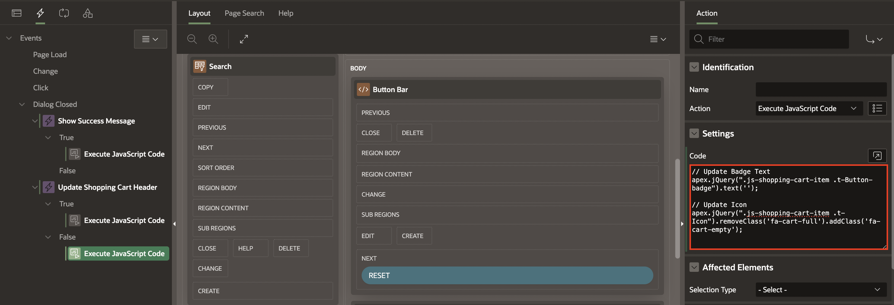

11. Click **Save and Run Page** to view your updated **Products** page.

    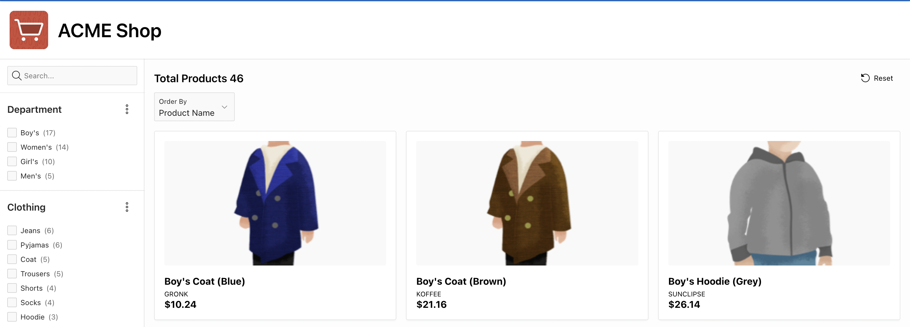

## Summary

You now know how to enhance faceted search and cards region. You may now **proceed to the next lab**.

## Acknowledgments

- **Author(s)** - Apoorva Srinivas, Senior Product Manager; Monica Godoy, Principal Product Manager
- **Contributors** - Shakeeb Rahman, Architect
- **Last Updated By/Date** - Ankita Beri, Product Manager, January 2025
