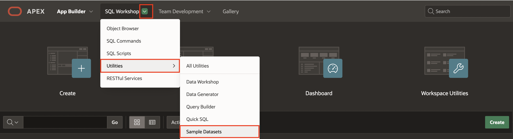
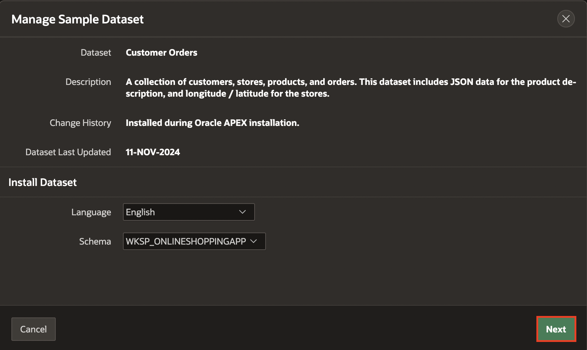
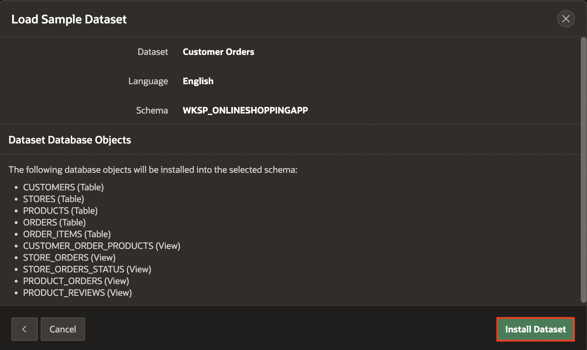
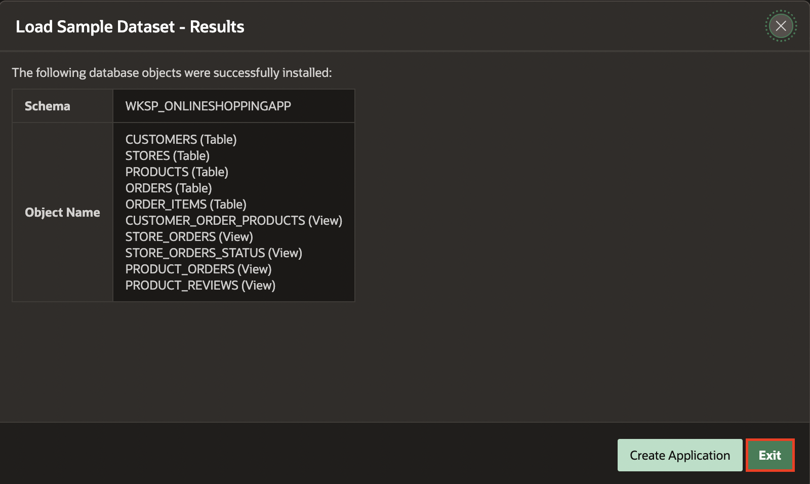
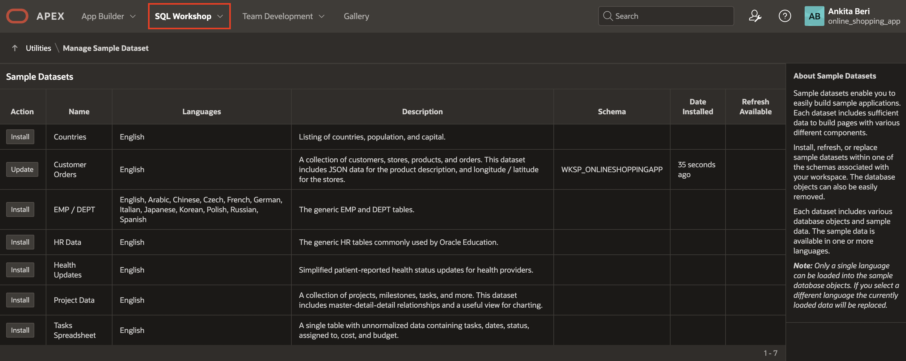
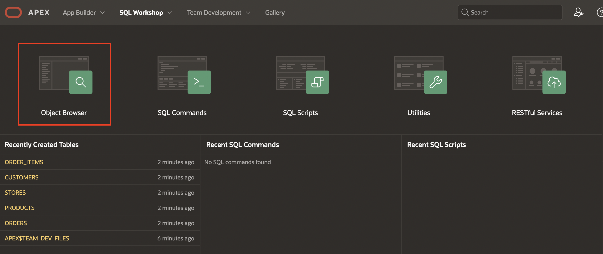
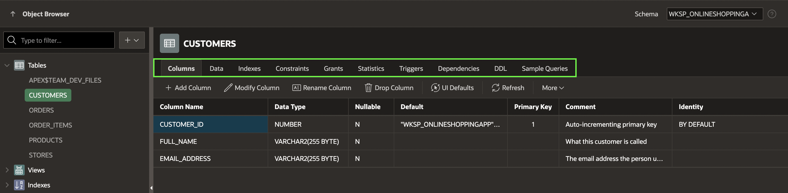

# Install a sample dataset

## Introduction

In this lab, you will learn to install sample tables and views from Sample Datasets. This particular sample dataset is a collection of customers, stores, products, and orders used to manage the shopping cart.

Estimated Time: 5 minutes

<!--
Watch the video below for a quick walk through of the lab.

-->

Watch the video below for a quick walk-through of the lab.
[Install a Sample Dataset](videohub:1_7r94t2rk)

### Objectives

In this lab, you will:

- Install a sample dataset into your Oracle APEX Workspace.

## Task 1: Create Customer Orders Tables

1. Log into your workspace.

2. From your APEX workspace home page, as shown below, select the down-arrow to the right of  **SQL Workshop**, navigate to **Utilities**, and select **Sample Datasets**.

    

3. On the **Customer Orders** row, click **Install**.

    

4. Click **Next**.

   *The schema name defaults to your current schema so will be different from the schema name shown below.*

    

5. Click **Install Dataset**.

    

6. Click **Exit**.

    

>**Note:** You do NOT want to click Create Application, as you will manually create an application later.

## Task 2: Review Database Objects

1. In the Oracle APEX Home page, click **SQL Workshop**.

    

2. Click **Object Browser**.

    

3. Click **Tables** to view different tables and then you will see various tabs, such as Data, Constraints, and so forth, to review the table details.

    

## Summary

This completes Lab 1. You now know how to install a sample dataset. You may now **proceed to the next lab**.

## Acknowledgments

- **Author** - Apoorva Srinivas, Senior Product Manager; Mónica Godoy, Principal Product Manager
- **Last Updated By/Date** - Ankita Beri, Product Manager, January 2025
