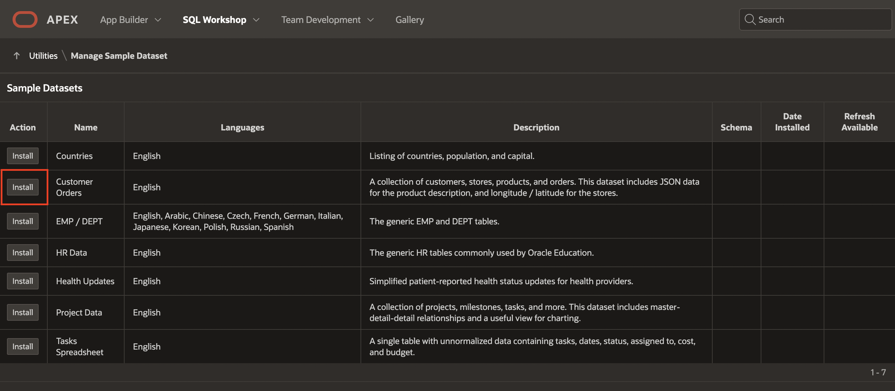

# Install a sample dataset

## Introduction

In this lab, you will learn how to install sample tables and views from Sample Datasets. This particular sample dataset is a collection of customers, stores, products, and orders used to manage the shopping cart.

Estimated Time: 5 minutes

Watch the video below for a quick walk through of the lab.

### Objectives
In this lab, you will:
- Install a sample dataset into your Oracle APEX Workspace

## Task 1: Create Customer Orders Tables
1. Log into your workspace.
2. From your APEX workspace home page, as shown below, select the down-arrow to the right of  **SQL Workshop**, then click the arrow to the right of  **Utilities**, and choose **Sample Datasets**.

    

3. On the **Customer Orders** row, click Install.

    

4. Click **Next**.

   *The schema name defaults to your current schema so will be different from the schema name shown below.*
    

5. Click **Install Dataset**.

    

6. Click **Exit**.

    

>**Note:** You do NOT want to click Create Application, as you will manually create an application 

## Task 2: Review Database Objects

1. In the Oracle APEX Home, click **SQL Workshop**.

2. Click **Object Browser**.

    

3. Click the new tables and the various tabs, such as Data, Constraints, and so forth, to review the table details.

This completes Lab 1. You now know how to install a sample dataset. You may now **proceed to the next lab**. 

## Acknowledgments

- **Author** - Mónica Godoy, Principal Product Manager
- **Last Updated By/Date** - Arabella Yao, Database Product Manager, October 2021