# Create an APEX Application

## Introduction

In this lab, you will create a new Oracle APEX application that will serve as the foundation for the Social Media App. You will use the Create App Wizard to configure the application, enable Progressive Web App (PWA) support, and run the application for the first time.

**Note:** The screenshots in this workshop are taken using Dark Mode in APEX 26.1.

Estimated Time: 5 minutes

 <!-- Watch the video below for a quick walk-through of the lab.
[Create an APEX App](videohub:1_a6bi2e62) -->

### Objectives

In this lab, you will:

- Create a new APEX application.

- Run your application.

### Prerequisites

- An Oracle APEX workspace.

## Task 1: Create the APEX App

1. From your APEX workspace homepage, navigate to **App Builder**.

    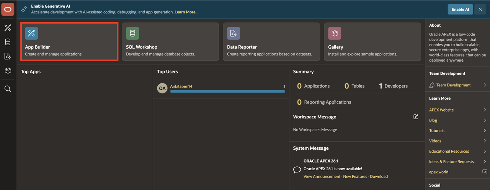

2. Click **Create**.

    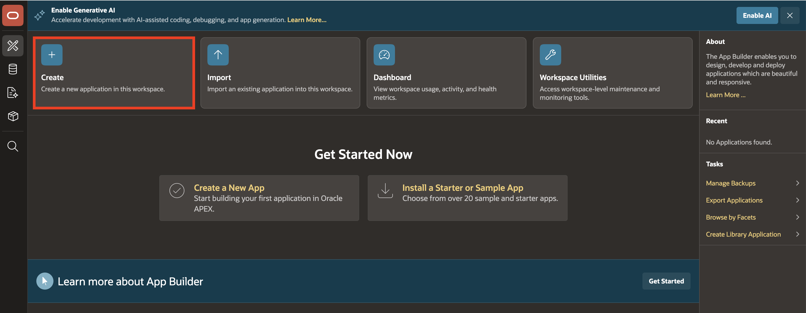

3. Select **Use Create App Wizard**.

    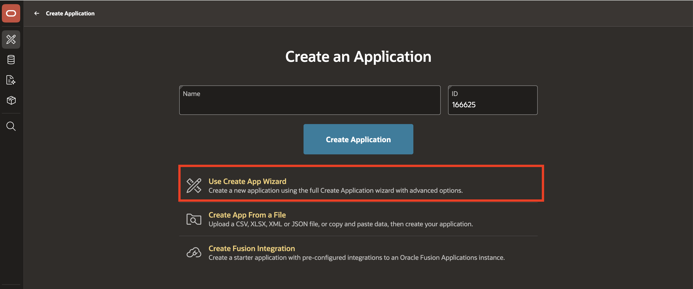

4. You are now viewing the **Create an Application** page, with the View Blueprint tab selected.

5. Enter the application name: **APEX Social Media** and click the **Edit** button for the Home page.

    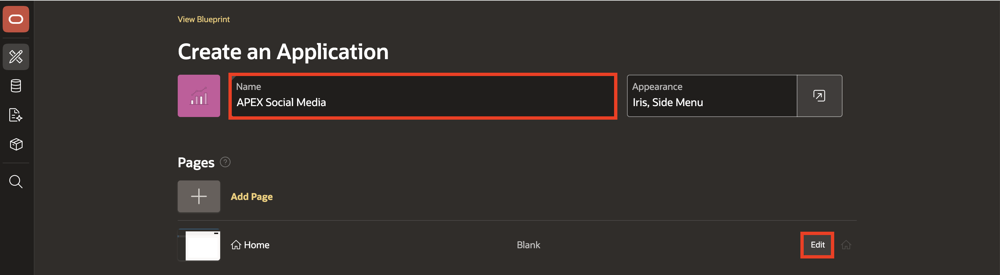

6. Update the Home Page Name to **Timeline**, then click **Save Changes**.

    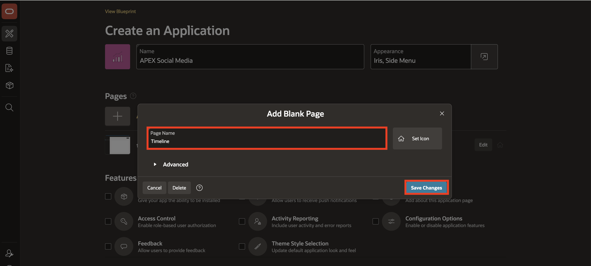

7. In the **Features** section, check the **Install Progressive Web App** option.

8. Click **Create Application**.

    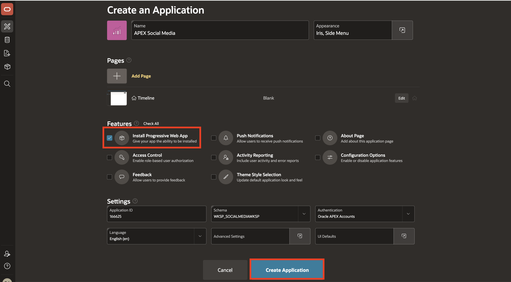

9. Your APEX application now contains three pages.

    - The Global page (which we will not be using in this lab).

    - The Timeline page (which is the primary page we will be working on in this lab).

    - The Login Page, which is the default page configured to use your workspace account credentials.

    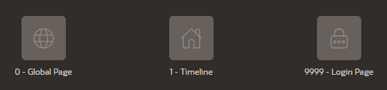

## Task 2: Run the App and Sign In

1. Click **Run application**.

    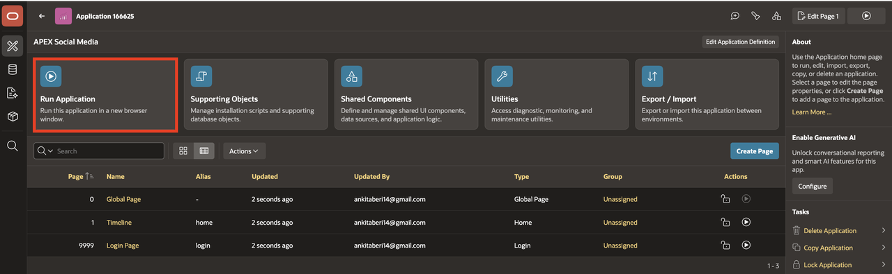

2. To sign in to the application, use your workspace username and password.

    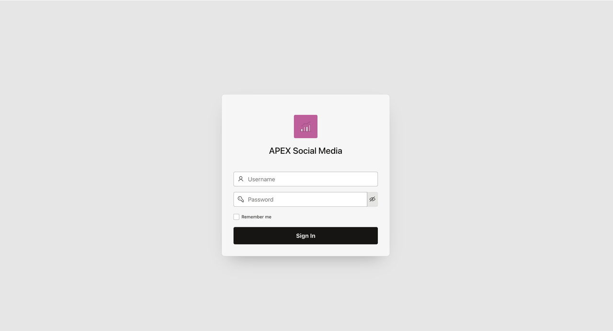

3. You now see the initial version of your app.

    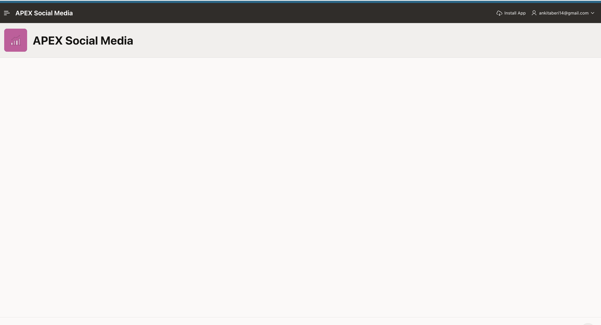

## Task 3: Observe the App

1. The side navigation is currently enabled in the app. To open the navigation menu, click on the hamburger menu at the top left of the screen. We will be customizing the page to our purpose.

   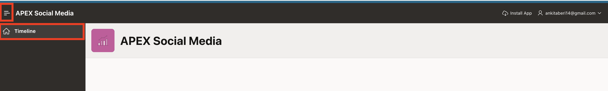

2. Next, we will go back to the APEX Workspace and create the APEX Social Media data model.

## Summary

In this lab, you created and ran a new Oracle APEX application for the Social Media App using the Create App Wizard. You also explored the default application structure, enabled Progressive Web App (PWA) support, and reviewed the initial app layout and navigation.

You may now proceed to the next lab.

## Acknowledgements

- **Author** - Jayson Hanes, Principal Product Manager; Apoorva Srinivas, Senior Product Manager, Ankita Beri ,Senior Product Manager

- **Last Updated By/Date** - Ankita Beri ,Senior Product Manager, May 2026
