# [OPTIONAL] Create a Map Region

## Introduction
In this lab, you will enable the app to get the device location which will be optional for end-users. If they agree, then their Location/GPS Latitude and Longitude will be acquired on page load and will populate the **P1\_LAT** and **L1\_LON** hidden page items. When users subsequently like a post or create a new post of their own, their location will be recorded and displayed on a Map.

Estimated Time: 5 minutes

Watch the video below for a quick walk-through of the lab.
[Create an APEX App](videohub:1_xrycy2p7)

### Objectives

In this lab, you will:
- Create a Map Region
- Retrieve the User's location and display on a Map using Dynamic Actions

### Prerequisites

- Completion of workshop through Lab 9

## Task 1: Create Map Region
We are going to drag a map region item into the Dialogs, Drawers and Popups region of the Page Designer Layout section and then configure it. **Note**: This is an alternate way of placing page components on the page. You can still use the previous method of right-clicking on the tree to create a new region.

1. In the Layout section, scroll down to the bottom of the page, so that you can see the Dialogs, Drawers and Popups region.

   

2. Ensure that your component drawer is open below the layout section, and click **Regions** tab.

   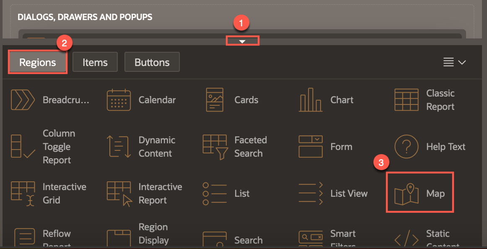

3. Click the **Map** Region in the component drawer and drag slowly and carefully into the Dialogs, Drawers and Popups region in the Layout section as shown. Notice that as you do this, things will adjust to show you where you can drop it.

   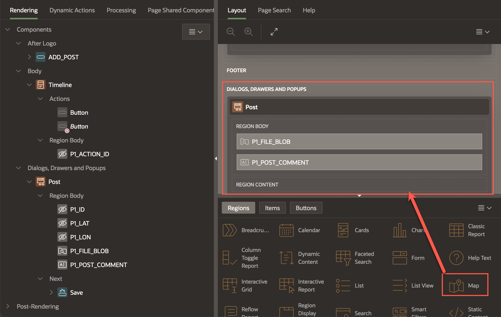

4.	Release/drop the Map region to the gold area inside this region.

   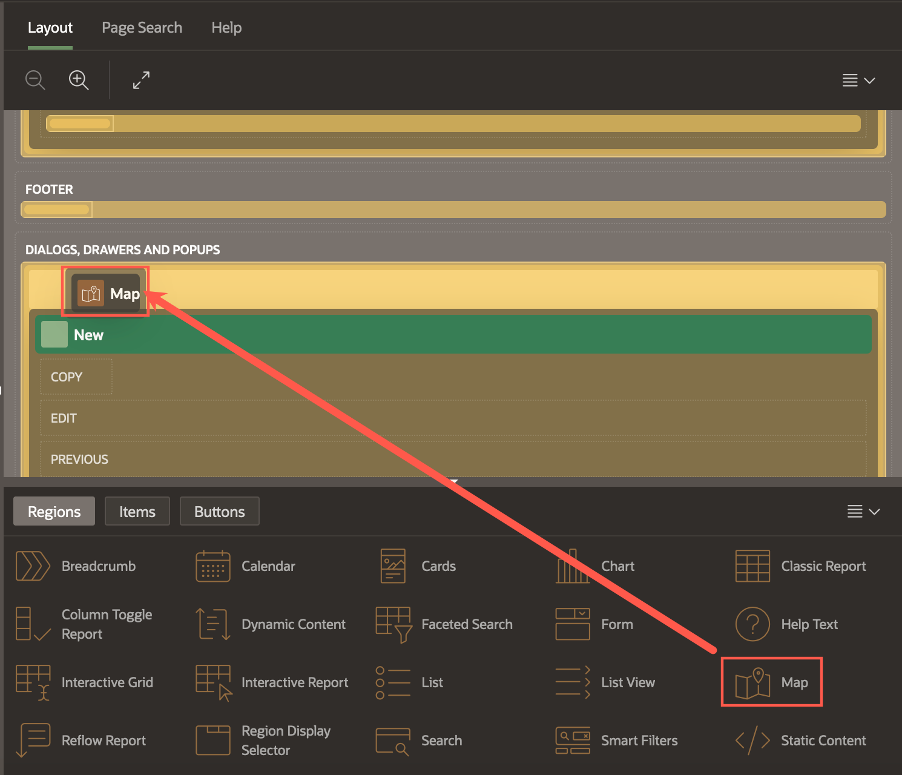
   
   In the rendering tree, you should see it appear like this:

   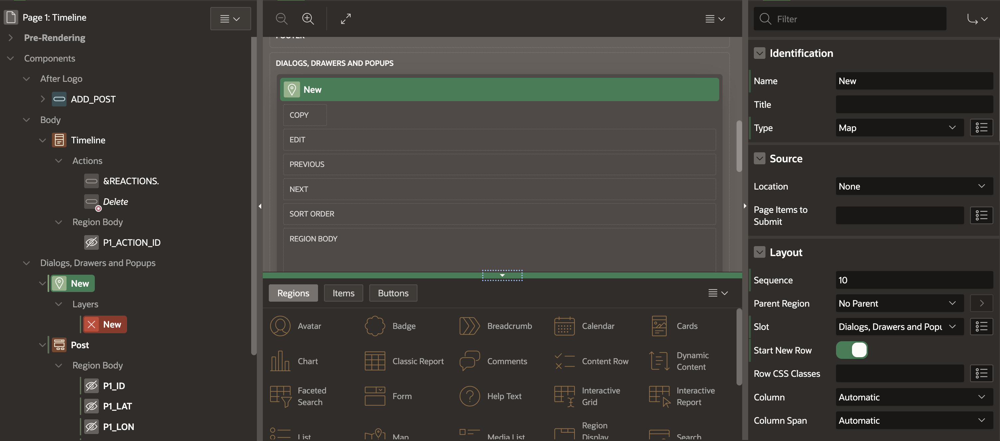

6. Now, we need to edit the settings for the Map region. APEX Maps support multiple layers, but for this app, one layer is sufficient. Update the following information:
    - Name: **Post and Like Locations**
    - Set the Region > Source > Location to **Local Database** (new properties will be shown underneath).
    - Set the Source > Type to **SQL Query**

7. We are going to use a query that aggregates locations from both the **POSTS** and **REACTIONS** locations by way of an Oracle Union query. Copy and paste the following query code into the **SQL Query** text area:

      ```
      <copy>
         select distinct lat, lon, created_by, apex_util.get_since(created) as since from
         (
         select lat, lon, created_by, created from SM_POSTS
         union
         select lat, lon, created_by, created from SM_REACTIONS
         )
      </copy>
      ```

      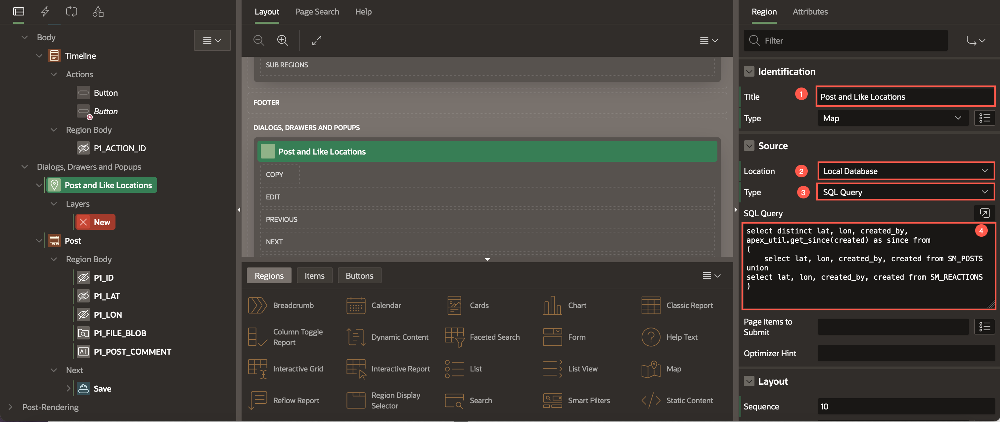

10. Next, update the following properties:
    - Appearance > Template : **Inline Dialog**.
    - Advanced > Static ID : **map**. The static ID will be used by our javascript to actually open the map region in the next task. 

    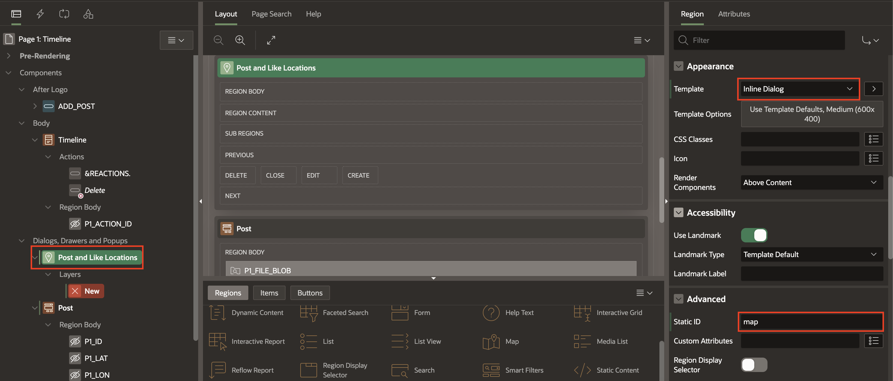

11. Finally, in the Rendering tree, click on the **New** Layer that was created so that we can configure a few final properties. 
    - Set Layer > Identification > Name to **Locations**
    - Change Source > Location to **Region Source**
    - Scroll down to Column Mapping and change Geometry Column Data Type to **Longitude/Latitude**
    - Set the Longitude Column to be **LON** and the Latitude Column to be **LAT**

    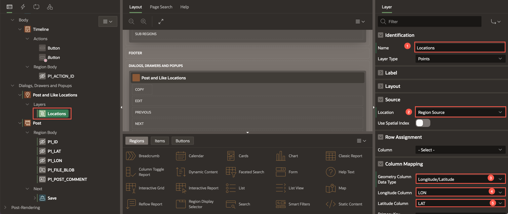

    - And now we will configure a tooltip for each map point. Under Tooltip, toggle Advanced Formatting to **ON**.
    - Copy and paste this expression into HTML Expression box:
      ```
      <copy>
      &CREATED_BY. @ &SINCE.
      </copy>
      ```
    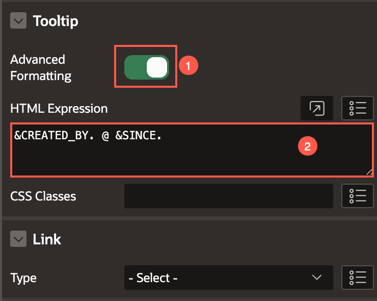

12. Navigate to the **Post and Likes Locations** region. In the Property Editor, click on the **Attributes** tab and change the following properties:
    - Map > Height to **300** pixels
    - Under Controls > Options, check **Mousewheel zoom** option

    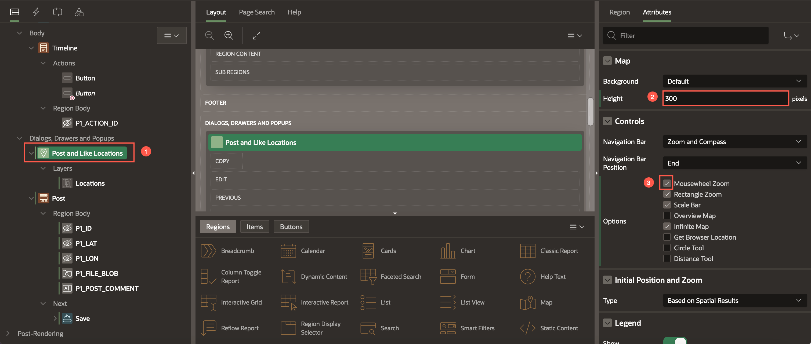

11. Save your changes! Remember, you won’t see this region on your app yet as it is a hidden region until we build the button and add code to open it.

   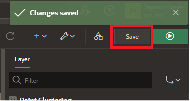

## Task 2: Create Map button
Now we’ll create a button that will be in the top navigation bar, between the Install App and User menu.

1. First, navigate to your applications’ **Shared Components** page. This can be done in a couple of different ways. Since you are already in Page Designer, you can click on the button that looks like stacked pieces.

   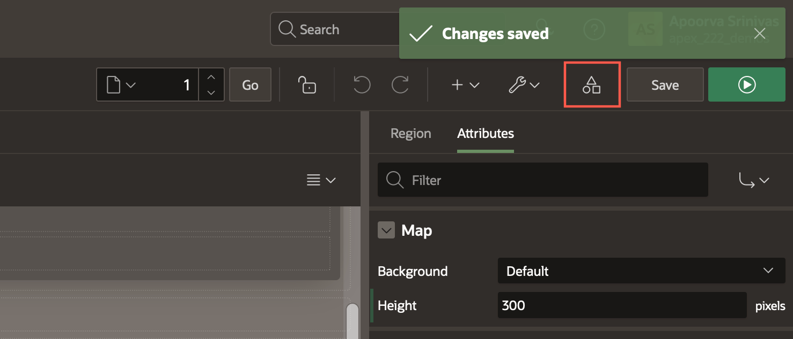

2. In the Navigation and Search section, click **Navigation Bar List**.

   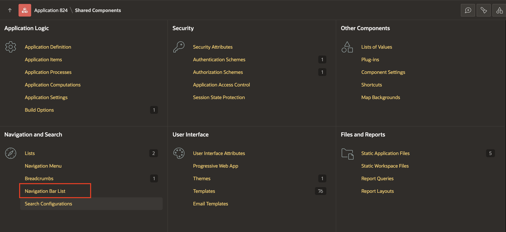

3. Our app only has one of these, so drill into its’ configuration by clicking on the **Navigation Bar entry** in the report under the **Name** column.

   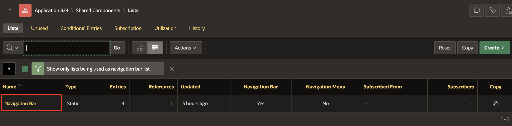

4. You will see 4 existing entries in the list, and we want to add a new one for the Map button. To do this, you can immediately click the **Add Entry** button to add a new row in the list.

5. In the new blank row:
    - For Sequence, enter number **15**
    - For name, enter **Map**
    - For Target, enter **#action$open-map**
    - For Icon, enter **fa-map**
    
    Click **Apply Changes**

    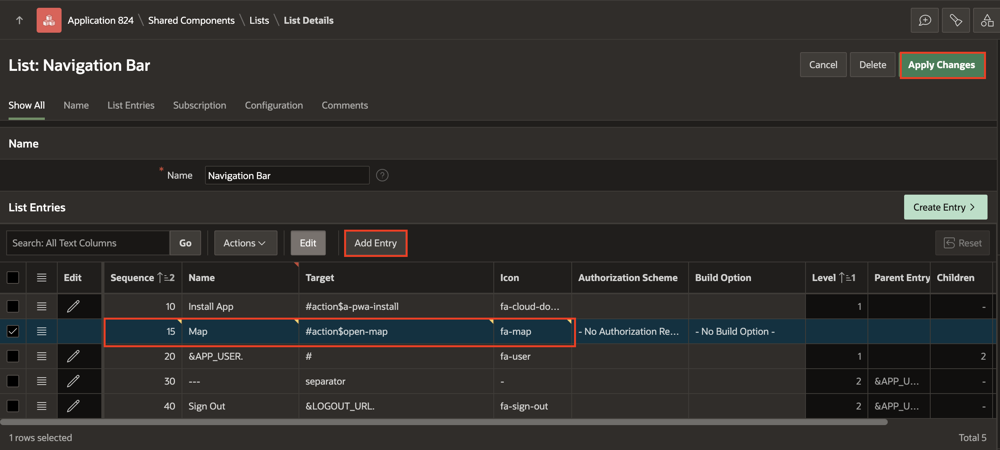

## Task 3: Create Dynamic Action to open Map Region

In this task, we update our javascript on the page so that the Target you specified above can open the map region.

1. Click on the **Edit Page 1** button in the upper right of the current page.

   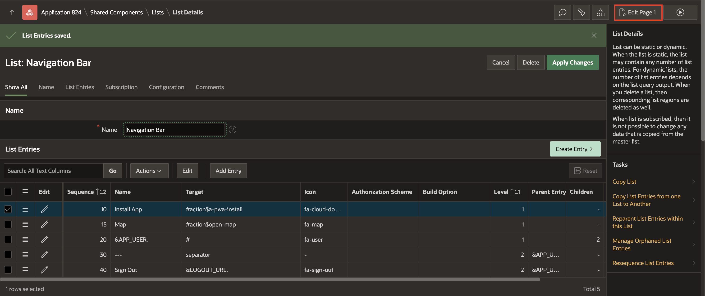

2. Page 1 is now open in the Page Designer. Ensure that **Page 1: Timeline** is already selected in the Rendering tree. In the Property Editor, go to the **Javascript > Execute When Page Loads** property and update the script by replacing it with the following script:

      ```
      <copy>
      apex.actions.add([{
      name: "like",
      action: (event, element, args) => {
         apex.items.P1_ACTION_ID.value = args.id;
         apex.event.trigger(document, 'action-like');
         }
      }, {
      name: "delete",
      action: (event, element, args) => {
         apex.items.P1_ACTION_ID.value = args.id;
         apex.event.trigger(document, 'action-delete');
         }
      }, {
      name: "open-map",
      action: () => {
         apex.event.trigger(document, 'action-open-map');
         }
      }]);
      </copy>
      ```

      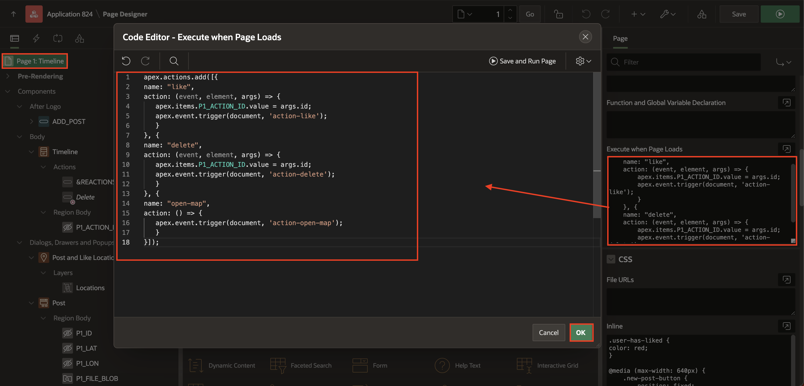

3. We’re almost there! We now need to create another custom dynamic action to open the Map region that we created, when the new Map button is clicked.
   In the Rendering Tree, click the **Dynamic Actions** tab. Right click on the **Custom** branch, and choose **Create Dynamic Action**.

   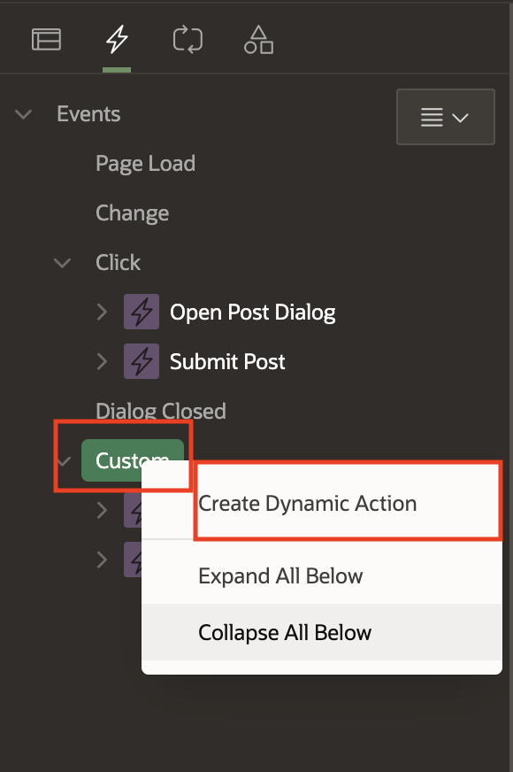

4. You should now see the new Dynamic Action as New/Show.

   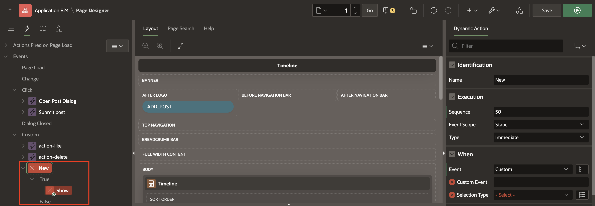

4. On the right side with **New** selected, edit the following:
    - Identification > Name : **action-open-map**
    - Set the Custom Event : **action-open-map**
    - Selection Type : **JavaScript Expression**
    - JavaScript Expression : **document**

   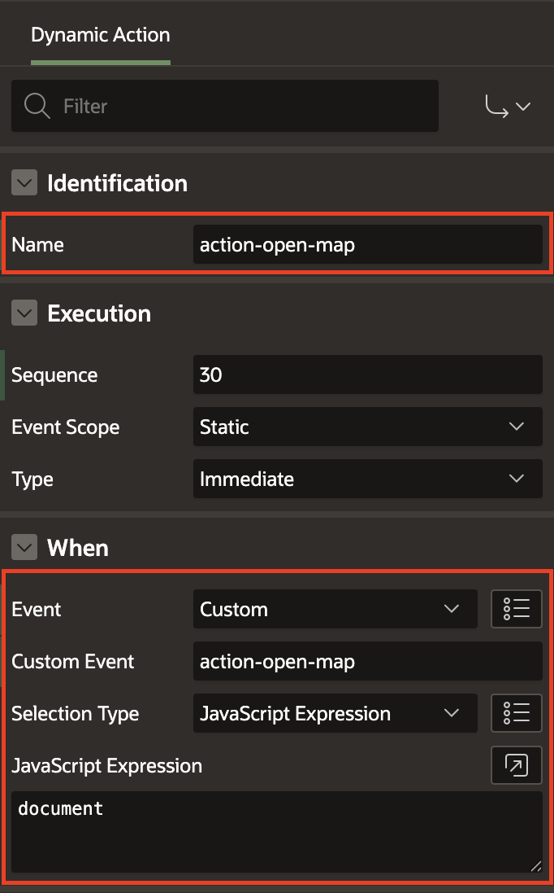

5. The last part of this is to configure the dynamic action itself that is currently set to **Show**. Select **Show**.
In the Property Editor:
    - Identification > Action : **Open Region**
    - Selection Type : **Region**
    - Region : **Post and Like Locations**

    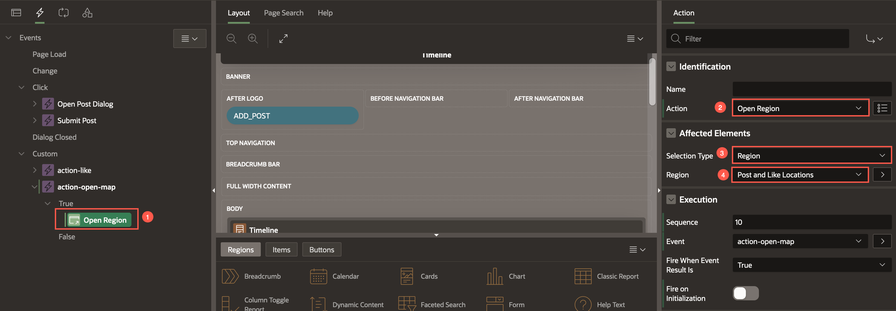

7. That completes the configuration of this button. Click **Save**. Before we run the app, we need to add another dynamic action to get the device location.

   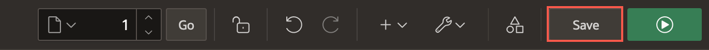
    

## Task 4: Create Dynamic Action to get Device Location

In this final task, we create another dynamic action to get the device location of the user. 

1. From the Dynamic Actions tab, under Events right-click **Page Load** and select **Create Dynamic Action**.

   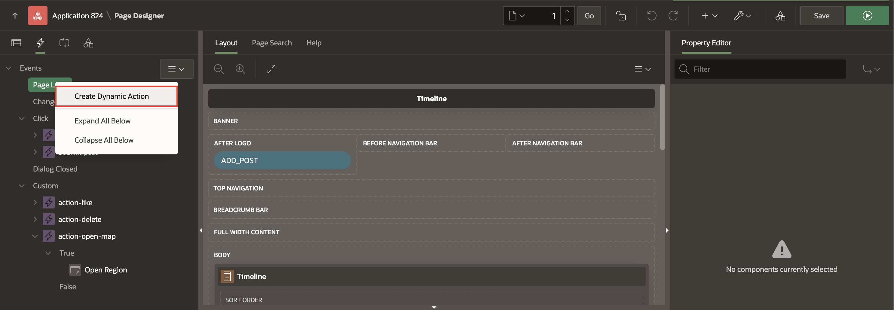

2. In the Property Editor, for Identification > Name, enter a name such as **Get Device Location**.

   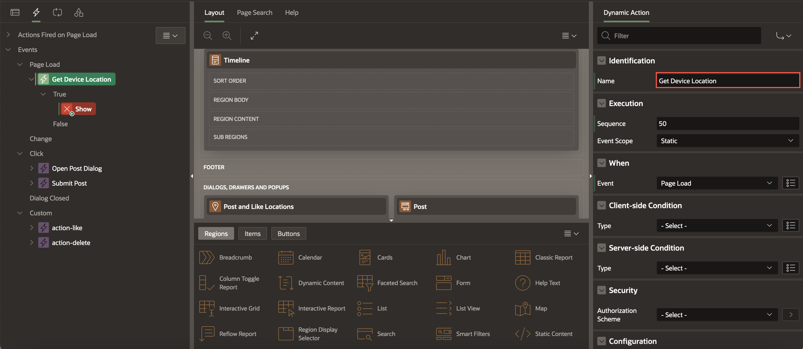

3. In the Rendering Tree, under True action, select **Show**. In the Property Editor, edit the following:
      - Action : **Get Current Position**
   
      Under Settings:
      - Return Type : **Latitude and Longitude**
      - Latitude Item: **P1_LAT**
      - Longitude Item: **P1_LON**

      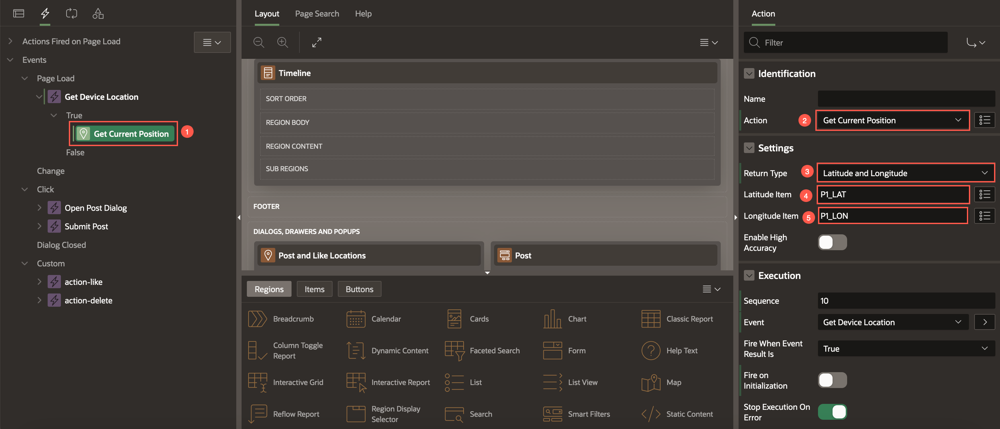

4. In the Rendering Tree, under Post region, select **P1\_LAT** and **P1\_LON** together. In the Property Editor, under Settings, toggle the **Value Protected** to OFF.

      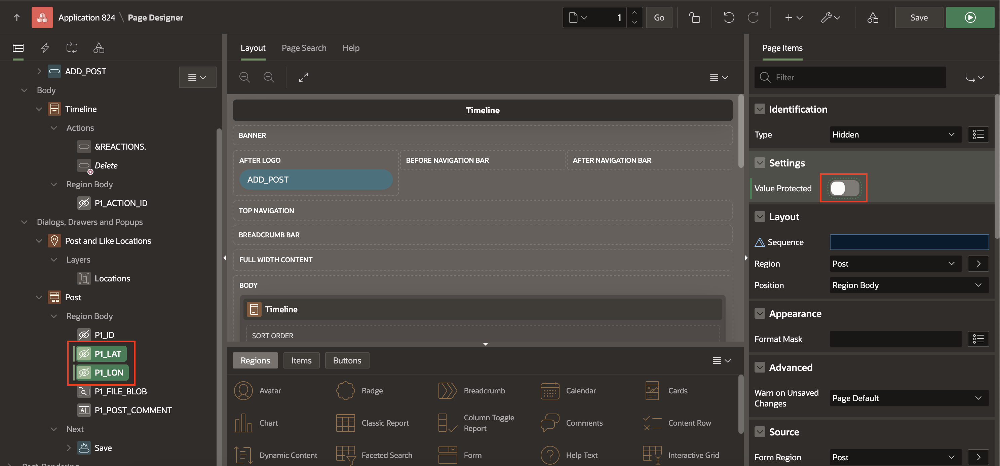

5. Let us see how the Map is displayed in the app. Click **Save and Run**.

   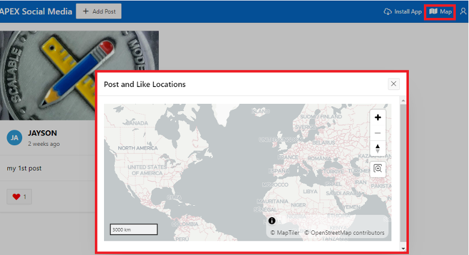

    **Note**: No pins will likely be visible on this map unless you permit the location to be used before you post or like your post. If others were to use your app, their locations would show up too!

   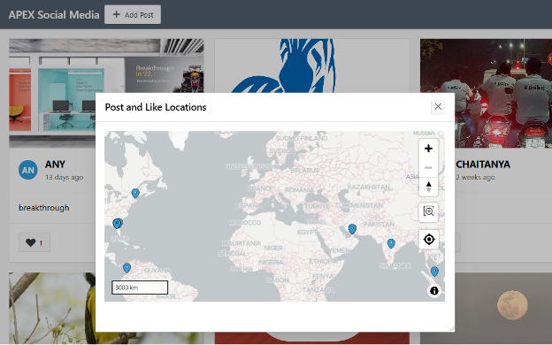

## Acknowledgements

 - **Author** - Jayson Hanes, Principal Product Manager; Apoorva Srinivas, Senior Product Manager;
 - **Last Updated By/Date** - Apoorva Srinivas, Senior Product Manager, July 2023
