# [OPTIONAL] Create a Map Region

## Introduction
In this lab, you will enable the app to acquire the device location which will be optional for end-users. If they agree, then their Location/GPS Latitude and Longitude will be acquired on page load and will populate the **P1\_LAT** and **L1\_LON** hidden page items. When users subsequently like a post or create a new post of their own, their location will be recorded and displayed on a Map.

Estimated Time: 5 minutes

## Task 1: Create Map Region
We are going to drag a map region item into the Dialogs, Drawers and Popups region of the Page Designer Layout section and then configure it. **Note**: This is an alternate way of placing page components on the page. (If you choose, you can still use the previous method of right-clicking on the tree to create a new region).

1. In the layout section, scroll down to the bottom of the page, so that you can see the Dialogs, Drawers and Popups region.

   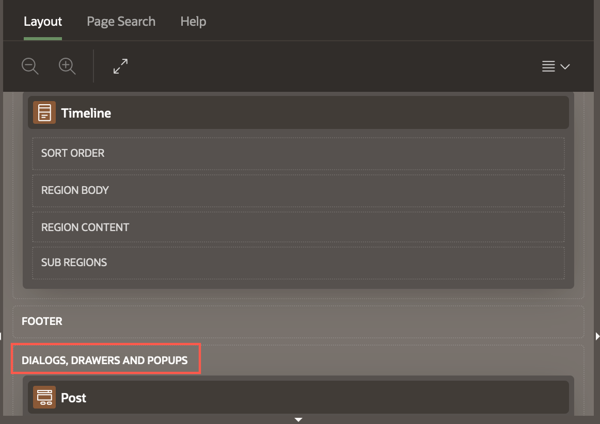

2. Ensure that your component drawer is open below the layout section, and click on the **Regions** button.

   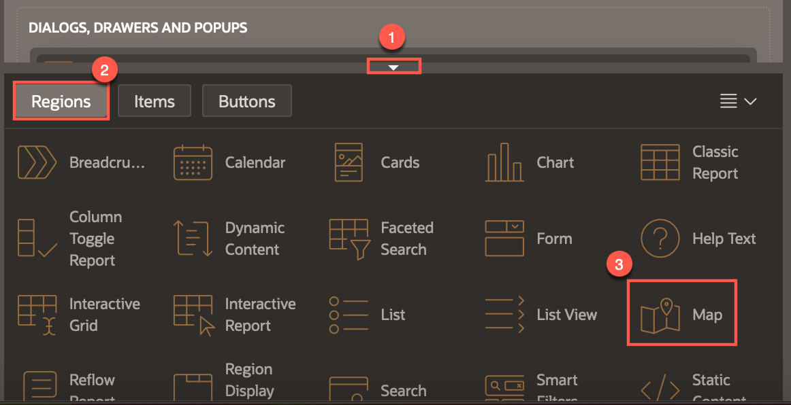

3. Click the **Map** Region in the component drawer and drag slowly and carefully into the Dialogs, Drawers and Popups region in the layout section as shown, but be aware that as you do this, things will adjust to show you where you can drop it (next step).

   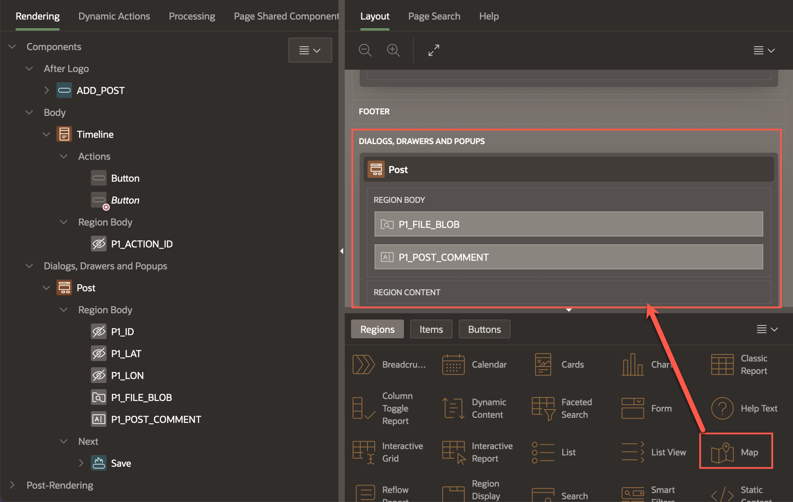

4.	As you do this, things will look similar to the following screenshot, where you want to release/drop the Map region to the gold area inside this region.

   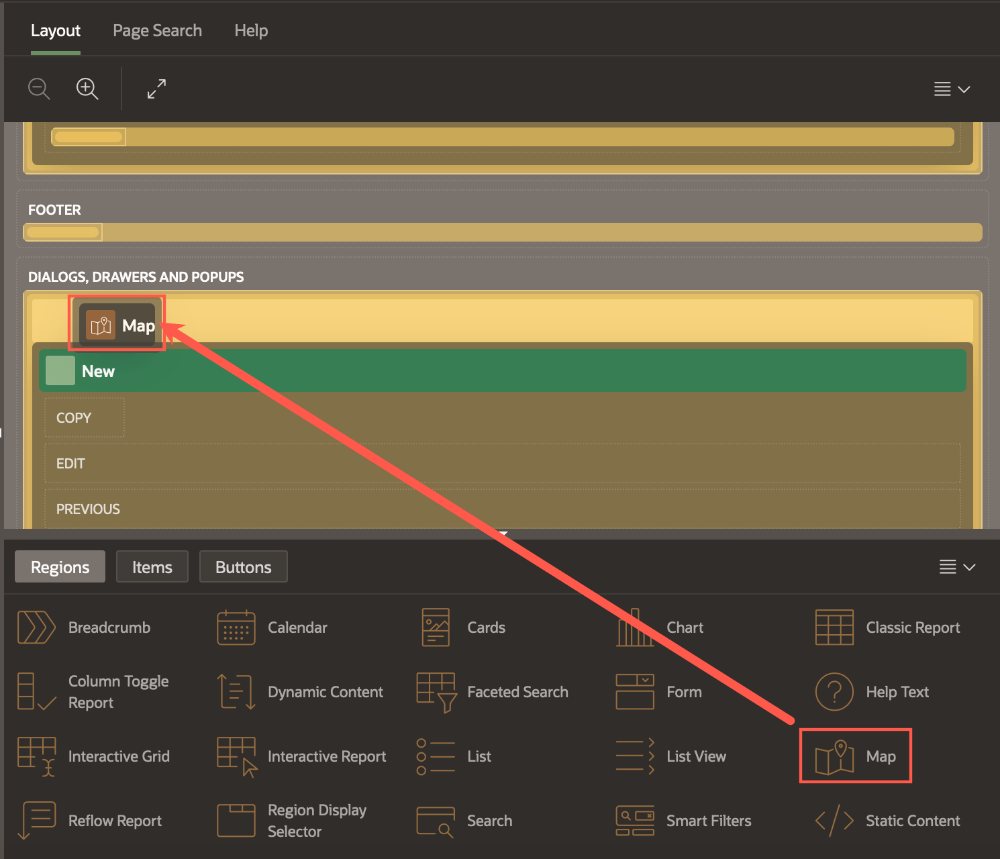

5. As you release, you should see the region disappear from the layout – because this is actually a hidden region and it now has this region inside of it. However, if you look in the rendering tree, you should see it appear like this:

   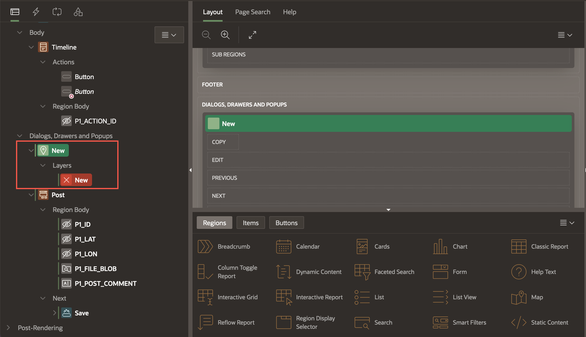

6. Now we need to edit the settings for the Map region. APEX Maps support multiple layers, but for this app, one layer is sufficient. Update the following information:
   - Update the Name to **Post and Like Locations**
   - Set the Region > Source > Location to **Local Database** (new properties will be shown underneath).
   - Set the Source > Type to **SQL Query**

7. We are going to use a query that aggregates locations from both the **POSTS** and **REACTIONS** locations by way of an Oracle Union query. Copy and paste the following query code into the SQL Query text area:

      ```
      <copy>
         select distinct lat, lon, created_by, apex_util.get_since(created) as since from
         (
         select lat, lon, created_by, created from SM_POSTS
         union
         select lat, lon, created_by, created from SM_REACTIONS
         )
      </copy>
      ```

      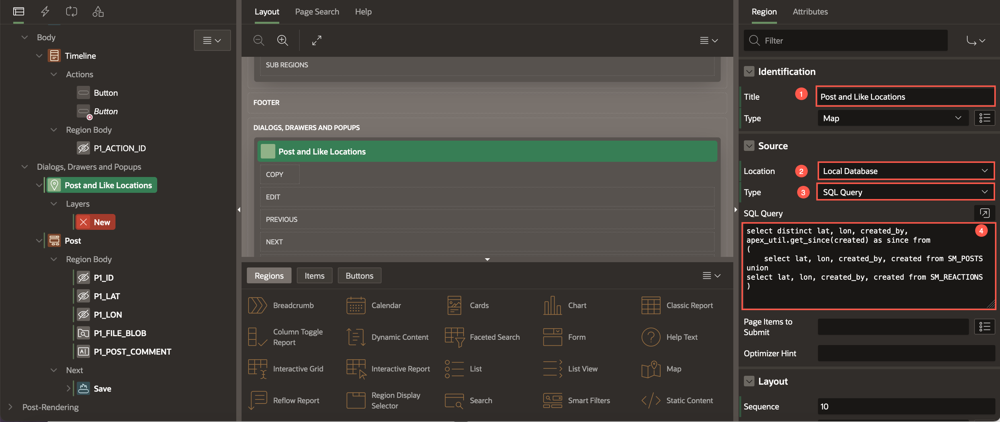

8. Next, update the following properties:
   - In the **Appearance** section, change the **Template** to **Inline Dialog**.
   - Set the **Advanced > Static ID** to be **map**. This ID will be used by our javascript to actually open this region in the next task.

   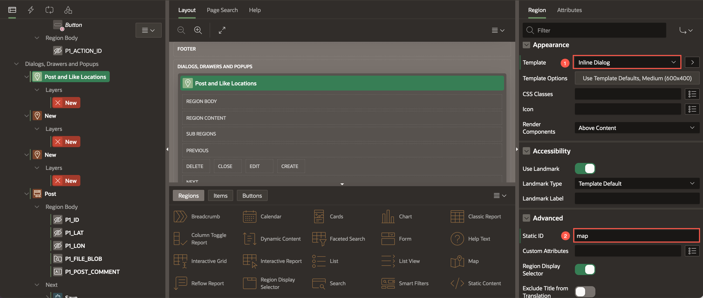

9. Finally, in the Rendering tree, click on the **New** Layer that was created so that we can configure a few final properties.
   - Set Layer > Identification > Name to **Locations**
   - Change Source > Location to **Region Source**
   - Scroll down to Column Mapping and change Geometry Column Data Type to **Longitude/Latitude**
   - Set the Longitude Column to be **LON** and the Latitude Column to be **LAT**

   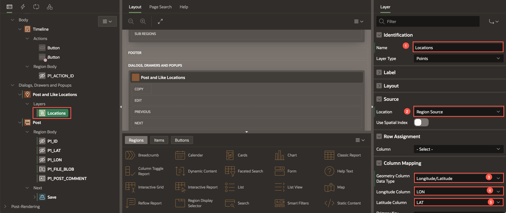

   - And now we’ll configure a tooltip for each map point. Under Tooltip, toggle Advanced Formatting to **ON**.
   - Copy and paste this expression into HTML Expression box:
      ```
      <copy>
      &WHO. @ &SINCE.
      </copy>
      ```
   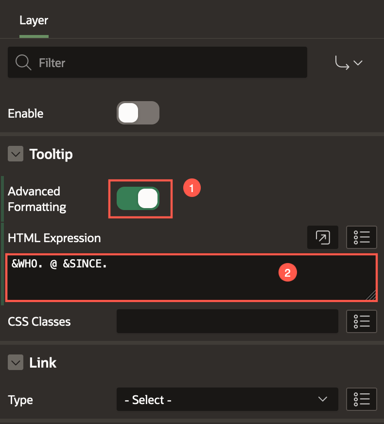

10. Navigate to the **Post and Likes Locations** region. In the Property Editor, click on the *Attributes* tab and change the following properties:
   - Map > Height to **300** pixels
   - Under Controls > Options, check the **Mousewheel zoom**

   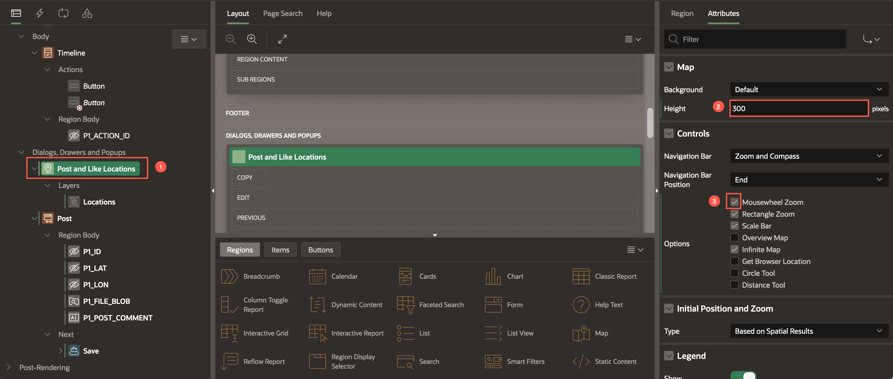

11. Save your changes! Remember, you won’t see this region on your app yet as it’s a hidden region until we build the button and add code to open it.

   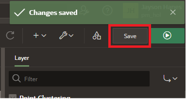

## Task 2: Create Map button
Now we’ll create a button that will be in the top navigation bar, between the Install App and User menu.

1. First, navigate to your applications’ **Shared Components** page. This can be done in a couple of different ways. Since you are already in Page Designer, you can click on the button that looks like stacked pieces.

   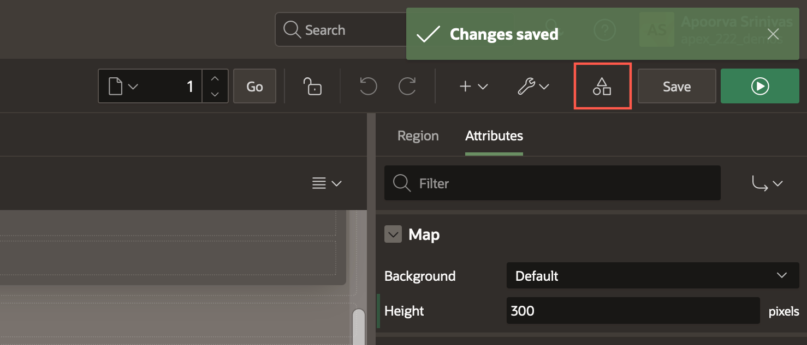

2. In the Navigation and Search section, click on **Navigation Bar List**.

   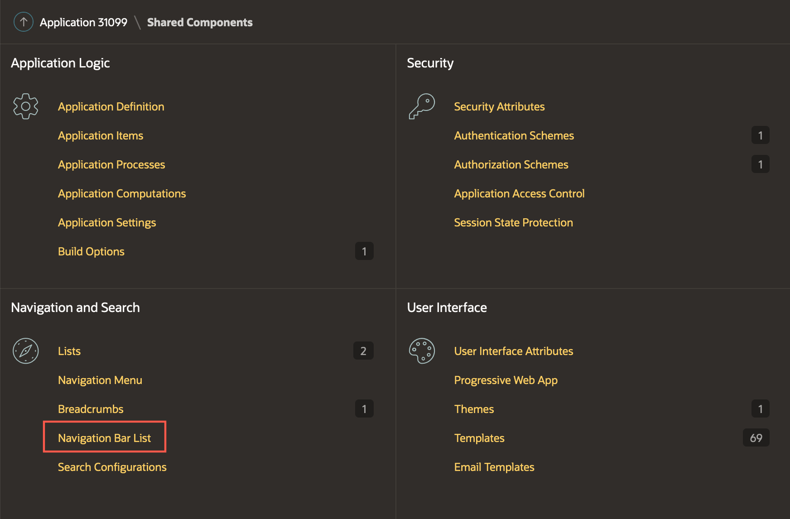

3. Our app only has one of these, so drill into its’ configuration by clicking on the **Navigation Bar entry** in the report under the **Name** column.

   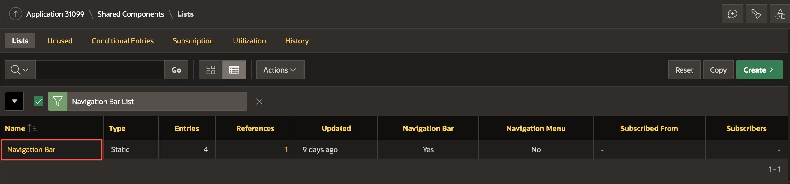

4. You will see 4 existing entries in the list, and we want to add a new one for the Map button. To do this, you can immediately click the **Add Entry** button to add a new row in the list.

5. In the new blank row:
   - For Sequence, enter number **15**
   - For name, enter **Map**
   - For Target, enter **#action$open-map**
   - **fa-map** for the Icon
   Click **Apply Changes**

   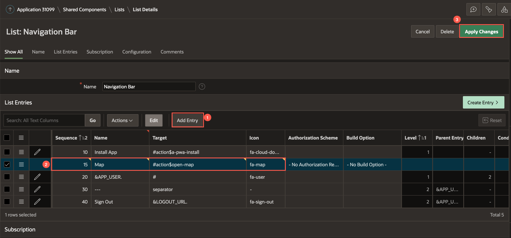

## Task 3: Create Dynamic Action to open Map Region

Now, it’s time to update our javascript on the page so that the Target you specified above can open the map region.

1. Click on the **Edit Page 1** button in the upper right of the current page.

   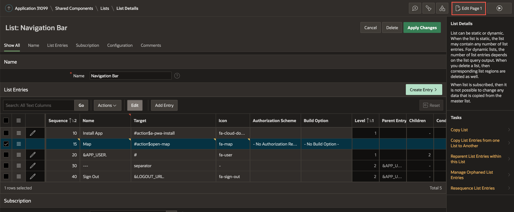

2. Now that we’re back in Page Designer editing Page 1, and we have the **Page 1: Timeline** Rendering tree entry already selected, we can scroll through the properties on the right side down to the *Javascript > Execute When Page Loads* property and update it.
   The easiest way to do this is to delete everything in that box (select all, delete) and copy and paste this block of javascript back into it. Note: There is code for the delete button in here, but we haven’t completed that yet in this workshop.

      ```
      <copy>
      apex.actions.add([{
      name: "like",
      action: (event, element, args) => {
         apex.items.P1_ACTION_ID.value = args.id;
         apex.event.trigger(document, 'action-like');
         }
      }, {
      name: "delete",
      action: (event, element, args) => {
         apex.items.P1_ACTION_ID.value = args.id;
         apex.event.trigger(document, 'action-delete');
         }
      }, {
      name: "open-map",
      action: () => {
         apex.event.trigger(document, 'action-open-map');
         }
      }]);
      </copy>
      ```

      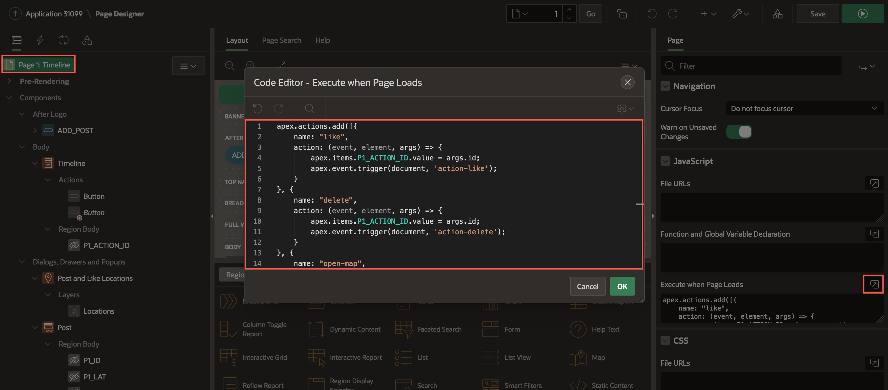

3. We’re almost there! We now need to create another custom dynamic action to open the Map region that we created, when the new Map button is clicked.
   On the left side, click the **Dynamic Actions** tab. Right click on the *Custom* branch, and choose **Create Dynamic Action**.

   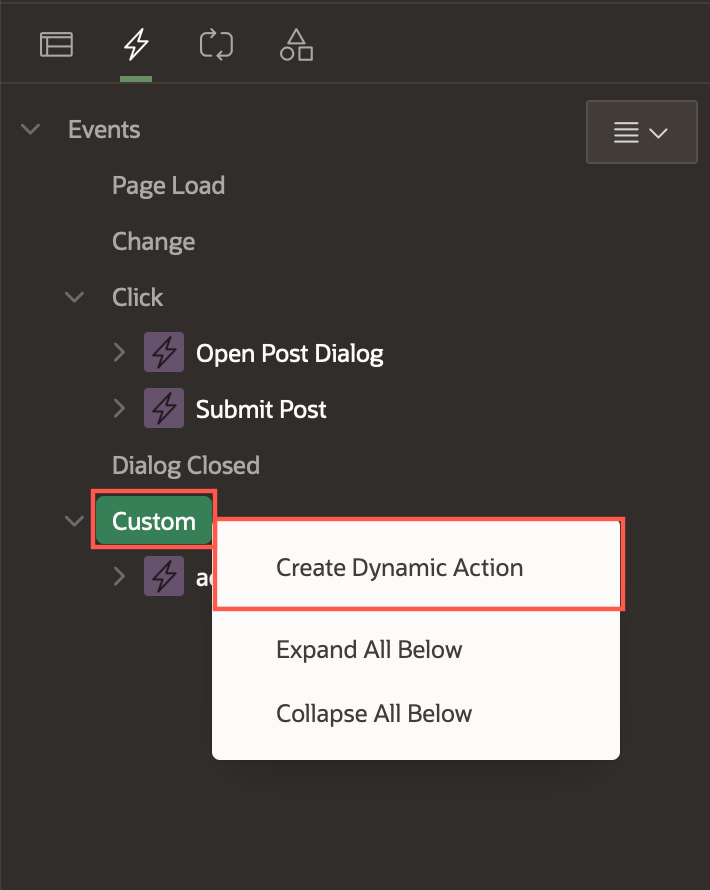

4. You should now see the new Dynamic Action as New/Show.

   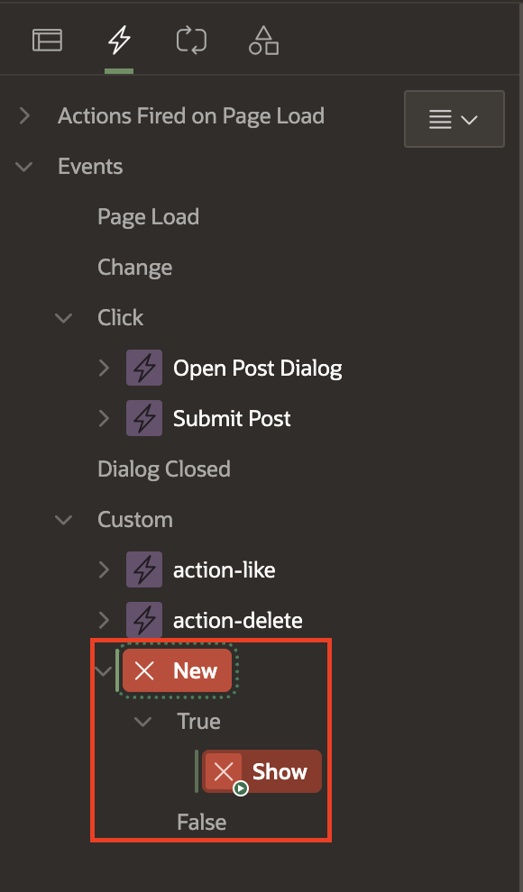

5. On the right side with **New** selected, edit the following:
   - Identification> Name to be **action-open-map**
   - Set the Custom Event to also be **action-open-map**
   - And the Selection Type to **JavaScript Expression** with the actual JavaScript Expression as **document**

   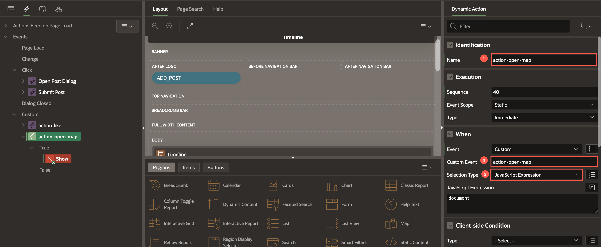

6. The last part of this is to configure the dynamic action itself that is currently set to Show.
   - Click on the tree entry and change the Identification > Action to **Open Region**
   - Set the Selection Type to **Region**
   - Set the Region to **Post and Like Locations** (which is what we named our region)

   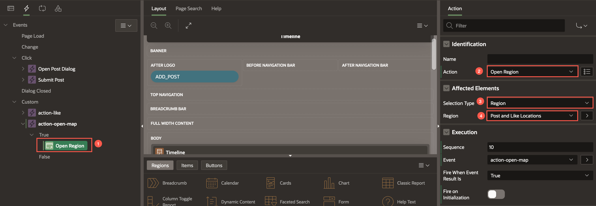

7. That completes the configuration of this button. **Save and Run** the app!

   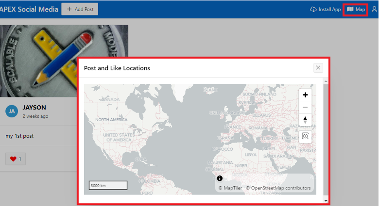

   **Note**: No pins will likely be visible on this map unless you permit the location to be used before you post or like your post. If others were to use your app, their locations would show up too!

   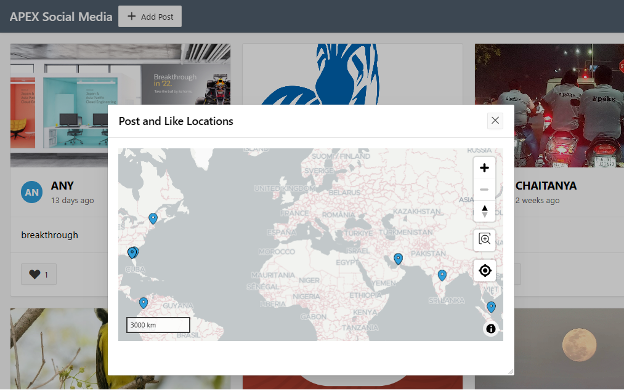

## **Acknowledgements**

 - **Author** - Jayson Hanes, Principal Product Manager; Apoorva Srinivas, Senior Product Manager;
 - **Last Updated By/Date** - Ankita Beri, Product Manager, March 2023
