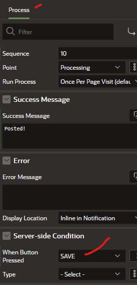

# [OPTIONAL] Get Device Location

## Introduction
In this lab, you will learn to add a map region and get the device location of the end user.

Estimated Time: 5 minutes

## Task 1: Create Map Region

## Task 2: Create Map button

## Task 3: Create Dynamic Action to open Map Region

## Task 4: Update the page javascript to open Map Region

## Task 5: Clear the Post comment after saving new post

## Task 6: Update Server-side Condition on page Process

   Set **Processing -\> Processes -\> Server-side Condition** for the **SAVE** submit-request value from the button **DA** to ensure that if more buttons are added, only the **SAVE** submit-request will trigger the database operation.

   

## Task 7: Move the **Post** (Form) Region to a more appropriate location

   In the layout -- set the Post Region to be placed in the **Dialogs,Drawers and Popups** region location

## Task 8: How to create more users?

## Task 9: Social Sign-In?

## **Acknowledgements**

 - **Author** - Jayson Hanes, Principal Product Manager; Apoorva Srinivas, Senior Product Manager; 
 - **Last Updated By/Date** - Apoorva Srinivas, Senior Product Manager, March 2023
