# Build the Data Model

## Introduction

In this lab, you will create the database objects required for the Social Media App. You will use the SQL Workshop component in Oracle APEX to generate database objects using Quick SQL, run SQL scripts, and explore the generated objects using the Object Browser.

<!-- Watch the video below for a quick walk-through of the lab.
[Create an APEX App](videohub:1_i2wy8qzr) -->

### Objectives

In this lab, you will:

- Review the application data model.

- Generate database objects using Quick SQL.

- Create a custom table constraint.

### Prerequisites

- Completion of workshop through Lab 1

Estimated Time: 5 minutes

## Task 1: Review the Data Model and Generate DDL using QuickSQL

1. Our application data model consists of TWO tables:

    - A table for the **POSTS**

    - A table for the **REACTIONS** on the posts.

    Each table has a primary key, and a foreign key relationship links REACTIONS to POSTS.

    Additionally, a constraint is applied to ensure that users can react to a post only once. We will prefix our database objects with **SM\_** (short for **S**ocial **M**edia), as shown in the following model:

    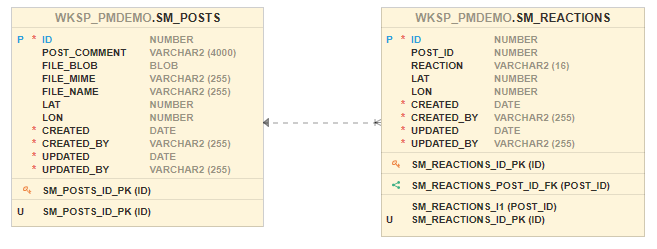

2. To achieve this, we will create the database objects for our application using **QuickSQL**.

3. From the left navigation menu, mouse over the **SQL Workshop** icon, select **Utilities**, and then select **Quick SQL**.

    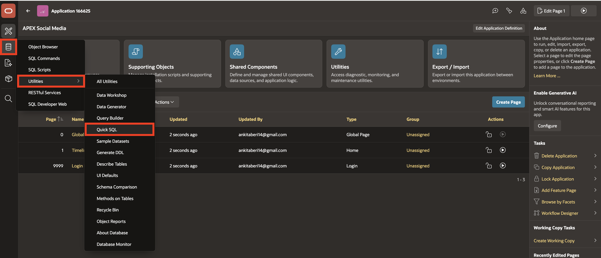

    The **Quick SQL** page is displayed.

    On the left side of the page, you can enter Quick SQL shorthand notation that represents the design of the data model. To learn more about the shorthand notation, you can click on the **Help** button at the top.

    On the right side of the page, Quick SQL generates the DDL (Database Definition Language) script based on the shorthand entered by the developer on the left side.

   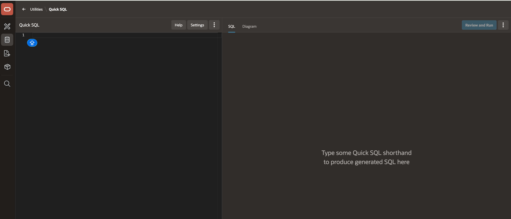

## Task 2: Create Database Objects

1. Copy and paste the following Quick SQL model into the left pane, and click **Review and Run**.

    *Note: It is very important to maintain the tabbing so that all the objects get generated.*

    ```
    <copy>
    # prefix: "sm"
    # apex: true
    posts /auditcols
        post_comment vc4000
        file_blob blob
        file_mime vc255
        file_name vc255
        lat num
        lon num
        reactions /auditcols
            post_id /fk posts
            reaction vc16
            lat num
            lon num
    </copy>
    ```

    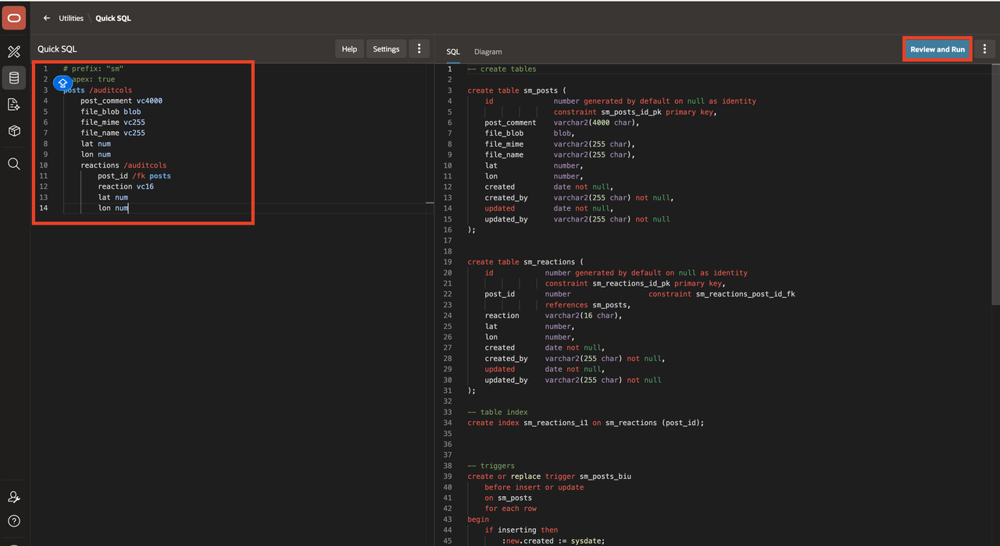

2. In this case, we have used APEX **Quick SQL** shorthand to generate the SQL script, which we will run to create the database objects. Alternatively, this could be done manually through the APEX **Object Browser** or by writing the SQL code manually.

3. Save the SQL script as **db objects**, and click **Run**

    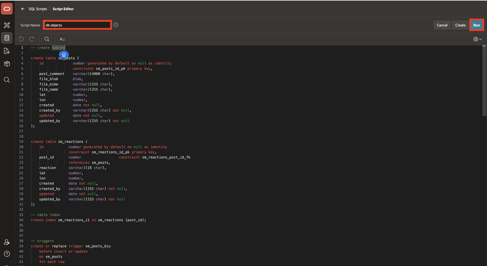

4. Review the summary and click **Run**.

    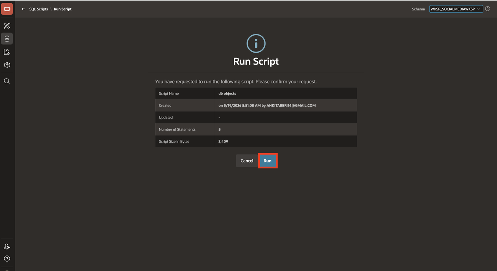

5. Five statements were executed successfully.

    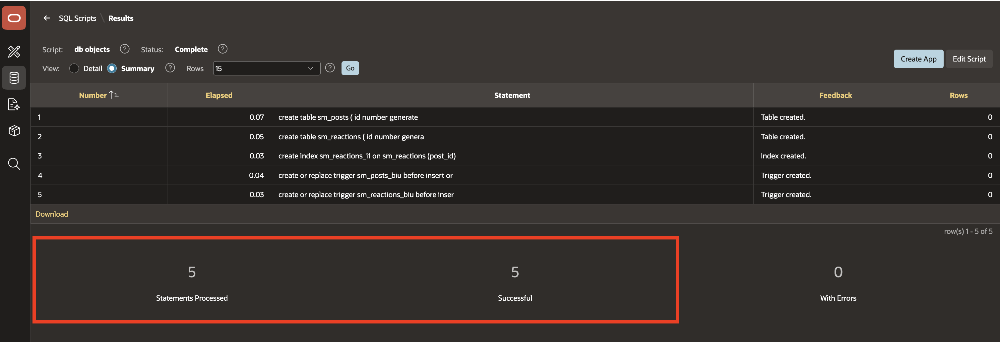

## Task 3: Create a Custom Table Constraint

Since users should only be able to react to a post once, we need to add a constraint to the *SM_REACTIONS* table. This will ensure proper database behavior in a later step of this workshop.

1. From the left navigation menu, mouse over **SQL Workshop** icon and select **Object Browser**.

    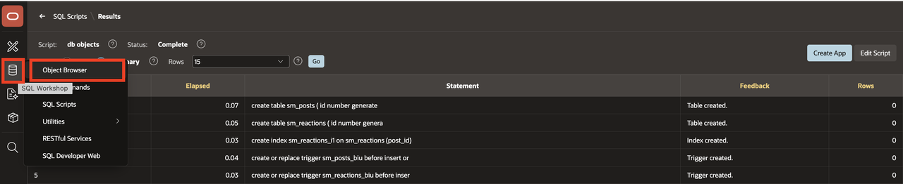

2. In the object tree, expand Tables and select **SM\_REACTIONS** table. In the details panel for the **SM\_REACTIONS** table, click **Constraints** tab.

    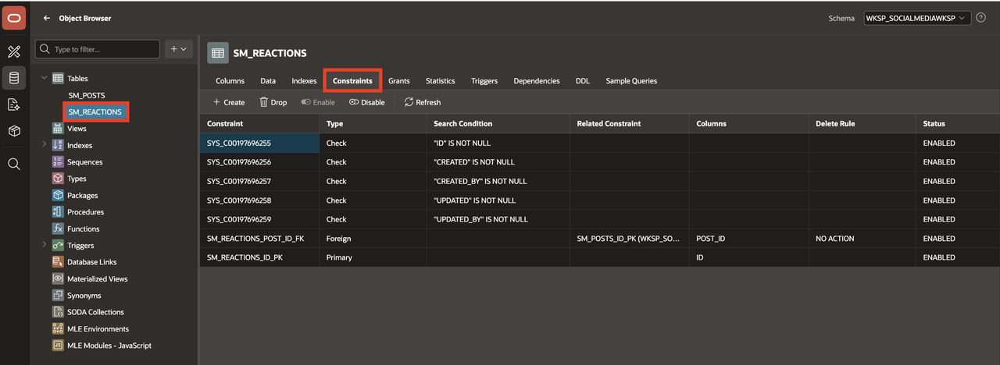

3. Click **Create**.

    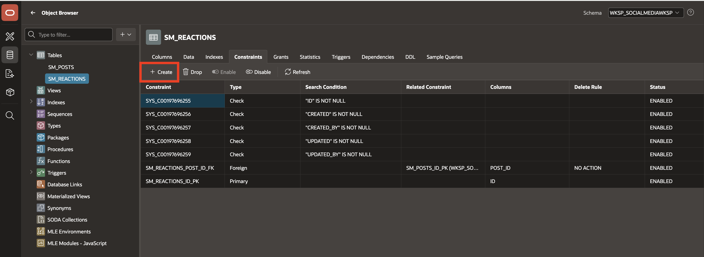

4. Create a new constraint with the following details:

    | Parameter | Value |
    | -------- |:-------:|
    | Constraint Name | **SM\_REACTIONS\_CON** |
    | Constraint Type | **Unique** |
    | Unique column 1 | **POST_ID** |
    | Unique column 2 | **CREATED_BY** |

5. Click **Apply** to create the constraint.

    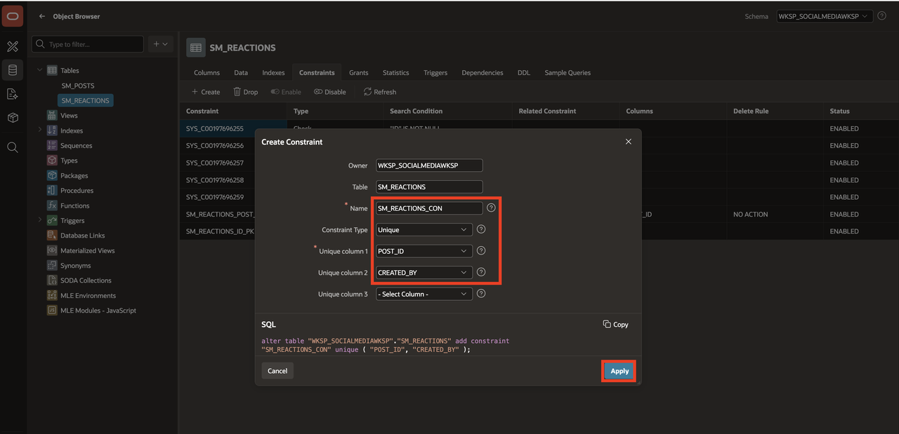

## Summary

In this lab, you reviewed the Social Media App data model and used Quick SQL to generate the required database objects. You also explored the SQL Workshop tools and created a custom constraint to ensure that users can react to a post only once.

You may now **proceed to the next lab**

## Acknowledgements

- **Author** - Jayson Hanes, Principal Product Manager; Apoorva Srinivas, Senior Product Manager; Ankita Beri, Senior Product Manager

- **Last Updated By/Date** - Ankita Beri, Senior Product Manager, May 2026
