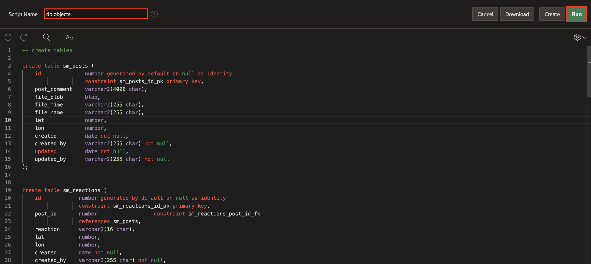
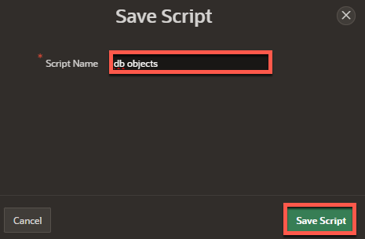
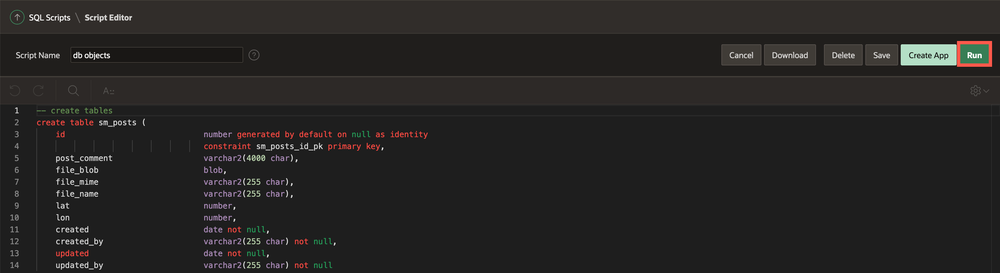
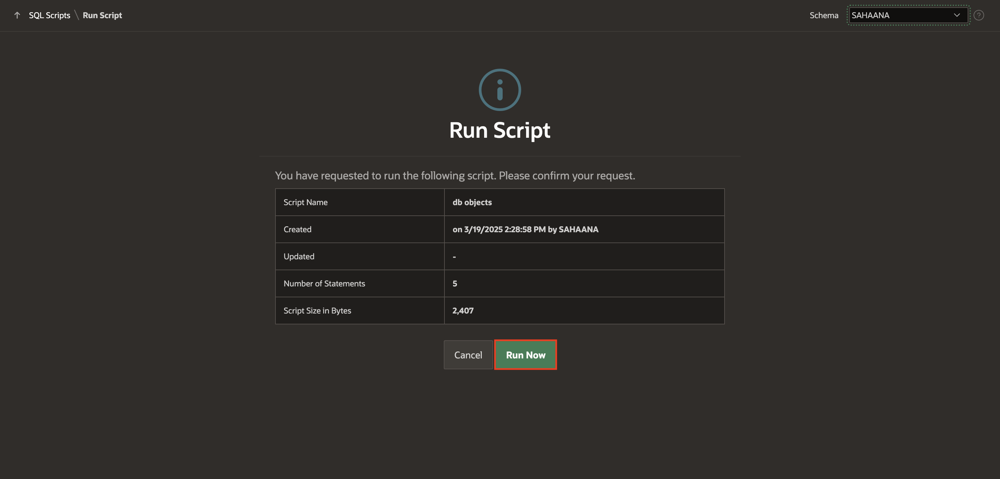

# Build the Data Model


## Introduction

In this lab, you create the database objects required for the app. To do so, you are introduced to the **SQL Workshop** component of APEX where you build the database objects using **Quick SQL**, run SQL scripts and view the data using the Object Browser.

Estimated Time: 5 minutes

Watch the video below for a quick walk-through of the lab.
[Create an APEX App](videohub:1_i2wy8qzr)

### Objectives

In this lab, you will:
- Review the Data Model
- Create database objects
- Create table constraints

### Prerequisites

- Completion of workshop through Lab 1

## Task 1: Review the Data Model and Generate DDL using QuickSQL

1. Our application data model consists of TWO tables:
    - A table for the **POSTS**
    - A table for the **REACTIONS** on the posts.

    These tables each have a primary key and a foreign key relationship linking **REACTIONS** to **POSTS**.
    There is also a constraint added to ensure that users can only react to a post once. We will be prefixing our database objects with **SM\_** (short for**S**ocial **M**edia) as shown in the following model:

    

2. To achieve this, we create the database objects for our application using **QuickSQL**. Navigate to **SQL Workshop** > **Utilities** > **Quick SQL**.

    

    The **Quick SQL** page is displayed.
The left side of the page is where a developer can enter **Quick SQL** shorthand notation that represents the design of our data model. To learn more about the shorthand notation, you can click on the **Help** button at the top.

    The right side of the page is where **Quick SQL** will generate the DDL
(Database Definition Language) script based on the shorthand entered by
the developer on the left side.

   


## Task 2: Create Database Objects

1. Copy and paste the below **Quick SQL** model into the left side, and click **Generate SQL**.
    **Note**: It is very important to maintain the tabbing so that all the objects get generated.

    ```
    <copy>
    # prefix: "sm_"
    # apex: true
    posts /auditcols
        post_comment vc4000
        file_blob blob
        file_mime vc255
        file_name vc255
        lat num
        lon num
        reactions /auditcols
            post_id /fk posts
            reaction vc16
            lat num
            lon num
    </copy>
    ```

2. In this case, we have used APEX **Quick SQL** shorthand to generate the SQL
script that we will run to build the database objects. This could also be
done manually through APEX Object Browser or even by manually typed
code.

    Save SQL Script with a name like **db objects**.

    

    

    

## Task 3: Run the script to create Database Objects

1. Now that we have saved the script, we need to **Review and Run** the
script.

    


2. Now, click **Run**.

    

3. Review the summary and then click ***Run Now***.s

    

4. We can see that 5 statements were run successfully.

    

## Task 4: Create a Custom Table Constraint

Since we prefer that Users react to a post one time only, we need to add a constraint to the *SM_REACTIONS* table. This will facilitate the proper functioning of a database operation later in this workshop.


1.  From your APEX workspace homepage, click **SQL Workshop** and then right click **Object Browser**, and choose  **Open link in new tab** in order to open SQL Workshop in a new browser tab.

2.  On the left side, select the Table **SM_REACTIONS**. In the main panel, click on the **Constraints** tab.

    

3.  Click the **Create** Button and configure the new constraint:
    | Parameter | Value |
    | -------- |:-------:|
    | Constraint Name | **SM\_REACTIONS\_CON** |
    | Constraint Type | **Unique** |
    | Unique column 1 | **POST_ID** |
    | Unique column 2 | **CREATED_BY** |

    

4.  Click **Apply** to create the Constraint.

You may now **proceed to the next lab**

## Acknowledgements

 - **Author** - Jayson Hanes, Principal Product Manager; Apoorva Srinivas, Senior Product Manager;
 - **Last Updated By/Date** - Ankita Beri, Product Manager, May 2023
