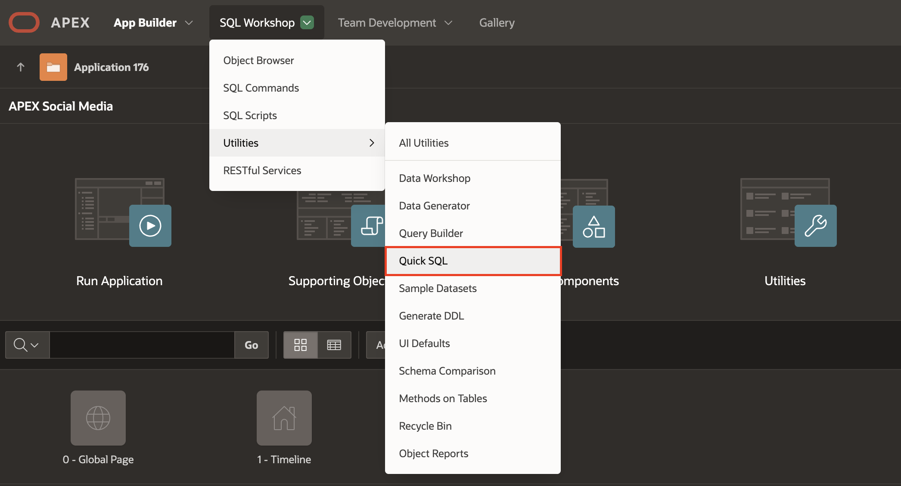
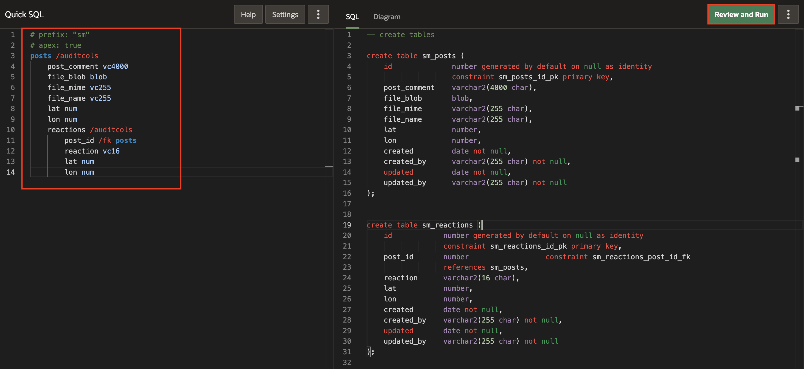
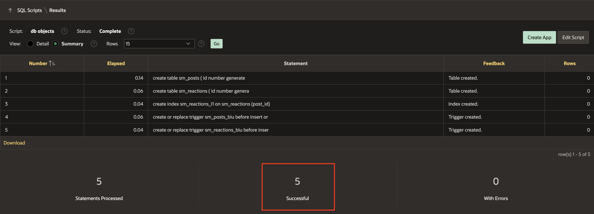
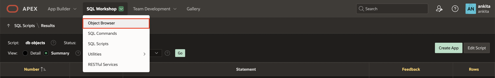
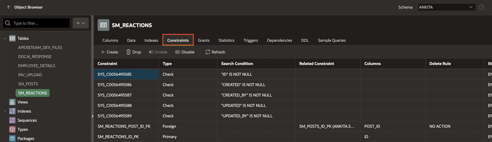

# Build the Data Model

## Introduction

In this lab, you will create the necessary database objects for the app. As part of this process, you will be introduced to the **SQL Workshop** component of APEX, where you will use  **Quick SQL** to build database objects, run SQL scripts, and explore data using the Object Browser.

Estimated Time: 5 minutes

Watch the video below for a quick walk-through of the lab.
[Create an APEX App](videohub:1_i2wy8qzr)

### Objectives

In this lab, you will:

- Review the Data Model
- Create database objects
- Create table constraints

### Prerequisites

- Completion of workshop through Lab 1

## Task 1: Review the Data Model and Generate DDL using QuickSQL

1. Our application data model consists of TWO tables:
    - A table for the **POSTS**
    - A table for the **REACTIONS** on the posts.

    These tables each have a primary key and a foreign key relationship linking **REACTIONS** to **POSTS**.
    Additionally, a constraint is applied to ensure that users can react to a post only once. We will prefix our database objects with **SM\_** (short for **S**ocial **M**edia), as shown in the following model:

    

2. To achieve this, we will create the database objects for our application using **QuickSQL**. Navigate to **SQL Workshop** > **Utilities** > **Quick SQL**.

    

    The **Quick SQL** page is displayed.
    The left side of the page is where a developer can enter **Quick SQL** shorthand notation that represents the design of our data model. To learn more about the shorthand notation, you can click on the **Help** button at the top.

    The right side of the page is where **Quick SQL** generates the DDL (Database Definition Language) script based on the shorthand entered by the developer on the left side.

   

## Task 2: Create Database Objects

1. Copy and paste the below **Quick SQL** model into the left side, and click **Review and Run**.

    *Note: It is very important to maintain the tabbing so that all the objects get generated.*

    ```
    <copy>
    # prefix: "sm"
    # apex: true
    posts /auditcols
        post_comment vc4000
        file_blob blob
        file_mime vc255
        file_name vc255
        lat num
        lon num
        reactions /auditcols
            post_id /fk posts
            reaction vc16
            lat num
            lon num
    </copy>
    ```

    

2. In this case, we have used APEX **Quick SQL** shorthand to generate the SQL script, which we will run to create the database objects. Alternatively, this could be done manually through the APEX **Object Browser** or by writing the SQL code manually.

    Save the SQL Script as **db objects**, and click **Run**

    

3. Review the summary and click **Run Now**.

    

4. We can see that 5 statements were run successfully.

    

## Task 3: Create a Custom Table Constraint

Since we want users to react to a post only once, we need to add a constraint to the *SM_REACTIONS* table. This will ensure proper database behavior in a later step of this workshop.

1. Navigate to **SQL Workshop** and select **Object Browser**.

    

2. In the object tree, expand Tables and select **SM\_REACTIONS** table. In the details panel of the **SM\_REACTIONS** table, click on the **Constraints** tab.

    

3. Click the **Create** Button and create a new constraint with the following details:
    | Parameter | Value |
    | -------- |:-------:|
    | Constraint Name | **SM\_REACTIONS\_CON** |
    | Constraint Type | **Unique** |
    | Unique column 1 | **POST_ID** |
    | Unique column 2 | **CREATED_BY** |

    

4. Click **Apply** to create the Constraint.

    

You may now **proceed to the next lab**

## Acknowledgements

- **Author** - Jayson Hanes, Principal Product Manager; Apoorva Srinivas, Senior Product Manager;
- **Last Updated By/Date** - Sahaana Manavalan, Senior Product Manager, March 2025
