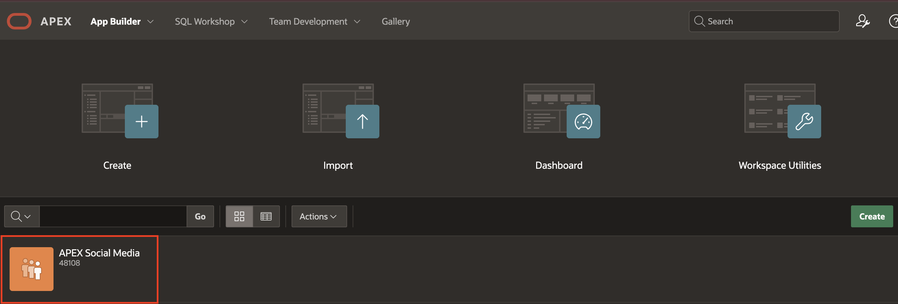

# Get Familiar with the APEX Developer Tools

## Introduction

In this lab, you will explore the developer tools, including the APEX Developer Toolbar and Page Designer.

Estimated Time: 5 minutes

### Objectives

In this lab, you will:

- Explore the APEX Developer Toolbar
- Get familiar with the Page Designer

### Prerequisites

- Completion of workshop through Lab 2

**NOTE: You can skip to [LAB 4](?lab=4-customize-app-homepage) if you are already familiar with the APEX developer tools**

## Task 1: The APEX Developer Toolbar

1. Navigate to the **App Builder**.

    

2. Select **APEX Social Media** application.

    

3. Click **Run Application**.

     

4. In the application, check the bottom of the page for the APEX Developer Toolbar.

    

    **Note**: The application end users will not see this bar. The developer tool bar is only visible to you because you are already logged into the APEX builder in another tab. The toolbar consists of quick links to features of APEX that we will continue to use for our development.

5. Click **Page 1**. This navigates back to the APEX Page Designer, where you can begin making changes to the page.

    

## Task 2: Get acquainted with APEX Page Designer

Welcome to APEX Page Designer! This is the interface where most of the APEX development magic happens.

The APEX Page Designer is divided into three vertical sections, each containing one or more tabs. You can adjust the width of these sections by dragging the thin bars between them or click the middle button to collapse or expand the left or right sections.

1. The left side (#1 in the image below) defaults to the **Rendering Tree**, but notice that there are a few other tabs within: **Dynamic Actions**, **Processing** and **Page Shared Components**. We will learn more about these later.

    

    This first section is a tree-view of the components that are on the page and may contain nested feature-nodes with more parts within each component. The nodes can be expanded or collapsed which will be useful as this tree content grows. Most list entries here can be dragged and dropped within the tree, and/or can be right-clicked to view a context menu with available developer options.

2. The middle section is itself divided into two sections:

    

    The top section is the page **Layout** tab, it also has other tabs within: **Page Search** and **Help**.

    **Take a moment to click on each tab to see how they look.**

    The bottom section has 3 tabs: **Regions, Items** and **Buttons**. The objects within this section can be dragged and dropped into the **Layout** section depending on where you want them placed.

3. The third section on the right is called the **Property Editor** and displays the declarative features of the selected page component. The title of the first tab within will be the name of the component that you have selected, be it of type **Page** or **Region** and so forth. In addition, depending on what is selected, another tab titled **Attributes** might be available with more component specific declarative options. In this case, the top-most tree entry, **Page 1: Timeline** is selected, and the Property Editor displays the **Page** related declarative features:

    

   **Note**: Some tabs may have scroll bars, allowing you to scroll down or across to access additional options.

    **Before we continue, take a moment to practice adjusting the size of your sections, but keep them all expanded.**

    

    If you're unsure or need to restore the default layout, simply click the wrench button at the top right of Page Designer. Click **Layout** and select **Reset Layout**

    

You may now **proceed to the next lab**.

## Acknowledgements

- **Author** - Jayson Hanes, Principal Product Manager; Apoorva Srinivas, Senior Product Manager;
- **Last Updated By/Date** - Sahaana Manavalan, Senior Product Manager, March 2025
