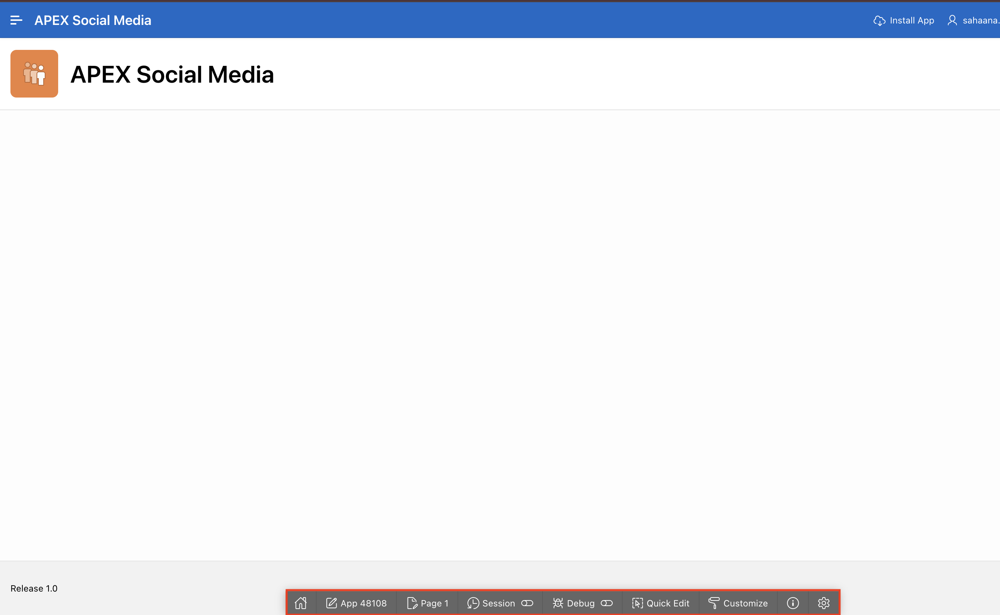
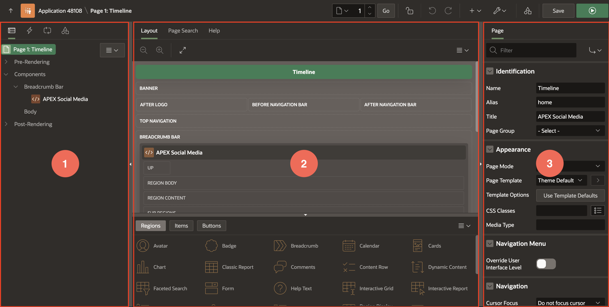

# Get Familiar with the APEX Developer Tools

## Introduction
In this lab, you will get acquainted with the developer tools where the APEX developers spend most of their time. You will explore the APEX Developer Toolbar and the Page Designer.

Estimated Time: 5 minutes

**NOTE: You can skip to [LAB 4](?lab=4-customize-app-homepage) if you are already familiar with the APEX developer tools**

## **Task 1**: The APEX Developer Toolbar

1. Switch back to the tab where the app is running, and notice the APEX
Developer toolbar at the bottom.

    

    ** Note:** The application users will not see this bar. The developer tool bar
is only visible to you because you are already logged into the APEX
builder in another tab. Within it, there are quick links to features of
APEX that we will use to continue development.

2. Click on the Page 1 link -- this will open up the APEX Page Designer so
that we can begin making our changes and get our application built out.

    

## **Task 2** : Get acquainted with APEX Page Designer

Welcome to APEX Page Designer! This is the APEX interface by which the
majority of all the APEX developer magic happens!

The APEX Page Designer is organized with 3 vertical column sections,
each of which can have 1 or more tabs within. The thin bars between each
column area can be dragged to adjust their width, or even their middle
button can be clicked to collapse and expand the left or right sections.

1. The left side (#1 in the image below) defaults to the **Rendering
Tree**, but notice that there are a few other tabs within: **Dynamic
Actions**, **Processing** and **Page Shared Components**. We'll learn a
bit more about these later.

    

This first section is a tree-view of the components that are on the page
and may contain nested feature-nodes with more parts within each
component -- these can be expanded or collapsed which will be useful as
this tree content grows. Most listed entries here can be dragged and
dropped within the tree, and/or right-clicked for a content menu of
available developer options. The goal of this tree is to give you the
ability to quickly click on an entry to do more things.

2. The middle section is itself divided into 2 sections, the top and the
bottom:

    

The top section is the page **Layout** tab, but notice that it also has
other tabs within: **Page Search** and **Help**

**Take a moment to click each to see how they look.**

The bottom section here has 3 tabs of its own: **Regions, Items** and
**Buttons** divided by another thin bar that is horizontal. It also can
be dragged or collapsed and expanded. These objects within this section
can be dragged and dropped into positions within the **Layout** section
depending on where you want them placed -- but there is more than one
way to place items on your pages, which we'll cover in this workshop.

3. The third section on the right is where the more common details or
declarative features of the selected page component are shown. The title
of the first tab within will be the name of the component that you have
selected, be it of type **Page** or **Region** and so forth. In
addition, depending on what is selected, another tab titled
**Attributes** might be available with more component specific
declarative options. In this case, the top-most tree entry is selected,
which is the **Page** **itself**, and this section shows the **Page**
related declarative features:

    

    Further, you will want to be aware that each tab within their respective
sections might have scroll bars shown so that you can navigate down or
across longer sections of options.

    **Before we continue, take a moment to practice adjusting the size of
your sections, but keep them all expanded.**

    

    If you are confused, you can easily reset the layout back to the
default with the wrench button at the top right of Page Designer:

    

## **Acknowledgements**

 - **Author** - Jayson Hanes, Principal Product Manager; Apoorva Srinivas, Senior Product Manager; 
 - **Last Updated By/Date** - Apoorva Srinivas, Senior Product Manager, March 2023