# Customize the App Homepage

## Introduction

In this lab, you will customize the homepage of the Social Media App using Oracle APEX low-code development features. You will learn how to modify page properties declaratively, remove unnecessary UI components, and preview the changes in your application.

<!-- Watch the video below for a quick walk-through of the lab.
[Create an APEX App](videohub:1_bgxyfanv) -->

### Objectives

In this lab, you will:

- Customize the application homepage.

- Learn to remove the Navigation Menu and Breadcrumb region.

### Prerequisites

- Completion of workshop through Lab 3

Estimated Time: 5 minutes

## Task 1: Remove the Navigation Menu

1. First, remove the Navigation Menu from the page by selecting **Page 1: Timeline** in the left pane.

    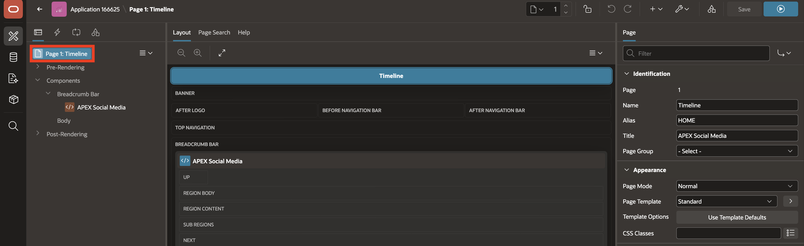

2. In the Property Editor, enter/select the following:

    - Under Navigation Menu:

        - Override User Interface Level: Toggle **ON**

        - List: **Do not show the Navigation Menu List**

    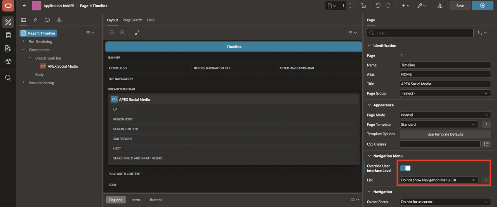

## Task 2: Remove the Breadcrumb Region

Since our app is a Single Page Application, we do not need a breadcrumb bar at the top of the page. Let's proceed with deleting the default breadcrumb.

1. In the left pane, navigate to **Components** and select **Breadcrumb Bar**.

2. Right-click **APEX Social Media**, and select **Delete**.

    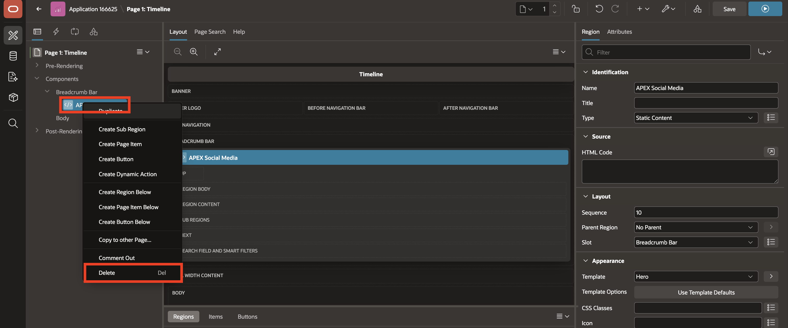

3. Observe how the Rendering Tree changes after the breadcrumb is deleted.

    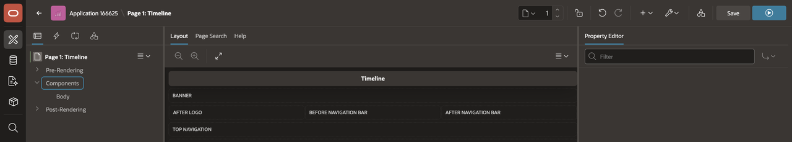

4. Click **Save and Run** to see how these changes affect the app.

    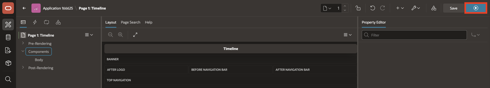

    Once you are signed in, your app should look like this:

    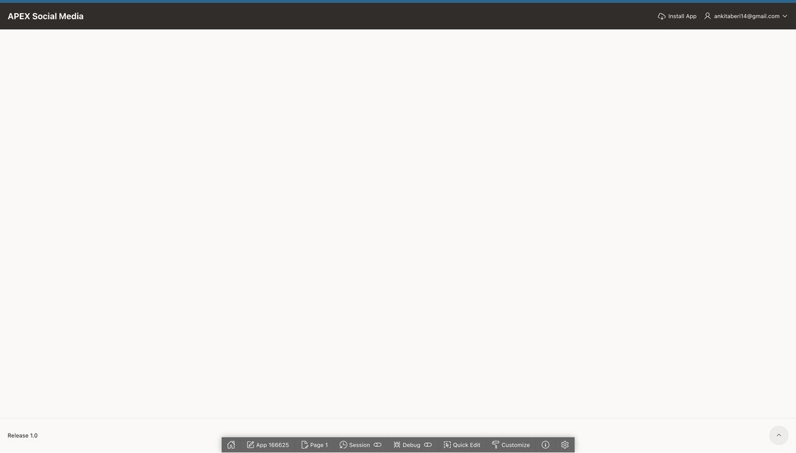

    **Note:** Throughout this workshop, you will continue this iterative development process: make changes, click Save and Run, and review the effects of your updates.

    Switch back to your browser tab with **Page Designer**.

## [OPTIONAL] Alternate Time Saver

In this task, you will learn how to download and import a starter application. If you follow this lab, you can skip Lab 1, Lab 2, Lab 3, and Lab 4. Once you complete this task, proceed to Lab 5.

1. Download the [Starter App](https://c4u04.objectstorage.us-ashburn-1.oci.customer-oci.com/p/EcTjWk2IuZPZeNnD_fYMcgUhdNDIDA6rt9gaFj_WZMiL7VvxPBNMY60837hu5hga/n/c4u04/b/livelabsfiles/o/data-management-library-files/APEX_Social_Media_HOL_LAB1-4_completed.zip) for Social Media workshop. This application includes all functionality completed in Labs 1, 2, 3, and 4.

2. To import an application, from App Builder, click **Import**.

    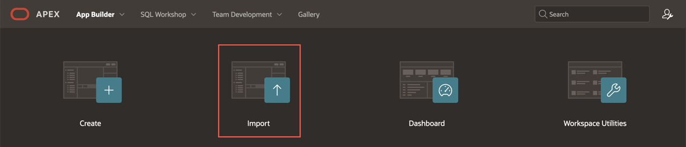

3. Drag and drop the starter application ZIP file downloaded in **Step 1**. Click Next.

    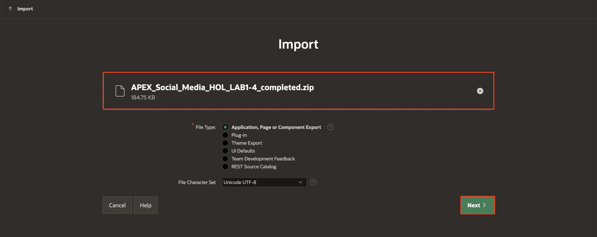

4. Accept the defaults and click **Install Application**.

    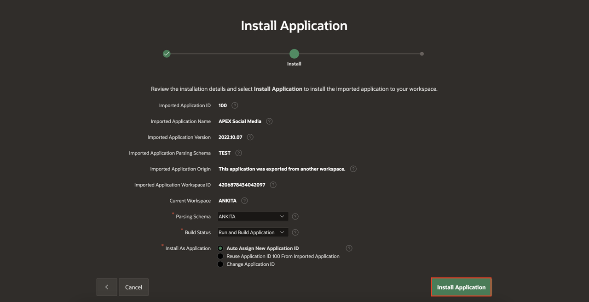

5. Click **Install Supporting Objects**.

    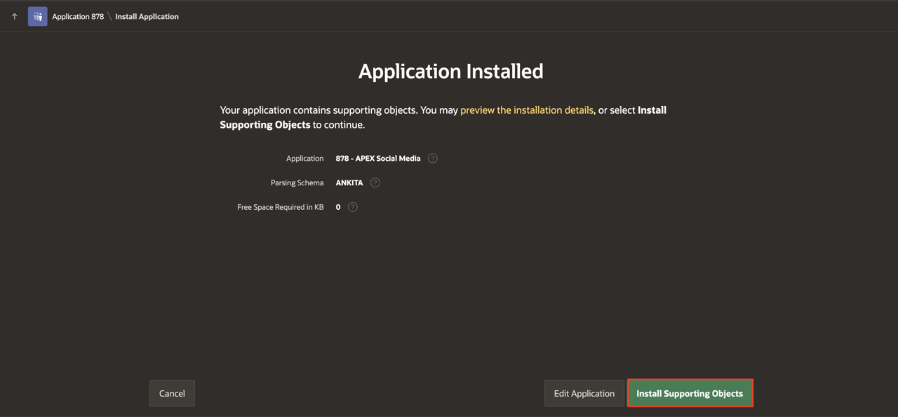

6. Click **Run Application**.

    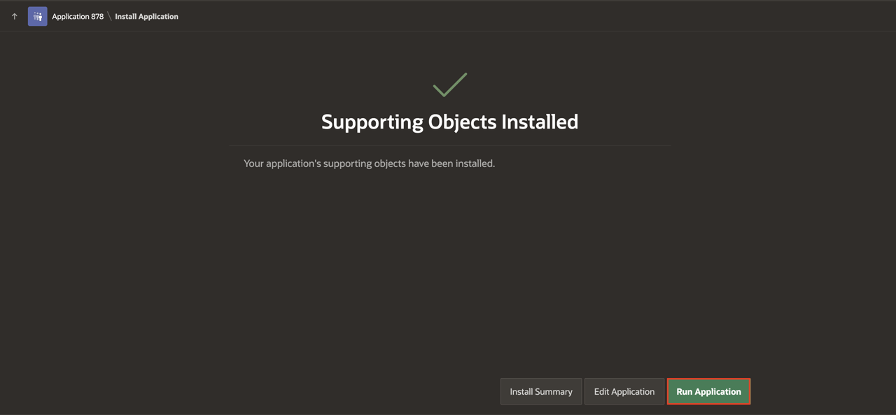

## Summary

In this lab, you customized the Social Media App homepage by removing the Navigation Menu and Breadcrumb region using APEX Page Designer. You also learned how to preview application changes and optionally import a starter application to save time in the workshop.

You may now **proceed to the next lab**

## Acknowledgements

- **Author** - Jayson Hanes, Principal Product Manager; Apoorva Srinivas, Senior Product Manager; Ankita Beri, Senior Product Manager

- **Last Updated By/Date** - Ankita Beri, Senior Product Manager, May 2026
